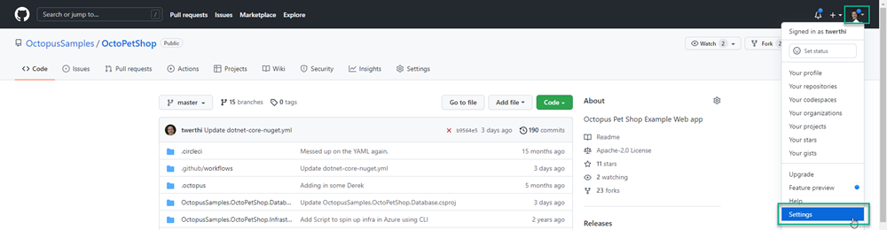
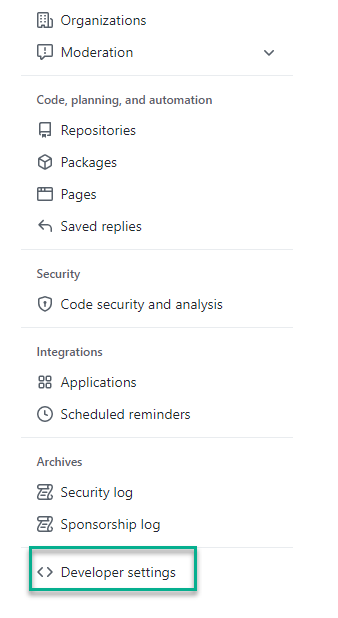
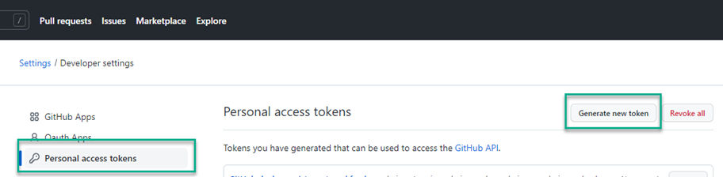
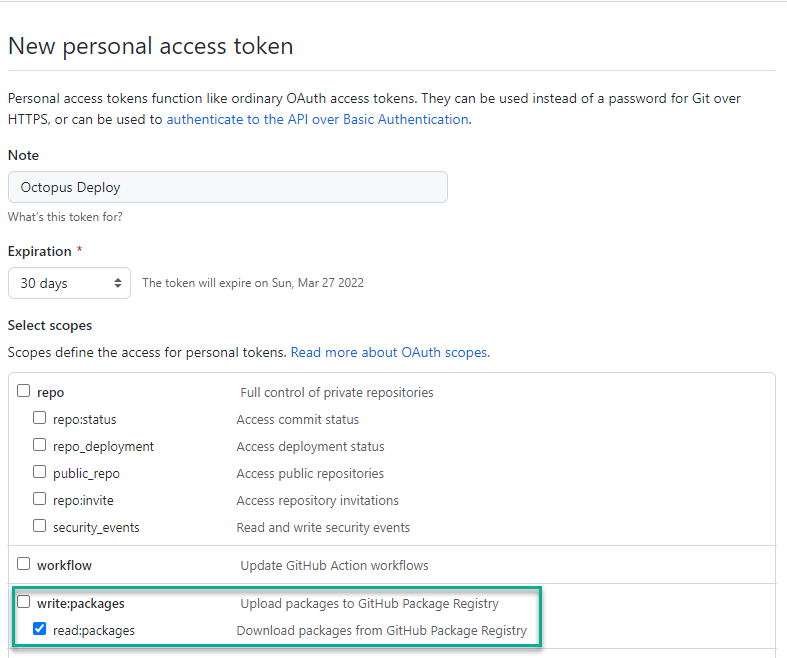

GitHub has become more than just a source code repository.  The folks at GitHub have developed exciting features such as their build server offering, GitHub Actions, issue tracking, and even a Package Registry which is compatible with Docker containers, npm, Maven, and NuGet packages as well as RubyGems.  In this post, you'll learn how to configure a GitHub Actions job to push a .NET Core NuGet package into the registry and connect the registry to Octopus Deploy as an [External Feed](https://octopus.com/docs/packaging-applications/package-repositories).

## Configuring the .NET Core application
To push packages to the Package Registry, you need to specify the `RepositoryUrl` element in the `.csproj` file.  This information is used by the `dotnet` commands when packing and pushing the packages to the registry.  Below is an example for the OctoPetShop Database project:

[OctopusSamples.OctoPetShop.Database.csproj](https://github.com/OctopusSamples/OctoPetShop/blob/master/OctopusSamples.OctoPetShop.Database/OctopusSamples.OctoPetShop.Database.csproj)
```xml
<Project Sdk="Microsoft.NET.Sdk">

  <PropertyGroup>
    <OutputType>Exe</OutputType>
    <TargetFramework>netcoreapp2.1</TargetFramework>
    <RuntimeIdentifiers>win-x64;linux-x64</RuntimeIdentifiers>
    <TargetLatestRuntimePatch>true</TargetLatestRuntimePatch>
    <RepositoryUrl>https://github.com/OctopusSamples/OctoPetShop.git</RepositoryUrl>
  </PropertyGroup>

  <ItemGroup>
    <PackageReference Include="dbup" Version="4.2.0" />
  </ItemGroup>

  <ItemGroup>
    <EmbeddedResource Include="scripts/*.sql" />
  </ItemGroup>

  <ItemGroup>
    <None Update="deploy.sh" CopyToOutputDirectory="PreserveNewest" />
    <None Update="deploy.ps1" CopyToOutputDirectory="PreserveNewest" />
  </ItemGroup>

</Project>
```

## Configuring GitHub Actions build
Aside from building the application, the GitHub Actions job will need to perform the following activities:
- Package the application components into a NuGet packages
- Add the NuGet repository source
- Push the packages into the Package Registry

All of these commands are available within the `dotnet` CLI.

### Package the application into a NuGet package
Packing the application into a NuGet package can be done a multitude of ways.  This post uses the `dotnet pack` command built into the dotnet CLI.  To set the package version, use the MSBuild syntax of `-p:PackageVersion $PACKAGE_VERSION`.  The `$PACKAGE_VERSION` variable is declared earlier within the GitHub Actions YAML (see [here](https://github.com/OctopusSamples/OctoPetShop/blob/master/.github/workflows/dotnet-core-nuget.yml) for the entire process).  Below is an excert of the build to demonstrate the packing of the OctoPetShopDatabase project

```yaml
    - name: Pack OctoPetShopDatabase
      run: |
        dotnet pack OctopusSamples.OctoPetShop.Database/OctopusSamples.OctoPetShop.Database.csproj --configuration Release --output "$GITHUB_WORKSPACE/artifacts/OctopusSamples.OctoPetShop.Database" -p:PackageVersion=$PACKAGE_VERSION
```

### Add the NuGet repository source
To target the GitHub Package registry, you'll need to add the registry as a source.  The `source` URL will be in the following format: `https://nuget.pkg.github.com/YourGitHubUsernameOrOrganizationName/index.json`.  In addition to the `source` URL, you will also need to specify credentials with sufficient permissions to push packages to the registry.  You can either create a Personal Access Token (PAT) or use the built-in secret available within GitHub Actions, `GITHUB_TOKEN`

```yaml
    - name: Add source
      run: |
        dotnet nuget add source "https://nuget.pkg.github.com/OctopusSamples/index.json" --username OctopusSamples --password ${{ secrets.GITHUB_TOKEN }} --store-password-in-clear-text --name github 
```

### Push the package into the Package Registry
The `push` command also needs credentials specified, `GITHUB_TOKEN` can also be used for the `--api-key` argument:

```yaml
    - name: Push packages to GitHub Packages NuGet feed
      run: |
        dotnet nuget push "$GITHUB_WORKSPACE/artifacts/OctopusSamples.OctoPetShop.Database/OctopusSamples.OctoPetShop.Database.$PACKAGE_VERSION.nupkg"  --api-key ${{ secrets.GITHUB_TOKEN }} --source "github"
```

Once the packages have been pushed, they should appear in the Packages section of your GitHub project


## Configuring GitHub Package Registry as an External Feed
GitHub Package Registries require authentication to be able to pull packages.  Before you can configure the feed, you will first need to create a PAT in GitHub.

### Creating a PAT in GitHub
Creating a PAT is a relatively straightforward process.  To start, click on your profile in the upper right-hand corner and choose **Settings**



Scroll to bottom of the left-hand menu and click **Developer Settings**



Click on **Personal access tokens** then **Generate new token**



Give the token a description, choose an expiration and assign the `read:packages` permission.  Click **Generate token**



Copy the new token and save it in a safe location.

### Create External Feed
To create an External Feed, Click on **Library** -> **External Feeds** -> **ADD FEED**


Fill in the Feed form:
- Feed Type: NuGet Feed
- Name: Give a descriptive name
- URL: https://nuget.pkg.github.com/YourGitHubUsernameOrOrganizationName/index.json
- Credentials
  - Username: Username for the token
  - Password: PAT you generated earlier


Click **SAVE AND TEST**.  Enter a partial name of the package(s) you created with your build to make sure that the feed is working correctly


## Conclusion
In this post, I demonstrated how to pack an application into a NuGet package using the dotnet CLI in GitHub Actions and push the package into the GitHub Package Registry as well as configure the Registry as an External Feed within Octopus Depoloy.