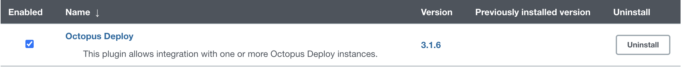
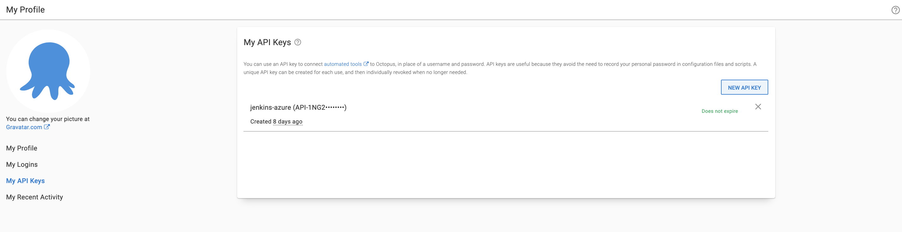
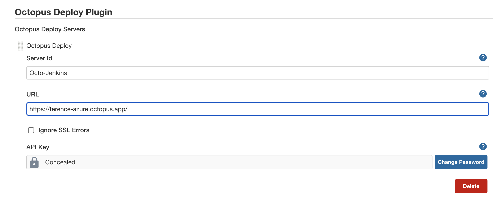
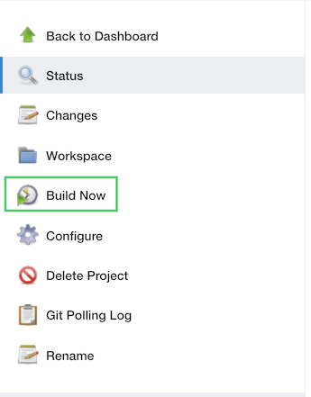
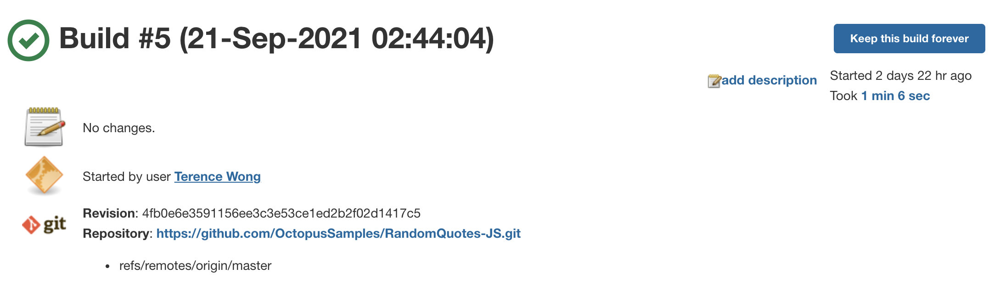
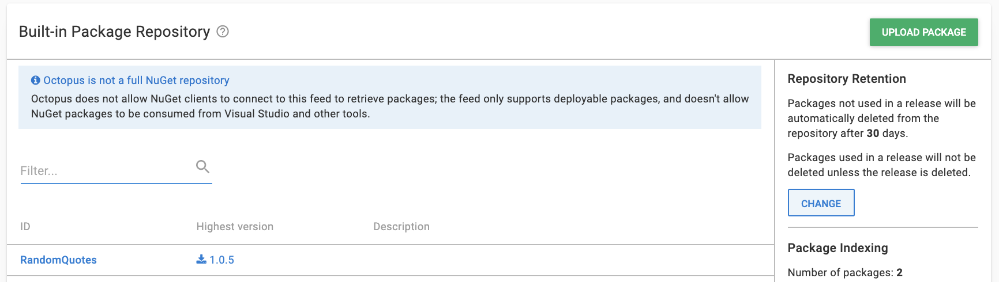
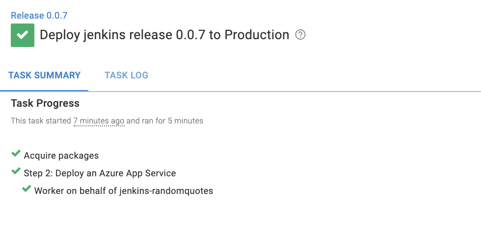
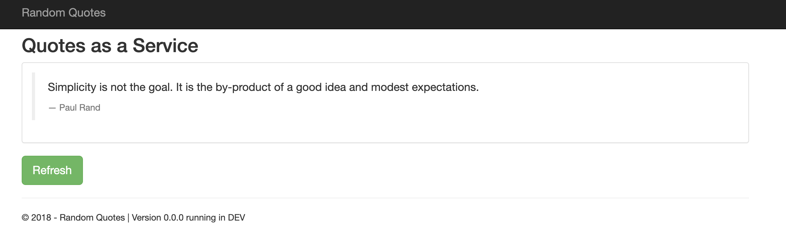

Jenkins is the most popular Continuous Integration (CI) platform on the market. It's open-source and free, and lets you automate the building and testing of your code. 

You can use it with Octopus Deploy to manage releases and deployments automatically.

In this post, I show you how to configure a Jenkins instance, push a package to an Octopus Deploy instance, and deploy a web application to Azure.

## Before you start

To follow along with this post, you need:

- An [Octopus Deploy instance](https://octopus.com/start)
- An Azure account
- A Jenkins instance

:::hint
You can install Jenkins in many ways, for example, on [Linux or Windows](https://octopus.com/blog/jenkins-install-guide-windows-linux), on [Docker](https://octopus.com/blog/jenkins-docker-install-guide), or with [Helm](https://octopus.com/blog/jenkins-helm-install-guide). Or you can follow steps 1 to 4 in [this guide from Microsoft](https://docs.microsoft.com/en-us/azure/developer/jenkins/configure-on-linux-vm) for a live Jenkins instance on Azure.
:::

## Setting up Jenkins for Octopus Deploy

After you set up Jenkins, go to the URL for your Jenkins instance to access the UI. 

In the UI, go to **Manage Jenkins**, then **Manage Plugins** and search for the Octopus Deploy Plugin under **Available**, and install the plugin.

You now need to generate an API key in your Octopus Deploy instance. 

In Octopus, go to your **Username**, then **Profile**, then **My API Keys**, and create a key. Jenkins uses this value.

Next, go to **Manage Jenkins**, then **Configure system**.

Under the Octopus Deploy Plugin setting, add the URL of your Octopus Deploy instance, and add your API key.

Jenkins makes your compile packages available in Octopus, ready to be deployed. 

Create a new job by going to the Jenkins home page and clicking **New item**, then **Freestyle project**, and assigning the following settings:

### Source code management

Git: `https://github.com/OctopusSamples/RandomQuotes-JS.git`
Build specifier: `*/master`

### Build triggers

Poll SCM: `H/5 * * * *`

### Build step - execute shell

You have to install npm and Node.js on the virtual machine.

    npm install
    npm tests

### Build step Octopus Deploy: package application

- Octopus Deploy CLI: default
- Package ID: `RandomQuotes`
- Version Number: `1.0.${BUILD_NUMBER}`
- Package format: zip
- Package include paths: `${WORKSPACE}/**`
- Package output folder: `${WORKSPACE}`

### Build step Octopus Deploy: push packages

- Octopus Deploy CLI: default
- Octopus Deploy Connection: Octo-Jenkins
- Package paths: `${WORKSPACE}/RandomQuotes.1.0.${BUILD_NUMBER}.zip`
    
Click **SAVE**.

Go back to the **Dashboard** and click **Build Now** to start the job.

After the build starts, navigate to the build number and inspect its progress. If every step passes, you see a success status.

Jenkins uploads the package to the Octopus Deploy instance, which you can find under **Library**, then **Packages**. The package version corresponds to the latest build number in Jenkins.

## Configuring an Azure account

You need to configure an Azure account and web application as a target for the deployment from Octopus. You can also use other targets, such as AWS or Linux and Windows servers.

Create an account in Azure by navigating to the [Azure portal](https://portal.azure.com/). 

### Creating an Azure Service Principal with the Azure portal {#create-service-principal-account-in-azure}

<iframe width="560" height="315" src="https://www.youtube.com/embed/QDwDi17Dkfs" frameborder="0" allow="accelerometer; autoplay; encrypted-media; gyroscope; picture-in-picture" allowfullscreen></iframe>

1. In the Azure Portal, open the menu, navigate to **Azure Active Directory**, then **Properties** and copy the value from the **Tenant ID** field. This is your **Tenant ID**.
1. Next you need your **Application ID**:
  - If you created an AAD registered application, navigate to **Azure Active Directory**, then **App Registrations**, and click **View all applications**. Select the app and copy the **Application ID**. Please note, the Azure UI defaults to **Owned Applications** tab. Click the **All Applications** tab to view all app registrations. 
  - If you haven't created a registered app, navigate to **Azure Active Directory**, then **App Registrations**, click on **New registration**, and add the details for your app, and click **Save**. Make note of the **Application ID**.
1. Generate a one-time password by navigating to **Certificates & Secrets**, then **New client secret**. Add a new secret, enter a description, and click **Save**. Make note of the displayed application password to use in Octopus. You can change the expiry date, if you don't want to accept the default one-year expiry for the password.

You now have the following:

- Tenant ID
- Application ID
- Application Password/Secret

This means you can [add the Service Principal Account in Octopus](#add-service-principal-account).

Next, you need to configure your [resource permissions](#resource-permissions).

### Resource permissions {#resource-permissions}

Resource permissions ensure your registered app can work with your Azure resources.

1. In the Azure Portal navigate to **Resource groups** and select the resource group(s) that you want the registered app to access. If a resource group doesn't exist, create one by going to **Home**, then **Resource groups**, then **Create**. After it's created, take note of the Azure subscription ID of the resource group.
2. Click the **Access Control (IAM)** option. Under **Role assignments**, if your app isn't listed, click **Add role assignment**. Select the appropriate role (**Contributor** is a common option) and search for your new application name. Select it from the search results, then click **Save**.

The next step is setting up an [Azure web application](#web-application-setup) and configuring its properties.

### Web application setup {#web-application-setup}

1. In your **Resource group** click **Create**, then **Web App**.
2. Create a Windows Node Application under runtime stack and operating system.
3. Take note of your Azure app name, as this will be the address of your web application: `[your-site].azurewebsites.net`.

### Add the Service Principal account in Octopus {#add-service-principal-account}

You can add your account to Octopus using the following values:

- Application ID
- Tenant ID
- Application Password/Key

1. Navigate to **Infrastructure**, then **Account**
2. Select **ADD ACCOUNT**, then **Azure Subscriptions**
3. Give the account the name you want it to be known by in Octopus
4. Give the account a description
5. Add your Azure Subscription ID - this is found in the Azure portal under **Subscriptions**
6. Add the **Application ID**, the **Tenant ID**, and the **Application Password/Keyword**

Click **SAVE AND TEST** to confirm the account can interact with Azure. Octopus attempts to use the account credentials to access the Azure Resource Management (ARM) API and lists the resource groups in that subscription. 

You may need to whitelist the IP addresses for the Azure Data Center that you're targeting. See [deploying to Azure via a Firewall](https://octopus.com/docs/deployments/azure) for more details.

:::hint
It can take several minutes for your newly-created Service Principal to pass the credential test. If you've double-checked your credential values, wait 15 minutes then try again.
:::

## Configuring Octopus to deploy to Azure

In your Octopus instance, add a production environment by going to **Infrastructure**, then **Environments**, and **Add Environment**.

Go to **Infrastructure**, then **Deployment Targets** and add an Azure Web App. Assign the production environment and set a role (for example, `azure`) for the target. 

Choose the Azure account you set up earlier and select your Azure Web application. Click **SAVE**.

Create a project by going to **Projects**, then **Add Project**.  

Go to the **Process** section. Add a **Deploy an Azure App Service step**.

### On Behalf of

1. Choose the role (for example, `azure`)

### Deployments

2. Select deploy from a zip, Java WAR, or NuGet package
3. Choose the package from the built-in library
    
Use the default settings for everything else.

Go to your project and create a release. Click **SAVE**, then **Deploy to Production**, then **Deploy**, and wait for the deployment to complete.

Go to your site URL `[your-site].azurewebsites.net` to see the deployed web application.

## Post-build

The Octopus Deploy Jenkins plugin can also be used to create releases and deployments in Jenkins.

In the dashboard of your Jenkins job, go to **Configure** and add the following steps:

### Post-build action: create release

- Octopus Deploy CLI: default
- Octopus Server: `Octo-Jenkins`
- Project Name: `jenkins`
- Release Version: `0.0.i`
- Deploy this release after it is created? Check the box

Click **SAVE**, go back to the job dashboard, and click **Build now**. Jenkins triggers the package to build and starts the post-build release and deploy steps in Octopus Deploy.

## Conclusion

In this post, you set up and used a Jenkins instance to build and push a package to Octopus Deploy. You used this package to deploy a web application to an Azure Web App. 

This post shows you how Jenkins integrates with Octopus Deploy to manage releases and deployments automatically.

For more on Continuous Integration (CI) and build servers, [check out our CI blog series](https://octopus.com/blog/tag/CI%20Series).

Happy deployments! 
