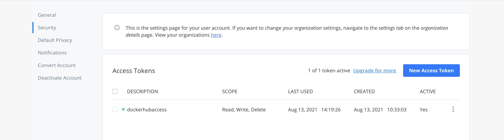
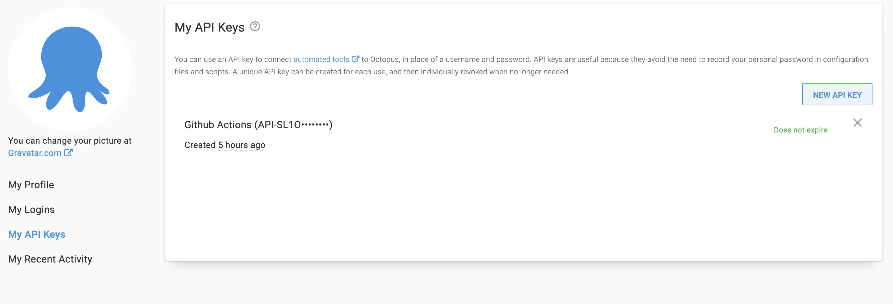
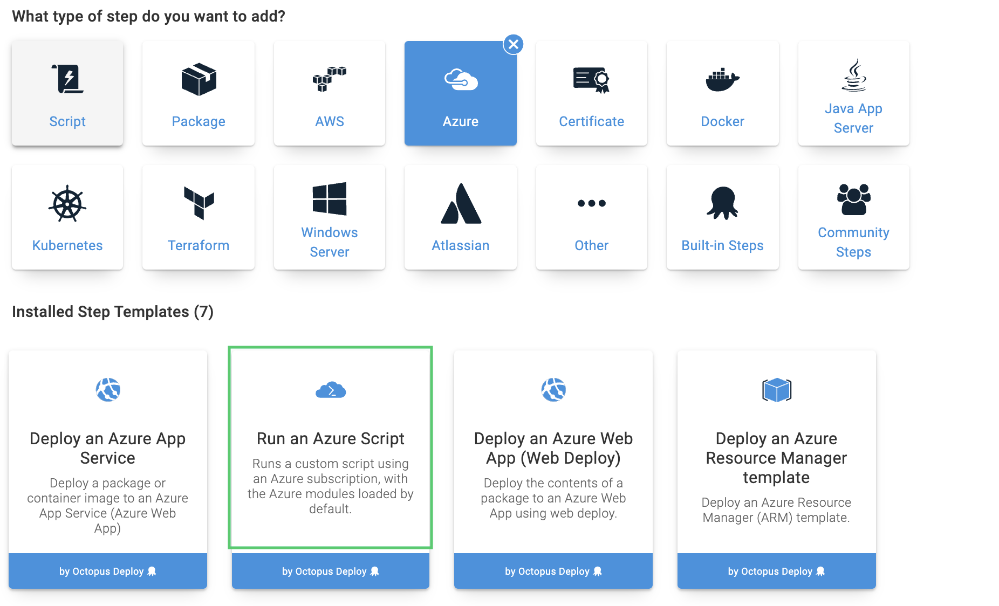
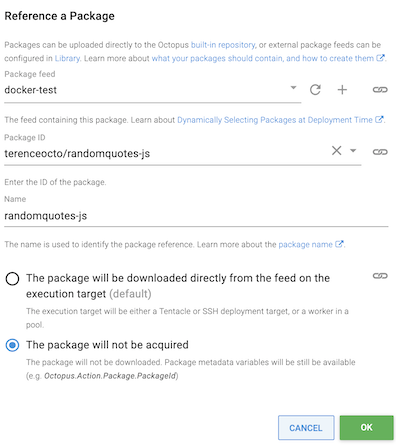
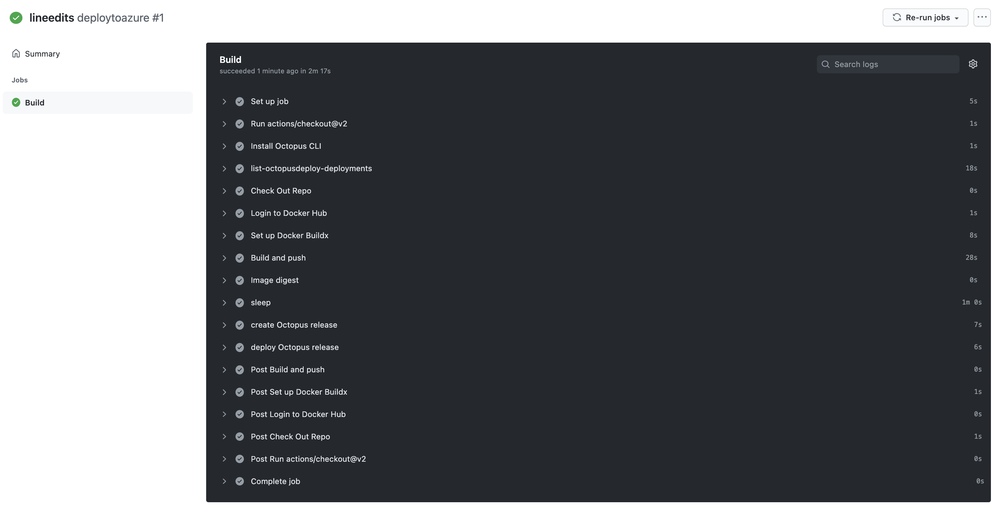
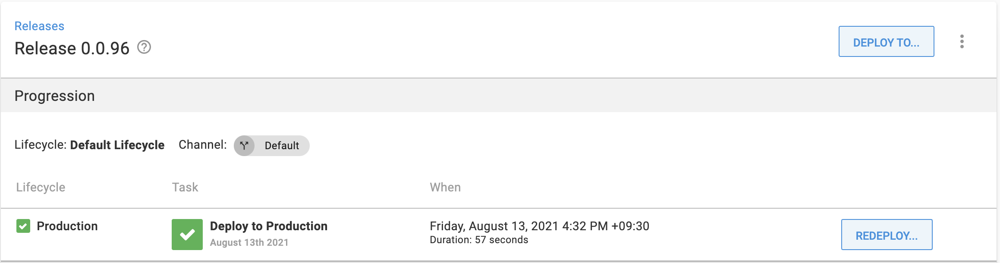
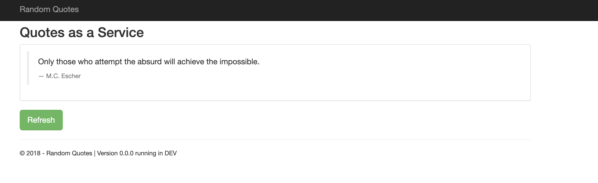
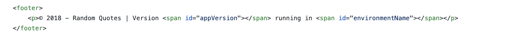
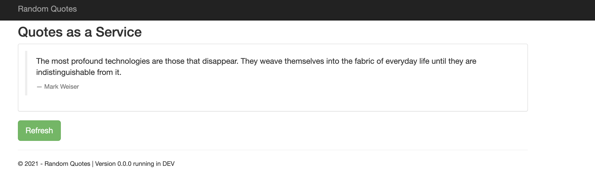

GitHub Actions is a Continuous Integration and Continuous Delivery (CI/CD) tool that uses automated actions to deploy your code. If you store your code in GitHub, GitHub Actions enhances every GitHub repository with CI/CD functionality, making deployments simple. 

Many developers want an easy way to get started without the bloat of enterprise tools, and GitHub Actions fits that need. 

In this post, I show you how to get started with GitHub Actions, and how to deploy a sample web application to Azure with Octopus. 

## Before you start

To complete the steps in this post, you need:

- An active [Octopus Deploy instance](https://octopus.com/start)
- A GitHub account
- A Docker Hub account
- An Azure account

The deployment flow begins with GitHub. GitHub hosts the web application code. GitHub Actions automatically detects changes to the code base, builds the code, and deploys a Docker image to Docker Hub. Octopus Deploy uses this image in an orchestration step to deploy the web application to Azure.

The first step in the process is forking [the Random Quotes repository](https://GitHub.com/OctopusSamples/RandomQuotes-JS). Random Quotes is a simple web application that generates random historical quotes, to demonstrate GitHub Actions' functionality. 

Next, you need to set up GitHub Actions to automate the build, push and deploy process. To do this, you need to retrieve some credentials from Docker and Octopus.

Go to **Docker Hub Account**, then **Account Settings**, then **Security** and create a new access token. Make sure you save this token as you can only view it once.

Go to your Octopus instance, then **Profile**, then **My API keys** and create an API key. Save this key value. Take note of your Octopus server URL.

In your forked Random Quotes repository, go to **Settings** then **Secrets,** then **Actions** and add the following repository secrets:

    DOCKER_HUB_ACCESS_TOKEN
    DOCKER_HUB_USERNAME
    OCTOPUS_APIKEY
    OCTOPUS_SERVER

Navigate to .GitHub/workflows where you see a node.yml file. This file instructs GitHub on how to deploy the code. Replace the contents of the file with the following code:

    name: deploytoazure

    on:
      push:
        branches: [ master ]
    jobs:

      build:
        name: Build
        runs-on: ubuntu-latest
        steps:
          - uses: actions/checkout@v2

          - name: Check Out Repo 
            uses: actions/checkout@v2

          - name: Login to Docker Hub
            uses: docker/login-action@v1
            with:
              username: ${{ secrets.DOCKER_HUB_USERNAME }}
              password: ${{ secrets.DOCKER_HUB_ACCESS_TOKEN }}

          - name: Set up Docker Buildx
            id: buildx
            uses: docker/setup-buildx-action@v1

          - name: Build and push
            id: docker_build
            uses: docker/build-push-action@v2
            with:
              context: ./
              file: ./Dockerfile
              push: true
              tags: ${{ secrets.DOCKER_HUB_USERNAME }}/randomquotes-js:latest

This code builds and pushes the code as a Docker image to Docker Hub on every new push to main. Go to the **GitHub Actions** tab to view the steps. 

After the build is complete, navigate to [Docker Hub](https://hub.docker.com/) to see the image.

## Configuring an Azure account

You need to configure an Azure account and web application to act as a target for the deployment from Octopus. Other targets are possible such as AWS or local.

Next, create an account in Azure, by navigating to the [Azure portal](https://portal.azure.com/). 

### Creating an Azure Service Principal with the Azure Portal {#create-service-principal-account-in-azure}

1. In the Azure Portal, open the menu  and navigate to **Azure Active Directory,** then **Properties** and copy the value from the **Tenant ID** field. This is your Tenant ID.
1. Next you need your **Application ID**.
 - If you created an AAD registered application, navigate to **Azure Active Directory,** then **App Registrations**, click **View all applications**, select the app and copy the **Application ID**. Please note, the Azure UI defaults to the **Owned Applications** tab. Click the **All Applications** tab to view all app registrations. 
 - If you haven't created a registered app, navigate to **Azure Active Directory,** then **App Registrations**, click on **New registration** and add the details for your app, and click **Save**. Make note of the **Application ID**.
1. Generate a one-time password by navigating to **Certificates & Secrets,** then **Certificates & Secrets**. Add a new **Secret**, enter a description, and click **Save**. Make note of the displayed application password for use in Octopus. If you don’t want to accept the default one-year expiry for the password, you can change the expiry date.

You now have the following:

- **Tenant ID**
- **Application ID**
- **Application Password/secret**

Now, you can [add the Service Principal Account in Octopus](#add-service-principal-account).

Next, you need to configure your resource permissions.

### Resource permissions {#resource-permissions}

Resource permissions ensure your registered app has permission to work with your Azure resources.

1. In the Azure Portal navigate to **Resource groups** and select the resource group(s) that you want the registered app to access.
2. Next, click the **Access Control (IAM)** option. Under **Role assignments**, if your app isn't listed, click **Add role assignment**. Select the appropriate role (**Contributor** is a common option) and search for your new application name. Select it from the search results and then click **Save**.

Next, you set up an Azure web application and configure its properties.

### Web application setup {#web-application-setup}

1. If a resource group doesn't exist, create one by going to **Home**, then **Resource groups**, then **Create**. After it's created, take note of the Azure subscription ID for the resource group.
2. In your **Resource group** click **Create** then **Web App**
3. For the publish setting, choose Docker container.
4. For the operating system, choose Linux.
5. Take note of your Azure app name. This will be the address of your web application: `[webapp-name].azurewebsites.net`
6. Take note of the app service plan and resource group when setting up the application.

In your Octopus instance, go to **Library** then **External feeds** and add the Docker container registry feed by entering your Docker credentials. Click **Save and test** to confirm the connection.

### Add the Service Principal account in Octopus {#add-service-principal-account}

With the following values, you can now add your account to Octopus:

- Application ID
- Tenant ID
- Application Password/Key

1. Navigate to **Infrastructure,** then **Account**.
2. Select **ADD ACCOUNT** then **Azure Subscriptions**.
3. Give the account the name you want it to be known by in Octopus.
4. Give the account a description.
5. Add your Azure Subscription ID. This is found in the Azure portal under **Subscriptions**.
6. Add the **Application ID**, the **Tenant ID**, and the **Application Password/Keyword**.

Click **SAVE AND TEST** to confirm the account can interact with Azure. Octopus then attempts to use the account credentials to access the Azure Resource Management (ARM) API and list the Resource Groups in that subscription. You may need to whitelist the IP Addresses for the Azure Data Center you're targeting. See [deploying to Azure via a Firewall](https://octopus.com/docs/deployments/azure) for more details.

:::hint
A newly created Service Principal may take several minutes before the credential test passes. If you've double checked your credential values, wait 15 minutes then try again.
:::

## Adding deployment targets

With Octopus, you can deploy software to Windows servers, Linux servers, Microsoft Azure, AWS, Kubernetes clusters, cloud regions, or an offline package drop. Wherever you're deploying your software, these machines and services are known as your deployment targets. Octopus organizes your deployment targets (the VMs, servers, and services where you deploy your software) into environments.

1. Go to **Infrastructure,** then **Deployment Targets**.
2. Select an Azure Web App.
3. Enter a Display Name.
4. Fill out the **Environment** and **Target roles**.
5. Select the Azure account and web app created earlier.

## Creating the project environment

Create a project by navigating to **Projects,** then **Add Project**. These steps assume a project named `docker`. 

Add an environment named `Production` by going to **Infrastructure**, then **Environments**, then **Add Environment**. 

Navigate to the project you created. Under **Variables**, add the following variables with their values:

- `app-service-plan`
- `resource-group`
- `webapp-name`

In the process step, add an Azure script step.

Add the Azure account you configured earlier and copy the following code into the script step:

     $pi = $OctopusParameters["Octopus.Action.Package[randomquotes-js].PackageId"]
     $pv = $OctopusParameters["Octopus.Action.Package[randomquotes-js].PackageVersion"]
     $dockerImage = "${pi}:${pv}"
     $ImageName = $OctopusParameters["Octopus.Action.Package[randomquotes-js].Image"]
     $RegistryUrl = $OctopusParameters["Octopus.Action.Package[randomquotes-js].Registry"]

     az webapp create --resource-group $OctopusParameters["resource-group"] --plan $OctopusParameters["app-service-plan"] --name $OctopusParameters["webapp-name"] --deployment-container-image-name $dockerImage

     az webapp config container set --name $OctopusParameters["webapp-name"] --resource-group $OctopusParameters["resource-group"] --docker-custom-image-name $ImageName --docker-registry-server-url $RegistryUrl

Add a referenced package under the script step by navigating to the Docker feed and searching for the Random Quotes package. Check **The package will not be acquired** to reference the package in the script. Click **OK**. Click **Save** to save the process step.

You want to ask GitHub Actions to automatically build the Docker image, push it to Docker Hub, create a release, and deploy it in the GitHub code. The update will happen on every commit to main. Update node.yml to the following:

    name: deploytoazure

    on:
      push:
        branches: [ master ]
    jobs:

      build:
        name: Build
        runs-on: ubuntu-latest
        steps:
          - uses: actions/checkout@v2
          
          - name: Install Octopus CLI
            uses: OctopusDeploy/install-octopus-cli-action@v1.1.1
            with:
              version: latest
              
          - name: Check Out Repo 
            uses: actions/checkout@v2

          - name: Login to Docker Hub
            uses: docker/login-action@v1
            with:
              username: ${{ secrets.DOCKER_HUB_USERNAME }}
              password: ${{ secrets.DOCKER_HUB_ACCESS_TOKEN }}

          - name: Set up Docker Buildx
            id: buildx
            uses: docker/setup-buildx-action@v1

          - name: Build and push
            id: docker_build
            uses: docker/build-push-action@v2
            with:
              context: ./
              file: ./Dockerfile
              push: true
              tags: ${{ secrets.DOCKER_HUB_USERNAME }}/randomquotes-js:latest

          - name: sleep
            run: sleep 60
          
          - name: create Octopus release
            run: octo create-release --project docker --version 0.0.i --server=${{ secrets.OCTOPUS_SERVER }} --apiKey=${{ secrets.OCTOPUS_APIKEY }}
            
          - name: deploy Octopus release
            run: octo deploy-release --project docker --version=latest --deployto Production --server=${{ secrets.OCTOPUS_SERVER }} --apiKey=${{ secrets.OCTOPUS_APIKEY }}

The changes install the Octopus Deploy CLI onto the machine to run commands on behalf of your Octopus Deploy instance. On every push to Docker, the script waits 60 seconds and then creates a new deployment for Azure. 

Commit the changes and navigate to the actions tab to confirm the deployments.

Navigate to Octopus Deploy **Projects,** then **Releases** to see the latest deployments.

Go to `[webapp-name].azurewebsites.net` to see your web application:

Make a change to confirm that the deployment is automatically updated. In GitHub, edit the file:

    RandomQuotes-JS/source/www/index.html
 

Change the year to `2021` and commit the code to GitHub. The commit and push will trigger the GitHub Actions build. After the deployment is complete, navigate to your web app where the year has changed.

## Conclusion

GitHub Actions is a CI/CD platform that enhances all GitHub projects with CI/CD capabilities. GitHub Actions makes it easy for developers to deploy their GitHub projects. Octopus Deploy works with GitHub Actions to provide a dedicated continuous delivery tool for managing deployments. The CI/CD process can be connected to a cloud target, such as Microsoft Azure or Amazon Web Services, to give the application a deployment target.

This tutorial set up a continuous delivery flow with Octopus Deploy, GitHub Actions, Docker, and Azure. GitHub automatically detects changes to the code, triggers a build, and pushes to Docker. Octopus Deploy then creates a new release and deploys the Azure Web Application. 

!include <github-actions-free-tool>

For more on Continuous Integration (CI) and build servers, [check out our CI blog series](https://octopus.com/blog/tag/CI%20Series).

Happy deployments!
