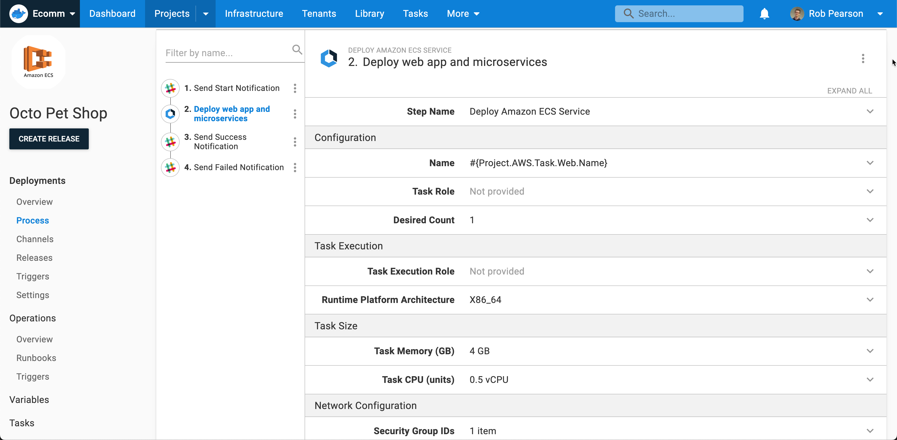
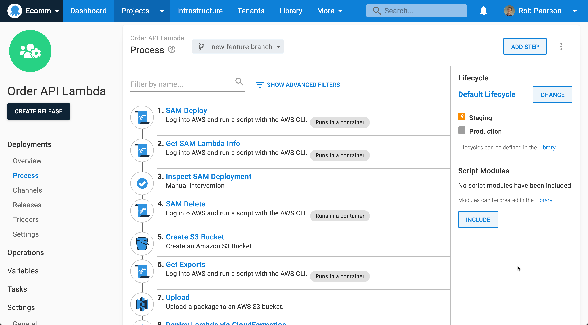

The Octopus 2022 Q2 release is now available.

Moving to cloud-native isn’t about randomly lifting and shifting every component or rewriting every application. It's about combining the right technologies and tools and making strategic choices about where to modernize and where to maintain. 

Whether you're deploying to AWS, Azure, GCP, or your own data center -  wherever you are on your cloud journey - Octopus Deploy is the only deployment tool you'll ever need.

We’re improving our cloud-native support with new features to help you containerize and modernize your CI/CD pipeline. We improved support to deploy containerized applications to Amazon ECS and Kubernetes, added the cloud target discovery feature, and made serverless improvements for AWS.

The 2022 Q2 release is available on Octopus Cloud and ready for download by our self-hosted customers.

This release also includes other noteworthy updates:

- ServiceNow Change Management without the friction (early access preview)
- Config as Code usability improvements to release creation and step templates
- Faster Octopus Cloud deployments with better Dynamic Worker caching
- Customer-driven updates: 
  - Easy customization of Project and Space icons
  - Improved security administration with adjustable session timeouts and invalidation
  - Support for OAuth 2.1 Authorization Code flow with PKCE
  - Tenant variable versioning without errors

## Included in the Q2 release

- Octopus Server 2022.2 ([release notes](https://octopus.com/downloads/whatsnew/2022.2))
- Tentacle 6.1.1320
- Plugins and tools: 
  - Octopus Deploy for Visual Studio Code 0.0.17
  - Azure DevOps plugin 5.2.134
  - TeamCity plugin for Octopus Deploy 6.1.12
  - Terraform Provider for Octopus Deploy 0.7.72

## Long term support 

The following table shows the Octopus Server releases with long term support. 

| Release               | Long term support              |
| --------------------- | ---------------------------    |
| Octopus 2022.2        | Yes                            |
| Octopus 2022.1        | Yes                            |
| Octopus 2021.3        | Expired                        |

## Why use Octopus for cloud-native deployments? 

Most DevOps teams work on projects with a mix of modern and legacy technologies. As teams begin to modernize, it’s common to maintain critical legacy systems deployed to older infrastructure as features are added to newer systems. Customers regularly tell us they’re slowly modernizing older systems, containerizing applications and services, and shifting them to the cloud to minimize risk. 

This is a trend throughout the industry. In a recent report on the [state of modernization](https://www.konveyor.io/modernization-report/?utm_source=thenewstack&utm_medium=website&utm_campaign=platform#modernization-is-happening-quickly), conducted by Konveyor, teams modernizing their applications found the process wasn't quick or straightforward, and faced numerous challenges. Their biggest challenges were resistance to change, time constraints, cost and budget constraints, and lack of skilled resources.

Octopus is a great solution for teams on this journey because we have a broad set of integrations for new and older technologies. You can orchestrate deployments with older technologies as you start new projects to modernize others. 

:::hint
Config as Code in Octopus lets you branch and iterate on your deployment process so you can modernize your CI/CD pipelines while maintaining the older process, until the new one is ready for production.

[Learn more about version control](https://octopus.com/docs/projects/version-control).
:::

Octopus 2022 Q2 also includes out-of-the-box support to deploy applications to Amazon ECS and Kubernetes clusters, including Amazon EKS, Azure Kubernetes Service, and Google Kubernetes Engine. 

## Guided steps for easy configuration

Container hosting platforms help teams manage and scale their containerized applications, but they're also complicated with a steep learning curve. Our guided steps make it easier to get started. Our structured UI walks you through the process of configuring complex deployment scenarios. This helps you get your CI/CD pipeline working fast so you can deploy, get feedback, and iterate. 

Our guided steps also let you export the underlying YAML or CloudFormation templates so you have complete control to customize your deployment. The exported files include parameterized variables, so you can use them in the complementary steps: **Deploy raw Kubernetes YAML** or **Deploy an AWS CloudFormation template**.

## AWS, Azure, and Google Cloud accounts

Our cloud-native support leverages our built-in cloud provider account support for AWS, Azure, and Google Cloud. Add your cloud provider credentials and securely use them throughout your deployments. 

Octopus provides Worker Machines (Octopus Cloud has [Dynamic Workers](https://octopus.com/docs/infrastructure/workers/dynamic-worker-pools) and Octopus Server on-premises has a [Built-in Worker](https://octopus.com/docs/infrastructure/workers/built-in-worker)) plus tooling via [execution containers](https://octopus.com/docs/projects/steps/execution-containers-for-workers) so you can execute your deployments without configuring additional infrastructure (that is, without delegating to separate virtual machines or containers).

## Integration with your infrastructure and older systems

No team uses the same tech stack, so it’s important your tooling integrates with your infrastructure. Octopus has integrations that work with you, ranging from legacy virtual machines and complex network systems to modern cloud-native technologies. 

Our Tentacle agent runs virtually everywhere with support for Windows, Linux (Debian, Ubuntu, Linux Mint, CentOS, RHEL, Fedora, and more), and Docker. You can use it to connect to any physical or virtual machine in listening or polling mode. Alternatively, you can securely connect directly to servers running over SSH. 

Octopus also ships with over 500 automation step templates covering technologies including AWS, Azure, Cassandra, Databricks, F5, Firebase, Flyway, Jira, MariaDB, Oracle, Pingdom, Pulumi, Slack, Splunk, Snowflake, Twilio, and Zabbix. 

No matter what you use, Octopus lets your team integrate Octopus with your existing systems and workflow while you modernize your applications and services based on your timeline and priorities. 

## Octopus cloud-native deployment demo

<iframe width="560" height="315" src="https://www.youtube.com/embed/vsJkvaCLT4k" frameborder="0" allowfullscreen></iframe>

<!--

## Customers using cloud-native deployments

[EB Games](https://www.ebgames.com.au/) is using Octopus to deploy their containerized applications. They shared feedback about how it's improved their development workflow.

> My favorite part about the Amazon ECS support in Octopus is I can build my task definitions files and export the CloudFormation template if I need to customize it. This is so much easier than writing them by hand.
>
> *Brendan McGill, Software Development Manager at EB Games*

[Read more](eb-games.pdf) about how EB Games uses Octopus Deploy and Amazon ECS.
-->

<!--
Want to learn more about how other customers use Octopus? Check out our [customer stories](https://octopus.com/customers). 
-->

### Flexible deployment options across Kubernetes and Amazon ECS 	

Regardless of where you are on your cloud-native journey, Octopus offers the flexibility to deploy in a way that works for you. 

### Amazon ECS

Octopus also provides convention-based Amazon ECS deployments, eliminating the need for custom scripting or navigating the AWS console. Octopus lets you configure your ECS deployment with our easy-to-use UI, or you can edit HCL-based Config as Code configuration files directly. 

Our solution covers 2 of the most common configurations:

- Amazon ECS on AWS Fargate, eliminating the need to manage servers or clusters of Amazon EC2 instances.
- Established Amazon Clusters created manually or with Infrastructure as Code technologies like AWS CloudFormation or Hashicorp Terraform. This allows you to separate your concerns between infrastructure (cluster configuration and management) and deployments. 

Octopus provides deep support for automated Amazon ECS deployments: 

- Guided ECS automation steps that are opinionated by default and extensible for complete control. No custom scripting or task definition configuration files. 
- Built-in validation, useful deployment feedback, and error messages without the AWS console.
- Export the underlying CloudFormation template (with parameterized variables) to customize it for your specific needs.
- Deploy containerized application updates (version bumps) in a single step without changes to the underlying deployment process.  
- No retry loops with support to timeout when deployments get stuck in a bad state.
- Support for complex task definitions (multiple containers and task roles).

You can also complement your deployments with runbooks to manage and maintain your cluster: restart tasks, run AMI updates, and more. 

[Learn more about our support for ECS deployments](https://octopus.com/docs/deployments/aws/ecs).

### Kubernetes

Love YAML or hate it? Our Kubernetes automation supports 3 approaches:

- A structured UI step that guides you through the configuration without any YAML input.
- A fully flexible step configured with raw YAML.
- Helm chart automation steps.

Octopus originally shipped support for Kubernetes in 2018, and we continue to update and refine it. Octopus 2022.2 delivers the ultimate Kubernetes experience for DevOps teams.

- Centralize your Kubernetes clusters and resources in a single place so you can focus on your applications and customers.
- Use built-in service accounts for simple and secure authentication.
- Streamline your deployments and runbooks with shared variables.
- Implement deployment patterns like blue/green, canary, and rolling deployments.
- Use pre-authenticated kubectl scripts.
- Automate routine maintenance and respond more quickly to emergencies.

It’s important to note that if you use our guided UI-driven **Deploy Kubernetes container** step template, you can export the underlying YAML configuration so you can customize it completely. This lets you get started quickly but take full control if you need it. 

[Learn more about managing your Kubernetes resources](https://octopus.com/docs/deployments/kubernetes).

### Dynamic infrastructure and automatic cloud target discovery

Modern cloud infrastructure can be created and destroyed in seconds. DevOps tooling needs to be "cloud-aware" to work with dynamic infrastructure so you can be productive. 

With automatic cloud discovery, you can deploy your work to new infrastructure quickly. There's no clicking through a UI to configure it, writing custom scripts, or specifying the exact details. Connect your cloud accounts, tag your cloud resources, and deploy your applications. 

Octopus also periodically checks if cloud infrastructure is available and removes it from the Octopus infrastructure if needed. This keeps your infrastructure dashboard clean and up-to-date.

This initial release adds support for Azure App Services (Web Apps), Amazon ECS clusters, and Kubernetes clusters (early access preview).

[Learn more about cloud target discovery](https://octopus.com/docs/infrastructure/deployment-targets/cloud-target-discovery).

### Serverless improvements for Amazon Web Services

Octopus 2022.2 includes improvements for AWS Lambda serverless deployments. 

The new **Create S3 bucket** step gives you more flexibility when uploading files to new or updated locations. Create new S3 buckets and then upload files to them in subsequent steps without any friction or custom scripting.

[Learn more about creating an AWS S3 bucket](https://octopus.com/docs/deployments/aws/aws-s3-create-bucket).

The **Upload to an AWS S3 bucket** step now supports referencing files uploaded in previous steps and adds full support for variable substitution and structured variable replacement. This update means you can upload files and transform them appropriately with variables scoped to your target environment.

[Learn more about uploading a package to an AWS S3 bucket](https://octopus.com/docs/deployments/aws/s3).

## ServiceNow Change Management without the friction (early access preview)

IT service management (ITSM) describes how IT teams provide reliable IT services to their customers. This often includes delivery and support of IT services and managing changes to systems. 

Managing deployment pipelines at scale is complex and time-consuming for DevOps teams, and it's more complicated when you add in change management. It's common to have strict change processes needing thorough reviews to get approval to ship new releases of applications. Change advisory boards can be perceived as roadblocks that slow development teams.

We want to make this easier by helping you integrate Octopus with ServiceNow to reduce friction and simplify your development teams' lives.

:::hint
Alex Yates wrote about [why change advisory boards don't work](https://octopus.com/blog/change-advisory-boards-dont-work). He explores the pain that teams can face and offers suggestions on working with them better.
:::

**ITSM approvals in ServiceNow**

As part of improving our ITSM support, we're pleased to share the first milestone with ServiceNow integration. Our customers told us that manually filling out change requests is time-consuming and prone to error. They wanted a way for their CI/CD systems to create change requests automatically and work towards best practices with less friction.

This new integration links Octopus deployments to ServiceNow change requests and automatically creates pre-populated, normal change requests. You get improved traceability out-of-the-box, and you can prove to auditors that every controlled deployment has a change request. This ensures your CI/CD and release management processes are compliant with company policies and regulation.

What's included in our ServiceNow support? 

- Easy workflow configuration, so it's straightforward to integrate Octopus with ServiceNow. 
- Link a deployment to an existing change request, to manually associate deployments with change requests. 
- Automatically create normal change requests at deployment time. Octopus pauses the deployment until the appropriate approvals are complete.
- Use change templates to auto-create standard change requests to reduce manual work and control what information is populated. 
- View and export audit logs of controlled deployments for easy compliance and post-deployment reconciliation.

This integration is fully functional and available in early access. We want to get your feedback to help shape and polish our support before it's generally available.

**If your team uses ServiceNow change management, we'd love for you to try it and provide your feedback.**

[Register for the ServiceNow EAP](https://octopusdeploy.typeform.com/servicenow-eap).

## Config as Code usability improvements to release creation and step templates

We’re continuing to improve Config as Code in Octopus with updates to make it even easier to use. To learn more about Config as Code, read our [announcement from the 2022.1 release](https://octopus.com/blog/octopus-release-2022-q1). 

With Config as Code, you can now have multiple branches for a project, and as the deployment process can vary across branches, the step templates can also vary. We updated Config as Code to better support step template usage across branches. You can use the Step Templates Usage tab to find out-of-date templates by showing what version of templates are used in the latest 20 releases created from different branches.

You can also create a release from a Git commit or tag instead of the head of a branch to give you more control, by selecting a specific commit or tag when creating a release. 

[Learn more about our version control features](https://octopus.com/docs/projects/version-control).

## Faster Octopus Cloud deployments with improved Worker Tool image caching

Based on customer feedback, we improved our execution container Docker images to make deployments even faster. 

We improved Docker image caching, and we’re working to shrink the size of our Docker container images (we call them Worker Tools) that are technology-specific with much smaller file sizes. Combined with better caching approaches, you can use the latest tools and technologies in your deployments without a performance hit. 

## Customer-driven improvements

This release contains several customer-driven improvements. 

### Easy customization for Project and Space icons

We introduced built-in support for Project and Space icons so you can find the right icon and pick the color that suits your team. Customize your Octopus instance quickly and easily.

### Improved security administration with adjustable session timeouts and invalidation

With Octopus 2022.2, your security teams can adjust session timeouts according to your internal security policies. You can express your threat model in Octopus configuration settings and customize it to your organization's needs. 

### OAuth authentication improvements

In addition to the current OAuth 2.0 Implicit flow, we also support OAuth 2.1 Authorization Code flow with PKCE so we're up-to-date with key protocols and standards to meet the needs of your security teams. Using Authorization Code flow with PKCE ensures your instance is more secure because you can dynamically generate a client secret on every request. Please note that the old implicit flow can still be used until you update to the new flow via your Settings.

The following authentication providers can now be used with OAuth 2.1 Authorization Code flow with PKCE:

- [Azure Active Directory (AAD)](https://octopus.com/docs/security/authentication/azure-ad-authentication)
- [GoogleApps Authentication](https://octopus.com/docs/security/authentication/googleapps-authentication)
- [Okta](https://octopus.com/docs/security/authentication/okta-authentication)

Please read the documents for each provider to find out more.

### Tenant variable versioning

If 2 people were making changes to tenant variables at the same time, it was possible to overwrite the other person's changes. We fixed this by adding a new variable version field. This prevents tenant variables being overwritten by any subsequent changes made by another user if they're both editing tenant variables at the same time. 

For example, if 2 people are working on tenant variables at the same time, the second person can't override changes made by the first person. The second person needs to refresh their page and re-enter their variable updates to save their changes.

## Breaking changes 

This release contains one breaking change: 

**Empty versions in Octostache syntax now throw an error instead of returning a default value**

Octostache allows you to specify an empty version which resolves any parts to a default value. This behavior has been removed from Octopus.Versioning since March 2021, however the package wasn't updated in Octostache until now. From now, empty versions instead throw an error and all other behavior of Octostache remains the same.

Learn more about this change in the [GitHub issue](https://github.com/OctopusDeploy/Issues/issues/7375).

## Upgrade or get started

Octopus Cloud users are already running this release. Self-hosted Octopus customers can download the latest version from our website.

<a class="btn btn-success" href="https://octopus.com/downloads/">Download Octopus 2022.2</a>

We encourage you to review the [steps for upgrading Octopus Server](https://octopus.com/docs/administration/upgrading). Please see the [release notes](https://octopus.com/downloads/whatsnew/2022.2) for further information.

If you've never used Octopus, [sign up for a free trial](https://octopus.com/start) or [email our team](mailto:sales@octopus.com) to see a demo and learn more.

## What's coming in future releases?

Check out our [public roadmap](https://octopus.com/roadmap) to stay informed and register for updates.

## Conclusion

Octopus 2022 Q2 delivers a number of new features to support you as you containerize your applications and modernize your CI/CD pipeline. Wherever you are on your cloud journey, Octopus is the only deployment tool you'll ever need. 

Happy deployments!
