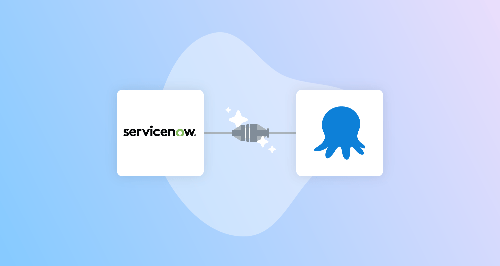
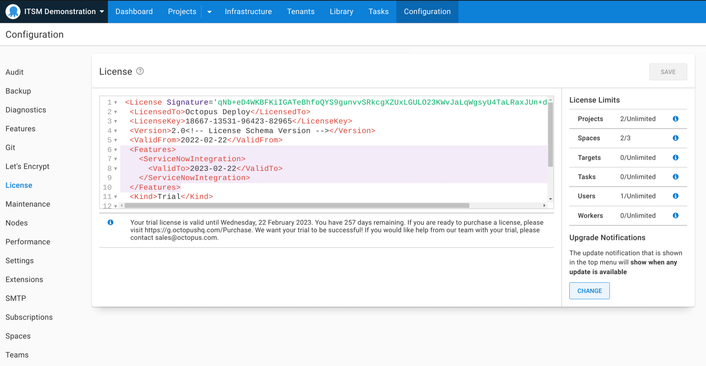
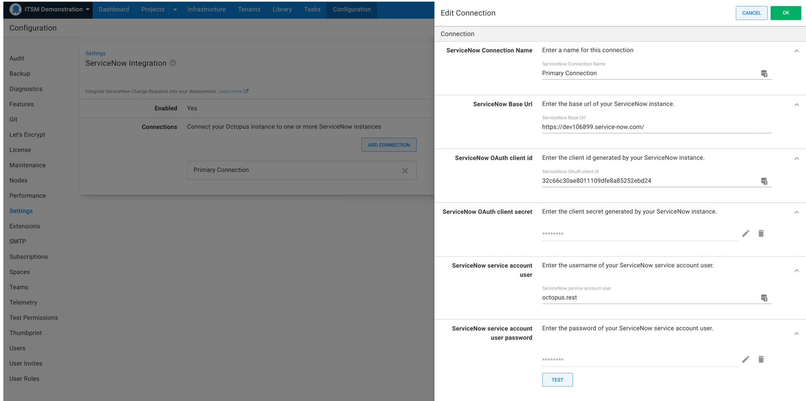
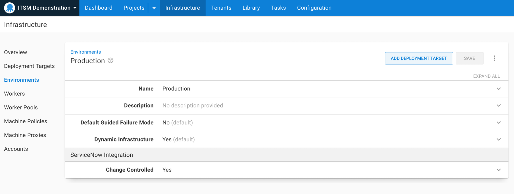
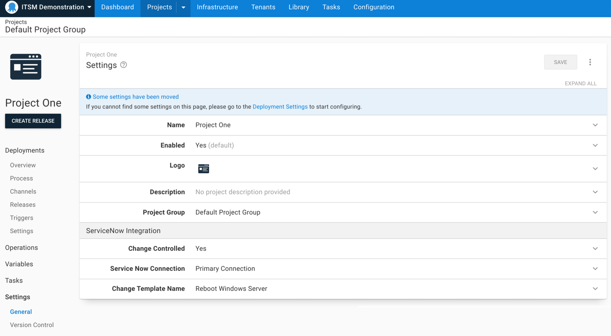
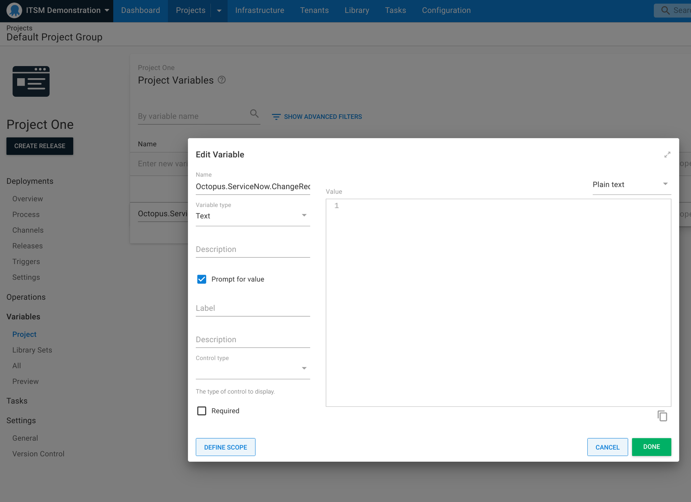
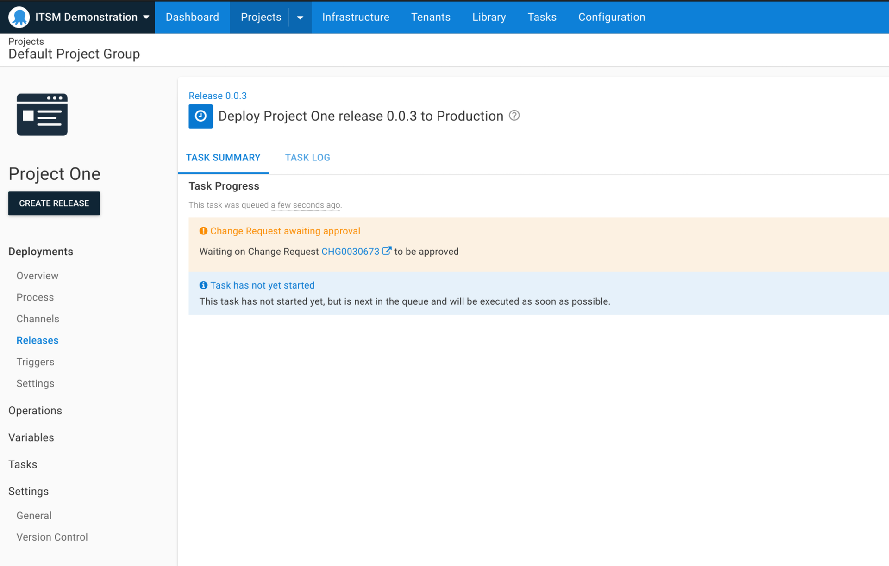
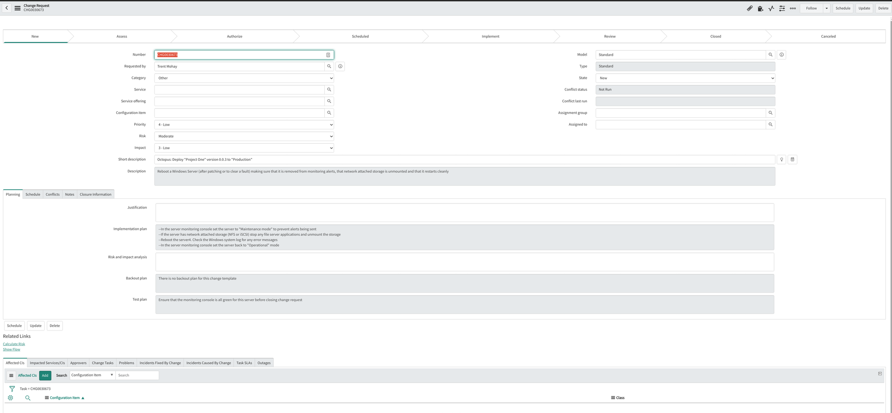
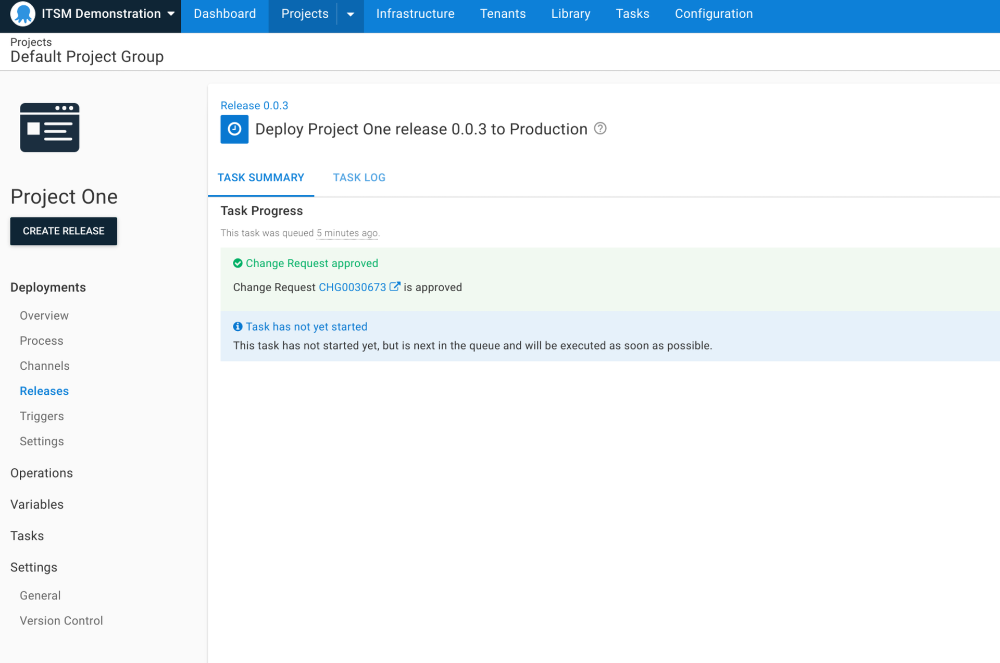
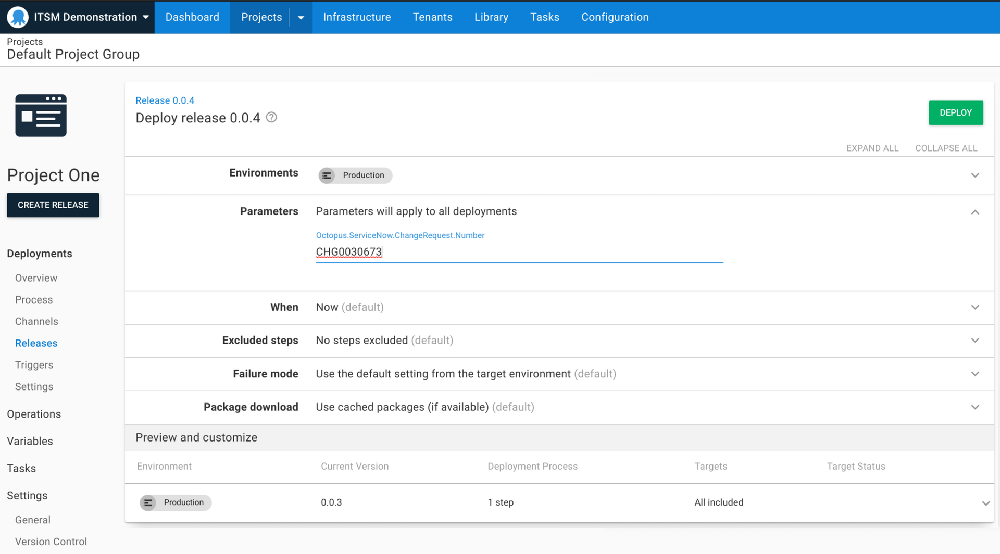

Our ServiceNow integration is available as an early access preview (EAP). 

This integration simplifies change management processes for DevOps teams by ensuring your mission-critical deployments are only executed against an approved ServiceNow change request. This reduces the risk of system downtime because of unapproved deployments and helps to protect your business-critical applications by enforcing approval checks on high risk deployments.

The integration links Octopus deployments to change requests, and provides automatic creation of standard change requests with pre-populated details, helping you work more efficiently with your change management teams. With our integration, every controlled deployment has a change request so that your CI/CD and release management processes are compliant with company policies and regulatory requirements. With a full audit log of deployments, change managers can also be sure that all deployments are executed with the appropriate level of control.

Our ServiceNow integration lets you:

- Easily configure your workflow to integrate Octopus with one or more ServiceNow connections. 
- Link a deployment to an existing change request via prompted variables, so you can manually associate deployments with change requests.
- Link a manually-created change request via string matching on the change request title.
- Automatically create standard change requests at deployment time. 
- Use change templates to auto-create standard change requests to reduce manual work and control what information is populated. 
- View and export audit logs of controlled deployments for easy compliance and post-deployment reconciliation.

In this post, I introduce our ServiceNow integration and walk you through how to get started. 

:::hint
Our ServiceNow integration is an early access preview. As we're still developing this feature, we appreciate [any feedback you have](https://octopusdeploy.typeform.com/to/W5PhKzWn). We also invite you to join the discussion [in our Community Slack](https://octopus.com/slack).
:::

## The need for easier change management 

For DevOps teams, managing deployment pipelines at scale is complex and time consuming, and it becomes even more difficult when you add in change management. It’s common to have strict change processes that require thorough reviews to get approval to ship new releases of applications. 

Change advisory boards can be perceived as roadblocks that slow down development teams. (Learn more by reading our post about [why change advisory boards may not work and how to improve them](https://octopus.com/blog/change-advisory-boards-dont-work).)

## Approvals without manual interventions

One reason we implemented our ServiceNow integration was to provide a better, more automated approval process outside of manual interventions. 

We noticed that manual interventions were being used for approvals, but they weren’t designed for this purpose. Manual interventions were created to pause a deployment and wait for user interaction in common use cases, like DBA reviewing a Delta script generated by tooling, or a web admin reviewing the stage slot in an Azure Web App Deployment. 

Because of this, there are limitations to using manual interventions for approvals. It’s hard to model multiple approvers, you can’t reuse the same approval across the deployment, CAB or change approvals can't be forced, and it's difficult to enforce the person approving the manual intervention. 

Our ServiceNow integration isn't a replacement for manual interventions, but an augmentation for them. Manual interventions can still be used for their intended purpose, and provide those who need approvals with an easier and more effective way to automate them in Octopus. 

## ServiceNow and Octopus bring better change management

We want to make change management easier by helping you integrate Octopus with ServiceNow to reduce friction and simplify the lives of your development teams. 

Our ServiceNow integration in Octopus relieves some of the pain in manually filling out change requests, which is time consuming and prone to error. In deployments, you can automatically create a change request, making it easier to work towards best practice. 

### Change management built into Octopus

ServiceNow integration set up is simple as everything is built into Octopus. The integration uses documented APIs provided by ServiceNow for minimal friction, without downloading a separate ServiceNow app. 

After you're set up, change requests can be automatically created in your deployments, or you can use an existing change request, and the deployment won't continue until someone provides approvals. After the change request is in the implement phase, Octopus recognizes the approval automatically and continues the deployment. There's no need for manual intervention in the deployment process. 

### Reuse approvals across projects and environments

Sometimes the same change request is used across your deployment process, and so the same ID is used multiple times. Manual interventions don't allow for change requests to be used twice. 

With our ServiceNow Integration, you can use a prompted variable to reuse a change request across multiple deployments. After the change request is in the implement phase, you can simply copy the ID from one deployment to another. Octopus automatically recognizes the approval and continues the deployment if you manually select one. If not, Octopus creates one for you. 

### Minimal configuration to use the integration

The ServiceNow integration doesn't require much set up in ServiceNow. All you need is a special Octopus license, which is free for [early access preview (EAP) users](https://octopusdeploy.typeform.com/servicenow-eap).

After your license is set up, you only need to configure 2 things in ServiceNow to get started:

- Create a web service user account with OAuth
- Create a user and assign permissions

Anyone can create a free Personal Development Instance (PDI) to use in ServiceNow which is fully functional.

## Getting started with the ServiceNow Integration

:::hint
Read the latest version of the [documentation for the ServiceNow integration](https://octopus.com/docs/approvals/service-now). 
:::

<iframe width="560" height="315" src="https://www.youtube.com/embed/MWrhD78xzyw" frameborder="0" allowfullscreen></iframe>

After [signing up for the EAP](https://octopusdeploy.typeform.com/servicenow-eap), there are a few settings you need to configure to get started with the ServiceNow integration.

Navigate to **Configuration**, then **License**, and add the license key provided by the Customer Success Team. 

Next, click **Settings** and navigate to **ServiceNow Integration**. **Enable** the ServiceNow integration with the check box, and add a connection. 

You need to provide a Base URL, OAuth Client ID, and Client Secret from ServiceNow. The Base URL can be found in your ServiceNow menu. 

To get the OAuth Client ID, go into **Application Registry** in ServiceNow and set up the **OAuth API endpoint for External Clients** as global. You can then paste this ID into the **Settings** tab in Octopus. 

Next, you need to create the user and assign permissions. In the **Users** section of ServiceNow you can create a service account and assign roles to that user. The password you’re given can be pasted into Octopus. 

:::hint
The permissions you give users are important and should match your organization's guidelines. We don't recommend giving users universal permissions. 
:::

## Configuring your environment and project

After configuring the ServiceNow integration, you need to configure your environment and project. Both need ServiceNow enabled for the ServiceNow integration to work. 

### Configuring your environment

To set up your environment, go to **Infrastructure** and choose the environment you'd like to use with ServiceNow. Under the **ServiceNow Integration** dropdown, select the checkbox for **Change Controlled**. 

Repeat this for all environments that apply. 

### Configuring your project

To set up your project, go to **Settings - General** and under the subheading **ServiceNow Integration**, check the box next to **Change Controlled**. You then select the connection you want to use. You might use the one you set up earlier, or if you have multiple connections for different business units, you can select the right one for the project.

You can also provide a change template name if your organization has templates for their names in their change process. This is optional, and you can leave it blank if it’s not required. If you include the change template name, it's used to automatically create a standard change request on deployment.

## Setting up a prompted variable for reusable change requests

If you want to reuse change requests or use an existing change request, you need to set up a prompted variable for ServiceNow. 

:::hint
If you aren’t planning to reuse change requests, there's no need to set this up.
:::

In your project, in the **Variables** section, look for the **Octopus.ServiceNow.Change.Number**. You can select **Open Editor** to change the label and description, so it's easier to use. 

## Creating a new change request in a deployment

Go to the environment you set up and navigate to the **Deploy** window. To create a new change request, leave the **Parameters** field blank. 

After you click **Deploy**, the **Task Summary** screen appears and displays the message `Change Request awaiting approval`. A change request number then appears for the created change request, with a link to ServiceNow. 

To get your change request approved, assign it to someone in the **Assignment Group** section. Then, select **Request Approval** to move the change request along your organization’s approval process. 

Until the change request is approved, your deployment won't run in Octopus. The approver needs to move the change request to **Implement** before it triggers automatic approval in Octopus. 

:::hint
A change request can only be in Implement stage to run a deployment in Octopus. If the change request is in any other stage, the tasks won't start. 

To reuse a change request for another deployment, it needs to remain in Implement. 

The change request must also remain in Implement for the duration of the deployment because Octopus checks the status of the change request throughout the Task Log. 
:::

## Using an existing change request for deployments

If you have an existing change request in the Implement stage, you can use this for other environments and projects (for example, you can use the same change request in Test and Production). 

Simply copy the change request number and paste it in the **Parameters** section for your next environment. 

If the change request has remained in the Implement stage, Octopus automatically recognizes it's been approved. 

## Running diagnostics on the ServiceNow integration

If there are any errors in the setup of the ServiceNow integration, an error is created and your deployment won’t run. To find out why this is happening, go to the **Diagnostics** tab. From here you can see the issue, for example you may have incorrect template names or unassigned roles for the user. 

## Conclusion

Our ServiceNow integration is available as an early access preview (EAP). It helps automate your change management process, making it easier to run change management without the need for manual intervention. 

We look forward to introducing new features to continue supporting your change management processes. 

We’d love you to try this integration with your workflow and let us know how we can improve it. 

[Register for the ServiceNow EAP](https://octopusdeploy.typeform.com/servicenow-eap).

Happy deployments! 
