Octopus Deploy has a [built-in repository](https://octopus.com/docs/packaging-applications/package-repositories/built-in-repository) that supports a variety of [file types](https://octopus.com/docs/packaging-applications#supported-formats).  However, some customers prefer to use a third-party repository or use the repositories built in to their Continuous Integration (CI) tools.  

In this post, I demonstrate how to use GitLab's built-in registries as external feeds to deploy your projects with Octopus.

## GitLab registries

There are multiple registry types supported in GitLab:

- Package registry
- Container registry
- Infrastructure registry

In this post, I cover package and container registries.

### Package registry

The [GitLab Package Registry](https://gitlab.octopusdemos.app/help/user/packages/package_registry/index.md#use-gitlab-cicd-to-build-packages) supports a wide variety of package types, however, Octopus only supports the following GitLab package registry types as external feeds:

- Maven
- NuGet

#### Maven

Maven repositories are often associated with Java applications, although they can be used more generically (more on that later).  Our [PetClinic](https://bitbucket.org/octopussamples/petclinic/src/master/) example application contains most of the components necessary to demonstrate the Maven registry capabilities of GitLab.  The only thing missing is the mechanism to authenticate to the Maven registry.  [GitLab documentation](https://docs.gitlab.com/ee/user/packages/maven_repository/#create-maven-packages-with-gitlab-cicd-by-using-maven) shows you how this can be easily included, by adding an `ci_settings.xml` file with the following contents: 

```xml
<settings xmlns="http://maven.apache.org/SETTINGS/1.1.0" xmlns:xsi="http://www.w3.org/2001/XMLSchema-instance"
  xsi:schemaLocation="http://maven.apache.org/SETTINGS/1.1.0 http://maven.apache.org/xsd/settings-1.1.0.xsd">
  <servers>
    <server>
      <id>gitlab-maven</id>
      <configuration>
        <httpHeaders>
          <property>
            <name>Job-Token</name>
            <value>${env.CI_JOB_TOKEN}</value>
          </property>
        </httpHeaders>
      </configuration>
    </server>
  </servers>
</settings>
```

After you add this, you're ready to define your build definition.  

GitLab uses a YAML based approach for configuring build definitions.  Below is an example build definition for the PetClinic application:

```yaml
stages:
    - set-version
    - java-build
    - maven-push

set-version:
  stage: set-version
  tags:
    - shell
  script:
    - dayOfYear=$(date +%j)
    - hour=$(date +%H)
    - minutes=$(date +%M)
    - seconds=$(date +%S)
    - year=$(date +%y)
    - echo "1.0.$year$dayOfYear.$hour$minutes$seconds" >> version.txt
  artifacts:
    paths:
      [ version.txt ]

java-build:
  stage: java-build
  tags:
    - shell
  script:
    - VERSION_NUMBER=$(cat version.txt)
    - mvn clean package -DskipTests=true -Dproject.versionNumber=$VERSION_NUMBER
  artifacts:
    paths:
      - "$CI_PROJECT_DIR/target/*.war"

maven-push:
  stage: maven-push
  tags:
    - shell
  variables:
    GROUP: "com.octopus"
    VERSION: $VERSION_NUMBER
    REPO_PROJECT_ID: $CI_PROJECT_ID
  script:
    - VERSION_NUMBER=$(cat version.txt)
    - mvn deploy:deploy-file -s ci_settings.xml -DgroupId=$GROUP 
      -Dversion=$VERSION_NUMBER
      -Dfile=$CI_PROJECT_DIR/target/petclinic.web.$VERSION_NUMBER.war
      -Durl=${CI_API_V4_URL}/projects/${CI_PROJECT_ID}/packages/maven
      -DrepositoryId=gitlab-maven
      -DpomFile=pom.xml
    - zip -r $CI_PROJECT_DIR/petclinic.mysql.flyway.$VERSION_NUMBER.zip $CI_PROJECT_DIR/flyway
    - mvn deploy:deploy-file -s ci_settings.xml
      -DgroupId=$GROUP
      -DartifactId=petclinic.mysql.flyway
      -Dpackaging=zip
      -Dfile=$CI_PROJECT_DIR/petclinic.mysql.flyway.$VERSION_NUMBER.zip
      -DrepositoryId=gitlab-maven
      -Durl=${CI_API_V4_URL}/projects/${CI_PROJECT_ID}/packages/maven
      -DartifactId=petclinic.mysql.flyway
      -Dversion=$VERSION_NUMBER
```

The PetClinic application consists of 2 major components: 

- The Java web application
- [Flyway](https://flywaydb.org/), which is used to perform the database updates

To deploy both of these using Octopus, first you need to add them to the Maven registry so Octopus can find and deploy them.  

The `maven-push` section of the build definition is where the artifacts are uploaded to the Maven registry.  Note that there are 2 `mvn deploy:deploy-file` commands defined in the script section.  The first `deploy` command uploads the `.war` file that was compiled in the `java-build` stage to the registry.  

Unlike the web component, the Flyway piece is already compiled, you just need to zip then upload it to the registry.  The `zip` command zips the contents of the `flyway` folder. 

Next, use the directions from Matt Casperson's [post about deploying and consuming ZIP files from Maven](https://octopus.com/blog/deploy-and-consume-zip-files-from-maven), to upload the `.zip` file to a Maven registry.

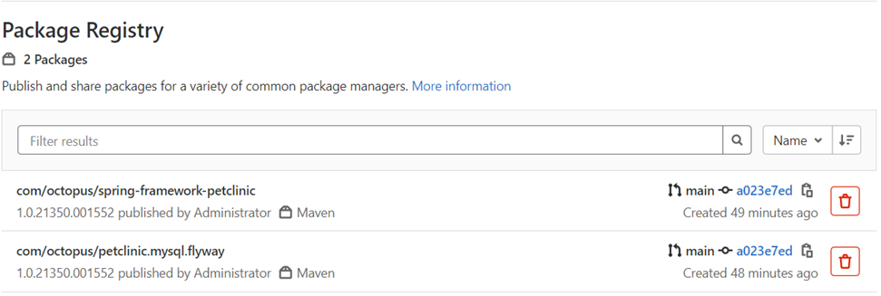

#### NuGet

For .NET applications, the most commonly used registry type is NuGet.  The .NET core example application, [OctoPetShop](https://github.com/OctopusSamples/OctoPetShop), works well for this demonstration.  

Use the following for the build definition (this definition takes advantage of the Docker-in-Docker (DIND) feature of GitLab):

```yaml
image: ubuntu:latest

stages:
    - set-version
    - build-dotnet
    - package-dotnet
    - push-packages

set-version:
  stage: set-version
  script:
    - dayOfYear=$(date +%j)
    - hour=$(date +%H)
    - minutes=$(date +%M)
    - seconds=$(date +%S)
    - year=$(date +%y)
    - echo "1.0.$year$dayOfYear.$hour$minutes$seconds" >> version.txt
  artifacts:
    paths:
      [ version.txt ]
    
build-dotnet:
  stage: build-dotnet
  image: mcr.microsoft.com/dotnet/core/sdk:3.1
  script:
    - VERSION_NUMBER=$(cat version.txt)
    - dotnet build OctopusSamples.OctoPetShop.Database/OctopusSamples.OctoPetShop.Database.csproj --output "$CI_PROJECT_DIR/output/OctopusSamples.OctoPetShop.Database"
    - dotnet publish OctopusSamples.OctoPetShop.ProductService/OctopusSamples.OctoPetShop.ProductService.csproj --output "$CI_PROJECT_DIR/output/OctopusSamples.OctoPetShop.ProductService"
    - dotnet publish OctopusSamples.OctoPetShop.ShoppingCartService/OctopusSamples.OctoPetShop.ShoppingCartService.csproj --output "$CI_PROJECT_DIR/output/OctopusSamples.OctoPetShop.ShoppingCartService"
    - dotnet publish OctopusSamples.OctoPetShop.Web/OctopusSamples.OctoPetShop.Web.csproj --output "$CI_PROJECT_DIR/output/OctopusSamples.OctoPetShop.Web"

  artifacts:
    paths:
      - "$CI_PROJECT_DIR/output/"

package-dotnet:
  stage: package-dotnet
  image: octopuslabs/gitlab-octocli
  script: 
    - VERSION_NUMBER=$(cat version.txt)
    - octo pack --id=OctopusSamples.OctoPetShop.ProductService --version=$VERSION_NUMBER --basePath="$CI_PROJECT_DIR/output/OctopusSamples.OctoPetShop.ProductService" --outFolder="$CI_PROJECT_DIR/packages" --format="NuPkg"
    - octo pack --id=OctopusSamples.OctoPetShop.Database --version=$VERSION_NUMBER --basePath="$CI_PROJECT_DIR/output/OctopusSamples.OctoPetShop.Database" --outFolder="$CI_PROJECT_DIR/packages" --format="NuPkg"
    - octo pack --id=OctopusSamples.OctoPetShop.ShoppingCartService --version=$VERSION_NUMBER --basePath="$CI_PROJECT_DIR/output/OctopusSamples.OctoPetShop.ShoppingCartService" --outFolder="$CI_PROJECT_DIR/packages" --format="NuPkg"
    - octo pack --id=OctopusSamples.OctoPetShop.Web --version=$VERSION_NUMBER --basePath="$CI_PROJECT_DIR/output/OctopusSamples.OctoPetShop.Web" --outFolder="$CI_PROJECT_DIR/packages" --format="NuPkg"
  artifacts:
    paths:
      - "$CI_PROJECT_DIR/packages/"
    

push-packages:
  stage: push-packages
  image: mcr.microsoft.com/dotnet/core/sdk:3.1
  script:
    - dotnet nuget add source "${CI_API_V4_URL}/projects/${CI_PROJECT_ID}/packages/nuget/index.json" --name gitlab --username gitlab-ci-token --password $CI_JOB_TOKEN --store-password-in-clear-text
    - dotnet nuget push "$CI_PROJECT_DIR/packages/*.nupkg" --source gitlab
```

The `IsPackable` property of a web application is set to false by default.  Rather than messing with project properties, you can use the Octopus Deploy GitLab CLI image to pack the compiled applications into NuGet packages.  After the `.nupkg` files are created, `dotnet` commands can be used to push the packages into the GitLab NuGet registry.

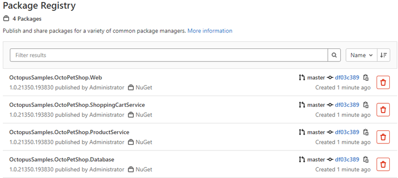

### Container registry

Along with package registries, GitLab also contains a container registry.  To demonstrate container registry usage, you can again use the OctoPetShop application:

```yaml
image: ubuntu:latest

stages:
    - set-version
    - build-docker

set-version:
  stage: set-version
  script:
    - dayOfYear=$(date +%j)
    - hour=$(date +%H)
    - minutes=$(date +%M)
    - seconds=$(date +%S)
    - year=$(date +%y)
    - echo "1.0.$year$dayOfYear.$hour$minutes$seconds" >> version.txt
  artifacts:
    paths:
      [ version.txt ]

build-docker:
    stage: build-docker
    image: docker:1.11
    services:
      - docker:dind
    before_script:
      - docker info
    script:
      - VERSION_NUMBER=$(cat version.txt)
      - docker build -t $CI_REGISTRY/$CI_PROJECT_NAMESPACE/$CI_PROJECT_NAME/octopetshop.database:$VERSION_NUMBER ./OctopusSamples.OctoPetShop.Database/ 
      - docker build -t $CI_REGISTRY/$CI_PROJECT_NAMESPACE/$CI_PROJECT_NAME/octopetshop.productservice:$VERSION_NUMBER ./OctopusSamples.OctoPetShop.ProductService/ 
      - docker build -t $CI_REGISTRY/$CI_PROJECT_NAMESPACE/$CI_PROJECT_NAME/octopetshop.shoppingcartservice:$VERSION_NUMBER ./OctopusSamples.OctoPetShop.ShoppingCartService/ 
      - docker build -t $CI_REGISTRY/$CI_PROJECT_NAMESPACE/$CI_PROJECT_NAME/octopetshop.web:$VERSION_NUMBER ./OctopusSamples.OctoPetShop.Web/ 
      - docker login -u $CI_REGISTRY_USER -p $CI_REGISTRY_PASSWORD $CI_REGISTRY
      - docker push $CI_REGISTRY/$CI_PROJECT_NAMESPACE/$CI_PROJECT_NAME/octopetshop.database:$VERSION_NUMBER
      - docker push $CI_REGISTRY/$CI_PROJECT_NAMESPACE/$CI_PROJECT_NAME/octopetshop.productservice:$VERSION_NUMBER
      - docker push $CI_REGISTRY/$CI_PROJECT_NAMESPACE/$CI_PROJECT_NAME/octopetshop.shoppingcartservice:$VERSION_NUMBER
      - docker push $CI_REGISTRY/$CI_PROJECT_NAMESPACE/$CI_PROJECT_NAME/octopetshop.web:$VERSION_NUMBER
```
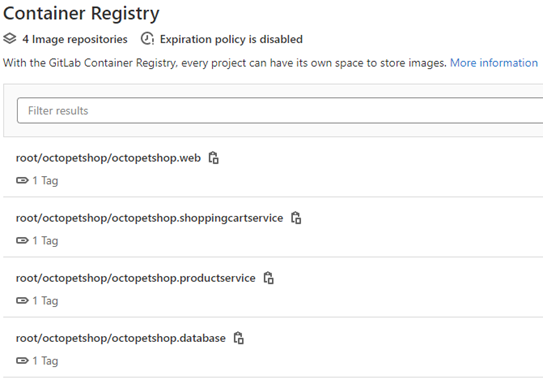

## Connecting GitLab registries as external feeds

Aside from the built-in repository, Octopus Deploy supports the use of [external feeds](https://octopus.com/docs/packaging-applications/package-repositories) to pull packages for deployment.  To add an external feed, click **Library**, then **External Feeds**, and **ADD FEED**.

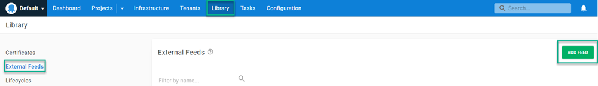

### Adding a GitLab Maven feed

To add a GitLab Maven registry, you need the Project or Group ID the feed is associated with. This post demonstrates the project level.  To get the Project ID, navigate to the project, and the ID is displayed on the initial screen:

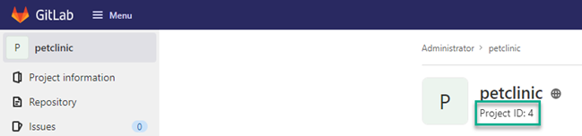

Fill in the form fields:

- **Feed Type**: `Maven Feed`
- **Name**: Give the feed a name, for example, `GitLab Petclinic Maven Feed`
- **URL**: `https://[gitlabserver]/api/v4/projects/[project or group id]/packages/maven`
- (Optional) **Credentials**: Username and password to access the feed

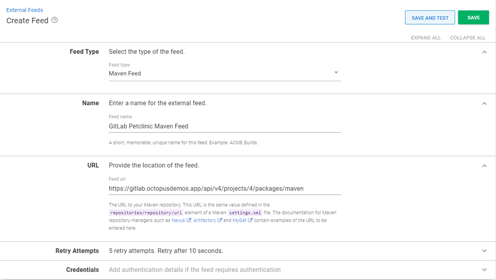

Click **SAVE AND TEST** to ensure the feed is functional.  Enter the name of the package using the GROUP:ARTIFACT format.

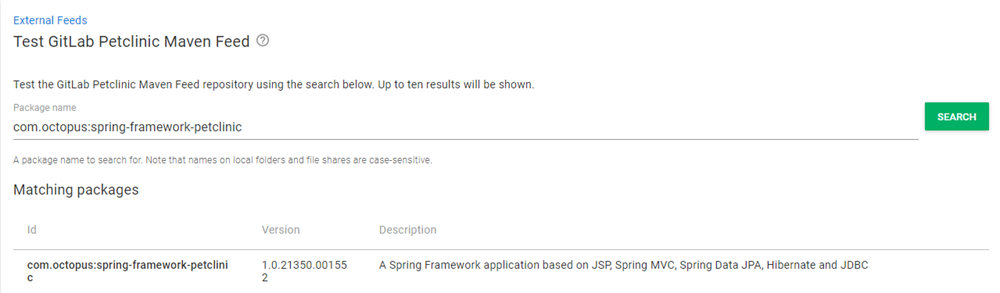

### Adding a GitLab NuGet feed
Similar to the Maven feed, you need the Project or Group ID the feed is associated with.

Fill in the form fields:

- **Feed Type**: `NuGet Feed`
- **Name**: Give the feed a name, for example, `GitLab OctoPetShop Nuget Feed`
- **URL**: `https://[gitlabserver]/api/v4/projects/[project or group id]/packages/nuget/index.json`
- (Optional) **Credentials**: Username and password to access the feed

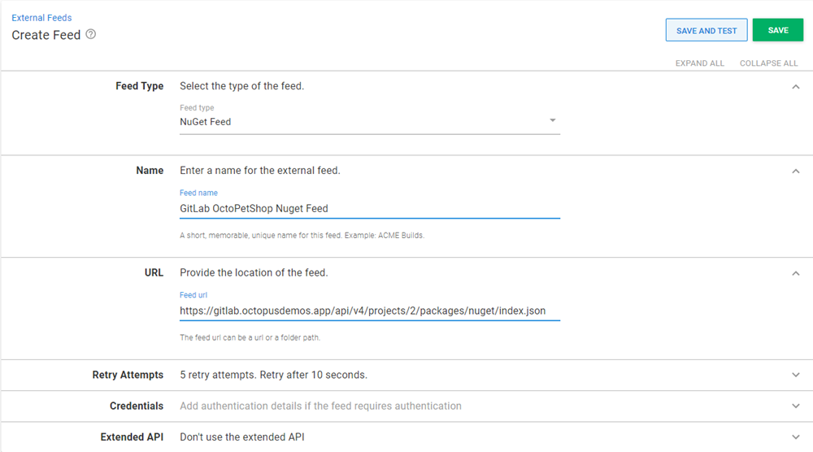

Click **SAVE AND TEST** to ensure the feed is functional.  Enter the name of the package (can be partial):

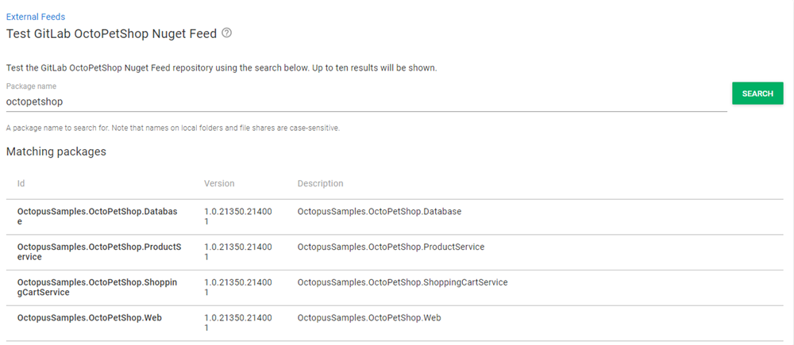

### Adding a GitLab container feed

Unlike the other 2 feed types, the container feed doesn't need the Project or Group ID.  It does, however, need to know which port on the server is configured to host the container registry.

Fill in the form fields:

- **Feed Type**: `Docker Container Registry`
- **Name**: Give the feed a name, for example, `GitLab Container Registry`
- **URL**: `https://[gitlabserver]:[port]`
- **Credentials**: Username and password to access the feed

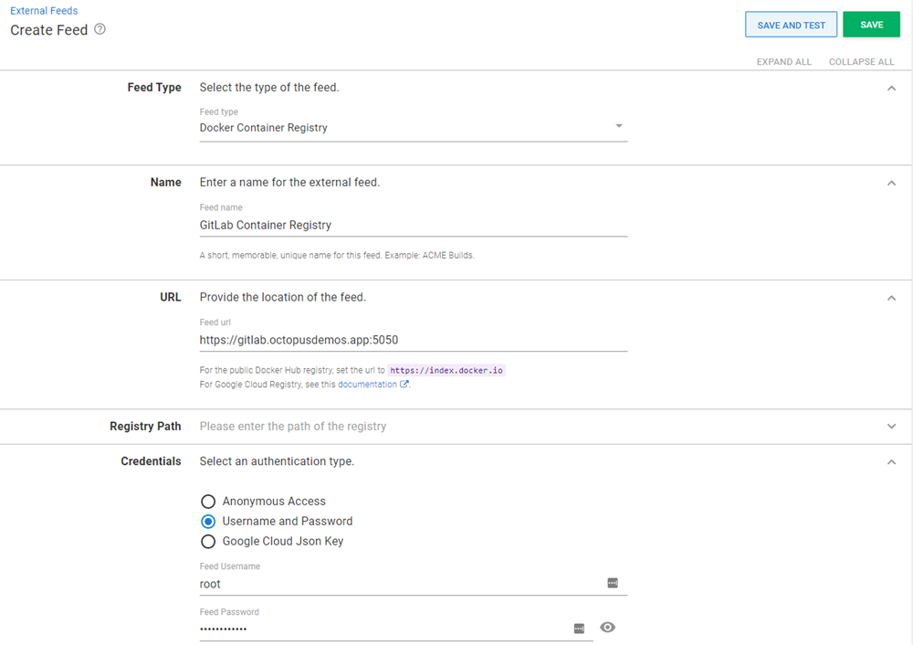

Click **SAVE AND TEST** to ensure the feed is functional. Enter the name of the package (can be partial):

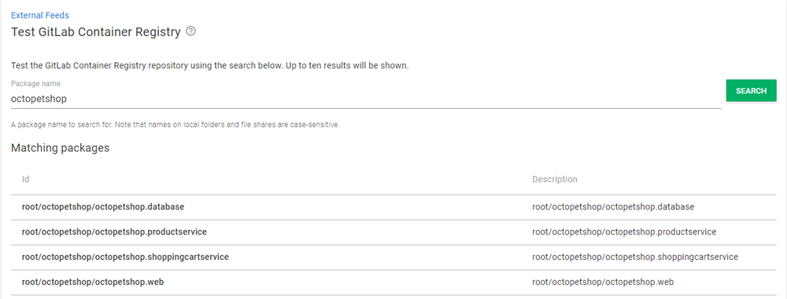

## Conclusion

In many cases, you'll benefit from using Octopus Deploy's built-in repository. However, if you need something cross-space and don't want to duplicate, there are alternatives. This post showed you how to use GitLab's built-in registries as external feeds to deploy your projects with Octopus.

Happy deployments!