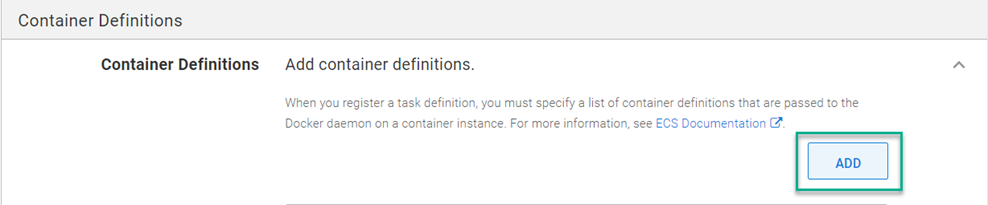
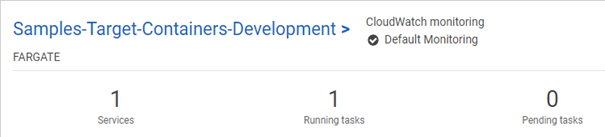
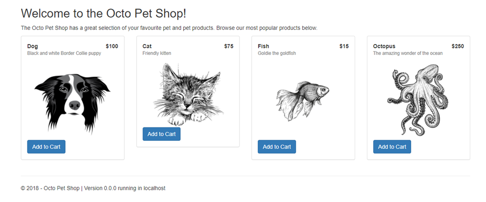

A little over a year ago, I wrote a [blog post](https://octopus.com/blog/aws-fargate) demonstrating how to deploy to AWS ECS using Octopus Deploy.  While the content showed you how to make it work, having to script out everything yourself using the AWS CLI wasn't exactly a stellar experience.  Octopus [ellicted feedback](https://github.com/OctopusDeploy/StepsFeedback/issues/1) from the community and found that ECS support was something that our customers felt we were lacking.  As of version 2021.3, Octopus Depoloy now includes an ECS deployment step that completely replaces everything from the original post!

## Amazon ECS Target
The first thing you'll need to do is create an ECS cluster to deploy to.  Below is a quick script that uses the aws CLI to create a cluster

```powershell
# Get variables
$ecsClusterName = $OctopusParameters['AWS.ECS.Cluster.Name']

# Create cluster
aws ecs create-cluster --cluster-name $ecsClusterName
```

With the cluster created, you'll need to add it to Octopus Deploy as a deployment target.  When creating a new target, select the AWS category, then the new ECS Target


This post uses `PetClinic-ECS` as the assigned role.

As with other target types, you can also add the target via the API or use script commands.

### API
Registering a target via the API isn't anything new, there are many examples on how to do this.  However, the ECS step utilizes the new `Step UI Framework` (link?).  The `Endpoint` component of the JSON document for an ECS Target is different than other target types.  Below is an example script on how to register an ECS target via the API.

```powershell
# Define parameters
$baseUrl = $OctopusParameters['Global.Base.Url']
$apiKey = $OctopusParameters['Global.Api.Key']
$spaceId = $OctopusParameters['Octopus.Space.Id']
$spaceName = $OctopusParameters['Octopus.Space.Name']
$environmentName = $OctopusParameters['Octopus.Environment.Name']
$environmentId = $OctopusParameters['Octopus.Environment.Id']
$awsAccount = $OctopusParameters['AWS.Account']
$awsECSClusterName = $OctopusParameters['AWS.ECS.Cluster.Name']
$awsRegion = $OctopusParameters['AWS.Region.Name']
$name = $OctopusParameters['AWS.ECS.Cluster.Name']

# Get default machine policy
$machinePolicy = (Invoke-RestMethod -Method Get -Uri "$baseUrl/api/$spaceId/machinepolicies/all" -Headers @{"X-Octopus-ApiKey"="$apiKey"}) | Where-Object {$_.Name -eq "Default Machine Policy"}
Write-Output "Retrieved $($machinePolicy.Name) ..."

# Build JSON payload
$jsonPayload = @{
	Id = $null
    MachinePolicyId = $machinePolicy.Id
    Name = $name
    IsDisabled = $false
    HealthStatus = "Unknown"
    HasLatestCalamari = $true
    StatusSummary = $null
    IsInProcess = $true
    EndPoint = @{
    	DeploymentTargetType = "aws-ecs-target"
        DeploymentTargetTypeId = "aws-ecs-target"
        StepPackageId = "aws-ecs-target"
        StepPackageVersion = "1.0.0"
        Inputs = @{
        	clusterName = $awsECSClusterName
            region = $awsRegion
            awsAccount = $awsAccount
        }
        RelatedDocumentIds = @($awsAccount)
    	Id = $null
        CommunicationStyle = "StepPackage"
        Links = $null
        DefaultWorkerPoolId = ""
    }
    Links = $null
    TenantedDeploymentParticipation = "Untenanted"
    Roles = @(
    	"PetClinic-ECS"
    )
    EnvironmentIds = @(
    	$environmentId
    )
    TenantIds = @()
    TenantTags = @()
}

# Register the target to Octopus Deploy
Invoke-RestMethod -Method Post -Uri "$baseUrl/api/$spaceId/machines" -Headers @{"X-Octopus-ApiKey"="$apiKey"} -Body ($jsonPayload | ConvertTo-Json -Depth 10)
```

### Script commands
Target types that were developed using the Step UI Framework can take advantage of a new command to register their target types.  Below is an example of how to use the command to register an ECS Target using PowerShell or Bash

```powershell PowerShell
$inputs = @"
{
    "clusterName": "$($OctopusParameters["clusterName"])",
    "region": "$($OctopusParameters["region"])",
    "awsAccount": "$($OctopusParameters["awsAccount"])",
}
"@
New-OctopusTarget -Name $OctopusParameters["target_name"] -TargetId "aws-ecs-target" -Inputs $inputs -Roles $OctopusParameters["role"]
```
```bash Bash
read -r -d '' INPUTS <<EOT
{
    "clusterName": "$(get_octopusvariable "clusterName")",
    "name": "$(get_octopusvariable "target_name")",
    "awsAccount": "$(get_octopusvariable "awsAccount")",
}
EOT
new_octopustarget -n "$(get_octopusvariable "target_name")" -t "aws-ecs-target" --inputs "$INPUTS" --roles "$(get_octopusvariable "role")"
```

## The DEPLOY AMAZON ECS SERVICE step
To demonstrate the **DEPLOY AMAZON ECS SERVICE** step, this post will duplicate the deployment of the containerized version of the OctoPetShop application from the previous post using the new step.

### Adding the DEPLOY AMAZON ECS SERVICE step
To add the The **DEPLOY AMAZON ECS SERVICE** step, click on **ADD STEP**, choose AWS, then `Deploy Amazon ECS Service`


:::info
In the script version, the `Register-ECSTaskDefinition` cmdlet takes a parameter `-Cpu 512`.  This value equates to `0.5 vCpu` in the new step (https://docs.aws.amazon.com/AmazonECS/latest/developerguide/task-cpu-memory-error.html).
:::

Once the step has been added fill in the form fields with same information from the script (anything not listed are either blank or use default values)

- Name: octopetshop-web
- Desired Count: 1
- Task Memory (GB): 4 GB
- Task CPU (units): 0.5 vCPU
- Security Group IDs: (Your AWS Security group ID)
- Subent IDs: (Two AWS subnet IDs)
- Auto-Assign Public IP: Yes
- Enable ECS Managed Tags: No

Click the **ADD** button to add containers to the ECS service


- Container Definitions:
  - Container Name: octopetshop-web
    - Container Image: This post pulls the octopetshop-web image from AWS ACR
    - Container Port Mappings:
      - 5000, tcp
      - 5001, tcp
    - Environment Variables
      - Key: ProductServiceBaseUrl, Value: http://localhost:5011
      - Key: ShoppingCartServiceBaseUrl, Value: http://localhost:5012
  - Container Name: octopetshop-productservice
   - Container Image: This post pulls the octopetshop-productservice image from AWS ACR
   - Container Port Mappings:
     - 5011, tcp
   - Environment Variables
     - Key: OPSConnectionString, Value: Database connection string (ie: Data Source=localhost;Initial Catalog=OctoPetShop; User ID=#{Project.Database.User.Name}; Password=#{Project.Database.User.Password})
  - Container Name: octopetshop-shoppingcartservice
    - Container Image: This post pulls the octopetshop-web image from AWS ACR
    - Container Port Mappings:
      - 5012, tcp
   - Environment Variables
     - Key: OPSConnectionString, Value: Database connection string (ie: Data Source=localhost;Initial Catalog=OctoPetShop; User ID=#{Project.Database.User.Name}; Password=#{Project.Database.User.Password})
  - Container Name: sqlserver
    - Container Image: This post pulls the mssql/server image from the Microsoft container registry
    - Container Port Mappings:
      - 1433, tcp
    - Environment Variables
      - Key: ACCEPT_EULA, Value: Y
      - Key: SA_PASSWORD, Value: (secure password)
  - Container Name: octopetshop-database
    - Container Image: This post pulls the octopetshop-database image from AWS ACR
    - Essential: False
   - Environment Variables
     - Key: DbUpConnectionString, Value: Database connection string (ie: Data Source=localhost;Initial Catalog=OctoPetShop; User ID=#{Project.Database.User.Name}; Password=#{Project.Database.User.Password})    

And that's it!  This single step completely replaces the custom scripting from the previous post.

A deployment should look something like this


## Testing the deployment
Once the deployment is complete, the AWS console should show a Fargate service running



Clicking into the cluster, you'll see that your containers are running and a public IP Address has been assigned


:::info
The `octopetshop-database` performs database migrations and is designed to stop once it's done.  The `STOPPED` status is normal.
:::

The octopetshop-web container is configured to listen on ports 5000 and 5001.  Navigating to `Public IP` address, port 5000 will redirect you to HTTPS on 5001.  The certificate is a .NET core development certificate which will be untrusted, the dialogue about a security risk is normal.  Once you've proceeded to the site, you'll see the Octo Pet Shop application.



## Conclusion
The previous post showed you that you could deploy to Amazon ECS using a scripting method.  While it worked, it was quite clunky and the experience was not as nice as other, built-in deployment steps.  This post demonstrated how to replace the scripting method with the new, built-in ECS deployment step.  Happy deployments!