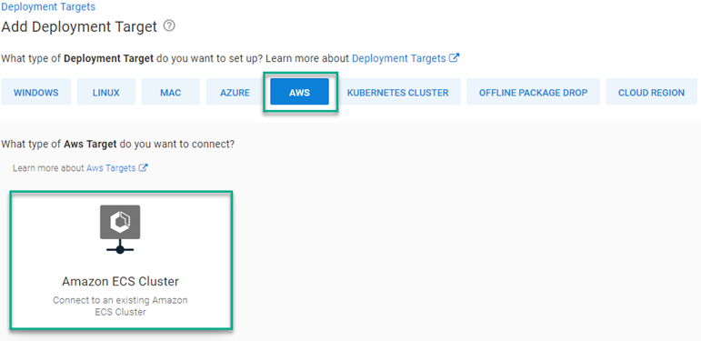
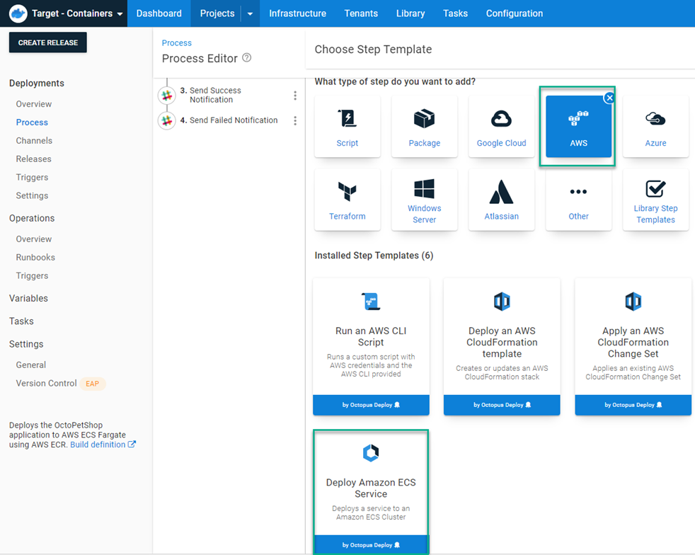
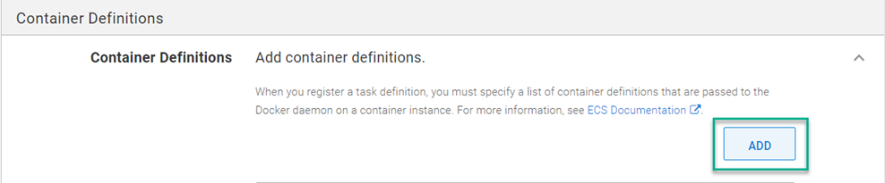
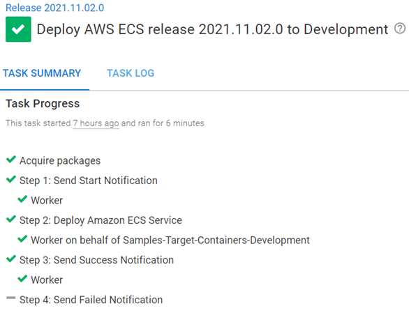
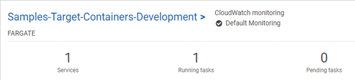
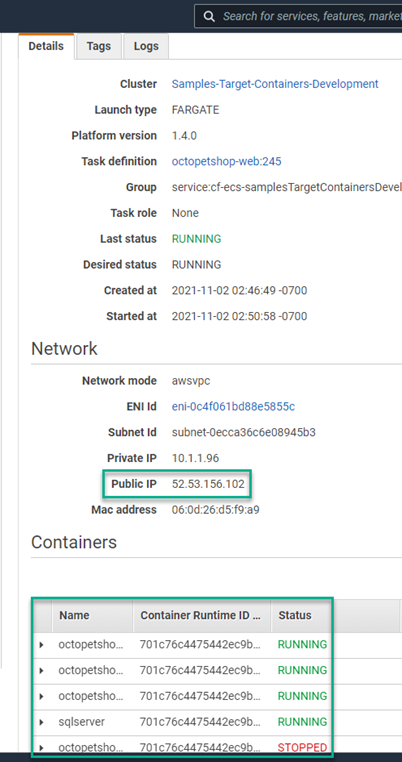
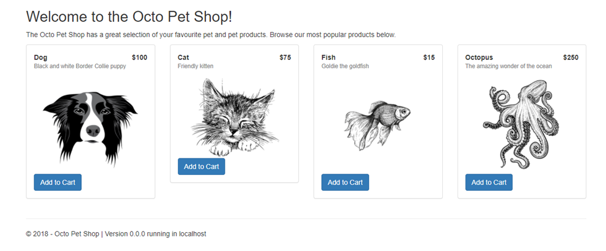

I previously wrote a [post demonstrating how to deploy to AWS ECS using Octopus Deploy](https://octopus.com/blog/aws-fargate). I showed you how to make it work, but scripting everything yourself using the AWS CLI wasn't an ideal experience. We [gathered feedback](https://github.com/OctopusDeploy/StepsFeedback/issues/1) from the community and discovered our customers wanted better ECS support. As of version 2021.3, Octopus Deploy includes an ECS deployment step that replaces everything from the original post.

In this post, I explain how to implement the new ECS deployment step.

## Amazon ECS target

First, you need to create an ECS cluster to deploy to. The script below uses the AWS CLI to create a cluster:

```powershell
# Get variables
$ecsClusterName = $OctopusParameters['AWS.ECS.Cluster.Name']

# Create cluster
aws ecs create-cluster --cluster-name $ecsClusterName
```

After you create the cluster, you need to add it to Octopus Deploy as a deployment target.  When creating a new target, select the AWS category, then the new ECS Target.



This post uses `PetClinic-ECS` as the assigned role.

As with other target types, you can also add the target via the API or use script commands.

### API
There are many examples of how to register a target via the API.  However, the ECS step uses the new **Step UI Framework** (link?).  The `Endpoint` component of the JSON document for an ECS target differs to other target types. The example script below shows you how to register an ECS target via the API:

```powershell
# Define parameters
$baseUrl = $OctopusParameters['Global.Base.Url']
$apiKey = $OctopusParameters['Global.Api.Key']
$spaceId = $OctopusParameters['Octopus.Space.Id']
$spaceName = $OctopusParameters['Octopus.Space.Name']
$environmentName = $OctopusParameters['Octopus.Environment.Name']
$environmentId = $OctopusParameters['Octopus.Environment.Id']
$awsAccount = $OctopusParameters['AWS.Account']
$awsECSClusterName = $OctopusParameters['AWS.ECS.Cluster.Name']
$awsRegion = $OctopusParameters['AWS.Region.Name']
$name = $OctopusParameters['AWS.ECS.Cluster.Name']

# Get default machine policy
$machinePolicy = (Invoke-RestMethod -Method Get -Uri "$baseUrl/api/$spaceId/machinepolicies/all" -Headers @{"X-Octopus-ApiKey"="$apiKey"}) | Where-Object {$_.Name -eq "Default Machine Policy"}
Write-Output "Retrieved $($machinePolicy.Name) ..."

# Build JSON payload
$jsonPayload = @{
	Id = $null
    MachinePolicyId = $machinePolicy.Id
    Name = $name
    IsDisabled = $false
    HealthStatus = "Unknown"
    HasLatestCalamari = $true
    StatusSummary = $null
    IsInProcess = $true
    EndPoint = @{
    	DeploymentTargetType = "aws-ecs-target"
        DeploymentTargetTypeId = "aws-ecs-target"
        StepPackageId = "aws-ecs-target"
        StepPackageVersion = "1.0.0"
        Inputs = @{
        	clusterName = $awsECSClusterName
            region = $awsRegion
            awsAccount = $awsAccount
        }
        RelatedDocumentIds = @($awsAccount)
    	Id = $null
        CommunicationStyle = "StepPackage"
        Links = $null
        DefaultWorkerPoolId = ""
    }
    Links = $null
    TenantedDeploymentParticipation = "Untenanted"
    Roles = @(
    	"PetClinic-ECS"
    )
    EnvironmentIds = @(
    	$environmentId
    )
    TenantIds = @()
    TenantTags = @()
}

# Register the target to Octopus Deploy
Invoke-RestMethod -Method Post -Uri "$baseUrl/api/$spaceId/machines" -Headers @{"X-Octopus-ApiKey"="$apiKey"} -Body ($jsonPayload | ConvertTo-Json -Depth 10)
```

### Script commands
Target types developed using the Step UI Framework take advantage of a new command to register their target types.  Below is an example of how to use the command to register an ECS target using PowerShell or Bash:

```powershell PowerShell
$inputs = @"
{
    "clusterName": "$($OctopusParameters["clusterName"])",
    "region": "$($OctopusParameters["region"])",
    "awsAccount": "$($OctopusParameters["awsAccount"])",
}
"@
New-OctopusTarget -Name $OctopusParameters["target_name"] -TargetId "aws-ecs-target" -Inputs $inputs -Roles $OctopusParameters["role"]
```
```bash Bash
read -r -d '' INPUTS <<EOT
{
    "clusterName": "$(get_octopusvariable "clusterName")",
    "name": "$(get_octopusvariable "target_name")",
    "awsAccount": "$(get_octopusvariable "awsAccount")",
}
EOT
new_octopustarget -n "$(get_octopusvariable "target_name")" -t "aws-ecs-target" --inputs "$INPUTS" --roles "$(get_octopusvariable "role")"
```

## The Deploy Amazon ECS Service step
To show you how to use the **Deploy Amazon ECS Service** step, this post duplicates the deployment of the containerized version of the Octo Pet Shop application from the previous post, using the new step.

### Adding the Deploy Amazon ECS Service step

To add the **Deploy Amazon ECS Service** step, click **ADD STEP**, choose AWS, then **Deploy Amazon ECS Service**.



:::hint
In the script version, the `Register-ECSTaskDefinition` cmdlet takes a parameter `-Cpu 512`.  This value equates to `0.5 vCpu` in the new step, See the [AWS documentation for more information](https://docs.aws.amazon.com/AmazonECS/latest/developerguide/task-cpu-memory-error.html).
:::

After you add the step, fill in the form fields with the same information from the script. Anything not listed can be left blank or use default values.

- Name: `octopetshop-web`
- Desired Count: `1`
- Task Memory (GB): `4 GB`
- Task CPU (units): `0.5 vCPU`
- Security Group IDs: (Your AWS Security group ID)
- Subent IDs: (Two AWS subnet IDs)
- Auto-Assign Public IP: `Yes`
- Enable ECS Managed Tags: `No`

Click the **ADD** button to add containers to the ECS service.



- Container Definitions:
  - Container Name: `octopetshop-web`
    - Container Image: This post pulls the octopetshop-web image from AWS ACR
    - Container Port Mappings:
      - `5000, tcp`
      - `5001, tcp`
    - Environment Variables
      - Key: `ProductServiceBaseUrl, Value: http://localhost:5011`
      - Key: `ShoppingCartServiceBaseUrl, Value: http://localhost:5012`
  - Container Name: `octopetshop-productservice`
   - Container Image: This post pulls the octopetshop-productservice image from AWS ACR
   - Container Port Mappings:
     - `5011, tcp`
   - Environment Variables
     - Key: `OPSConnectionString, Value: Database connection string (ie: Data Source=localhost;Initial Catalog=OctoPetShop; User ID=#{Project.Database.User.Name}; Password=#{Project.Database.User.Password}`
  - Container Name: `octopetshop-shoppingcartservice`
    - Container Image: This post pulls the octopetshop-web image from AWS ACR
    - Container Port Mappings:
      - `5012, tcp`
   - Environment Variables
     - Key: `OPSConnectionString, Value: Database connection string (ie: Data Source=localhost;Initial Catalog=OctoPetShop; User ID=#{Project.Database.User.Name}; Password=#{Project.Database.User.Password})`
  - Container Name: `sqlserver`
    - Container Image: This post pulls the mssql/server image from the Microsoft container registry
    - Container Port Mappings:
      - `1433, tcp`
    - Environment Variables
      - Key: `ACCEPT_EULA, Value: Y`
      - Key: `SA_PASSWORD, Value: (secure password)`
  - Container Name: `octopetshop-database`
    - Container Image: This post pulls the octopetshop-database image from AWS ACR
    - Essential: `False`
   - Environment Variables
     - Key: `DbUpConnectionString, Value: Database connection string (ie: Data Source=localhost;Initial Catalog=OctoPetShop; User ID=#{Project.Database.User.Name}; Password=#{Project.Database.User.Password})`    

And that's it! This single step replaces the custom scripting from the previous post.

A deployment looks something like this:



## Testing the deployment
After the deployment is complete, the AWS console shows a Fargate service running.



Clicking into the cluster, you see your containers running and an assigned public IP address.



:::info
The `octopetshop-database` performs database migrations and is designed to stop after it's complete.  The `STOPPED` status is normal.
:::

The octopetshop-web container is configured to listen on ports 5000 and 5001.  Navigating to **Public IP** address, port 5000 redirects you to HTTPS on 5001.  The certificate is a .NET core development certificate which is untrusted, so the dialogue about a security risk is normal. After you proceed to the site, you see the Octo Pet Shop application.



## Conclusion
My [previous post](https://octopus.com/blog/aws-fargate) showed you how to deploy to Amazon ECS using a scripting method.  While it worked, the experience wasn't as easy as the built-in deployment steps. This post demonstrated how to replace the scripting method with the new, built-in ECS deployment step.  

Happy deployments!