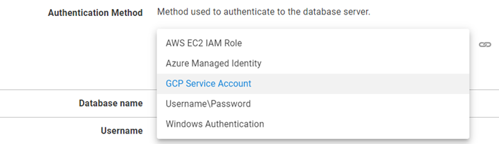
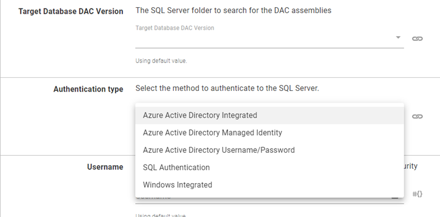

Amazon Web Services (AWS), Azure, and Google Cloud Platform (GCP) have introduced passwordless authentication mechanisms where resources such as virtual machines (VMs) can be assigned an identity (Azure), a service account (GCP), or a role (AWS) that can be used to authenticate to other resources such as database server instances. 

Octopus Deploy has several built-in steps that support authenticating to resources using this method, however, database deployments are almost entirely done using community step templates.  

The Octopus community has been hard at work updating templates to support cloud-native authentication. In this post, I list templates updated with cloud provider authentication functionality.

## Database technologies that support cloud-native authentication methods

Only some database technologies offered by cloud providers support cloud-native authentication. Below, I list by provider which technologies are supported:

AWS

- Amazon Aurora
- MariaDB
- MySQL
- PostgreSQL

Azure

- Azure Cosmos DB
- MySQL
- PostgreSQL
- Microsoft SQL Server

GCP

- MySQL
- PostgreSQL

Both GCP and AWS support Windows Authentication for Microsoft SQL Server, however, the server must connect to an Active Directory domain on the cloud provider.

:::warning
Amazon Aurora and Azure Cosmo haven't been tested with the templates listed in this post.  
::::

## Step templates with cloud authentication support

The following community step templates have been updated to support using cloud-native database authentication:

- [Flyway Database Migrations](https://library.octopus.com/step-templates/ccebac39-79a8-4ab4-b55f-19ea570d9ebc/actiontemplate-flyway-database-migrations)
- [Liquibase Run Command](https://library.octopus.com/step-templates/36df3e84-8501-4f2a-85cc-bd9eb22030d1/actiontemplate-liquibase-run-command)
- [MariaDB - Add Database User To Role](https://library.octopus.com/step-templates/24095ff8-a851-498f-8105-667bd76733eb/actiontemplate-mariadb-add-database-user-to-role)
- [MariaDB - Create Database If Not Exists](https://library.octopus.com/step-templates/2bdfe600-e205-43f9-b174-67ee5d36bf5b/actiontemplate-mariadb-create-database-if-not-exists)
- [MariaDB - Create User If Not Exists](https://library.octopus.com/step-templates/5e41412b-0839-4fa8-b7a1-9360115ef303/actiontemplate-mariadb-create-user-if-not-exists)
- [MySQL - Add Database User To Role](https://library.octopus.com/step-templates/fc7272be-779c-4ef2-8051-0e7271471328/actiontemplate-mysql-add-database-user-to-role)
- [MySQL - Create Database If Not Exists](https://library.octopus.com/step-templates/4a222ac3-ff4b-4328-8778-1c44eebdedde/actiontemplate-mysql-create-database-if-not-exists)
- [MySQL - Create User If Not Exists](https://library.octopus.com/step-templates/d5e87b36-da2b-4771-9394-0dbdc9587dd4/actiontemplate-mysql-create-user-if-not-exists)
- [Postgres - Add Database User To Role](https://library.octopus.com/step-templates/72f8bfaf-14c3-4807-b687-c07738c14ba1/actiontemplate-postgres-add-database-user-to-role)
- [Postgres - Create Database If Not Exists](https://library.octopus.com/step-templates/0a1208c7-4a12-4da1-a60d-2b3197b377c4/actiontemplate-postgres-create-database-if-not-exists)
- [Postgres - Execute SQL](https://library.octopus.com/step-templates/9a9c8c2c-d50e-4dc8-8e7e-b561f6e8fc15/actiontemplate-postgres-execute-sql)
- [Postgres - Create User If Not Exists](https://library.octopus.com/step-templates/6e676055-fb63-450f-9d98-ac99c4a68023/actiontemplate-postgres--create-user-if-not-exists)
- [SQL - Deploy DACPAC with AAD Auth support](https://library.octopus.com/step-templates/ae9d0024-a5aa-4aa8-95a9-cba53c291054/actiontemplate-sql-deploy-dacpac-with-aad-auth-support)

With the exception of **SQL - Deploy DACPAC with AAD Auth support**, the templates above work on Windows (PowerShell, PowerShell Core) and Linux (PowerShell Core) and have been updated with an **Authentication Method** selector that supports the following types:

- AWS EC2 IAM Role
- Azure Managed Identity
- GCP Service Account
- Username\Password
- Windows Authentication

:::Info
Flyway Database Migrations is PowerShell Core only.
:::

### SQL - Deploy DACPAC with AAD Auth support

Cloud-native authentication using the **SQL - Deploy DACPAC with AAD Auth support** template is limited to the Azure cloud provider and supports the following methods:

- Azure Active Directory Integrated
- Azure Active Directory Managed Identity
- Azure Active Directory Username/Password
- SQL Authentication
- Windows Integrated

**SQL - Deploy DACPAC with AAD Auth support** is written in PowerShell and makes use of .NET standard DLL files that are part of the SQL Server installation or SQL Server PowerShell module.  Because of this, it doesn't work on the Linux operating system.

## Conclusion

The Octopus community recognizes the advantages of using authentication mechanisms offered by cloud providers.  

In this post, I listed templates that have been updated with cloud provider authentication functionality.

## Learn more

Our Samples instance has updated examples that use cloud-native authentication:

- [MySQL using Azure Managed Identity and Flyway](https://samples.octopus.app/app#/Spaces-242/projects/flyway-azure-paas/deployments/process)
- [MySQL using Azure Managed Identity and Liquibase](https://samples.octopus.app/app#/Spaces-242/projects/liquibase-azure-paas/deployments/process)
- [MySQL using Google Cloud Service Account and Flyway](https://samples.octopus.app/app#/Spaces-242/projects/flyway-gcp-service-account/deployments)
- [MySQL using Google Cloud Service Account and Liquibase](https://samples.octopus.app/app#/Spaces-242/projects/liquibase-gcp-service-account/deployments/process)
- [PostgreSQL using Azure Managed Identity and Flyway](https://samples.octopus.app/app#/Spaces-243/projects/flyway-azure-paas/deployments/process)
- [PostgreSQL using Azure Managed Identity and Liquibase](https://samples.octopus.app/app#/Spaces-243/projects/liquibase-azure-paas/deployments/process)
- [PostgreSQL using Google Cloud Service Account and Flyway](https://samples.octopus.app/app#/Spaces-243/projects/flyway-gcp-service-account/deployments/process)
- [PostgreSQL using Google Cloud Service Account and Liquibase](https://samples.octopus.app/app#/Spaces-243/projects/liquibase-gcp-service-account/deployments/process)

Happy deployments! 