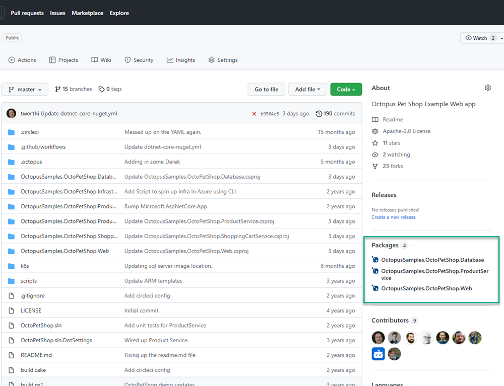
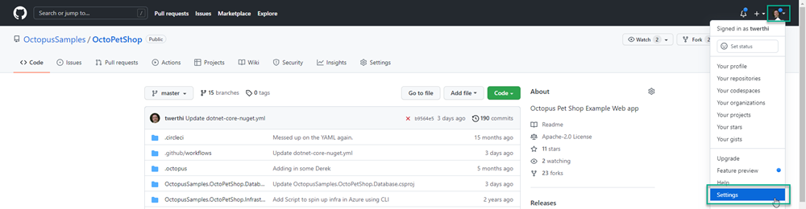
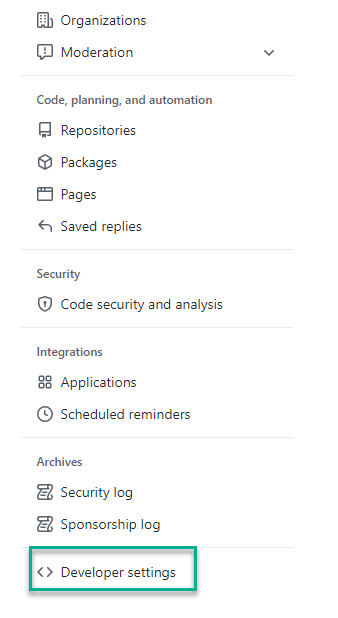
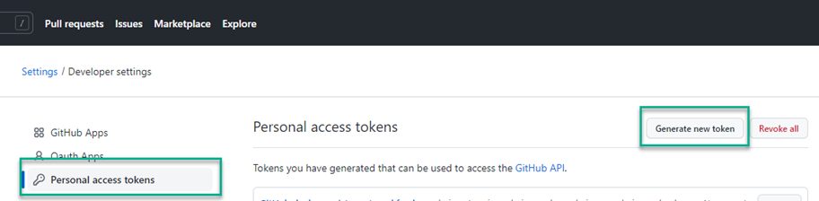
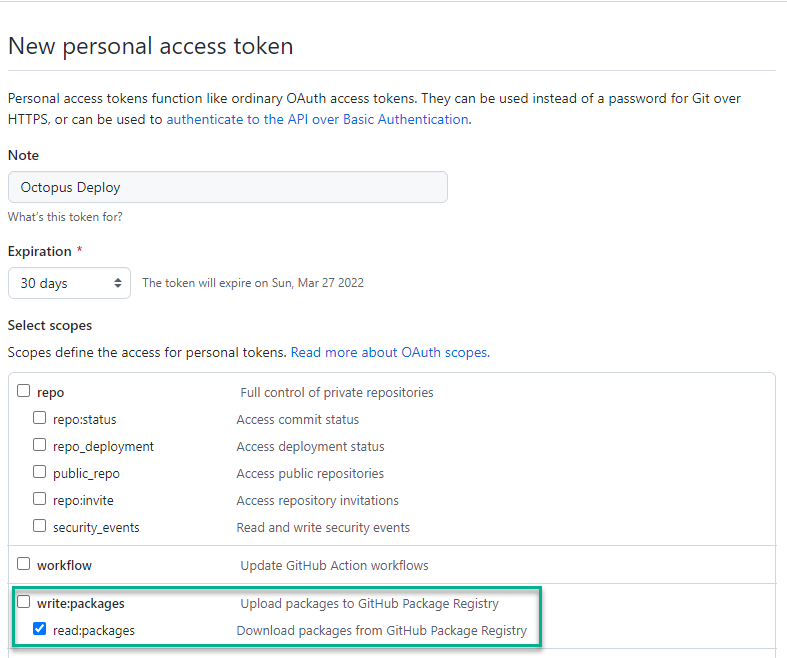
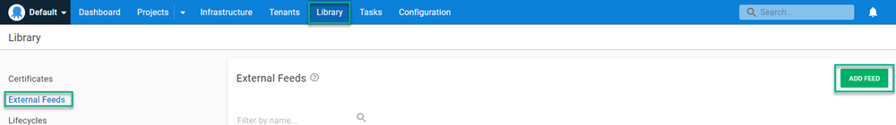
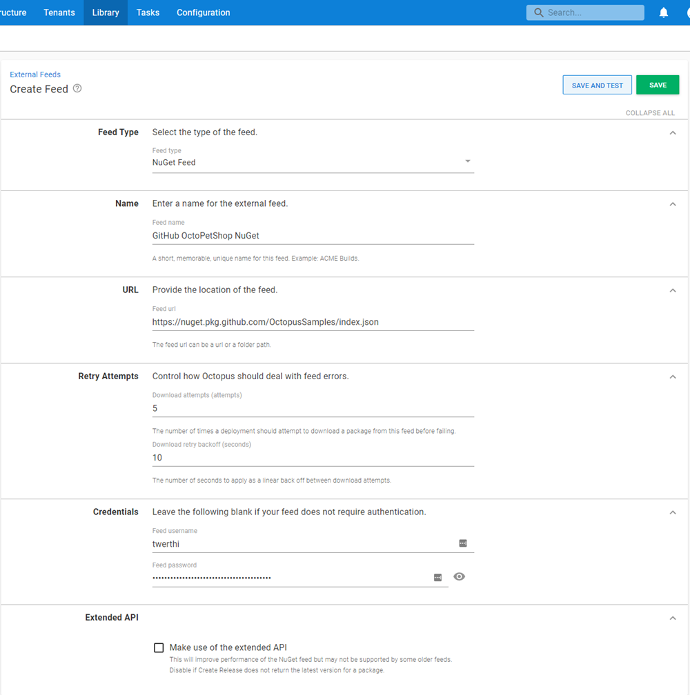
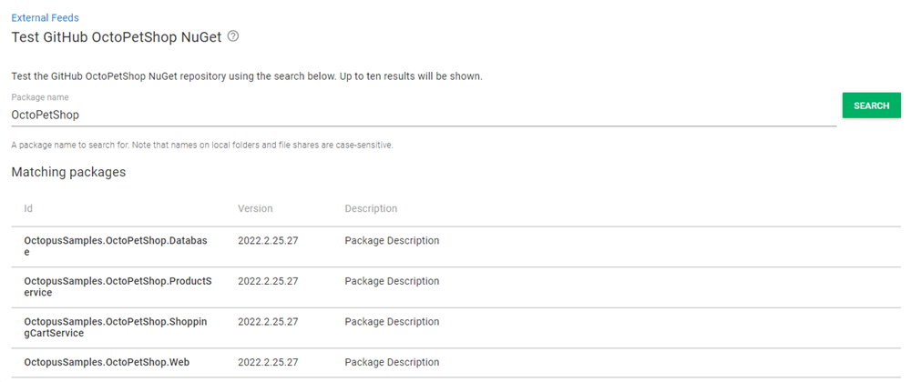

GitHub has become more than just a source code repository.  The folks at GitHub have developed features like their build server offering, GitHub Actions, and issue tracking. They even developed GitHub Packages, a registry which is compatible with Docker containers, npm, Maven, NuGet packages, and RubyGems.  

In this post, I show you how to configure a GitHub Actions job to push a .NET core NuGet package into the registry and connect the registry to Octopus Deploy as an [external feed](https://octopus.com/docs/packaging-applications/package-repositories).

## Configuring the .NET Core application

To push packages to GitHub Packages, you need to specify the `RepositoryUrl` element in the `.csproj` file.  This information is used by the `dotnet` commands when packing and pushing the packages to the registry.  Below is an example for the OctoPetShop Database project:

[OctopusSamples.OctoPetShop.Database.csproj](https://github.com/OctopusSamples/OctoPetShop/blob/master/OctopusSamples.OctoPetShop.Database/OctopusSamples.OctoPetShop.Database.csproj)
```xml
<Project Sdk="Microsoft.NET.Sdk">

  <PropertyGroup>
    <OutputType>Exe</OutputType>
    <TargetFramework>netcoreapp2.1</TargetFramework>
    <RuntimeIdentifiers>win-x64;linux-x64</RuntimeIdentifiers>
    <TargetLatestRuntimePatch>true</TargetLatestRuntimePatch>
    <RepositoryUrl>https://github.com/OctopusSamples/OctoPetShop.git</RepositoryUrl>
  </PropertyGroup>

  <ItemGroup>
    <PackageReference Include="dbup" Version="4.2.0" />
  </ItemGroup>

  <ItemGroup>
    <EmbeddedResource Include="scripts/*.sql" />
  </ItemGroup>

  <ItemGroup>
    <None Update="deploy.sh" CopyToOutputDirectory="PreserveNewest" />
    <None Update="deploy.ps1" CopyToOutputDirectory="PreserveNewest" />
  </ItemGroup>

</Project>
```

## Configuring GitHub Actions build

Aside from building the application, the GitHub Actions job needs to perform the following activities:

- Package the application components into NuGet packages
- Add the NuGet repository source
- Push the packages into the package registry

All of these commands are available in the `dotnet` CLI.

### Package the application into a NuGet package

You can pack the application into a NuGet package in many ways. This post uses the `dotnet pack` command built into the .NET CLI.  

To set the package version, use the MSBuild syntax of `-p:PackageVersion $PACKAGE_VERSION`.  The `$PACKAGE_VERSION` variable is declared earlier in the GitHub Actions YAML (see [our OctoPetShop sample](https://github.com/OctopusSamples/OctoPetShop/blob/master/.github/workflows/dotnet-core-nuget.yml) for the entire process).  Below is an excerpt of the build to show the packing of the OctoPetShop Database project:

```yaml
    - name: Pack OctoPetShopDatabase
      run: |
        dotnet pack OctopusSamples.OctoPetShop.Database/OctopusSamples.OctoPetShop.Database.csproj --configuration Release --output "$GITHUB_WORKSPACE/artifacts/OctopusSamples.OctoPetShop.Database" -p:PackageVersion=$PACKAGE_VERSION
```

### Add the NuGet repository source

To target the GitHub Packages registry, you need to add the registry as a source.  The `source` URL is in the following format: `https://nuget.pkg.github.com/YourGitHubUsernameOrOrganizationName/index.json`.  

You also need to specify credentials with sufficient permissions to push packages to the registry. You can create a Personal Access Token (PAT) or use the built-in secret available in GitHub Actions, `GITHUB_TOKEN`.

```yaml
    - name: Add source
      run: |
        dotnet nuget add source "https://nuget.pkg.github.com/OctopusSamples/index.json" --username OctopusSamples --password ${{ secrets.GITHUB_TOKEN }} --store-password-in-clear-text --name github 
```

### Push the package into the package registry

You also need to specify credentials for the `push` command, and you can also use `GITHUB_TOKEN` for the `--api-key` argument:

```yaml
    - name: Push packages to GitHub Packages NuGet feed
      run: |
        dotnet nuget push "$GITHUB_WORKSPACE/artifacts/OctopusSamples.OctoPetShop.Database/OctopusSamples.OctoPetShop.Database.$PACKAGE_VERSION.nupkg"  --api-key ${{ secrets.GITHUB_TOKEN }} --source "github"
```

After you push the packages, they should appear in the **Packages** section of your GitHub project.



## Configuring GitHub package registry as an external feed

GitHub Packages registries require authentication to pull packages.  Before you can configure the feed, you first need to create a PAT in GitHub.

### Creating a PAT in GitHub

Creating a PAT is relatively straightforward.  To start, click your profile in the upper right-hand corner and choose **Settings**.



Scroll to the bottom of the left-hand menu and click **Developer Settings**.



Click **Personal access tokens**, then **Generate new token**.



Give the token a description, choose an expiration, and assign the `read:packages` permission.  Click **Generate token**.



Copy the new token and save it in a safe location.

### Create external feed

To create an external feed, click **Library**, then **External Feeds**, and then **ADD FEED**.



Fill in the Feed form:

- **Feed Type**: `NuGet Feed`
- **Name**: Give a descriptive name
- **URL**: `https://nuget.pkg.github.com/YourGitHubUsernameOrOrganizationName/index.json`
- **Credentials**
  - **Username**: Username for the token
  - **Password**: PAT you generated earlier



Click **SAVE AND TEST**.  Enter a partial name of the package(s) you created with your build to make sure the feed is working correctly.



## Conclusion

In this post, I demonstrated how to pack an application into a NuGet package using the .NET CLI in GitHub Actions, and push the package into the GitHub Packages registry. I then showed you how to configure the registry as an external feed in Octopus Deploy.

You might also be interested in my post about [using GitLab feeds with Octopus Deploy](https://octopus.com/blog/gitlab-external-feeds).

Happy deployments!