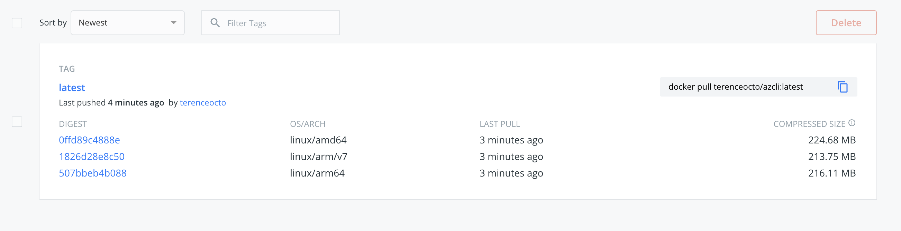

Octopus Deploy previously supported the Azure Command Line Interface (CLI) as part of its [custom Worker Tools](https://github.com/OctopusDeploy/WorkerTools). As of Octopus 2021.1, however, Octopus no longer maintains the current Azure CLI version. If your deployments use the pre-bundled version, you'll receive a warning recommending you maintain your Worker image. 

The Azure tools bundled with Octopus Deploy were provided to make it easy for users who need to run scripts against Azure targets. Octopus bundles versions of the Azure Resource Manager PowerShell modules (AzureRM) and Azure CLI. Since Octopus 2021.1, we recommend maintaining your own worker container with the versioning you need to run your deployments. This way, the tooling provided matches the requirements specified by the deployment.

In this post, you can follow an example of creating a custom Docker image with the latest Azure CLI version, hosting it on Docker Hub, and using it in an Octopus deployment.

## Installing and pushing custom container

To begin, create a Dockerfile that specifies the operating system, as well as the Azure CLI install commands. The latest version of the CLI is set to be installed (2.28.0).

    FROM ubuntu:18.04

    ARG DEBIAN_FRONTEND=noninteractive
    ARG Azure_Cli_Version=2.28.0\*

    # Install wget, apt-utils, and software-properties-common
    RUN apt-get update && \
    apt-get install -y wget apt-utils && \
    apt-get install -y software-properties-common

    # Install the Azure CLI
    RUN wget --quiet -O - https://packages.microsoft.com/keys/microsoft.asc | gpg --dearmor | tee /etc/apt/trusted.gpg.d/microsoft.asc.gpg > /dev/null && \
    echo "deb [arch=amd64] https://packages.microsoft.com/repos/azure-cli/ bionic main" | tee /etc/apt/sources.list.d/azure-cli.list && \
    apt-get update && \
    apt-get install -y azure-cli=${Azure_Cli_Version}

    # Tidy up
    RUN apt-get clean
    
This Dockerfile can include other forms of tooling if required. Octopus is recommending all users maintain their tooling versions as this will ensure consistent deployment outcomes.

Run a docker buildx command to build and push the image to Docker Hub. These instructions are for an M1 Mac. Using multiple platforms ensures that Octopus Deploy will pull down the appropriate version.

    docker buildx build --platform linux/amd64,linux/arm64,linux/arm/v7 -t terenceocto/azcli:latest --push .
    
Upon success, Docker Hub will host the image on Docker Hub.

## Confirm Success

By [specifying a custom container](https://octopus.com/docs/projects/steps/execution-containers-for-workers), you can confirm the version number of the CLI with the built-in Azure CLI that prints out the version to the screen.

Using the custom container instructions, specify the new custom image in the Octopus UI and print out the version again. The Azure CLI is now up to date with the latest version.

Since Octopus 2021.1, the Azure CLI and other tooling are not current. Customers should supply their image with tooling that supports their deployments. This blog post has shown you how to set up a docker image with the latest Azure CLI and use it in an Octopus Deploy deployment.

Happy Deployments!
