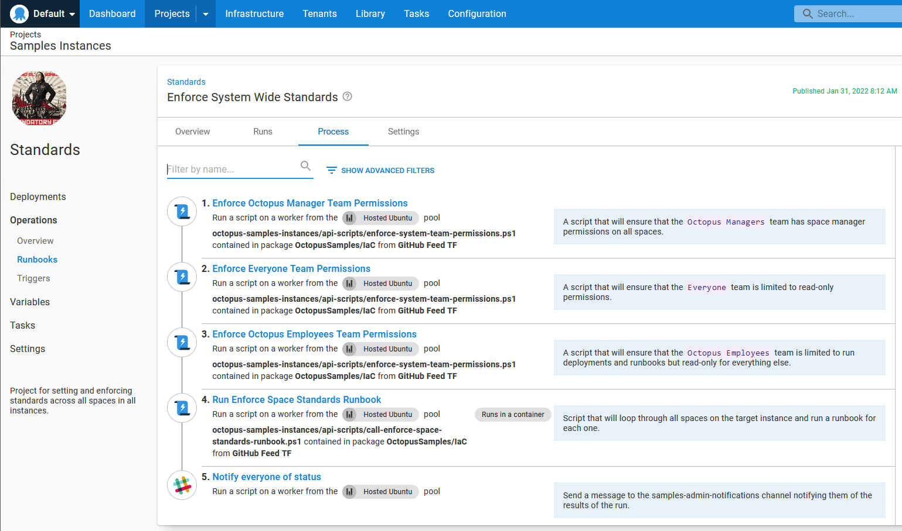
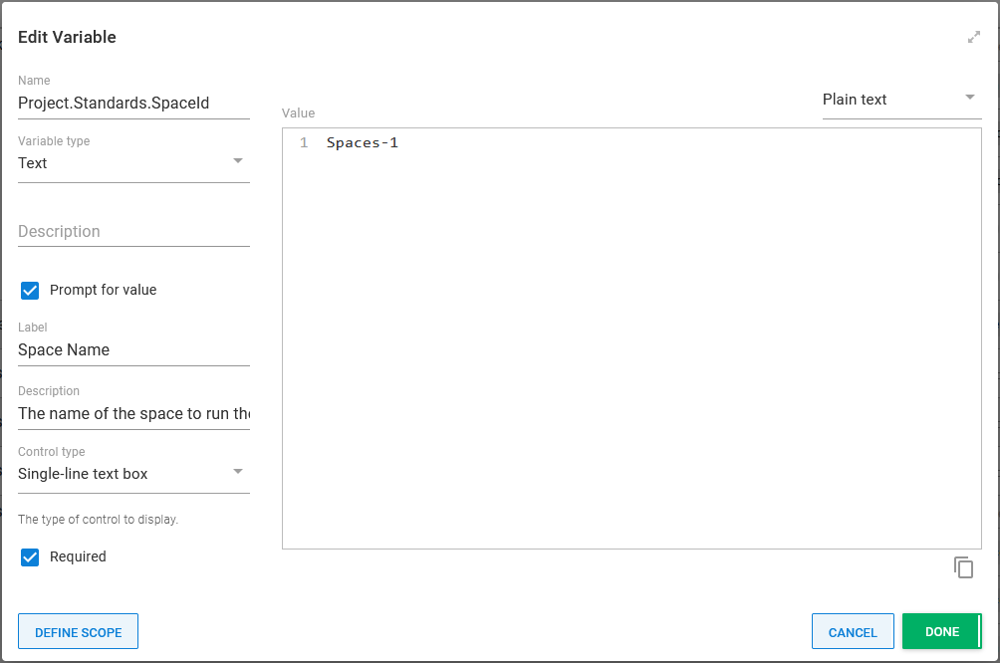
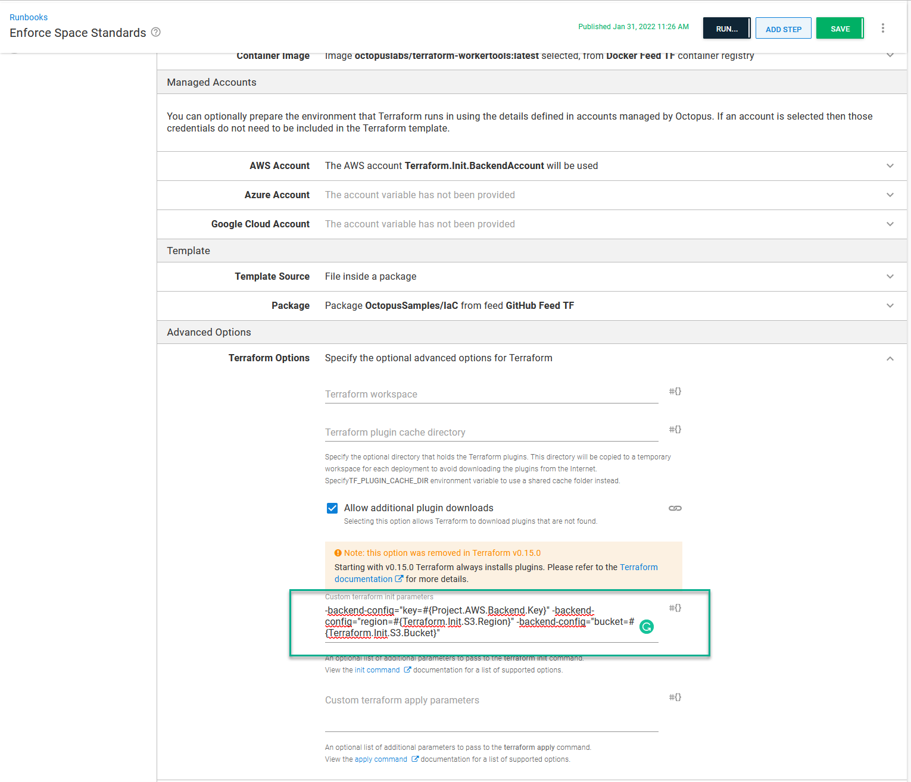

The [Octopus Deploy samples instance](https://samples.octopus.app) has grown significantly since we created it in late 2019.  It has over 30 spaces. That growth is a double-edged sword, though. The samples are helpful to our customers, but having many spaces makes routine maintenance tasks, like rotating an external feed password, time-consuming.  

In this post, I describe how our Customer Solutions team used the [Octopus Deploy Terraform Provider](https://registry.terraform.io/providers/OctopusDeployLabs/octopusdeploy/latest/) to establish standards to make the samples instance easier to maintain.

## Maintenance woes

At Octopus Deploy, each team gets a unique sandbox for AWS, Azure, and GCP. In our sandbox, everyone has free rein. We can create whatever resources we need to demonstrate Octopus Deploy's functionality.  

As the team and the samples instance grew, however, consistency between samples became harder to enforce. Each person used whatever region was closest to them (for me, US Central for Azure and GCP, US East 2 for AWS). We'd create spaces if our region didn't have a virtual network, VPC, database server, etc. When a new space was created, the person creating it would copy over values from an earlier example they worked on. That was in addition to creating the cloud accounts, Worker Pools, external feeds, and other variable sets.

Maintaining the samples instance was time-consuming.  For example, some of our samples used AWS AMIs. AWS is fond of deprecating AMIs, which required us to search every sample to determine which one to update.

While that was a pain, it didn't cause _enough friction_ to change anything.  It's not like we create spaces all the time.  And we do spot-check items when we can.  But when we were asked by our security team to move our AWS and Azure sandboxes, I took a hard look at the Octopus Terraform Provider.

## Space standards

Each space in the samples instance is unique, showing how to use a different feature in Octopus Deploy. Projects between spaces were rarely alike. The scope was set to base resources across all spaces for this project. Those resources were:

- Accounts
    - GCP
    - AWS
    - Azure
- Worker Pools
    - GCP
    - AWS
    - Azure
- External feeds
    - Docker
    - GitHub
    - Feedz (NuGet feed)
- Library variable sets
    - Notifications (standard messages for use with email and Slack)
    - GCP
    - AWS
    - Azure
    - API keys (to use when calling API scripts from Octopus)

In the list above, you'll notice library variable sets for each cloud provider. That was the second part of the space standards project. We decided to create a set of base resources, VPCs, or virtual networks, subnets, security groups, and more, in a select number of regions in both the US and UK.  The names of those base resources are stored in those library variable sets so any sample on any space can use it.

## Using Octopus Deploy Runbooks to run Terraform commands

I knew I'd be using Octopus Deploy Runbooks to run the `terraform apply` or `terraform destroy` commands.  But I wasn't sure where those runbooks should exist. Storing the runbooks on the samples instance caused a "snake eating the tail" scenario. And they could end up blocking sample deployments and other runbooks. 

I opted to create a new instance, `samples-admin`, to house the runbooks.  

The next step was developing a runbook structure to apply Terraform templates to all spaces on the samples instance.  The space list is dynamic; adding a space should automatically add to the process.  The Octopus Terraform Provider works best when targeting a specific space.  Therefore, I needed to run the `terraform apply` command for each space.  Having a single runbook with 34 static steps, each running `terraform apply` didn't scale well.  To solve this dilemma, I created the following runbooks:

**Enforce System Wide Standards** - runs API scripts to enforce permissions on the everyone team, Octopus employees team, and Octopus managers team then invokes **Enforce Space Standards** for each space on the samples instance.



**Enforce Space Standards** - accepts a Space-ID as a prompted variable, runs a few API scripts to enforce retention policies, and runs the **Apply a Terraform Template** built-in step.  


The Space-ID prompted variable has `Spaces-1` as the default if I want to test a change quickly on a single space.  



**Create New Space** - accepts a space name as a prompted variable and runs an API script to create a space.  After the space is created, it calls the **Enforce System Wide Standards** runbook (using a prompted variable for a single space) to ensure permissions and resources are set up correctly for the new space.


The scheduled trigger only invokes the **Enforce System Wide Standards** runbook.  Each time that trigger runs, the following tasks are created:

- **Enforce System Wide Standards**
    - **Enforce Space Standards** (Spaces-1)
    - **Enforce Space Standards** (Spaces-2)
    - **Enforce Space Standards** (Spaces-3)
    - ...
    - **Enforce Space Standards** (Spaces-xxx)

:::hint
All scripts and Terraform files used by these runbooks can be found in the [IaC GitHub Repository](https://github.com/OctopusSamples/IaC/tree/master/octopus-samples-instances).
:::

## Terraform basics

At the start of this, my experience with Terraform was limited to proof of concepts.  This section covers what I learned about using Terraform with Octopus Deploy.

### Resource ownership

Adding a resource to Terraform, be it infrastructure account, environment, or library variable set, means it now owns the lifecycle of that item.  Any modifications to that resource in the Octopus UI will be overwritten the next time the `terraform apply` runs for that space.  My runbooks run once every 6 hours so, at most, a modification will live for 6 hours before being overwritten.

One of the standards I wanted to enforce was every lifecycle's retention policy was set to 5 days.  Some of our spaces have a variety of lifecycles to demonstrate a particular feature.  Managing that standard was not possible via Terraform because:

- Resources have to be declared in the Terraform file.  We didn't want to lose the ability to add lifecycles via the UI.  Dynamically adding resources to Terraform files was a non-trivial amount of work.  
- It would be very confusing to have one or two lifecycles managed by Terraform while the others were not.  
- Terraform has total control over a resource.  I couldn't tell Terraform to only manage the retention policies.  

I opted for an [API script](https://github.com/OctopusSamples/IaC/blob/master/octopus-samples-instances/api-scripts/enforce-lifecycle-policies.ps1) instead.  

:::hint
You can't have resources managed by Terraform and the Octopus UI.  It's one or the other. Make it clear which resources are managed by Terraform.  I decided to include the suffix `TF` on every resource name.
:::

### State

Terraform uses a state file to determine which resources to create, update, and delete.  When a resource appears in the Terraform file but not the state file, Terraform attempts to create it.  If a resource appears in the state file but not in the Terraform file, it's deleted.

The state file is stored in a subdirectory in the working directory by default.  The kicker is Octopus Deploy deletes that working directory after each Terraform step runs.  That state file is automatically deleted.  The first time Octopus Deploy runs a `terraform apply` command, everything works because it's a brand new state file, and the resources won't exist.  But it fails on subsequent runs because the resource already exists in Octopus Deploy, but the state file thinks those resources don't exist.  

Storing the state file in a local directory isn't recommended anyway.  Any sensitive values are stored unencrypted in the state file.  To store the state file, a [remote back-end](https://www.terraform.io/language/settings/backends) is recommended to store the state file.  I opted for a secured S3 bucket with encryption turned on.

The state options were declared inline in my initial version of the Terraform files.  However, you can't use variables for state options.  In my ignorance, I decided to use Octostache and have Octopus Deploy replace those values when the runbook ran.

```
terraform {
  required_providers {
    octopusdeploy = {
      source = "OctopusDeployLabs/octopusdeploy"
      version = ">= 0.7.64" # example: 0.7.62
    }
  }

  backend "s3" {
    bucket = "#{Project.AWS.Backend.Bucket}"
    key = "#{Project.AWS.Backend.Key}"
    region = "#{Project.AWS.Backend.Region}"
  }
}

provider "octopusdeploy" {
  # configuration options
  address    = var.octopus_address
  api_key    = var.octopus_api_key
  space_id   = var.octopus_space_id
}  
```

I didn't like that. There were too many moving parts and it was too easy to mess up.  Anyone modifying this process would have to know to look at the variables.tf and the main.tf files to make sure they created all the variables.

In looking through [Terraform's documentation](https://www.terraform.io/language/settings/backends/configuration#command-line-key-value-pairs), I found the `-backend-config` arguments to the `terraform init` command.  Octopus Deploy can add additional arguments to the `terraform init` command.  Because I'm using S3, the additional command-line arguments are:

```
-backend-config="key=#{Project.AWS.Backend.Key}" -backend-config="region=#{Terraform.Init.S3.Region}" -backend-config="bucket=#{Terraform.Init.S3.Bucket}"
```



Now my main.tf file looks like this:

```
terraform {
  required_providers {
    octopusdeploy = {
      source = "OctopusDeployLabs/octopusdeploy"
      version = ">= 0.7.64" # example: 0.7.62
    }
  }

  backend "s3" { }
}

provider "octopusdeploy" {
  # configuration options
  address    = var.octopus_address
  api_key    = var.octopus_api_key
  space_id   = var.octopus_space_id
}  
```

### Importing pre-existing items into the state file

Except for external feeds, almost all the space standard items were new to each space.  Several spaces had a Docker external feed, a Github external feed, or both.  I didn't want to create new external feeds and force everyone to update their deployment processes.  I opted to import those pre-existing external feeds into the state file before running the `terraform apply` step.

That wasn't as simple as running `terraform import`. I wanted my process to run multiple times. My script needed to:

1.  Determine if the feed already existed in Octopus by invoking the Octopus API. If it did not, then exit.
2.  Determine if the feed already existed in the Terraform state file.  If it did, then exit.
3.  Import the feed in question into the state file.

Invoking the Octopus Deploy API wasn't a problem for me.  I have [some experience working with the API](https://github.com/OctopusDeployLabs/SpaceCloner).  Everything else was new to me.  

I want to log in to AWS the same way as the built-in steps in Octopus Deploy.  Octopus uses [environment variables](https://www.terraform.io/language/settings/backends/s3#credentials-and-shared-configuration) for credential back-end.  In my case, I need to supply a value for `AWS_ACCESS_KEY_ID` and `AWS_SECRET_ACCESS_KEY`.

```PowerShell
$backendAccountAccessKey = $OctopusParameters["Project.AWS.Backend.Account.AccessKey"]
$backendAccountSecretKey = $OctopusParameters["Project.AWS.Backend.Account.SecretKey"]

$env:AWS_ACCESS_KEY_ID = $backendAccountAccessKey
$env:AWS_SECRET_ACCESS_KEY = $backendAccountSecretKey

terraform init -no-color
```

I solved the first problem; next was reading the state file into memory.  I did that by running the `terraform show` command with the argument `-json` specified and running the `ConvertFrom-Json` cmdlet.

```PowerShell
$currentStateAsJson = terraform show -json
$currentState = $currentStateAsJson | ConvertFrom-Json -depth 10
```

With the object in PowerShell, it took some trial and error to discover the structure (a lot of `Write-Hosts`).  I ended up with:

```PowerShell
function Get-ItemExistsInState
{
  param 
    (
      $currentState,
        $itemTypeToFind,
        $itemNameToFind
    )
    
    foreach ($item in $currentState.Values.root_module.resources)
    {
        Write-Host "Comparing $($item.Name) with $itemNameToFind and $($item.type) with $itemTypeToFind"
        if ($item.name.ToLower().Trim() -eq $itemNameToFind.ToLower().Trim() -and $item.type.ToLower().Trim() -eq $itemTypeToFind)
        {
            Write-Host "The item already exists in the state"
      return $true
        }
    }   
    
    return $false
}
```

The command to import an item into the state file is `terraform import [address] [id]`.  The address is what's defined in the terraform file.

For the resource defined as:

```Terraform
resource "octopusdeploy_feed" "github" {
  name = "GitHub Feed TF"  
  feed_type = "GitHub"
  feed_uri = "https://api.github.com"
  is_enhanced_mode = false
}
```

The address is `octopusdeploy_feed.github`.  The id is the ID of the item in Octopus Deploy.  For example, `Feeds-1070`.  

:::hint
You can see a sample of the script I wrote in our [Samples IaC GitHub Repository](https://github.com/OctopusSamples/IaC/blob/master/octopus-samples-instances/api-scripts/import-into-state-example.ps1)
:::

### Passing in variable values

With Terraform, you define and use a variable like this:

```Terraform
terraform {
  required_providers {
    octopusdeploy = {
      source = "OctopusDeployLabs/octopusdeploy"
      version = ">= 0.7.64" # example: 0.7.62
    }
  }

  backend "s3" { }
}

variable "octopus_address" {
    type = string
}

variable "octopus_api_key" {
    type = string
}

variable "octopus_space_id" {
    type = string
}

provider "octopusdeploy" {
  # configuration options
  address    = var.octopus_address
  api_key    = var.octopus_api_key
  space_id   = var.octopus_space_id
}
```

There are 3 options for passing in values to those variables.

1. Command line argument: `-var="octopus_address=https://samples.octopus.app"` or `-var="octopus_address=#{Octopus.Web.ServerUri}"`
1. Variable file: naming a file with the extension `.tfvars` and populating it with values.  For example `octopus_address = "https://samples.octopus.app"` or `octopus_address = "#{Octopus.Web.ServerUri}"`
1. Environment variables: `export TF_VAR_octopus_address=https://samples.octopus.app` or `$env:TF_VAR_octopus_address = https://samples.octopus.app`

Octopus Deploy supports all 3 options.  It's a matter of personal preference.  I didn't like using a .tfvars file as that would have to be checked into source control with Octostache values; any variable name changes required updating multiple disparate places. I opted for environment variables because it's cleaner in the Octopus UI than command-line variables.

## Migrating to new resources

I learned most lessons while doing a pilot template with a few items.  It didn't take long after the pilot was complete before those resources were created on all samples instances.  That was the easy part of this project.  

Now it was time to migrate all the existing projects to use the new resources.  This was a non-trivial task and not something we could script away with some API scripts.  Each sample was spinning up its own infrastructure.  We needed to modify those samples to use the same base set of cloud resources and only create what was needed.

Having the same library variable sets, accounts, and Worker Pools made the migration much easier, but it's still manual work.  I mention this because you'll probably have additional manual work if you want to implement something like this on an existing instance.  

## Conclusion

Before we started using the Octopus Terraform Provider, it took hours with copy/pasting to rotate a password or add a new resource group on all spaces.  Now it takes less than 30 minutes.  

The Octopus Terraform Provider makes it easy to establish standards across all spaces on the [Octopus Deploy samples instance](https://samples.octopus.app).  After learning the nuances of Terraform, I came to appreciate what it can offer.  I can now share several resources between spaces but have the state of those resources managed by Terraform.  By doing this, I limit edit permissions in the Octopus UI and rely on version control features such as branching, reverting, and pull requests to create an approval process.

Happy deployments!
