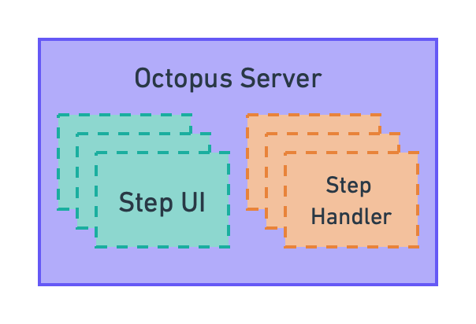
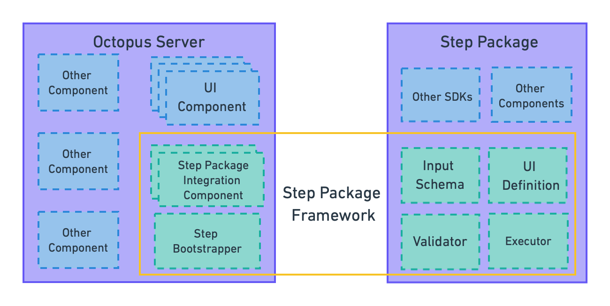
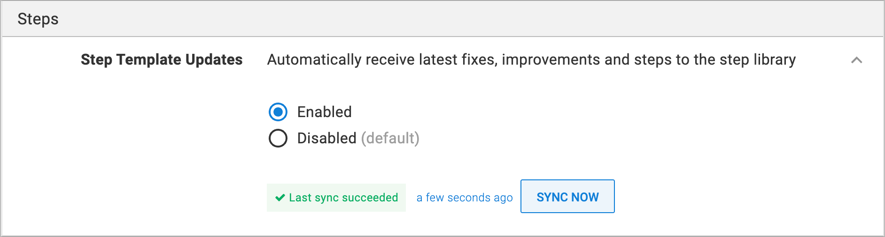
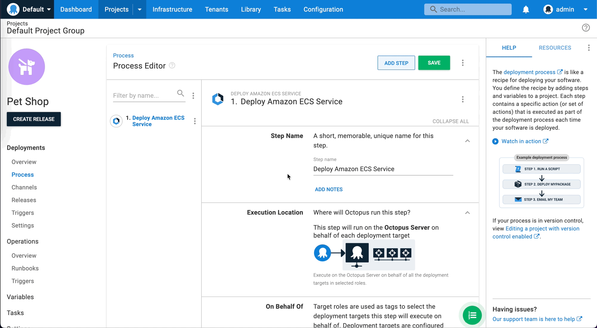
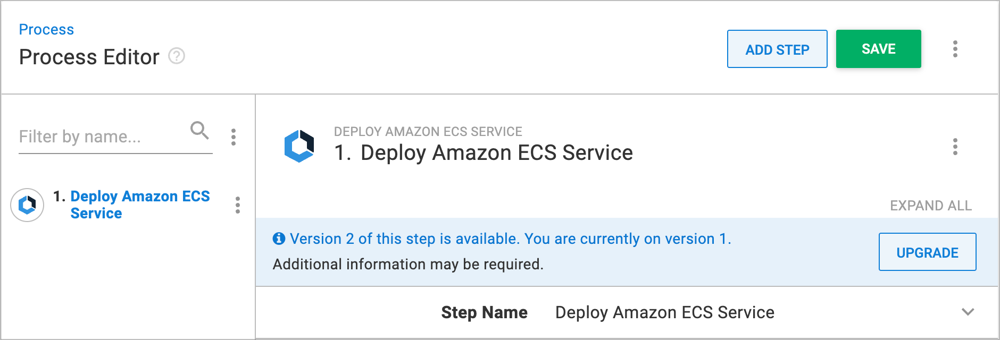
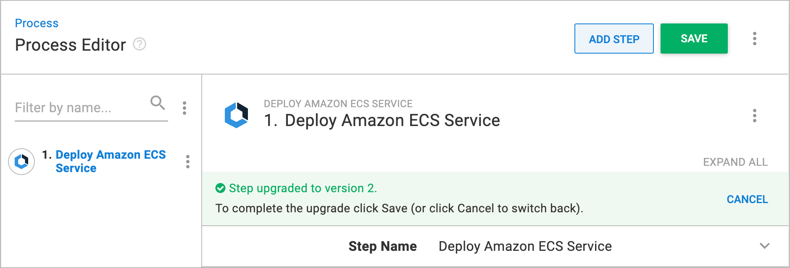

## Shaping a new step package framework

We have recently been working on a new way to develop the deployment steps you use in Octopus Deploy, and we call this the step package framework. In this post, we will explore:

* Why we built a new framework
* What the new framework is and design decisions
* How we tested and iterated the new framework 
* What it means for users of Octopus Deploy

We will also showcase how new steps are delivered to your Octopus Server instance with our new step package feed.

## Why create a new framework?

To help make deploying your software anywhere as easy as possible, Octopus Deploy is an opinionated product. Octopus Server works best when it understands the common targets you might be deploying to, ranging from an IIS instance on a server to an Amazon ECS cluster in the cloud. 

To help guide you through the process of interacting with these services, we create opinionated steps. For example, Octopus Deploy steps allow you to:
* Deploy or Update an Amazon ECS Service
* Run a script against Azure or Kubernetes
* Create or destroy infrastructure using a Terraform template

The step package framework is an evolution of how we develop these new steps for you to use in Octopus Deploy. To understand why a new framework was required, we must first look at the problems we were trying to solve. Let’s take a look at how we previously created and deployed steps in Octopus.

### How we previously created steps for Octopus Deploy

As Octopus Deploy has evolved, step development has gone through several architectural implementations. Originally, steps were developed in the core of Octopus Deploy. This allowed for tight integration between the components that made up a step and the actual process of using those components to perform the defined deployment. 



One advantage of this approach was the developer creating these steps had all the libraries and dependencies they would need to develop a step available to them at development time. This approach also enabled tight integration with our React front end.

However, this approach had several drawbacks, especially as we developed more steps: 
* Steps could only be shipped as part of the whole Octopus Deploy installer. This meant that to try out new functionality you would need to upgrade your entire Octopus instance. As Octopus often sits in the middle of mission-critical infrastructure, upgrade cycles are long and infrequent meaning you might not be able to use new steps.
* Any required changes to an existing step, including bug fixes, would have to go through the whole shipping pipeline and also require a  full instance upgrade before the issue was resolved. This meant even small fixes could take weeks to be updated, rather than a matter of days or even hours. 
* Developing a new step required understanding several big components of Octopus and how they are interlinked. This resulted in increased  delivery times and made it hard to build experimental steps
* Versioning steps independently of Octopus was impossible in any practical sense. For example, if a cloud provider shipped a new major version of their service, we would have to build many switches inside of the existing step, instead of just shipping a new version of an existing step that could be used alongside the original version

In a rapidly changing environment where new cloud services pop up frequently, we realized the need for more flexibility in our approach to ensure we are providing a world-class experience. As the number of steps in Octopus grows, the step package framework was built to solve these issues.

## Introducing the step package framework

The step package framework is a collection of Typescript libraries that support the creation and integration of steps into Octopus Server. It provides a CLI to ensemble step authors to build and package their new steps.

New steps that are built using the step package framework are now referred to as a step package. Step packages consist of a number of components: 
* A UI definition describing the UI elements that Octopus Server should render in the process editor
* An input schema and validator
* A Step Executor, which is the code that is executed at deployment time

Unlike in the previous implementation, all of these elements now exist within the step package itself, instead of inside Octopus Server.

These new steps are built against the API that is exposed from the step package framework and not against the interfaces that are available in Octopus Server as steps were previously. The step package framework integrates a step package and all of its constituent parts into Octopus Server.

The step package framework does this by contributing components to Octopus Server. The first is a collection of components to acquire, register and integrate step packages into Octopus Server, so that step packages can be added and configured to a deployment process. The other is the step bootstrapper. The bootstrapper will be invoked at step package execution time, and its responsibility is to provide the runtime configuration to the step package and then execute the executor code defined in the step package.



In addition to the new framework, we also needed to create a new mechanism for delivering step packages outside of Octopus Server releases. To do this, we built a globally accessible step package feed to ship the packaged steps. Unlike how NPM or NuGet feeds operate where any authenticated user can publish a package, the step package feed only contains packages developed and published by Octopus Deploy. After a step is written, built and packaged, it is ready to be shipped to Octopus instances everywhere. We do this by publishing it to the step package feed.

## Design Decisions

While designing the step package framework, we set ourselves several constraints to help shape the final design:
* Steps must be easy to write, even for someone with very little knowledge of how Octopus works
* The complexity of the underlying Octopus Server components must not leak into individual steps' code
* Steps must be written in a way that is idiomatic for the ecosystem. For example, if we use JavaScript, it has to be written in a way that most JavaScript developers would expect
* It should be easy to bring an external component or framework into your step
* The UI code needed to configure a step should be declarative and abstract so that step authors do not need to know what specific components are rendered or their internal workings
* Steps must be versioned and distributed out-of-band of Octopus Server
* Step authors should be able to tell with absolute certainty what inputs they receive from Octopus Server

When it came to our design decisions, we had to make trade-offs on these guiding principles, as they weren’t all compatible. We made the following design decisions using these tradeoffs and constraints as a guide.


### Steps must be written in a language familiar to most programmers

From the start, we wanted to expose the new way of writing steps to the broadest audience possible, so we had to make a decision about which programming language to pick. A few considerations were:
* Whether the language was popular enough that external libraries and APIs could be easily sourced, eliminating system-level languages that are not widely used to build web applications
* Whether it was expressive enough to represent complex deployment scenarios. While there is a wide choice of powerful scripting languages today, such as Lua and Groovy, they can become hard to manage with growing size and complexity
* A rich type system gives step authors sufficient information about incoming data and allows for compile-time code verification

We found JavaScript to be popular and expressive enough to match the first two conditions. With the addition of TypeScript, we could also build an expressive type system that protects step authors from writing invalid code and provides guidance on how to use the step package framework.

Additionally, JavaScript projects can be rolled up into a single distributable file, simplifying both publishing and local deployments, especially when things are frequently moving across networks (as is the case with what Octopus does).

### Execution environment

Naturally, native JavaScript execution today is synonymous with Node.js. This suits Octopus well as it is cross-platform, widely supported, light enough to quickly launch in any environment. It is also portable, meaning we can ship the environment and the executable right to the destination (for example, to a deployment target or a worker) without compatibility concerns.

### Declarative UI

Early on, we explored different options for representing the user interface of a step. One of the options was to leverage React and allow users to write their own components, utilizing React’s mechanism for changing the renderer. 

However, we decided against it for multiple reasons:
* This flexibility leads to a large compatibility surface, meaning that keeping Octopus Server and the numerous steps and their versions in sync would be difficult
* We could never support the whole range of libraries available in the React ecosystem. Because of that, it would be difficult to say with certainty which libraries are supported, and so writing React code for an Octopus step would become a different experience from writing React code for the web
* There are implicit assumptions about React code: you can add your own primitive components and write styles for them, but none of these assumptions would work in a constrained environment

With that in mind, we decided to decouple the mechanics of how the UI in Octopus Server works and how steps define their portion of it. Instead of asking step authors to write their own components on top of our primitives, we let the developers link their inputs with semantic components they would like to represent those inputs. For example, here is the code to show a text field:

```typescript
text({
    input: inputs.myTextInput,
    label: "Some text field",
    helpText: "The help text for the field"
})
```

As the code is declarative and is not tied to any particular implementation of a textbox, we could easily swap it out for something else without step authors having to do any work. Another benefit is that we can use the type system to guide developers toward the right component. For example, we can check that only number inputs are used for the number component at build time. 

The declarative style also allows a well-defined contract between Octopus Server and step packages, which helps us reduce the compatibility surface and be more deliberate about breaking changes between the framework versions.

### Versioning

Our big goal for the new framework was the ability to ship new steps quickly without having to release a new version of Octopus Server to do it. A big consequence of achieving that goal is that steps must also have their own mechanism of versioning, upgrades and migration. It also means Octopus Server must know precisely: 
* Which step versions it supports
* How to migrate from one version of a step to another
* Which steps versions can be migrated silently, and which migrations require additional user input
* What to do with incompatible steps

We have solved this by producing granular compatibility manifests on both sides of the equation. Each version of Octopus Server has a set of ranges of internal components that it can guarantee are compatible, and we inject the specific versions of these components into the step package at build time. Then we can easily tell not only if a step package is compatible, but which specific portions of the package are already compatible and which require migration to the latest version.

We have also built implicit guarantees into Octopus Server around version numbers, so that step authors can be sure that if they, for example, start building a step for version 2022.1, their step is always going to run on that version no matter how many minor versions and hotfixes we release later on.

### Dogfooding the new framework

At Octopus we believe that the best way to validate product ideas is to use the product yourself in a real environment, known as “dogfooding”.

Once we had our first iteration of the step package framework complete it was time to further refine and validate our assumptions and design decisions. To do this we built two fully featured steps using the new framework: Deploy an ECS Service, and Update an ECS service. 

The difference between these two steps is that the Deploy an ECS Service step builds a new ECS service definition and deploys it as a Cloud Formation template from scratch, whereas the Update an ECS Service step updates an existing set of definitions. 

With both of these new steps, we started from a blank page, just as any other step author would when using the framework in future. This allowed us to test that the decisions that went into the framework’s design were going to hold up. Mostly, they did, but a few lessons were learned that led to further improvements.  

### Framework improvements

#### The need for new UI components

A step UI component is a part of the step package framework that allows the step authors to define the user interface of the step. When the ECS project started, the framework supported most of the basic UI components that can be used to construct an interface that has the same look and feel as other built-in Octopus steps. However, while working on the project, the team realised some advanced components were needed such as the container image selector component.

One feature that required a new UI component was the ability to allow exporting step information to a CloudFormation Template. Implementing these new UI components in our declarative UI presented some challenges. As this is a shared set of components for all step packages, extra consideration had to be taken to make the new component generic enough so it could be used by other step packages but still support all the functions required for the ECS steps. This challenge is a conscious trade-off built into the framework that significantly reduces the complexity of authoring a new step at the cost of exposing only a subset of Octopus functionality to the steps.

#### The end-to-end testing framework

One critical aspect that the team considered during the development of the ECS steps was how to write integration tests. The tests are required to construct all resources required in the cloud service so that the deployment of the steps being tested can be executed. 

For those particular ECS steps we were building, we needed to set up a large number of resources in AWS before the tests could actually run. We decided to have a Terraform template spin up the resources for the integration test to eliminate the need for static resources. 

Realizing these needs would also be applicable to other types of steps in future, such as those using Azure or GCP infrastructure, we decided to develop a testing framework that acquires and sets up infrastructure from a Terraform template supplied by the client. The client declares the required cloudprovider (Azure, AWS, or GCP) and provides the credentials. The framework then outputs a random resource code that can both be used in the step authors’ own Terraform templates and within the tests to access and validate resources.

This testing framework facilitated the development of multiple integration tests we implemented in the ECS steps and is an essential tool for step authors working on any steps that require infrastructure setup in major cloud providers.

#### The pain of testing the steps locally

Steps built with the step package framework are independently developed from Octopus Server. Hence, we were required to manually integrate the under-development step packages to Octopus Server when we wanted to see how the steps worked visually. In order to do that, we needed to:
* Build and output the zipped step package from the step project
* Copy the zip files to the local folder inside the Octopus Server repository
* Delete any cache files of the previous version of the step
* Restart/rebuild Octopus Server

This process was time consuming during the development of the ECS steps. As a result, we have implemented a local feed which allows Octopus Server to periodically fetch step packages locally and load them to a running Octopus Server instance. This will enable step authors to conveniently apply their step package changes without having to restart their Octopus Server.

## What the step package framework means for you

As the new step package framework is built to help Octopus develop steps in a new way, what does this mean for you as a user of Octopus Deploy? As we can now build steps independently of Octopus Server, they are no longer tied to our release pipeline. This means we can now ship steps outside of an installation or upgrade of Octopus Server, giving you quicker access to steps without the need to upgrade. Noting that while step packages are packaged and delivered separately from Octopus Server, in order to use them, they still need to be installed in Server. 

### Delivery of Step Packages

Once a step package is available on the step package feed, the next time an Octopus Server instance checks the feed for new steps it will download the step package and it will be available in your Octopus Server instance immediately. This is available if you are using Octopus Server 2022.1 or later and your instance has been configured to allow it to connect to our step package feed.
This will happen on a schedule or can be triggered manually. You can find the status of this sync under Configuration > Features > Step Template Updates



### Step package updates

Once a step package has been downloaded and processed into an Octopus Server instance, it will update the usages of that step package in your deployment processes depending on the difference between the current and new versions.

Step packages use the semantic versioning format: major.minor.patch. If a new minor or patch version of a step package is released, then your processes will automatically be updated. 

Details on which version of a step package is being used are available in the “About this step” section of the step in your deployment editor.



If a major version is released, then deployment processes using these steps will not be automatically updated to use the new version. This is because major version updates require user intervention to allow future deployments to be successful. To use the new major version, you need to update each deployment process manually to use the new major version. 



If a new major version is available, you will see the following banner in your step editor. 



Upgrading to use the new major version is as easy as clicking the upgrade button and updating your deployment process with the newly required parameters, then clicking save.

## Conclusion

The step package framework is changing how we build and deliver new steps to your Octopus Server instances. It means that new steps can be delivered faster, and without the need for upgrades. We look forward to bringing you new and improved steps using this framework as we roll out even more functionality. 
