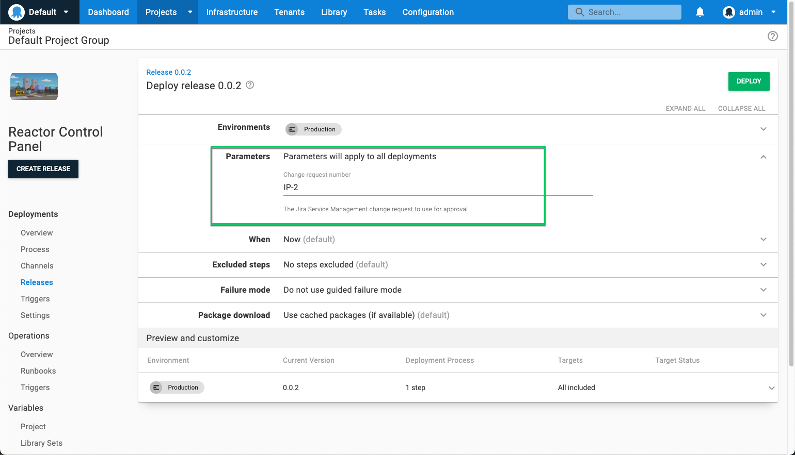

Our Jira Service Management integration is available as an early access preview (EAP) as part of [the Octopus 2022 Q3 release](https://octopus.com/blog/octopus-release-2022-q3).

For teams using [Jira Service Management for change management](https://www.atlassian.com/software/jira/service-management/product-guide/getting-started/change-management), this integration connects Octopus deployments to change requests in Jira Service Management.

You can enable this integration for specific projects and environments, and it supports the automatic creation of change requests or linking a deployment to an existing change request. 

With the Jira Service Management integration, every controlled deployment has a change request so that your deployments are compliant with company policies and regulatory requirements. With a complete audit log of deployments, change managers can also be sure all deployments are executed with the appropriate level of control.

Our [Jira Service Management integration](https://octopus.com/docs/approvals) lets you:

- Easily configure your workflow to integrate Octopus with one or more Jira Service Management connections
- Link a deployment to an existing change request via prompted variables, so you can manually associate deployments with change requests
- Link a manually-created change request via string matching on the change request title
- Automatically create change requests at deployment time
- View and export audit logs of controlled deployments for easy compliance and post-deployment reconciliation

In this post, I introduce you to our Jira Service Management integration and show you how to get started.

:::hint
Our Jira Service Management integration is an early access preview. As we're still developing this feature, we appreciate your feedback. We also invite you to join the discussion in our [Community Slack](https://octopus.com/slack). 
:::

## Better change management with Jira Service Management and Octopus

For DevOps teams, managing deployment pipelines at scale is complex and time consuming, and becomes more difficult when you add in change management. We want to provide a better, more automated approval process outside of manual interventions for those using Jira Service Management. 

Integrating Jira Service Management with Octopus helps to make change management easier, reducing friction and simplifying the lives of your development teams. 

## Getting started with the Jira Service Management integration

:::hint
[Read the latest version of the documentation](https://octopus.com/docs/approvals) for the Jira Service Management integration.
:::

After [signing up for the EAP](https://oc.to/jsm-eap), there are a few settings you need to configure to get started with the Jira Service Management  integration.

Navigate to **Settings** and then to **Jira Service Management Integration**. Enable the integration with the check box, and add a connection.

You must provide a base URL, username, and token from Jira Service Management. See the [Atlassian documentation for details on creating API tokens](https://support.atlassian.com/atlassian-account/docs/manage-api-tokens-for-your-atlassian-account/).

## Configuring your environment and project

After configuring the Jira Service Management integration, you need to configure your environment and project. Both need Jira Service Management enabled for deployments to be managed by Jira Service Management.

### Configuring your environment

To set up your environment, go to **Infrastructure** and choose the environment you want to use with Jira Service Management. Under the **Jira Service Management Integration** dropdown, select the checkbox for **Change Controlled**.

Repeat this for all environments that apply.

### Configuring your project

To set up your project, go to **Settings - General** and under the subheading **Jira Service Management Integration**, check the box next to **Change Controlled**. You then select the connection you want to use. You might use the one you set up earlier, or if you have multiple connections for different business units, you can select the right one for the project.

You also need to enter the **Key** for the Jira Service Management project.

## Setting up a prompted variable for linking to existing change requests {#prompted-variable}

If you want to reuse change requests or use an existing change request, you need to set up a prompted variable for the Jira Service Management change request.

If you're not planning to reuse change requests, there's no need to set this up.

In your project, in the **Variables** section, create a prompted variable named `Octopus.JiraServiceManagement.ChangeRequest.Number`. You can select **Open Editor** to change the label and description, so it's easier to use.

## Creating a new change request in a deployment

To create a new change request, your project must first be configured for Jira Service Management change control. Then trigger a deployment for that project to an environment also configured to be change controlled.

If you configured a prompted variable for the change request, leaving it blank will cause a new change request to be created.

After you click **Deploy**, the **Task Summary** screen appears and displays the message **Change Request awaiting approval**. A change request number appears for the created change request, with a link to Jira Service Management.

Octopus considers the change request approved when it's progressed to a status of **Implementing**.

Until the change request is approved, your deployment won't run in Octopus. The approver needs to move the change request to implementation before it triggers automatic approval in Octopus.

:::hint
A change request can only be in the implementation stage to run a deployment in Octopus. If the change request is in any other stage, the tasks won't start.
 
To reuse a change request for another deployment, it needs to remain in implementation.
 
The change request must also remain in implementation for the duration of the deployment because Octopus checks the status of the change request throughout the Task Log.
:::

## Using an existing change request for deployments

If you have an existing change request, you can link deployments to it rather than creating a new one.

Assuming you created the [prompted variable for the change request number](#prompted-variable), simply copy the change request number and paste it into the **Parameters** section when creating the deployment.

If the change request is in the Implementing stage, Octopus automatically recognizes it's been approved.

## Conclusion

The Jira Service Management integration is available as an early access preview (EAP) as part of [the Octopus 2022 Q3 release](https://octopus.com/blog/octopus-release-2022-q3). It helps automate your change management process, making it easier to achieve automated deployments that comply with your organization’s change management policy.

We look forward to introducing new features to continue supporting your change management processes.

We’d love you to try this integration with your workflow and let us know how we can improve it.

[Contact us to get access to the Jira Service Management EAP](https://octopus.com/company/contact)

Happy deployments!
