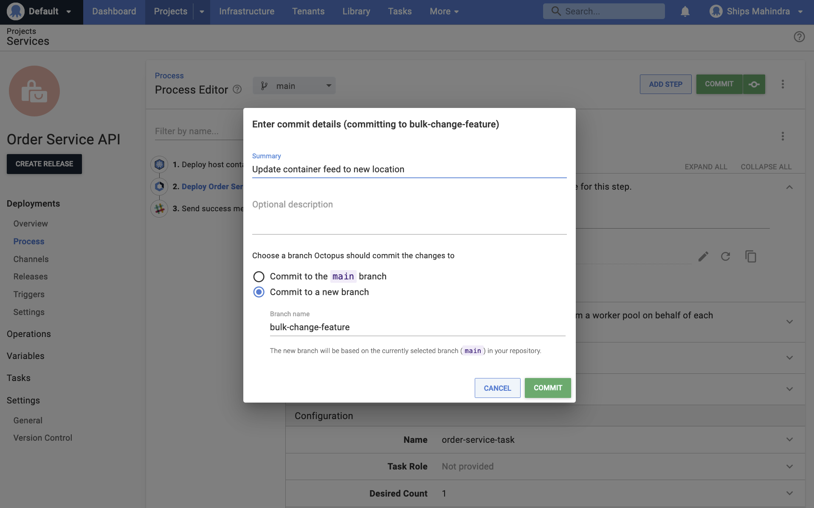
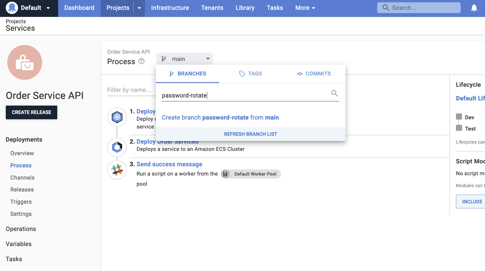
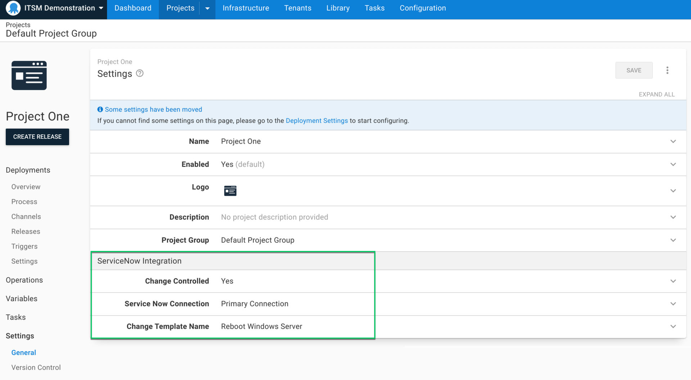
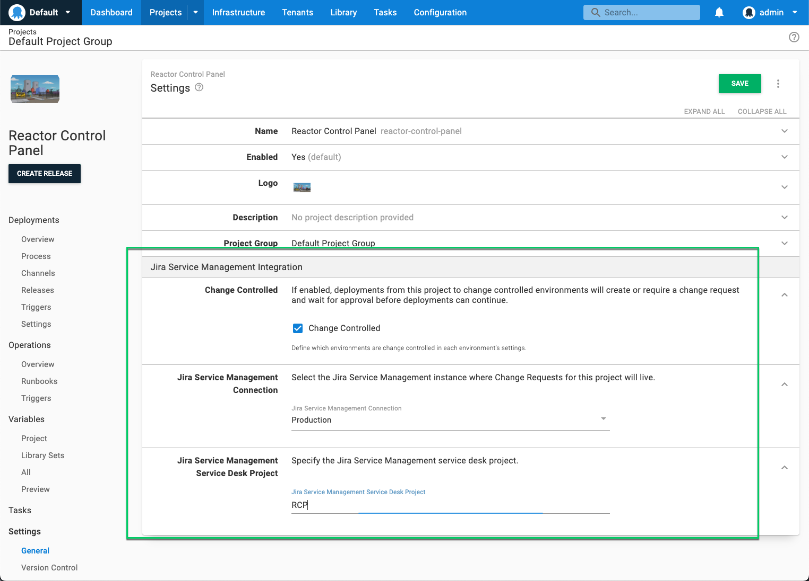
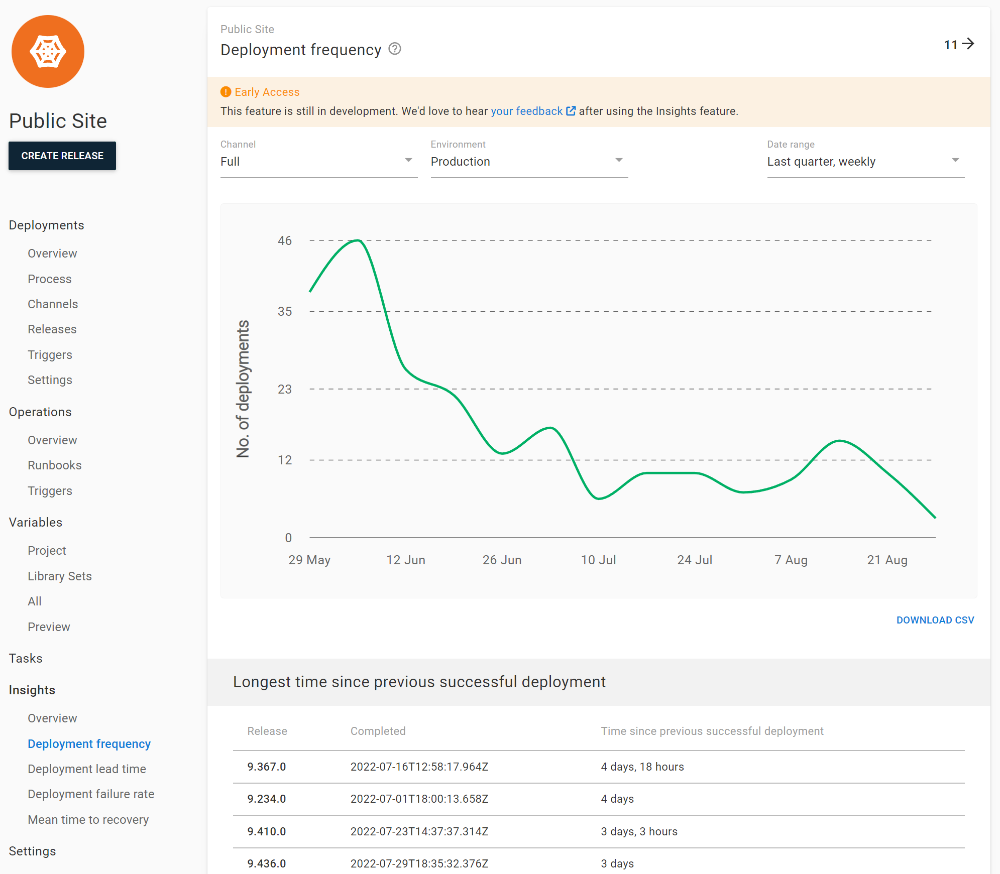
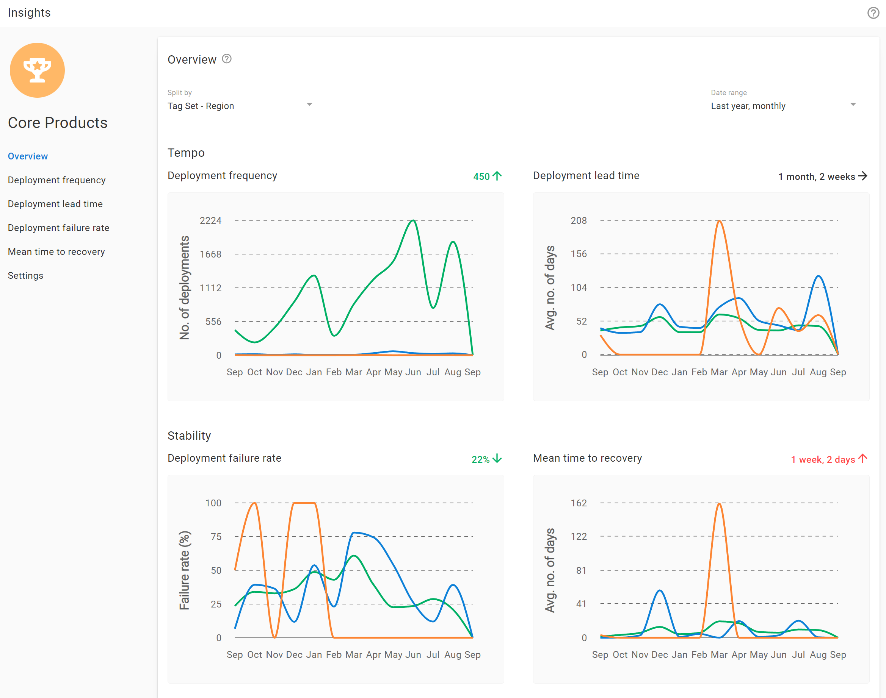
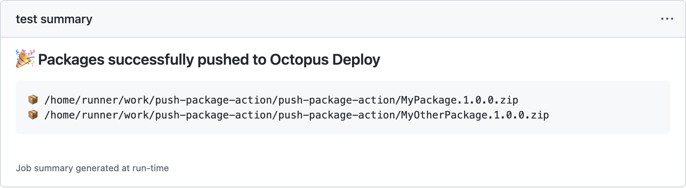
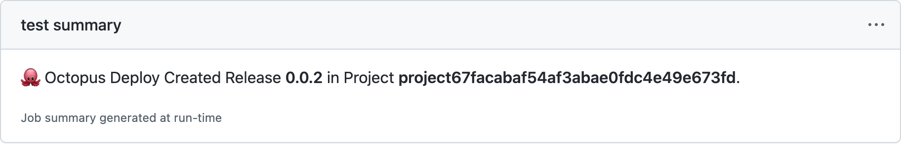
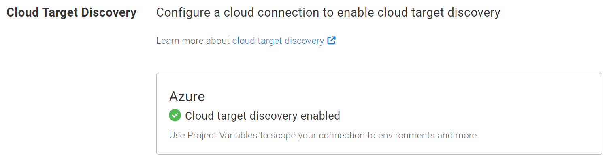

The Octopus 2022 Q3 release is now available.

This release adds support for version-controlled variables for version-controlled projects, for a more complete implementation of the [Config as Code solution we released in March](https://octopus.com/blog/octopus-release-2022-q1).

We also have a number of other new features to help you build safe, reliable, and auditable “As Code” CI/CD pipelines. These include ITSM change management with our ServiceNow and Jira Service Management integrations, and built-in DevOps reporting.

As organizations continue to modernize, it's increasingly important that you can safely and reliably audit your CI/CD pipelines. You need to monitor and secure your deployments, and your teams need to scale reliably with tools to collaborate as releases move from deployment through to testing and production. 

This release’s noteworthy updates include:

- Config as Code - version-controlled variables for version-controlled projects
- ITSM - change management without friction for ServiceNow
- Jira Service Management - efficient change management approvals (early access)
- DevOps Insights - DORA insights to quantify value and improvements (early access)
- GitHub Actions for Octopus Deploy v2
- Simpler cloud target discovery setup

Together, these features support collaboration, scalability, and security for your deployments. 

The 2022 Q3 release is available on Octopus Cloud and ready for download by our self-hosted customers.

## YouTube live launch party

To celebrate the release of Octopus 2022 Q3, we’re throwing a launch party on **Wednesday, October 5, 2022**. During this interactive YouTube live stream, some of our product managers and tech leads will take you through the latest features and answer your questions. 

Learn about: 

- Config as Code with version-controlled variables
- DevOps Insights 
- Change management with ServiceNow

Subscribe to our [YouTube channel](https://youtube.com/octopusdeploy) to get notified of the event. 

## Included in the Q3 release

- Octopus Server 2022.3 ([release notes](https://octopus.com/downloads/whatsnew/2022.3))
- Tentacle 6.2.50
- Plugins and tools 
  - Octopus Deploy for TeamCity 6.1.14
  - Octopus Deploy for Visual Studio Code 0.1.4
  - Terraform Provider for Octopus Deploy 0.8.1
  - Octopus Deploy for Jira Service Management 1.0.9-AC (available now for Jira Service Management Cloud customers)
  - Octopus Deploy for Bamboo 2.4.5

## Long term support 

The following table shows the Octopus Server releases with long term support. 

| Release               | Long term support              |
| --------------------- | ---------------------------    |
| Octopus 2022.3        | Yes                            |
| Octopus 2022.2        | Yes                            |
| Octopus 2022.1        | Expired                        |

## Config as Code - Version control your deployment process and configuration

Octopus 2022 Q3 builds on the foundation of our [2022 Q1 release](https://octopus.com/blog/octopus-release-2022-q1) with the addition of version-controlled variables to further improve your development workflow. You can evolve your configuration variables and infrastructure settings alongside your deployment process and application code.

With version-controlled deployment processes and variables, Octopus provides safe, reliable, and auditable “As Code” deployment pipelines. This lets your teams work in line with your company's regulatory requirements and compliance policies, making auditing a much smoother process. 

- **Traceable end-to-end CI/CD “As Code” pipelines** - Octopus has built-in plugins for a wide range of CI servers for easy integration. You can pair Octopus with a CI server that supports build definitions as code, giving you complete traceability into changes to your software development process. Changes to your build and deployment pipelines can go through the same pull request review and approval process, improving the stability and reliability of your pipeline.
- **Consistent processes and approvals** - Improve the quality of your code and meet compliance requirements by using pull request workflows to review and approve changes. Consistent processes contribute to quality releases, and you can enforce policies so that unapproved changes don't get merged.
- **Traceable changesets** - Have clear visibility into changesets by using pull request diffs combined with detailed audit logging. Octopus keeps a complete audit trail of everything that happens, with detailed logs and filters. See who changed what and when to help troubleshoot release issues. Capture further details with source control commits and Git diffs showing you the exact changes made to processes and configuration settings.
- **Disaster recovery** - Back-up and recover user pipelines in Git. If you need to, roll-back changes to recover more easily from release breaks.

:::hint
Learn more about [Config as Code in Octopus](https://octopus.com/docs/projects/version-control). 
:::

<!-- ### Config as Code demo

[TO DO: Add video link]() -->

### Customers benefiting from Config as Code

We have hundreds of customers using Config as Code in Octopus, including StackOverflow and Recruit Wizard.

*“Config as Code allowed us to create our desired workflow for every kind of change we made. It brought to life the most valuable part of version controlling deployments, which is the iteration process (via branching) that it allows users to have”.* 
**Chris Hunt, Staff Site Reliability Engineer - Stack Overflow**

*“Branching in Config as Code allows us to make changes to the deployment process alongside our code changes. This is an absolute game-changer, especially as we add more and more engineers to the team”.* 
**Ben Macpherson, CTO - Recruit Wizard**

## ServiceNow change management without friction

The ServiceNow integration links Octopus deployments to ServiceNow change requests and automatically creates pre-populated, normal change requests. 

You get improved traceability out-of-the-box, and you can prove to auditors that every controlled deployment has a change request. This ensures your CI/CD and release management processes are compliant with company policies and regulation.

### What's included in our ServiceNow support?

- Easy workflow configuration, so it's straightforward to integrate Octopus with ServiceNow.
- Link a deployment to an existing change request, so you can manually associate deployments with change requests.
- Automatically create normal change requests at deployment time. Octopus pauses the deployment until approvals are complete.
- Use Octopus to automate the transition between stages in the change request after it’s created, leaving a record of deployment in ServiceNow.
- Use change templates to auto-create standard change requests to reduce manual work and control what information is populated.
- Ensure “Change Windows” are honored on existing change requests so deployments won’t execute until the time-window specified.
- Add work notes to change requests with information about deployment start and finish time, and whether it was successful or not.
- View and export audit logs of controlled deployments for easy compliance and post-deployment reconciliation.

Learn more about our [ServiceNow integration](https://octopus.com/docs/approvals).

> The ServiceNow integration is available as part of our Enterprise subscription to help larger organizations with their change management. Contact our sales team for a demo and [learn more about Octopus Deploy pricing](https://octopus.com/pricing).

## Efficient change management approvals with Jira Service Management (early access preview)

Building on our ITSM change management support, our Jira Service Management integration is available as an early access preview (EAP). This integration links Octopus deployments to Jira Service Management change requests, making it easier to manage deployment pipelines at scale. It reduces the need for manually filling out change requests, making the process quicker and reducing errors.

Learn more about our [Jira Service Management integration](https://octopus.com/docs/approvals).

### What's included in our Jira Service Management support?

- Easy workflow configuration, so it's straightforward to integrate Octopus with Jira Service Management.
- Link a deployment to an existing change request, to manually associate deployments with change requests.
- Automatically create “Request for change” requests at deployment time. Octopus pauses the deployment until the appropriate approvals are complete.
- View and export audit logs of controlled deployments for easy compliance and post-deployment reconciliation.
- Improved traceability out-of-the-box to ensure your CI/CD and release management processes are compliant with company policies and regulation.

If your team uses Jira Service Management change management, we'd love you to try it and provide your feedback.

[Register for the Jira Service Management EAP.](https://octopusdeploy.typeform.com/jsm-eap)

## DevOps Insights: Better visibility and actionable DORA metrics (early access preview)

DevOps Insights (early access) in Octopus gives you better visibility into your company’s DevOps performance by surfacing insights based on the [4 key DORA metrics](https://octopus.com/docs/insights). These metrics help you qualify the results of your DevOps performance, and gain insights into areas for improvement. 

- Get better visibility into the performance of your projects and teams.
- Eliminate “gut feel” and use data to drive improvement and determine if a new process is working. 
- Review and collect data over time to highlight the path to delivering greater value faster.
- Help introduce change with data and collaboration to make a business case. 
- Share successes and learn from failures to continuously improve.

There are 2 levels available for DevOps Insights: 

- Project level insights: available to all customers
- Space level insights: available to Enterprise customers 

Project level insights are available to all customers out-of-the-box as a new tab in every project. If you’re already a user, Octopus has all the data it needs to help you uncover rich insights based on your deployment history. 

Learn how to use [Project level insights in our docs](https://octopus.com/docs/insights).  

### Insights across projects and teams with Space level insights 

This release includes additional insights for Enterprise customers. Space level insights:

- Aggregate data across your space so you can compare metrics across projects to identify what's working and what isn’t
- Inform better decision making: identify problems, track improvements, and celebrate successes 
- Help you quantify DevOps performance based on what's actually happening as shown by data

Learn more about [how Space level insights can help your team make better decisions](https://octopus.com/docs/insights). 

> Space level insights are available as a part of the Octopus Deploy Enterprise subscription. [Contact our sales team](mailto:sales@octopus.com) for a demo and to [learn more about Octopus Deploy pricing](https://octopus.com/pricing).

### Customer feedback from the DevOps Insights Alpha Program

Several customers participated in our DevOps Insights Alpha Program, and we thank them for their time and feedback. They helped shape the feature for thousands of other customers.

*"We used the DevOps Insights Alpha program and found it really useful. The insights give our teams easily accessible, concrete data to help validate our assumptions and make decisions. They provide proof-points to share with decision-makers and allow managers to find the information they need at a glance."*
**Leslie Brody, Principle Site Reliability Engineer - IMO**

## GitHub Actions for Octopus Deploy v2

We updated our GitHub Actions for Octopus Deploy:

- [Install Octopus CLI](https://github.com/marketplace/actions/install-octopus-cli) 
- [Push Package](https://github.com/marketplace/actions/push-package-to-octopus-deploy)
- New: [Push Build Information](https://github.com/marketplace/actions/push-build-information-to-octopus-deploy) 
- [Create Release](https://github.com/marketplace/actions/create-release-in-octopus-deploy)
- [Run Runbook](https://github.com/marketplace/actions/run-runbook-in-octopus-deploy)

This release also brings a number of updates, including:

- Improved usability through SemVer-based tags for major, minor, and patch updates
- Simpler inputs with sensible defaults and less input parameters for each action
- Leveraging environment variables for input parameters to actions
- Added support for environment variables for sensitive values (i.e. API keys)
- Generated job summaries for action runs through markdown (see below)

### Job summaries

Job summaries are generated using custom GitHub-Flavored Markdown that we emit through the Create Release and Push Package GitHub Actions. 

Actions output like this was previously limited to logs and annotations, which can be difficult to aggregate and group lots of information. This feature enhances the user experience.

### Push Build Information

This release introduces a new GitHub Action: [Push Build Information](https://github.com/marketplace/actions/push-build-information-to-octopus-deploy). This GitHub Action lets you provide detailed commit, build, and issue tracking information to Octopus, that can be surfaced as release notes. 

You can use this feature to share release notes with stakeholders for each production deployment. You can also follow the links from deployments back to builds and commits when trying to isolate bugs that were introduced in specific releases. 

Learn more about [Build Information and Issue Tracking](https://octopus.com/docs/packaging-applications/build-servers/build-information).

## Simpler cloud target discovery setup 

We made it easier to configure cloud connections so you can deploy to Azure, AWS, and Google Cloud. You can now configure cloud connections directly in the deployment process editor. This means you can configure and select the appropriate cloud account settings in fewer clicks. You'll also be informed when it's configured.

Learn more about how to [configure cloud connections](https://octopus.com/docs/infrastructure/deployment-targets/cloud-target-discovery).

## Breaking changes 

This release contains 3 breaking changes:

### Less requests made to external feeds when creating and viewing releases

Historically, Octopus performs a package search to retrieve the published date when creating a release. This can result in release creation being blocked when retrieving this information causing delays.

We made minor changes to reduce the number of requests made to external feeds when creating and viewing releases. 

Learn more about this change in the [GitHub issue](https://github.com/OctopusDeploy/Issues/issues/7673).

### Update OCL to reference shared resources via slugs instead of names

When Config as Code launched, Git projects referenced shared resources using their name. This also meant that API responses from Git projects included names instead of IDs.

Instead of using names, we've [introduced slugs into OCL](https://octopus.com/blog/introducing-slugs-config-as-code), and brought IDs back to the API for Git projects.

With this change, Git projects can reference shared resources from OCL using their unique slug instead of their name.

Octopus Server will convert these slugs to the resource IDs when returning results via the API, allowing (most) scripts to be re-used between database and Git projects without the need to account for names and IDs.

Learn more about this change in the [GitHub issue](https://github.com/OctopusDeploy/Issues/issues/7645).

### Existing change-controlled deployments impacted by updated ServiceNow approval caching 

ServiceNow approval caching has been updated as this feature becomes available to everyone. If you're currently using the Octopus ServiceNow integration and have deployments waiting for an approval when you upgrade to 2022.3, they'll be unable to exit the "Queued" state and won't run. Existing change-controlled deployments will need to be manually terminated and restarted after upgrading.

Alternatively, please make sure all existing change-controlled deployments have completed executing prior to installing the upgrade. 

Learn more about this change in the [GitHub issue](https://github.com/OctopusDeploy/Issues/issues/7760).

## Upgrade or get started

Octopus Cloud users are already running this release. Self-hosted Octopus customers can download the latest version from our website.

[Download Octopus 2022.3](https://octopus.com/downloads/)

We encourage you to review the [steps for upgrading Octopus Server](https://octopus.com/docs/administration/upgrading). Please see the [release notes](https://octopus.com/downloads/whatsnew/2022.3) for further information.

If you haven't used Octopus before, [sign up](https://octopus.com/start) for a free trial or [email our Sales team](mailto:sales@octopus.com) to see a demo and learn more.

## What's coming in future releases?
Check out our [public roadmap](https://octopus.com/roadmap) to stay informed and register for updates.

## Conclusion

Octopus 2022 Q3 delivers new features to support safe, reliable, and auditable “As code” CI/CD pipelines. Octopus 2022 Q3 builds on the foundation of our Q1 release with the addition of version-controlled variables. This release also includes a number of additional features to support modern DevOps teams. 

We’re continuing to add more functionality to our Config as Code solution, and look forward to seeing more version-controlled projects with the addition of variables. 

Happy deployments!