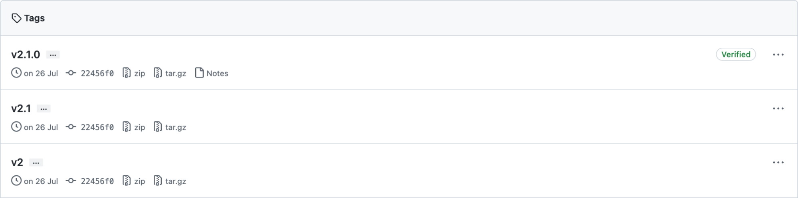
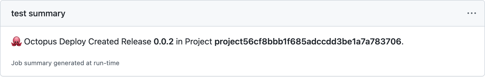
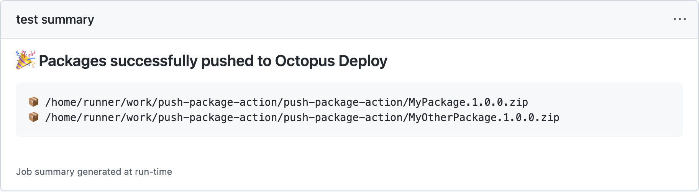

In June 2021, we [shipped our first set of actions](https://octopus.com/blog/github-actions-for-octopus-deploy) in the GitHub Marketplace to integrate your GitHub workflows with Octopus Deploy. 

We recently made updates to improve the usability of these actions, and have one new action in GitHub Actions for Octopus Deploy v2. 

Our updates include:

- SemVer release tag support
- Improved usability 
- New Push Build Information action
- Job summaries

In this post, I walk you through the changes we made and how you can get the most out of them. 

:::hint
Please note, this post assumes you know the basics of building a workflow with GitHub Actions. To learn more, head to the [GitHub docs](https://docs.github.com/en/actions/learn-github-actions).
:::

## SemVer release tag support

To improve usability, we now support [Semantic Versioning](https://semver.org/) (SemVer) for the release tags in all of our GitHub Actions. With this change, you can now reference release tags in your workflows far more easily than before:

```yaml
uses: OctopusDeploy/create-release-action@v2.0.0 # major.minor.patch
uses: OctopusDeploy/create-release-action@v2.0   # major.minor
uses: OctopusDeploy/create-release-action@v2     # major
```

Any changes we make to our actions will automatically update our release tags. These changes will be incorporated into your workflows, depending on how they're referenced.



For example, referencing an action with the major version only specified means your workflow will automatically pick up changes shipped with minor and patch updates.

```yaml
#use v2 of push-package-action which includes all updates to minor and patch versions
uses: OctopusDeploy/push-package-action@v2

#use v2.1 of push-package-action which includes all updates to patch versions
uses: OctopusDeploy/push-package-action@v2.1

#use v2.1.3 of push-package-action (pinned version; no updates)
uses: OctopusDeploy/push-package-action@v2.1.3
```

We recommend you pin to the major version only (v2) so you can automatically benefit from bug and security fixes as they become available. 

## Improved usability

After reviewing hundreds of public repositories, we observed that less than half of the parameters we provided were used in workflows. Many of these parameters were provided to support the Octopus CLI, but they weren’t being used in a GitHub workflow context. As a result, we removed these parameters to improve usability. 

We also now support the use of environment variables for contextual values. We continue to encourage the use of [secrets to protect sensitive values](https://docs.github.com/en/actions/security-guides/security-hardening-for-github-actions#using-secrets).

```yaml
-name: Create a release in Octopus Deploy 🐙
  uses: OctopusDeploy/create-release-action@v2
  env:
    OCTOPUS_API_KEY: ${{ secrets.API_KEY  }}
    OCTOPUS_HOST: ${{ secrets.SERVER }}
    OCTOPUS_SPACE: 'Spaces-1'
  with:
    project: 'MyProject'
```

All of the READMEs for our GitHub Actions have been updated to [document these changes](https://github.com/OctopusDeploy/create-release-action/blob/main/migration-guide.md) along with the [environment variables we support](https://github.com/OctopusDeploy/create-release-action#%EF%B8%8F-environment-variables).

## Push Build Information action

Build information is an important feature of Octopus Deploy that drives many post-deployment capabilities. In GitHub Actions for Octopus Deploy v2, we added support for sending build information through a new action, [push-build-information-action](https://github.com/OctopusDeploy/push-build-information-action).

This GitHub action lets you provide detailed commit, build, and issue tracking information to Octopus, which can be surfaced as release notes. You can use this feature to share release notes with stakeholders for each production deployment, and follow the links from deployments back to builds and commits when trying to isolate bugs introduced in specific releases. 

```yaml
env:
  OCTOPUS_API_KEY: ${{ secrets.OCTOPUS_API_KEY }} # API key used with Octopus Deploy
  OCTOPUS_HOST: ${{ secrets.OCTOPUS_HOST }}       # address of Octopus Deploy
  OCTOPUS_SPACE: '[space-name-or-space-id]'
steps:
  -uses: actions/checkout@v2
  -name: Push build information to Octopus Deploy 🐙
    uses: OctopusDeploy/push-build-information-action@v1
    with:
      packages: '[package-id]'
      version: '[version-of-packages]'
```

A close inspection of the YAML above reveals no dependency for the Octopus CLI. That’s because this action is the first to use our [TypeScript API Client library](https://github.com/OctopusDeploy/api-client.ts).

## Job summaries

[GitHub announced job summaries for GitHub Actions in May 2022](https://github.blog/2022-05-09-supercharging-github-actions-with-job-summaries/) and we wanted to support it. Actions output was previously limited to logs and annotations, which were difficult to aggregate and group lots of information. 

With GitHub Actions for Octopus Deploy v2, you see job summaries generated by [create-release-action](https://github.com/OctopusDeploy/create-release-action) and [push-package-action](https://github.com/OctopusDeploy/push-package-action), making it easier to understand:





## Conclusion

GitHub Actions for Octopus Deploy v2 is now available. Updates include SemVer release tag support, improved usability, a new push build information step, and support for job summaries. 

We hope you like the changes we made in GitHub Actions for Octopus Deploy v2.

Happy deployments!