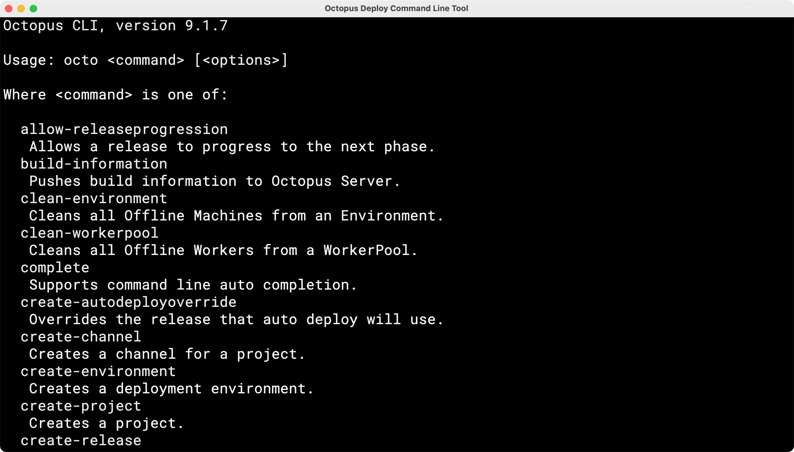
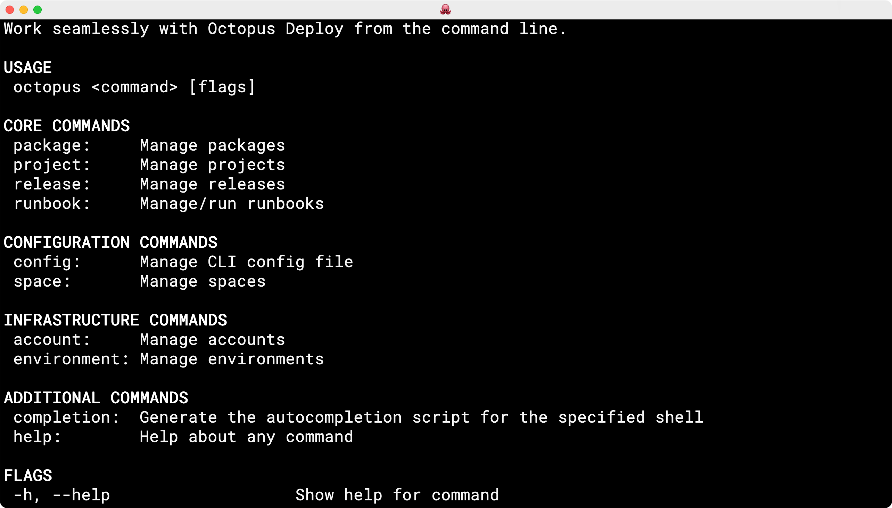

The Octopus CLI has served us well for many years. However, it has some limitations we want to address. 

In this post, I share our plans to evolve the CLI experience with Octopus Deploy.

## The state of the Octopus CLI (octo)

The [Octopus CLI](https://github.com/OctopusDeploy/OctopusCLI) (`octo`) is built on C# and relies heavily on the [OctopusClients](https://github.com/OctopusDeploy/OctopusClients) .NET library. It provides commands to facilitate the automation of deployments and runbook execution. Notable commands include: 

- `build-information` 
- `create-release` 
- `deploy-release` 
- `pack` 
- `push` 
- `run-runbook` 

The Octopus CLI remains one of the most productive means for interacting with the [Octopus REST API](https://octopus.com/docs/octopus-rest-api). It empowers our customers to automate repetitive tasks while providing the flexibility to perform one-off commands. Most of the integrations we build and maintain for supported platforms, like Azure DevOps, GitHub Actions, and TeamCity, use it to perform operations in concert with the [Octopus REST API](https://octopus.com/docs/octopus-rest-api).

Although the Octopus CLI has served us well for many years, we want to address some of its limitations:

- **Built for automation, not for people:** When you use the Octopus CLI, you can tell it was built primarily as an automation tool. The CLI needs to evolve to include a human-first design.
- **Inconsistent command structure and output:** The Octopus CLI command structure is inconsistent due to commands being added over the years. The output isn't governed by an overarching strategy. There are notable exceptions in the command structure that hurts consistency, for example `pack`. Furthermore, these commands are grouped by operations rather than by the target resource. This hurts the overall user experience and makes it difficult to evolve the set of commands.
- **Runtime dependencies:** Despite being a self-contained executable, the Octopus CLI has requirements of platform libraries that must be installed prior to running the binary (for example, dependencies for .NET self-contained executables on Alpine). This is reflected in the installation script that's required for the Octopus CLI vNext for various distributions of Linux.
- **Difficult to cross-platform compile:** The build scripts are tied to Nuke and require Windows-only tools (i.e. `SignTool.exe`), which makes building cross-platform difficult. For example, see [issue #124, macOS build fails](https://github.com/OctopusDeploy/OctopusCLI/issues/124).
- **No support for the Executions API:** The Octopus CLI (`octo`) doesn't support these operations and adding support for these operations requires a number of code paths (for more information, read our post [Faster deployments with the Executions API](https://octopus.com/blog/faster-deployments-with-the-executions-api))
- **Lack of self-serve troubleshooting:** The Octopus CLI (`octo`) doesn't support a built-in capability for customers to troubleshoot problems such as network connectivity issues (see [issue #220](https://github.com/OctopusDeploy/OctopusCLI/issues/220)).

We wrestled with whether or not to continue building out the capabilities of the Octopus CLI and incorporate the changes we wanted to make to move things forward. After careful consideration of the possibilities, we decided to start fresh without the constraints of 10+ years of design decisions that the Octopus CLI has baked in. This decision also mitigates the challenge of updating the Octopus CLI and exposing ourselves to downstream problems with our existing integrations. We wanted to be more opinionated and focused on customer-centric workflows that we often defer to our API.

## Introducing the new Octopus CLI (octopus)

The new Octopus CLI (`octopus`) represents an evolution of the Octopus CLI. For starters, the number of available commands will be significantly expanded. The new Octopus CLI will grow to support operations for managing resources like accounts, lifecycles, projects, and spaces. It will also feature a new capability for user interaction – we're proponents of the [Command Line Interface Guidelines](https://clig.dev/), which advocates this capability. This feature is designed to guide users through a series of questions to perform the operation they want in the easiest way possible:

An interactive CLI will guide both first-time and experienced users down a path to the outcome they want. That stated, the new Octopus CLI will support automation as its primary use case.

The new Octopus CLI is based on the Go programming language. The language and its supporting libraries are ideally suited for building a CLI. We also want to use this opportunity to improve the [Go API Client for Octopus Deploy](https://github.com/OctopusDeploy/go-octopusdeploy), which underpins the [Terraform Provider for Octopus Deploy](https://github.com/OctopusDeployLabs/terraform-provider-octopusdeploy).

## Why use Go to build a CLI?

Go is a highly-concurrent language that's well-suited for building a CLI. The [Go API Client for Octopus Deploy](https://github.com/OctopusDeploy/go-octopusdeploy) was also built to support the [Terraform Provider for Octopus Deploy](https://github.com/OctopusDeployLabs/terraform-provider-octopusdeploy). It's been put through its paces. 

Finally, Go lends itself to a small runtime footprint through multi-platform support that's based on C++. This provides a small executable file size and a small set of requirements on the target environment – this combines to support scenarios where customers wish to use the CLI with Bash (for example) via `curl`.

## We need your help

We want to build a CLI that customers love to use, so we'd be grateful for your feedback. We'd love to hear the scenarios you want us to support. 

<a class="btn btn-success" href="https://octopusdeploy.typeform.com/to/COaNc9A3">Provide feedback</a>

You can track our progress building the CLI by following the [cli repository on GitHub](https://github.com/OctopusDeploy/cli). Please feel free to watch or star the repository for updates. We've also started publishing distributables to popular package repositories like Chocolatey and Homebrew.

Happy deployments!