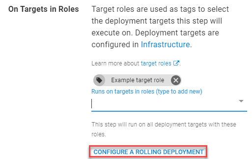
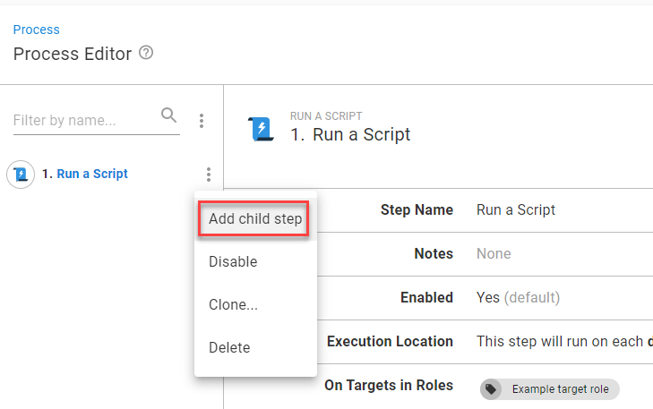
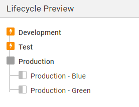
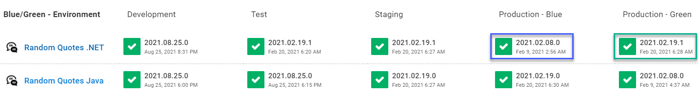
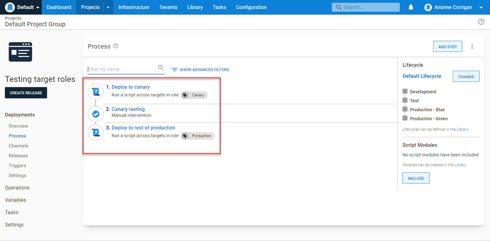
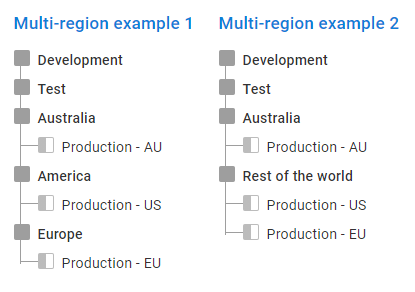
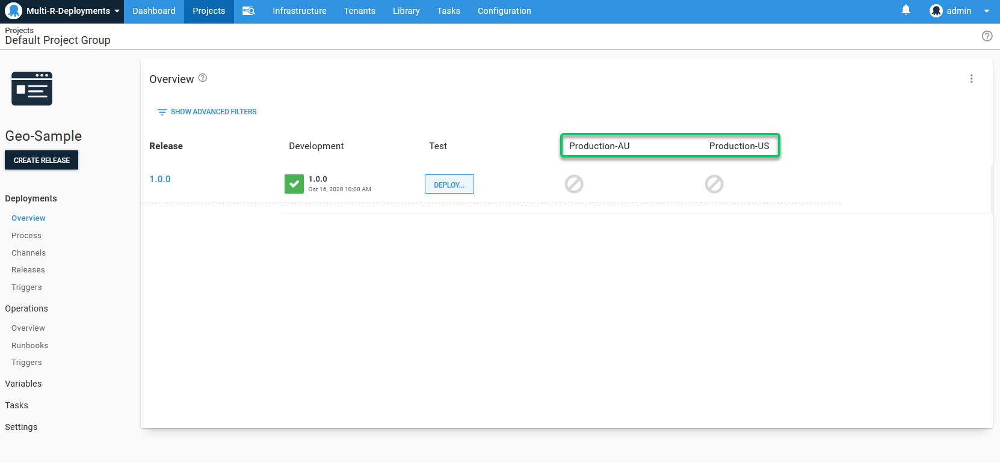
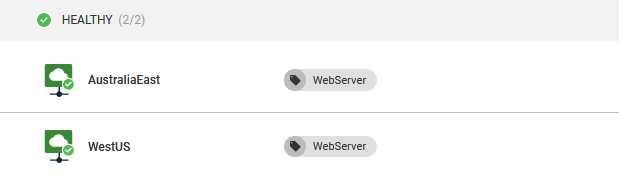
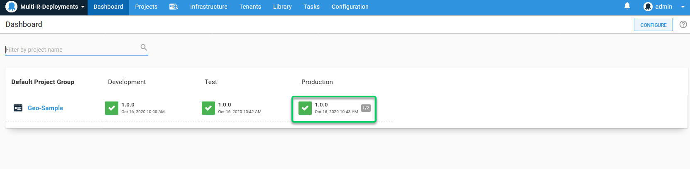

A deployment pattern is important to any development pipeline, helping to reduce downtime and other problems for your teams and customers. There are many approaches to deployment patterns, though, and one might suit your needs more than others.

This post looks at some of the most common deployment patterns and explains how to set them up in Octopus.

## Rolling deployments

A rolling pattern delivers releases to one [deployment target](https://octopus.com/docs/infrastructure/deployment-targets) (or batch of targets) at a time. This reduces downtime and traffic congestion on your environment during deployment.

As one of the simpler options, rolling deployments can be slow but are reliable, low risk, and easy to roll back.

### Setting up a rolling deployment pattern in Octopus

By default, a deployment process in Octopus only starts a new step when the previous one ends. However, if a step deploys to a [target role](https://octopus.com/docs/getting-started/best-practices/environments-and-deployment-targets-and-roles#deployment-target-environment-and-role-relationship) with more than one target (a server farm, for example), you hit up to 10 targets at the same time.

Instead, you can force a rolling pattern when defining your deployment process:

1. Under the **On Targets in Roles** section in the Process Editor, click **CONFIGURE A ROLLING DEPLOYMENT**.
1. In the **Rolling Deployment** section, set how many machines you want to deploy to at a time with the **Window size** field. For example:

   - A window size of ‘1’ will deploy to 1 machine at a time
   - A window size of ‘3’ will deploy to 3 machines at the same time

If you need to run a series of steps on a target before deploying to another, use child steps. You also add child steps in the **Process Editor**:

1. Click the 3 vertical dots next to the intended ‘parent’ step and select **Add child step**.
1. Complete the child step as you did with the parent (select the step type and complete the fields) and click **SAVE**. Repeat for as many steps as you need.

### More information on rolling deployments

Take a look at an [example rolling deployment setup](https://samples.octopus.app/app#/Spaces-45) in our Octopus Samples instance.

Also, check out our [rolling deployments documentation](https://octopus.com/docs/deployments/patterns/rolling-deployments) for more information, including how to use guided failures and variable run conditions. For even more reading on rolling deployments, take a look at some of our other blog posts:

- [The ultimate guide to rolling deployments](https://octopus.com/blog/ultimate-guide-to-rolling-deployments)
- [Convert an existing application to use rolling deployments](https://octopus.com/blog/convert-to-rolling-deployments)

## Blue/green deployments

A blue/green pattern uses 2 production environments that swap roles between ‘live’ and ‘staging’ with each release.

For example, if the live version of an application is on your blue server, you use the green server for staging and testing before redirecting traffic to it. After cutover, the blue server then acts as the new staging area.

The blue/green pattern has the easiest rollback solution on this list - just redirect your traffic back to the original server. Blue/green can be costly and complex though, given the need to clone your entire production environment.

### Set up a blue/green pattern in Octopus

You can set up a blue/green pattern in Octopus using [environments](https://octopus.com/docs/infrastructure/environments). 

Create 2 production environments with clear labels and assign the needed deployment targets to them.

To create an environment:

1. Click **Infrastructure** in the top menu, then select **Environments** from the left.
1. Click **ADD ENVIRONMENT**.
1. Enter the environment name (`Production – Blue`, for example) and click **SAVE**.

We also recommend creating a new [lifecycle](https://octopus.com/docs/releases/lifecycles) (or changing an existing one) so the blue and green environments sit in a shared phase. To create a lifecycle like this:

1. Click **Library** in the top menu, then select **Lifecycles** from the left.
1. Click **ADD LIFECYCLE** from the top right.
1. Enter a name and description for your new lifecycle, then click **ADD PHASE**.
1. If adding your full development pipeline (recommended): 
   - Enter the name of your earliest phase (`Development`, for example).
   - Click the **ADD ENVIRONMENT** button and select the related environment from the dropdown. Decide if you want to deploy automatically and click **OK**.
   - Click **ADD PHASE** to add another and repeat these steps.
1. When adding the phase for Production, add both your blue and green environments.
1. Click **SAVE** when happy with your lifecycle.

To assign a lifecycle:

1. Click **PROJECTS** in the top menu, select your project from the list, then click **Process** from the left.
1. Click **CHANGE** on the right, under the **Lifecycle** heading.
1. Select your lifecycle from the dropdown and click **SAVE**.

When readying a new release for staging, check your Octopus dashboard and deploy to the environment not acting as your live service.

### More information on blue/green deployments

Take a look around at an [example blue/green deployment setup](https://samples.octopus.app/app#/Spaces-302) in our Octopus Samples instance.

For more reading on blue/green deployments, take a look at some of our other blog posts:

- [What is the difference between blue/green and red/black deployments?](https://octopus.com/blog/blue-green-red-black)
- [Automated blue/green database deployments](https://octopus.com/blog/databases-with-blue-green-deployments)

## Canary deployments

A canary deployment pattern releases updates to a handful of production targets for testing before rolling out to the rest. Named after the [old early warning system for miners](https://en.wikipedia.org/wiki/Domestic_canary#Miner's_canary), it helps detect problems early and without impacting your whole service.

### Set up a canary pattern in Octopus

You could perform a canary pattern in Octopus without any special setup. Just manually deploy to your chosen canary targets, test, then continue with the remaining targets when happy.

That said, Octopus is all about automation, and you can build a canary pattern into your deployment process that:

1. Deploys to your ‘canary’ targets
1. Waits for manual approval with a [manual intervention step](https://octopus.com/docs/projects/built-in-step-templates/manual-intervention-and-approvals) while you test or invite user feedback
1. Deploys to the rest of your production targets once you’re happy

First, you should create target roles to make sure you hit the right deployment targets at the right phases:

1. Click **Infrastructure** in the top menu, then select **Deployment Targets** from the left.
1. Click on a deployment target you intend to act as a canary.
1. Click the **Target Roles** section under the **Deployment** heading to expand.
1. Enter a name in the **Roles** field (`canary`, for example) and click **SAVE**.

Repeat the steps and create target roles for the remaining deployment targets if they don’t already exist. After you create a target role, you can reuse it for other deployment targets.

Now you can create the deployment process:

1. Click **PROJECTS** from the top menu, select your project from the list, then click **Process** from the left.
1. Click **ADD STEP**, select the type of step and complete the details for the deployment. Select your canary target role in the **On Targets in Roles** section. Click **SAVE** when done.
1. Click **ADD STEP** again and use the **Choose Step Template** field to search for ‘manual intervention’. Hover your cursor over the **Manual Intervention Required** box and click **ADD**.
1. Complete the following fields and click **SAVE**:
   - **Step Name**
   - **Notes** – describe the purpose of the manual step
   - **Instructions** – enter what needs to happen, such as testing or awaiting user feedback
   - **Responsible Teams** – select the team responsible for testing or monitoring feedback
   - **Block Deployments** – select **Prevent other deployments while awaiting intervention**
   - **Required** – make this a required step
   - Complete the other options as needed and click **SAVE**.
1. Click **ADD STEP** and recreate the first step, but this time deploy to the target roles for the rest of your production targets.

### More information on canary deployments

Take a look around at an [example canary deployment setup](https://samples.octopus.app/app#/Spaces-542) in our Octopus Samples instance.

## Multi-region deployments

A multi-region pattern is when you deploy a release to multiple overseas targets, such as servers or data centers. While we consider it a deployment pattern itself, it’s an outlier as it uses other patterns as part of the process.

### Set up a multi-region deployment pattern in Octopus

There are 3 ways to set up multi-region deployments in Octopus:

- [Environments and lifecycles](#environments-and-lifecycles)
- [Cloud regions and variables](#cloud-regions-and-variables)
- [Tenants](#tenants)

#### Environments and lifecycles

You can use this solution to force the order of deployments through your regions.

To create an environment:

1. Click **Infrastructure** in the top menu, then select Environments from the left.
1. Click **ADD ENVIRONMENT**.
1. Enter the environment name (`US-West` for example) and click **SAVE**.

Repeat for each of your worldwide servers.

To create a suitable lifecycle:

1. Click **Library** in the top menu, then select **Lifecycles** from the left.
1. Click **ADD LIFECYCLE** from the top right.
1. Enter a name and description for your new lifecycle, then click **ADD PHASE**.
1. If adding your full development pipeline (recommended):
   - Enter the name of your earliest phase (`Development`, for example).
   - Click the **ADD ENVIRONMENT** button and select the related environment from the dropdown. Decide if you want to deploy automatically and click **OK**.
   - Click **ADD PHASE** to add another and repeat these steps.
1. When adding the phases for Production, add all your regional environments. Here your lifecycle could:
   - Deploy to all your environments consecutively
   - Deploy to one environment, then the others when you’re ready
1. Click **SAVE** when happy with your lifecycle.

To assign the lifecycle:

1. Click **PROJECTS** in the top menu, select your project from the list, then click **Process** from the left.
1. Click **CHANGE** on the right, under the **Lifecycle** heading.
1. Select your lifecycle from the dropdown and click **SAVE**.

You can also use scheduled deployments to deploy during low-usage timeframes:

1. Click **Projects** in the top menu, select your project from the list, then click **Releases** from the left.
1. Click **CREATE RELEASE**.
1. Click the **DEPLOY TO...** button
1. Click **When** to expand the menu and select **Later**.
1. Choose a date and time that best suits the region and click **DEPLOY**.

#### Cloud regions and variables

Cloud regions are perfect if you don’t care about the order you deploy to your regions.

To set up your cloud regions:

1. Click **Infrastructure** in the top menu, then select **Deployment Targets** from the left.
1. Click **Add deployment** target and select **CLOUD REGION**.
1. Hover your cursor over the **Cloud Region** box and click **ADD**.
1. Complete the following fields and click **SAVE**:
   - **Display name**
   - **Environments**
   - **Target Roles**
   
Repeat for all your cloud regions.

To use the cloud regions, you must use region-specific variables. To set these:

1. Click **Projects** in the top menu, select your project from the list, then click **Variables** from the left.
1. Complete the following columns to enter your first variable:
   - Name – you only need this for the first variable
   - Value – enter the value that defines your variable
   - Scope – click the field and select your cloud region with the **Select targets** option.
1. Click **ADD ANOTHER VALUE** to add more, creating a value for each cloud region.
1. Click **SAVE** when ready.

#### Tenants

Though we developed Tenants for those providing Software as a Service (SaaS), you can also use it to manage multi-region deployments. This is a great option for those who want more control and clarity on the Octopus dashboard.

To create your tenants:

1. Click **Tenants** in the top menu, then click **ADD TENANT** from the top right.
1. Give your tenant a name and description and click **SAVE**.
1. Click **CONNECT PROJECT**, select your project from the dropdown box and click **ADD CONNECTION**.
1. If you haven’t already enabled tenanted deployments for your project, Octopus will prompt you. Click **ENABLE TENANTED DEPLOYMENTS**, select your environments with the dropdown, and click **ADD CONNECTION**.
1. We recommend adding a logo or icon to tenants to make their purpose clearer. Click **Settings** from the left menu, upload an image in the Logo section and click **SAVE**.
1. Click **Tenants** in the top menu and repeat the steps to create your other tenants.

You should also use [common variable templates](https://octopus.com/docs/tenants/tenant-variables#common-variables) to prompt you for data needed for each region (storage account details, for example). Unlike [project variables](https://octopus.com/docs/tenants/tenant-variables#project-variables), you can reuse common variables across all tenants. Plus, they're not scoped to specific environments.

1. Click **Library** in the top menu, select **Variable Sets** from the left. 
1. Click **ADD VARIABLE SET**, enter a name and description and click **SAVE**.
1. Click the **VARIABLE TEMPLATES** tab on your new set, then click **ADD TEMPLATE**.
1. Complete the following fields and click **ADD** (there may be other options depending on what you select for the control type):
   - **Variable name** – enter a name, such as ‘Tenant.Alias’
   - **Label** – what’s shown when prompting for data
   - **Help text** – describe the action needed
   - **Control type** – what type of option the variable will prompt for 
   - **Default value** (optional)
1. Click **SAVE** when back on the **Variable Sets** screen.

Now you can connect the variable to your project:

1. Click **PROJECTS** in the top menu, select your project from the list, then click **Variables** from the left.
1. Click **Library Sets** from the left and click **INCLUDE LIBRARY VARIABLE SETS** from the top right.
1. Check the box for your new variable set and click **SAVE**.

Now your tenants will alert you if they’re missing information. To set the values needed:

1. Click **Tenants** in the top menu, select your tenant from the list, then click **Variables** from the left.
1. Click the **COMMON VARIABLES** tab, complete the information needed and click **SAVE**.

Now you can see how many tenants a project has deployed to on the Octopus dashboard.

To learn more, you can watch our [webinar on multi-tenancy deployments](https://octopus.com/events/better-multi-tenancy-deployments-using-octopus-deploy).

## Conclusion

As you can see, Octopus can help manage a range of deployment patterns to suit your team, projects, and customers.

Make sure you check out [our documentation](https://octopus.com/docs) for more help with deployment patterns, plus everything else Octopus.

Happy deployments!