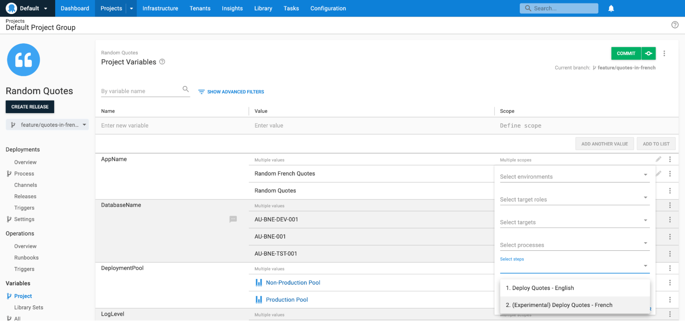
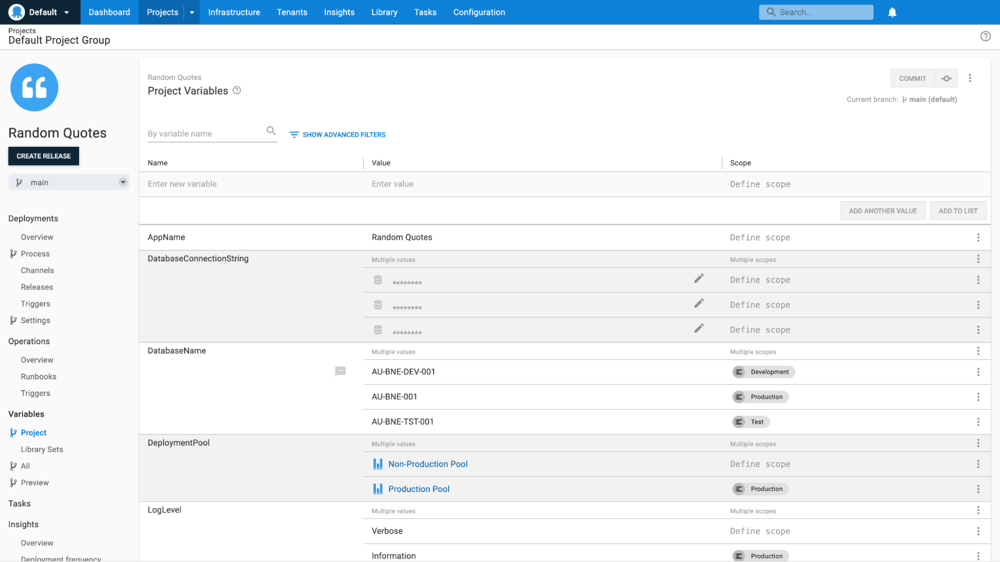
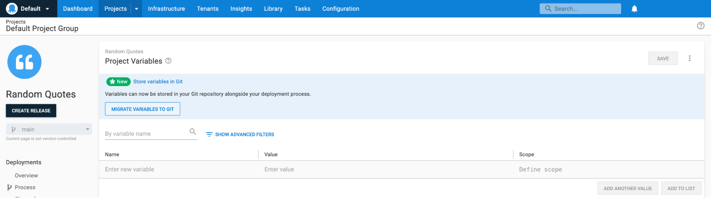

Since we launched Configuration as Code (Config as Code) in March 2022, we have been working hard adding new features. Since the release of [Octopus 2022 Q3 release](https://octopus.com/blog/octopus-release-2022-q3), you can now store your non-sensitive variables in Git alongside your deployment process and deployment settings.

In this post, I cover the changes that we have made, as well as a dive into the design of the variables OCL schema.

## Why choose variables as the first major upgrade to Config as Code?
Since the initial release of Config as Code in March 2022, we've been listening closely to everyone's feedback and suggestions to continue improving our support.

Whilst there have been many feature requests, we have seen a clear theme: _Config as Code feels incomplete without variables in the Git repository_. So it was clear this was the first update of many to Config as Code as we continue to improve. 

## Config as Code becomes more powerful
The first release of Config as Code had good support for version controlled deployment processes and settings, but process changes that needed complementary variable changes still needed to be carefully coordinated. If you changed the wrong value, or deleted the wrong variable, it could disrupt other deployments. 

With project variables now in the Git repository, the Config as Code feature and branching become even more powerful. You can make major changes to your deployment process and variables together on a feature branch without impacting anyone else until you're ready to merge those changes.

Octopus now has branch context on the project variables page. When setting action scopes, it pulls the list of actions from the currently selected branch (rather than only showing actions from the default branch).



This makes action scoping much more useful in Git projects. You can add a new step on your feature branch, scope a variable to this step, and merge these back to your default branch as a single block of configuration when you're ready.

### Support for sensitive values
For now, **sensitive variables will remain in the Octopus database**. On the project variables page, we make this clear by showing a database icon next to all sensitive values.



Regardless of the selected branch, commit, or tag you will always be viewing and modifying the single shared set of sensitive variables. We're investigating the best way to securely store sensitive variables in Git. We hope to add support for this at some point in the future, but for now sensitive values will remain in the database.

### Getting started
Once you have upgraded to a [supported version](https://octopus.com/downloads), the project variables will automatically be migrated alongside your deployment process and deployment settings when converting the project to Git. No additional steps are required.

For existing Git projects, you will need to migrate your variables to Git manually.

### Migrating variables to Git
We initially planned to automatically migrate the variables on the next commit for all those who had upgraded. After some testing of this approach however, it was clear that this would not work for many teams. The potential for disruption was too great, especially for cloud customers that receive frequent updates to their instances.

Instead we have opted to have a transition phase, allowing everyone to perform the migration at a time that suits them. If you have an existing Git project with variables that have not been migrated, you will see this banner on the project page.



Clicking the **Migrate Variables To Git** button will show a wizard that will guide you through the migration. _For more detailed documentation on the migration process, check out the [migrating variables to Git documentation](https://oc.to/ConfigAsCodeVariables)_.

#### Transitioning to automatic migration
This transition phase has resulted in three possible project states:

- Git projects with Git variables
- Git projects with database variables
- Database projects

This adds additional complexity to the codebase, and requires time and effort that could be used for new features. With this in mind **we are not going to support this transition state forever**. We will eventually remove support for Git projects with variables in the database, and so recommend migrating your variables as soon as practical.

### Route changes
With the project variable set now split between your Git repository and the Octopus database, Git projects now have two project variable routes:

- `/api/{spaceId}/projects/{projectId}/{gitRef}/variables`: Use this route for all variable types that are not sensitive. There is a separate set of variables for each [Git reference](https://git-scm.com/book/en/v2/Git-Internals-Git-References), and specify this reference in the `{gitRef}`. While you can read any type of reference, commits and tags are immutable, so you can only write to branches.
- `/api/{spaceId}/projects/{projectId}/variables`: Use this route for your sensitive variables. These remain in the database and are never written to your Git repository.

The original variable route (`/api/{spaceId}/variables/variableset-{projectId}`) will continue to work for projects with variables in Git, but it will only return the sensitive values. We recommend always using the new project scoped routes.

These don't apply if you only use Octopus through the UI. The project variables page will write the values to the correct locations for you.

## The variable OCL schema
One of the ongoing goals for Config as Code is to keep the Octopus UI fully functional for Git projects. With that in mind we still want to make sure we provide a first-class experience for those who want to edit OCL directly in a text file.

In the first version of Config as Code released earlier this year, we took our existing deployment process and deployment settings resource models and translated them directly to OCL to create the schema. This worked great for these resources, but we had to take a different approach with variables.

Variables are passed through the API and persisted as a single-level array of variables. Multi-value variables are persisted as completely separate variables with the same name. Had we just written this directly into the Git repository, the OCL would have looked something like this.

```hcl
variable "DatabaseName" {
    value = "AU-BNE-TST-001"
    scope = {
        environment = ["test"]
    }
}

variable "DatabaseName" {
    value = "AU-BNE-001"
    scope = {
        environment = ["production"]
    }
}

variable "DeploymentPool" {
    type = "WorkerPool"
    value = "production-pool"
    scope = {
        environment = ["production"]
    }
}

variable "DeploymentPool" {
    type = "WorkerPool"
    value = "non-production-pool"
}

variable "DatabaseName" {
    value = "AU-BNE-DEV-001"
    scope = { 
        environment = ["production"]
    }
}
```

This was functional and the UI worked as expected, but the OCL editing experience could be improved. There were repeated variable names and types, values for the same variable were easily separated, and there was unnecessary nesting. Instead, when serialising to OCL, we merge values for the same variable together, flatten out the scopes, and everything is a lot cleaner.

```hcl
variable "DatabaseName" {
    value "AU-BNE-TST-001" {
        environment = ["test"]
    }

    value "AU-BNE-DEV-001" {
        environment = ["development"]
    }

    value "AU-BNE-001" {
        environment = ["production"]
    }
}

variable "DeploymentPool" {
    type = "WorkerPool"

    value "non-production-pool" {}

    value "production-pool" {
        environment = ["production"]
    }
}
```

We had to take a completely different approach to OCL serialisation to achieve this, but we're happy with the result. It makes OCL easier to reason with and makes for a great editing experience. This gives us great options for how we define OCL schemas for future, and will feed into enhancements that we plan to make to the persistence and API layers.

_For a more detailed information and examples, check out the [variable OCL schema documentation](https://to-do)_

## What's next?
The latest version of Config as Code with Git variables is rolling out to cloud and on-premises now (download it [now](https://octopus.com/downloads)). Once your instance is up to date, you can migrate your variables to Git as soon as you are ready.

Please let us know your feedback and what features you want next on the [Config as Code feedback form](https://oc.to/CaCEAPFeedbackForm).