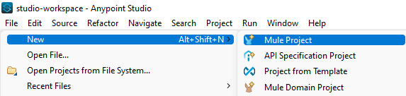

MuleSoft developed unique software that lets you create custom APIs to retrieve or manipulate information from on-premises or cloud-based systems. 

In this post, I show you how to deploy a MuleSoft API to a server running the [Mule Runtime](https://docs.mulesoft.com/mule-runtime/4.4/), using Octopus Deploy.

## Getting started

To follow along with this post, you need to download the following software:

- [MuleSoft Anypoint Studio](https://www.mulesoft.com/platform/studio)
- [Mule Community Edition Runtime](https://developer.mulesoft.com/download-mule-esb-runtime)
- [Maven](https://maven.apache.org/download.cgi) (optional)
- [Postman](https://www.postman.com/downloads/) (optional)

### Installing Anypoint Studio

Anypoint Studio is available from MuleSoft as a 30-day trial.  After filling in the form, download the ZIP file and extract it to your disk.  AnyPoint Studio isn't "installed" on your machine, so you can execute AnyPoint Studio after it's been extracted.

### Configuring MuleSoft Runtime

To configure the Mule Community Edition Runtime, first install and configure Java.  The MuleSoft documentation recommends [Java 8](http://www.oracle.com/technetwork/java/javase/downloads/jdk8-downloads-2133151.html), however, I successfully used [Microsoft OpenJDK 11](https://docs.microsoft.com/en-us/java/openjdk/download#openjdk-11).  

After you have Java and the Mule Runtime installed, create the following system environment variables:

- `JAVA_HOME`: Set this to the location of your Java folder
- `MULE_HOME`: Set this to the location of your Mule Runtime folder


By default, the Mule Community Runtime runs in the foreground.  To configure it to run as a service, follow the MuleSoft documentation:

- [Configuring Mule as a Linux or Unix daemon](https://docs.mulesoft.com/mule-runtime/3.9/configuring-mule-as-a-linux-or-unix-daemon)
- [Configuring Mule as a Windows service](https://docs.mulesoft.com/mule-runtime/3.9/configuring-mule-as-a-windows-service) 

### Installing Maven

Installing Maven is optional because Anypoint Studio software comes with Maven built into the product. If you want a build server to build the Anypoint Studio project, your build server needs the Maven capability.  Most, if not all, modern build servers contain steps or tasks that do this if Maven is installed on the build agent.  

Installing Maven is as simple as extracting the ZIP file, then adding the folder to the `PATH` system environment variable.

### Testing with Postman

After you create your API, you need to test it to make sure it's operating properly. Any tool capable of doing a POST request works, however, the most popular API testing tool is [Postman](https://www.postman.com/downloads/). 

[Postman is free](https://identity.getpostman.com/signup) and available for Windows, Mac, and Linux operating systems.

## Creating the API

In this post, I create a simple "Hello World" API.  As the name implies, the response from calling this API is `Hello world!`.  

Real-world APIs are more complex, but in this post I'm showing you how to deploy the API using Octopus Deploy.

### Creating the project

1.  In Anypoint Studio, click **File**, then **New**, then **Mule Project**.



2.  Give the project a name and click **Finish**.


3.  From the **Mule Palette**, choose the **HTTP** category and drag a **Listener** to the canvas.


4.  Configure the listener **Connector configuration** by clicking the green plus button.


5.  Configure the settings for the Connector configuration. For this post, I kept the defaults.


Click the **Test Connection...** button to make sure this works.

6.  Define a path for the API. For this post, I chose `/hello-world`.


7.  Add a **Set Payload** object from the **Core** category of the **Mule Palette** and drag it to the **Process** section of the message flow.


8.  Disable the **fx** button by clicking it, and set a static message for the **Value**.  For this post, I used `Hello World!`.


9.  Test your API by clicking the green play button.  When the **Console** window shows a status of **DEPLOYED**, your API is ready.  Switch over to Postman (or your tool of choice) to test your API.  Send a POST request to `http://localhost:8081/hello-world`.


## Creating a deployable file

The Anypoint Studio software contains a version of Maven built into the product.  This means you can create a deployable artifact in Anypoint Studio itself.  Alternatively, you can use Maven from a build server (or the command line) to produce the deployable file.

### Anypoint Studio

You can **Export** your project from Anypoint Studio by doing the following:

1.  Click **File**, then **Export**.


2.  Select an export wizard. For this post, I chose **Anypoint Studio Project to Mule Deployable Archive (includes Studio metadata)**.  Click **Next**.


3.  Select the project to export.  The `hello-world` project is the only one I created.  Click **Next**.

3.  Select a location to save the file and click **Finish**.


After the save operation is complete, it displays where the file is saved and the name.  In my case, it's saved to `C:\Users\Shawn.Sesna\hello-world.jar`.


### Maven

You can also build the project by using Maven from either a build server or the command line.  

In this post, I show you the command-line method, but the build server method is almost identical.

1.  Navigate to the project folder. This folder already contains a `pom.xml` file that you use with Maven.

1.  Run Maven with following command/goals:

```
mvn clean package
```

3.  After the build is complete, navigate to the **target** sub-folder.  The build has produced a file called `hello-world-1.0.0-SNAPSHOT-mule-application.jar`.


## Deploying the API

As you can seen, the Anypoint Studio projects are compiled into JAR files.  Octopus Deploy doesn't have a specific step to deploy to the Mule Community Edition Runtime, however, it contains a **Deploy Java Archive** step.  

After you place the JAR file in either the built-in repository, or an external one, you can proceed with configuring the deployment.

### Configuring the Deploy Java Archive step

This post assumes you know how to create projects in Octopus Deploy.  

To configure your Octopus Deploy project, use the following steps:

1.  Add a **Deploy Java Archive** step to your process.

1.  Select the role to deploy to. This post uses the role **Hello-World-API**.

1.  Select the package to deploy. This post uses the package created by the export method, `hello-world-1.0.0-SNAPSHOT-mule-application.jar`.  I renamed the file `hello-world.1.0.0.jar` so that Octopus can determine the SemVer version of the package.

1.  The Mule Community Edition Runtime expects APIs to be deployed to a specific folder. In the **Deployment** section of the **Deploy Java Archive** step, tick **Use custom deployment directory**.  Enter the location for the Mule Community Edition Runtime apps folder.

1.  Choose a final filename for the deployed JAR file.  If you don't fill this in, Octopus creates the file similar to the following format `hello-world@S1.0.0@673BE843C229AA40AC1698CC82104BD0`. While this deploys and functions, the next version such as 1.0.1, is deployed as `hello-world@S1.0.1@673BE843C229AA40AC1698CC82104BD0`.  Mule will think this is a new API and attempt to deploy it, which conflicts with the first.  If `1.0.1` has the same filename as `1.0.0`, Mule sees a change and uses the new API.

:::warning
Do NOT tick the **Purge** option.  If there are other APIs deployed, this deletes them all.
:::

When you're done, it should look something like this:


6.  Create a release and deploy.


7. Using Postman, test the API.


## Manipulating the API with structured configuration variables

You successfully deployed a simple API, however, this isn't terribly realistic. It's more likely items in the API need to be updated as it progresses through your environments.  

Using the [structured configuration variables](https://octopus.com/docs/projects/steps/configuration-features/structured-configuration-variables-feature), you can change the message displayed from `Hello World!` to something else.

### Updating the API message

The API message is stored in an XML file in the JAR package.  By determining the XPath of the message, you can update the message for your deployed API.

```xml
<?xml version="1.0" encoding="UTF-8"?>

<mule xmlns:http="http://www.mulesoft.org/schema/mule/http" xmlns="http://www.mulesoft.org/schema/mule/core"
	xmlns:doc="http://www.mulesoft.org/schema/mule/documentation"
	xmlns:xsi="http://www.w3.org/2001/XMLSchema-instance" xsi:schemaLocation="http://www.mulesoft.org/schema/mule/core http://www.mulesoft.org/schema/mule/core/current/mule.xsd
http://www.mulesoft.org/schema/mule/http http://www.mulesoft.org/schema/mule/http/current/mule-http.xsd">
	<http:listener-config name="HTTP_Listener_config" doc:name="HTTP Listener config" doc:id="1bcf8768-d2f4-449e-ace0-4a86472cc4e1" >
		<http:listener-connection host="0.0.0.0" port="8081" />
	</http:listener-config>
	<flow name="hello-worldFlow" doc:id="5b6f81da-ecf0-4a71-8299-c9918ed2ca69" >
		<http:listener doc:name="Listener" doc:id="433558cb-1dcc-4385-8126-5b2801575a29" config-ref="HTTP_Listener_config" path="/hello-world"/>
		<set-payload value="Hello World!" doc:name="Set Payload" doc:id="638c8080-540b-4fce-8539-a5e74350ab80" />
	</flow>
</mule>
```

1.  Edit the **Deploy Java Archive** step.

1.  Click the **CONFIGURE FEATURES** button.


3.  Enable the **Structured Configuration Variables** feature.


4.  The message is located in the hello-world.xml file. Specify this file to be replaced.


5.  Create an XPath project variable and give it a value.  In this case, the XPath is `/*[local-name()='mule']/*[local-name()='flow']/*[local-name()='set-payload']/@value`.

6.  Create a release and deploy. After the deployment is complete, test your API to see the new message.


## Conclusion

In this post, you learnt how to create an API using the MuleSoft Anytime Studio, and how to deploy it with Octopus Deploy to a server running Mule Community Edition Runtime.  

Happy deployments!
