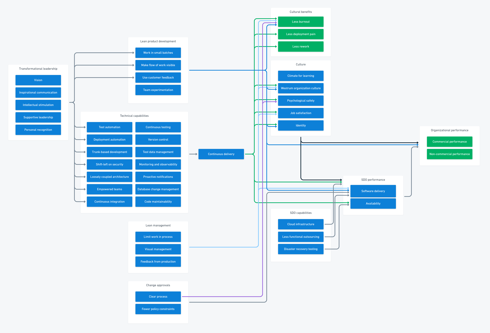
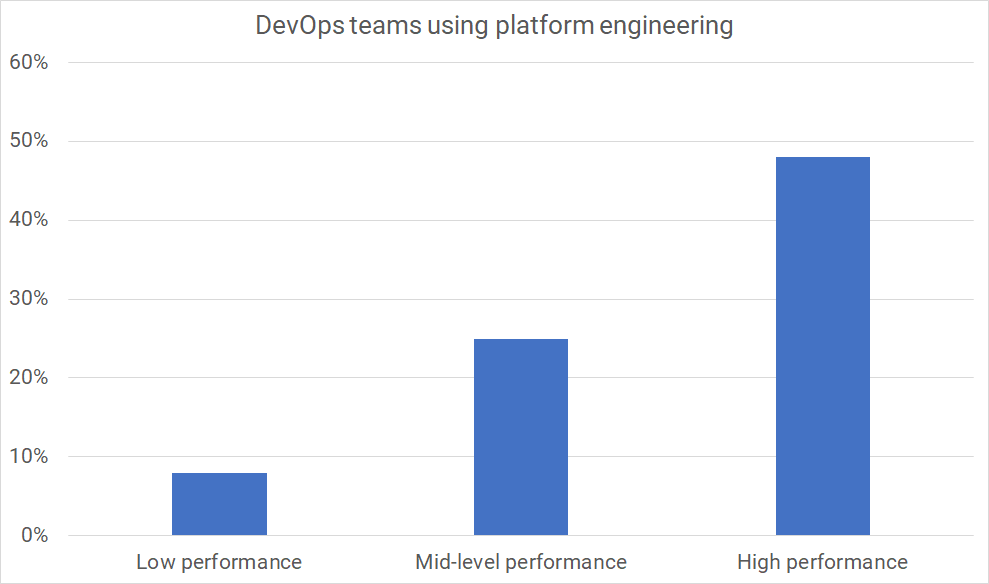

In this post, you'll discover where platform engineering fits into your broader software delivery process. You'll see how platform engineering works with a DevOps process and why both DevOps and platform engineering can help your organization attain high performance.

After a short refresher on DevOps, you'll find an overview of platform engineering and how it fits with a DevOps process.

## The quick version of DevOps

DevOps stems from the simple idea of developers and ops working together. This had become difficult to do in many organizations because these teams had conflicting goals.

Organizations had aligned goals to the specialism of each team. The operations team needed to keep systems stable, while developers had to deliver more value more frequently. When the teams work in isolation, the increase in change from developers lowers system stability. You can see how this might create the conditions for conflict.

You could overcome these conflicting goals by having dev and ops work more collaboratively. When people tried this, they found it was possible to deliver more changes in shorter timescales *and* increase reliability.

Over ten years, the vague value statement of "developers and ops working together" grew into a well-defined set of capabilities, thanks to extensive research by Puppet and DORA.

The DevOps *structural equation model* maps the capabilities and relationships found in the research. It was initially described in the book *Accelerate* and DORA has continued to update it as part of their research program.

*The 2022 DevOps structural equation model*

This model is helpful for teams looking for improvement opportunities and organizations looking to adopt DevOps and attain the benefits of high performance. You may have seen an older version of this diagram with fewer boxes.

As you can see, the 2022 model is packed with ideas for specific capabilities you can adopt to become *more DevOps*. If you feel overwhelmed, read [how to start using Continuous Delivery](https://octopus.com/devops/continuous-delivery/how-to-start-using-continuous-delivery/) in our [DevOps Engineer's handbook].

The crucial insight in this model is the importance of culture to your organization's technical performance and its performance against commercial and non-commercial goals.

In 2022, DevOps has grown to mean:

- Developers and ops working together
- A well-defined set of technical and non-technical capabilities
- Assessing your success using whole-system measures

If you've been around long enough, you might notice that many of the changes that DevOps encouraged look like how we developed systems before dev and ops silos were created.

Specialist teams were created for a reason, so as we back up and try another path, you should ensure you resolve those original issues without recreating the nasty side effects. The problem of scale and specialization still exists, so how do we overcome them healthily?

Enter the platform engineering team.

## Platform engineering

Despite many new teams and job titles springing up around DevOps, the platform engineering team is, perhaps, the most aligned to the mindset and objectives of DevOps.

Platform teams work with development teams to create one or more *golden pathways* representing a supported set of technology choices. These pathways don't prevent teams from using something else. Pathways encourage alignment without enforcing centralized decisions on development teams. Rather than pick up tickets, such as "create a test environment", platform teams create easy-to-use self-service tools for the development teams' use.

A critical part of platform engineering is treating developers as customers, solving their problems and reducing friction while advocating the adoption of aligned technology choices. For example, say your organization has plenty of experience running MySql databases and has worked out how to solve issues such as:

- Scaling
- Backups
- Maintenance
- Security
- Replication
- Deployments
- Test databases

A team choosing MySql will get all these for free at the push of a button. Another team might still need to use something different, but they will be responsible for their selections when they step off the pathway.

Choosing a golden pathway accelerates your software delivery, lets you focus on the differentiating work, and gives you a support channel when things go wrong. Your time as a developer is best spent on the features that provide value to your customers, not on setting up builds, environments, and other similar activities.

Platform engineering can make many tasks easier:

- Build pipelines
- Test and production environments
- Automated deployments
- Test frameworks
- Logging and monitoring
- Security features

Platform engineering reduces your operations burden when you scale up your software delivery team. You'll need fewer of these hard-to-find platform engineers overall, and by working on a platform team, they can make more impact than they could if they were embedded in development.

Platform engineering helps your organization scale its software delivery without losing some of the best small-team benefits.

## DevOps and platform engineering

As you can see, platform engineering complements, rather than competes, with DevOps. To provide further proof of this positive relationship, the [Puppet State of DevOps report](https://puppet.com/resources/report/2021-state-of-devops-report) found that DevOps high-performers are more likely to have platform engineering teams than low performers.

| Category | % with platform engineering |
|----------|----------------------------:|
| Low      | 8%                          |
| Mid      | 25%                         |
| High     | 48%                         |

Platform engineering alone doesn't provide a complete organizational view of performance. The DevOps structural equation model shows us capabilities for leadership, management, culture, and product that are outside a platform team's scope. This is why platform engineering belongs within a broader process, such as DevOps, rather than offering a replacement for one.

Used together with DevOps, platform engineering is an excellent tool for scaling your software delivery capability.

DevOps wants you to:

- Measure the performance of the whole system
- Shorten and amplify feedback loops
- Create a culture of continuous learning and improvement

Platform engineering wants you to:

- Smooth the development experience
- Create tools and workflows that enable self-service
- Make it easy for developers to achieve system quality attributes (such as performance, observability, and security)

## Conclusion

As you grow your software delivery team, you must carefully manage the complexity of scale. Some organizations limit complexity by limiting a team's autonomy, but platform engineering provides a mechanism that tames complexity while preserving development team autonomy.

Happy deployments!

## Further reading

- Building Secure and Reliable Systems - Heather Adkins, et al
- [Octopus DevOps Engineer's Handbook](https://octopus.com/devops/)