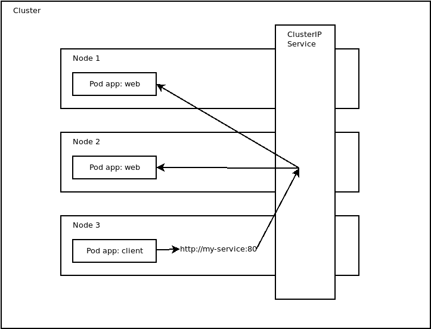
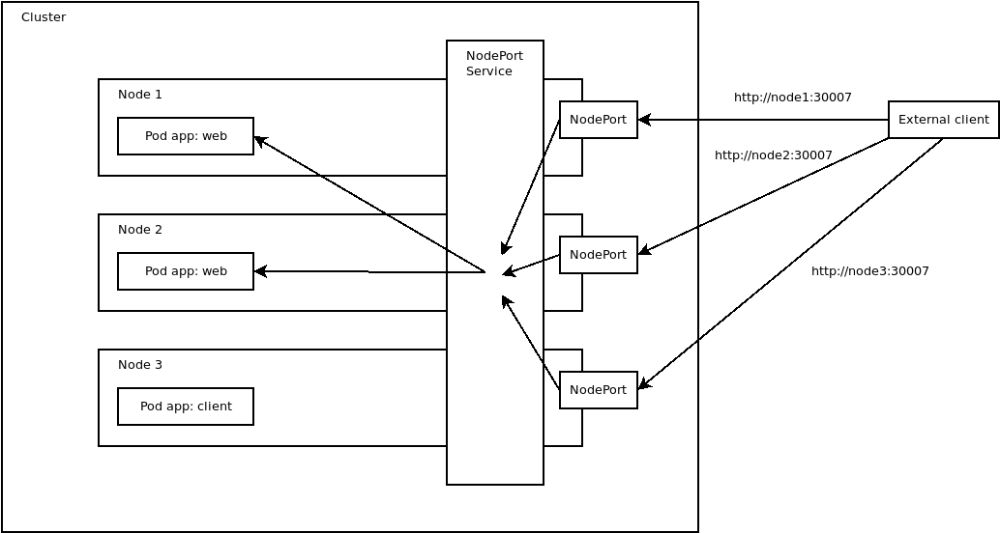
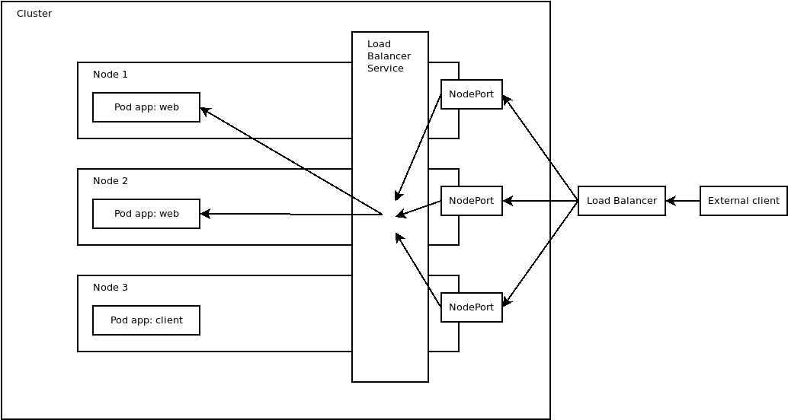

Kubernetes services provide three different types: `ClusterIP`, `NodePort`, and `LoadBalancer`. Knowing which type of service to configure is critical to allowing clients to establish network connections while not exposing services to unnecessary traffic.

In this post I'll discuss the three types of services and when they should be used.

## The ClusterIP service type

The YAML below defines a service of type `ClusterIP` that directs traffic on port 80 (defined by the `port` property) to port 8080 (defined by the `targetPort` property) on any pods with the label `app` set to `web` (defined by the `selector` property):

```yaml
apiVersion: v1
kind: Service
metadata:
  name: my-service
spec:
  type: ClusterIP
  selector:
    app: web
  ports:
    - protocol: TCP
      port: 80
      targetPort: 8080
```

`ClusterIP` services expose pods to internal network traffic. For example, you may expose a database to other pods via a `ClusterIP` service because external clients should never have direct access to the database.

`ClusterIP` services expose the smallest surface area and should be used for pods that only need to be exposed to other pods in the cluster.

The diagram below shows how pods within the same cluster can communicate via the `ClusterIP` service:



## The NodePort service type

The YAML below defines a `NodePort` service that directs traffic on port 30007 on each node (defined by the `nodePort` property) to port 8080 (defined by the `targetPort` property) on any pods with the label `app` set to `web`:

```yaml
apiVersion: v1
kind: Service
metadata:
  name: my-service
spec:
  type: NodePort
  selector:
    app: web
  ports:
    - protocol: TCP
      port: 80
      targetPort: 8080
      nodePort: 30007
```

`NodePort` services expose pods internally the same way a `ClusterIP` service does. In addition, a `NodePort` service allows external clients to access pods via network ports opened on the Kubernetes nodes. These ports are typically in the range 30000-32768, although that range is customizable.

`NodePort` services are useful for exposing pods to external traffic where clients have network access to the Kubernetes nodes. For example, if your nodes have the hostnames `node1` and `node2`, the example service above allows clients to access http://node1:30007 or http://node2:30007. It doesn't matter which node the external client connects to, as Kubernetes configures the network routing to direct all traffic from port 30007 on *any* node to the appropriate pods.

In practice I have not seen `NodePort` services used much in production systems. Unusual ports are frequently subject to restrictive firewall rules and it is hard to understand what service you are communicating with using a URL like http://node1:30007. `NodePort` services are great for testing though, as they may not require any additional infrastructure to expose pods to external traffic, making them a quick and easy way to debug a pod.

The diagram below shows how external clients can communicate with pods via ports on the nodes exposed by the `NodePort` service:



## The LoadBalancer service type

The YAML below defines a `LoadBalancer` service that directs traffic from port 80 (defined by the `targetPort` property) on a public load balancer and internal service to port 8080 (defined by the `targetPort` property) on any pods with the label `app` set to `web`:

```yaml
apiVersion: v1
kind: Service
metadata:
  name: my-service
spec:
  type: LoadBalancer
  selector:
    app: web
  ports:
    - protocol: TCP
      port: 80
      targetPort: 8080
```

`LoadBalancer` services expose pods internally the same way a `NodePort` service does. In addition, `LoadBalancer` services create external network infrastructure to direct network requests to pods in the cluster. On cloud platforms like Azure, AWS, and GCP, the external load balancer is typically provided by one of the cloud provider's existing load balancer services. For example, an [EKS cluster](https://aws.amazon.com/eks/) on AWS may create an [Elastic Load Balancer (ELB)](https://aws.amazon.com/elasticloadbalancing/) to expose pods to public network traffic.

`LoadBalancer` services are the best choice when pods need to be exposed to external clients via a predictable URL, or when additional control is required over the connections made by external clients. By utilizing existing load balancer solutions offered by cloud providers, `LoadBalancer` services allow administrators to configure additional settings like scaling, firewalls, routing and more on external traffic destined for the pods.

The downside to `LoadBalancer` services is that they usually incur additional costs. For example, an ELB instance costs roughly $16 a month when left running 24 hours a day, and that is before any costs associated with network traffic.

The diagram below shows how external clients can communicate with pods via a load balancer created by the `LoadBalancer` service:



## Conclusion

The different types of Kubernetes services provide multiple ways to expose pods to network traffic. Selecting the correct service depends on whether you need to expose a pod internally in a cluster, to external clients that have access to non-standard ports, or to external clients that require the scale and flexibility of dedicated load balancers. In this post you learned the difference between the `ClusterIP`, `NodePort`, and `LoadBalancer` services and when each type may be used.

Happy deployments!