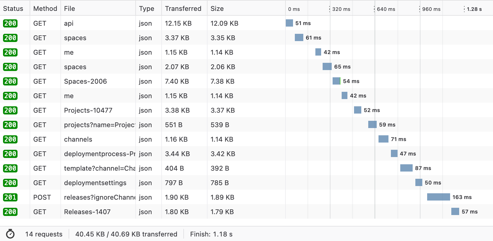
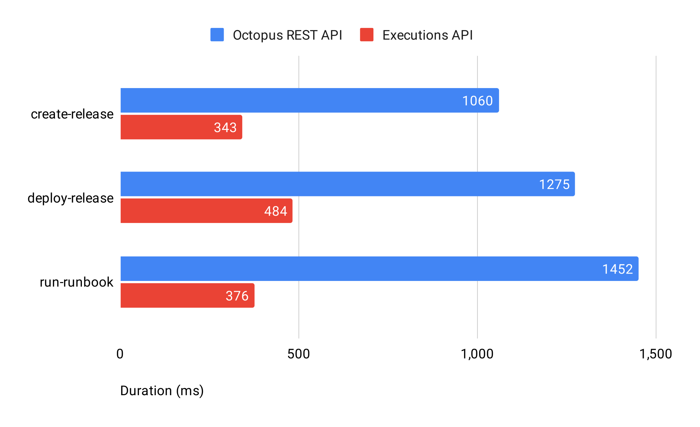

The Executions API is a new set of endpoints that dramatically improves the performance of operations like deployments, release creation, and runbook execution. We designed and added these endpoints as part of the [Octopus 2022 Q3 release](https://octopus.com/blog/octopus-release-2022-q3) after a review of these operations revealed several areas for improvement. The result is significantly better performance for these operations, for better scalability when conducting deployments.

In this post, I dive into why we created the Executions API and how it enhances performance and developer experience. 

## Measuring network performance with the Octopus CLI

Earlier this year, a small number of customers let us know about an issue that could be improved with their deployments. They noticed a great deal of network traffic between their build environment and the Octopus REST API. We wanted to improve performance by understanding precisely what was happening.

Our investigation began by measuring the network traffic generated by the Octopus CLI to establish a baseline. The Octopus CLI is used extensively in automation scenarios involving Azure Pipelines, Buildkite, GitHub Actions, Jenkins, and TeamCity. The Octopus CLI is relied on to create and deploy releases, push build information and packages, and run runbooks. These operations target the Octopus REST API to perform work.

We ran a series of tests involving 3 Octopus CLI operations:

- `create-release`
- `deploy-release` 
- `run-runbook` 

We traced the network traffic sent between the Octopus CLI and the Octopus REST API and derived a summary of their network profiles:

| Operation      	| # Reqs 	| Duration 	| Request (Body) 	| Response (Body) 	|
|----------------	|------	|--------	|--------------	|---------------	|
| `create-release` 	|   17   	|  1060 ms 	|     8.1 kB     	|     96.4 kB     	|
| `deploy-release` 	|   18   	|  1275 ms 	|     8.7 kB     	|     105.6 kB    	|
| `run-runbook`    	|   14   	|  1452 ms 	|     6.9 kB     	|      90 kB      	|

17 HTTP requests to support a command like `create-release` is quite a chatty conversation indeed! An examination of the `create-release` command in the Octopus CLI revealed the following HTTP requests being issued against the Octopus REST API:

```yaml
 1  200  CONNECT  /   
 2  200  GET      /api
 3  200  GET      /api
 4  200  GET      /api
 5  200  GET      /api/spaces
 6  200  GET      /api
 7  200  GET      /api/users/me
 8  200  GET      /api/users/{id}/spaces
 9  200  GET      /api/{id}
10  200  GET      /api/users/me
11  200  GET      /api/{id}/projects/projects?name={name}
12  200  GET      /api/{id}/projects/projects/{id}/channels
13  200  GET      /api/{id}/deploymentprocesses/{id}
14  200  GET      /api/{id}/projects/{id}/deploymentprocesses/template?channel={id}
15  200  GET      /api/{id}/projects/{id}/deploymentsettings
16  201  POST     /api/{id}/releases?{ignore-channel-rules}
17  200  GET      /api/{id}/releases/{id}
```

The HTTP POST on line 16 is the HTTP request responsible for creating a release. Most of the HTTP requests before it are built into the Octopus CLI to qualify resource identifiers (i.e. what’s the ID of project, “OctoPets”?). This also represents a happy path; more network traffic can be involved if exceptions and/or errors are encountered and a resolution is required. To make matters worse, these HTTP requests are made sequentially:



These operations impose data inspection and decision tree execution in the Octopus REST API. This scenario was made worse if a release involved distinct package versions, which may have executed additional service operations. All of this network traffic resulted in more load, hurting our scalability. 

We needed a better solution. We began work in 2022 Q2 to establish a new set of service endpoints collectively known as the Executions API. These APIs greatly reduce the amount of network traffic sent between the Octopus REST API and API clients such as the Octopus CLI.

## Introducing the Executions API

The Executions API consists of the following operations and routes:

| Operation             	|                       Route                      	|
|-----------------------	|------------------------------------------------	|
| `create-release`        	| `/api/{space-id}/releases/create/v1`             	|
| `run-runbook`           	| `/api/{space-id}/runbook-runs/create/v1`           	|
| `tenanted-deployment`   	| `/api/{space-id}/deployments/create/tenanted/v1`   	|
| `untenanted-deployment` 	| `/api/{space-id}/deployments/create/untenanted/v1` 	|

These APIs incorporate all of the “heavy-lifting” performed by the Octopus CLI. Not only does this reduce the network traffic, it also moves this work closer to the data. The result is that the Executions API is 3x faster than the collective calls represented through the Octopus REST API:



## A better developer experience with the Executions API

In addition to addressing performance issues, we wanted the Executions API to provide a great developer experience. We accomplished this by:

1. Incorporating versioning to all routes
2. Incorporating versioning to all messages
3. Applying camel case to the message schema
4. Applying resource names (whenever possible) to the message schema

Incorporating a versioning strategy to the Executions API was strategically important. We know APIs can live for a long time and need to evolve. Applying versions to routes and messages provides a path for us to incorporate changes in our API client libraries and existing integrations.

Camel casing of keys in the message schema provides a better developer experience because it aligns with customer expectations:

```YAML
{
  "channelName": "Default",
  "gitRef": "refs/heads/main",
  "projectName": "OctoPetShop",
  "releaseVersion": "1.2.3",
  "spaceId": "Spaces-2006",
  "spaceIdOrName": "Pattern - Tenants"
}
```

With the Executions API, you can specify names instead of IDs (whenever possible) for resources in the message payload. This saves you performing lookups, for a better developer experience overall.

## What's next?

The Executions API dramatically improves the performance of operations like deployments, release creation, and runbook execution, and is available for customers running [Octopus Deploy 2022.3](https://octopus.com/downloads/). 

Our next step is to incorporate them into our existing integrations and tools. Work has started to include the Executions API with the new Octopus CLI. You should notice significantly improved deployment times when using the new Octopus CLI in conjunction with the Executions API.

Happy deployments!
