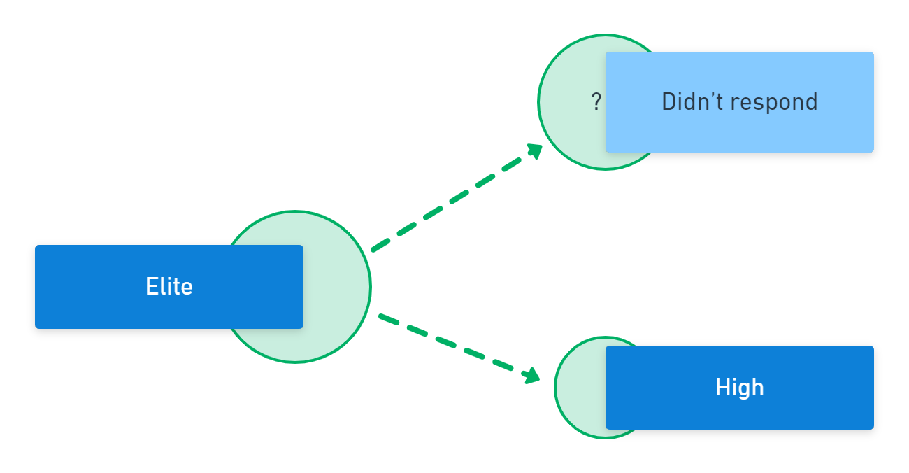

This year, the Accelerate State of DevOps Report contained a few surprises. One of these was a change to the traditional performance clusters. The report also introduced a new way to group organizations using an extra dimension.

This post introduces you to the original performance clusters, explains this year's changes, and describes how you can use the new groups.

## Previous changes

Some previous adjustments to the report have a bearing on the changes that emerged this year. In past reports, DORA (DevOps Research and Assessment) researchers used 4 key metrics to predict the performance of an organization:

 - Throughput

 1. Deployment frequency
 1. Lead time for changes

 - Stability

 3. Change failure rate
 3. Mean time to recovery

In 2018, DORA added a new metric for *availability*. They later changed this to *reliability*. You could measure software delivery performance with the original 4 metrics, but using all 5 lets you measure software delivery *and operational* performance, often shortened to *SDO performance*.

Performing well against all 5 measures drives organizational performance. The organization is more likely to achieve its goals where teams excel in these metrics.

## Clusters

A cluster is a group of data whose members are more similar to each other than they are to items in another group. This is useful in the State of DevOps report as it allows many organizations to be arranged methodically for comparison.

The research team uses hierarchical clustering to discover the performance groups in the State of DevOps report. This technique doesn't define clusters in advance but lets them emerge from the data.

Researchers test hypotheses using clusters. For example, by grouping organizations based on their deployment frequency, they can see that organizations that deploy more often are more likely to achieve their goals. Each time the researchers repeat the analysis on a different sample, they can test the validity of the hypothesis. This is how we increase our confidence in the practices that drive performance.

## Software delivery performance clusters

If you've followed the State of DevOps Report for a while, you'll be familiar with the software delivery performance clusters. Each group represents a different level of performance against throughput and stability metrics. This usually results in four clusters.

| Performance level | Lead time      | Deployment frequency           | Change failure rate | Mean time to resolve |
|-------------------|----------------|--------------------------------|---------------------|----------------------|
| Elite             | < 1 hour       | Multiple times per day         | 0-15%               | < 1 hour             |
| High              | 1 day - 1 week | Weekly to monthly              | 16-30%              | < 1 day              |
| Medium            | 1-6 months     | Monthly to biannually          | 16-30%              | 1 day - 1 week       |
| Low               | > 6 months     | Fewer than once every 6 months | 16-30%              | > 6 months           |

Organizations can compare their software delivery performance to the clusters based on throughput and stability metrics and identify potential improvement areas.

### How Software delivery clusters changed in 2022

The most apparent change to the clusters in 2022 is that there are only 3 performance groups, not 4. The removal of the elite performance group is described in more detail later, but let's first consider the changes to the other clusters as they are just as surprising.

#### The low-performance group

You'll find the performance of the lowest cluster has improved across 3 metrics, with lead time and deployment frequency matching last year's medium performance group. The mean time to resolve has also improved by more than 6x. However, the change failure rate has increased.

| Performance level | Lead time      | Deployment frequency           | Change failure rate | Mean time to resolve |
|-------------------|----------------|--------------------------------|---------------------|----------------------|
| 2021 Medium       | **1-6 months** | **Monthly to biannually**      | 16-30%              | 1 day - 1 week       |
| 2021 Low          | > 6 months     | Fewer than once every 6 months | 16-30%              | > 6 months           |
| Low (new)         | 1-6 months     | Monthly to biannually          | **46-60%**          | **1 week - 1 month** |

#### The medium-performance group

The medium-performance group has improved against lead time and deployment frequency, matching last year's high-performance group for these metrics. They have also improved their mean time to resolve and kept the same change failure rates.

| Performance level | Lead time             | Deployment frequency  | Change failure rate | Mean time to resolve |
|-------------------|-----------------------|-----------------------|---------------------|----------------------|
| 2021 High         | 1 day - 1 week        | **Weekly to monthly** | **16-30%**          | < 1 day              |
| 2021 Medium       | 1-6 months            | Monthly to biannually | **16-30%**          | **1 day - 1 week**   |
| Medium (new)      | **Weekly to monthly** | **Weekly to monthly** | 16-30%              | 1 day - 1 week       |

#### The high-performance group

The high-performance group merges the performance of last year's high and elite clusters.

| Performance level | Lead time          | Deployment frequency       | Change failure rate | Mean time to resolve |
|-------------------|--------------------|----------------------------|---------------------|----------------------|
| 2021 Elite        | < 1 hour           | **Multiple times per day** | **0-15%**           | < 1 hour             |
| 2021 High         | **1 day - 1 week** | Weekly to monthly          | 16-30%              | **< 1 day**          |
| High (new)        | 1 day - 1 week     | Multiple times per day     | 0-15%               | < 1 day              |

#### The elite performance group

Only 3 cluters emerged in 2022, so there is no elite-performance group this year. There are two explanations for this:

1. The elite respondents in 2022 have been absorbed into the improved high-performance cluster.
2. The demographic profile is different this year, compared to previous years

In previous years, many respondents had been in software delivery for a decade or more. In 2022 the proportion of respondents with more than 10 years of experience fell by half. The change seems less surprising as most respondents have less experience than those answering the surveys in prior years.

While you can see the clear change in demographics, what isn't known is whether this makes the sample more or less representative of the software development industry. However, as an individual looking at the insights, you can now think about how the level of experience in your team might affect your performance. You may be more likely to be an elite performer if your team has more members with a decade or more of software development experience.

Removing the elite performance category doesn't mean these organizations gave up software development. It tells us that this year's respondents had less experience overall and performed less well against the throughput and stability metrics.

Despite dramatic changes, one thing that remains the same is the gap between high and low performers. The report still shows that software delivery performance predicts organizational outcomes.

### Software delivery performance summary

In the chart below, you'll find a comparison of 2021 and 2022. The performance axis shows how the clusters moved. The circles indicate each cluster's size.

You can draw some conclusions from this chart, such as the high-performance group has fewer organizations but performs better. Although the medium cluster is much larger, it performs better than last year, too.

Further research will be needed to understand the cause of the changes to clusters, but it is likely to relate to a demographic shift in respondents.

## The SDO performance clusters

The new clusters for SDO performance use all 5 metrics for throughput, stability, and operational performance:

 - Throughput

  1. Deployment frequency
  2. Lead time for changes

 - Stability

  3. Change failure rate
  3. Mean time to recovery

- Operational performance

  5. Reliability

The reliability metric captures how often the team achieves its reliability targets. Each group's label suggests a scenario where you might expect the performance level. For example, the "starting" cluster exhibits performance you'd expect from a team starting out with modest performance against each dimension. In the early stages of development, the team may be focused more on innovation than reliability.

Here are the SDO performance clusters:

| Cluster  | Lead time        | Deployment frequency       | Failure rate | MTTR           | Reliability   |
|----------|------------------|----------------------------|--------------|----------------|---------------|
| Starting | 1 week - 1 month | Weekly or monthly          | **31-45%**   | 1-7 days       | **Sometimes** |
| Flowing  | < 1 day          | On demand                  | 0-15%        | < 1 hour       | Usually       |
| Slowing  | 1 week - 1 month | Weekly or monthly          | 0-15%        | < 1 day        | Usually       |
| Retiring | **1-6 months**   | **Monthly or bi-annually** | **46-60%**   | **1-6 months** | Usually       |

These groups are more descriptive than the software delivery performance clusters. Rather than striving for high performance across all products and teams, an organization can take a more balanced approach. An organization can plan for different performance levels from teams working on their core product and others working on a new product.

This approach isn't without its hazards. Many teams remain in the starting group permanently, never resolving the reliability issues that would unlock their software delivery performance. Equally, Not all teams in the retiring cluster are in the process of shutting down a system. The same performance characteristics would be present in an organization where the operations team acts as gatekeepers, preventing changes from moving through the system.

You should view the cluster names as best-fit explanations for deliberate performance choices. You might choose to give up some reliability to encourage risk-taking and innovation on a new product concept. If you don't make intentional choices, you risk inventing a narrative to explain poor performance. Future research may test how accurate the cluster names are.

The most practical application of the new clusters is to use them to focus your efforts on your core software systems. The systems you sell and the line-of-business applications that give you a competitive advantage are the ones to bring into a flowing state. Never classify these systems as *slowing*, and only designate a system as *retiring* when you have an active plan for its withdrawal or replacement.

Teams in the flowing state more commonly use the capabilities of the DevOps structural equation model, such as:

    - Deployment automation
    - Loosely coupled architectures
    - [Continuous Delivery](https://octopus.com/devops/continuous-delivery/)
    - Version control
    - Flexible work arrangements

While some organizations achieve adequate performance without flowing software delivery and operations, they do so at greater cost with more burnout, unplanned work, and lower change rates.

## Conclusion

The disappearance of the elite performance cluster may be related to the change in demographics.

The new SDO performance clusters need further research and analysis but provide an interesting way to focus continuous improvement efforts if your organization has many software systems under development.

The real measures are organization-wide, real-world performance against your commercial and non-commercial goals.

## Further reading

- [The 2022 State of DevOps Report](https://cloud.google.com/devops/state-of-devops/)
- [The DevOps Engineer's handbook](https://octopus.com/devops/)
- [White Paper: Measuring Continuous Delivery](https://octopus.com/whitepapers/lv-measuring-continuous-delivery-and-devops)

Happy deployments!