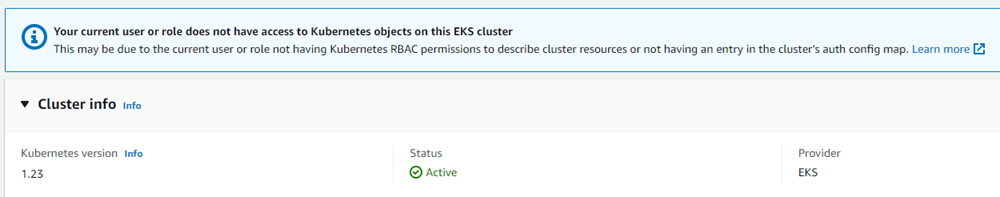
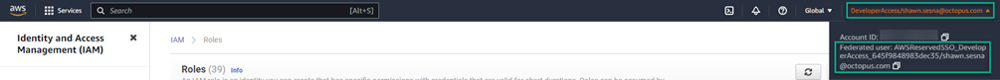
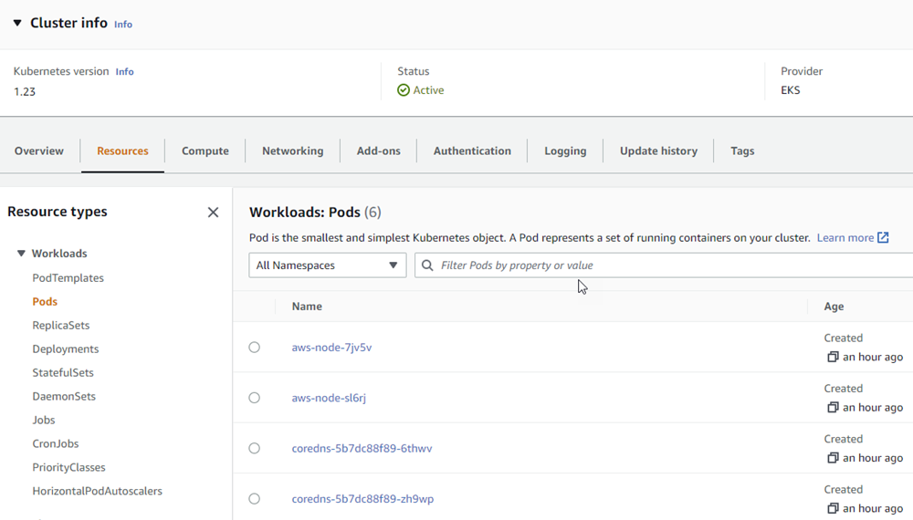
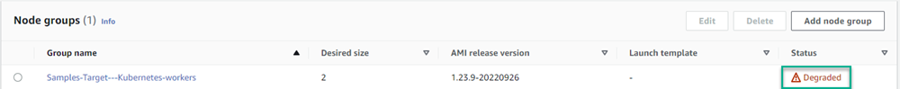
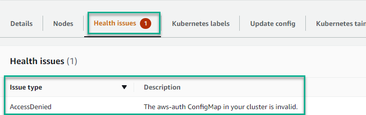

If you've worked with the Elastic Kubernetes Service (EKS) on AWS, chances are you've experienced the frustration of permissions.  When you're not the creator of the EKS cluster, the only information you can see in the AWS console is the cluster's overall status. 

There are many tutorials on adding additional user accounts; however, there isn't a definitive walk-through showing you how to add a federated user account. 

In this post, I walk you through granting a federated user account to an EKS cluster.

## What you'll learn

I decided to write this post after working with EKS on our [Samples](https://samples.octopus.app) instance. I needed to see the details of a deployment resource on the cluster created by a project.  The project used a [runbook](https://octopus.com/docs/runbooks) to create the EKS cluster using an AWS account. Despite having full access to our AWS account, I couldn't see the cluster's details. To further complicate things, I logged into the AWS console using a federated user account.  While researching this topic, I found some tutorials, but nothing covered the entire process.  

In this walk-through, you learn how to:

- Create an EKS cluster using a different account
- Find the information for the federated account(s)
- Add the federated account to the cluster

### Creating an EKS cluster

When granting a federated user account to an EKS cluster, problems arise if you're not the creator of the EKS cluster. A different user needs to first create the cluster. 

In my case, I created a user account with sufficient permissions to create EKS clusters. I added the [AWS account](https://octopus.com/docs/infrastructure/accounts/aws) in Octopus and used the following steps in a runbook to create a cluster:

- **Create EKS Cluster**
- **Add cluster as deployment target**

I'm using an Octopus Deploy runbook, but the **Create EKS Cluster** section isn't Octopus-specific as it uses the AWS CLI to create the cluster.

#### Create EKS cluster

This step uses the **Run an AWS CLI Script** step in Octopus Deploy to create the EKS cluster.  

The following variables are required by the CLI to create the cluster:

- ClusterName
- Region
- EKS Role ARN
- EKS Node Role ARN
- Subnet IDs (I use 2)
- Security Group ID

This post assumes you know enough about AWS to know what those values need to be. The following script uses the CLI to first create the EKS cluster then the nodegroup. After those activities are complete, it stores the URL endpoint for the cluster in an [output variable](https://octopus.com/docs/projects/variables/output-variables) for use in subsequent steps.  

```powershell
# Get variables
$clusterName = $OctopusParameters['AWS.Kubernetes.Cluster.Name']
$region = $OctopusParameters['AWS.Region.Name']
$eksRoleArn = $OctopusParameters['AWS.EKS.Role.Arn']
$nodeRoleArn = $OctopusParameters['AWS.Node.Role.Arn']
$subnet1Id = $OctopusParameters['AWS.Network.Subnet1.Id']
$subnet2Id = $OctopusParameters['AWS.Network.Subnet2.Id']
$securityGroupId = $OctopusParameters['AWS.Network.SecurityGroup.Id']


# Create EKS cluster
$eksCluster = aws eks create-cluster --name $clusterName --role-arn $eksRoleArn --resources-vpc-config subnetIds=$subnet1Id,$subnet2Id,securityGroupIds=$securityGroupId
$eksCluster = $eksCluster | ConvertFrom-JSON

Write-Host "Waiting for cluster to be done creating..."
while ($eksCluster.Cluster.Status -eq "CREATING")
{
	# Wait for cluster to be done creating
	$eksCluster = aws eks describe-cluster --name $clusterName
	$eksCluster = $eksCluster | ConvertFrom-JSON
}


Write-Host "Status of cluster: $($eksCluster.Cluster.Status)" 

Write-Host "Creating node group..."
aws eks create-nodegroup --cluster-name $clusterName --nodegroup-name "$clusterName-workers" --subnets $subnet1Id $subnet2Id --instance-types "t3.medium" --node-role $nodeRoleArn --remote-access ec2SshKey="<Your EC2 keypair>"

Set-OctopusVariable -name "EKSURL" -value $eksCluster.Cluster.Endpoint
```

#### Add cluster as deployment target

This steps adds the newly created cluster as a target in Octopus Deploy.  If you don't use Octopus, you can go to the next section, [Find the information for the federated account(s)](#info-federated).  

This step uses the [New-OctopusKubernetesTarget](https://octopus.com/docs/infrastructure/deployment-targets/dynamic-infrastructure/kubernetes-target) cmdlet in a **Run a Script** step to add the newly-created EKS cluster to Octopus Deploy.  The `$eksUrl` variable retrieves its value from the output variable of the previous step.

```powershell
# Get the variables
$clusterName = $OctopusParameters['AWS.Kubernetes.Cluster.Name']
$region = $OctopusParameters['AWS.Region.Name']
$eksUrl = $OctopusParameters['Octopus.Action[Create EKS Cluster].Output.EKSURL']

# Add new Kubernetes cluster target
New-OctopusKubernetesTarget -Name "Samples-#{Octopus.Space.Name | Replace " "}-EKS" -clusterName $clusterName -octopusRoles "PetClinic,EKS" -octopusAccountIdOrName "#{AWS.Account.Name}" -namespace "default" -skipTlsVerification $true -clusterUrl $eksUrl
```

### Find the information for the federated account(s) {#info-federated}

Navigating to the cluster in the AWS console, you see the following message:

`Your current user or role does not have access to Kubernetes objects on this EKS cluster.  This may be due to the current user or role not having Kubernetes RBAC permissions to describe cluster resources or not having an entry in the cluster’s auth config map.`



You can see the cluster is active and healthy, but that's all.

The solution is adding your user account to the `aws-auth` config map.  However, the process is different with a federated account as they don't show up in the **IAM Users** section of the AWS console.  

Federated users are mapped to an **AWS Role**, so you need to identify which role your account is mapped to.  Thankfully, this is easily done by clicking your account in the upper right of the AWS console. This displays the role your federated account is mapped to.  

In this case, you can see my account is mapped to the `AWSReservedSSO_DeveloperAccess_645f9848983dec35` role.



### Add the federated account to the cluster

Before adding the federated user(s), you must first get the current value of the `aws-auth` config map.  This can be done using a `kubectl` command, `kubectl get configmap/aws-auth -n kube-system`.  

To make working with his file easier, I output the command to JSON and write it to a file.  This lets me deserialize the JSON into a PowerShell object.

```powershell
# Get current aws-auth configmap
kubectl get configmap/aws-auth -n kube-system -o json | Set-Content aws-auth.json

# Load the JSON as an object
$jsonPayload = (Get-Content aws-auth.json | Out-String | ConvertFrom-Json)
```

Once loaded into the `$jsonPayload` variable, you can access relevant data by navigating to the `.data.mapRoles` property of the variable.  

By default, the value of `mapRoles` should look something like this:

:::info
Despite the object being deserialized from JSON into an PowerShell object, the `mapRoles` section is still YAML.
:::

```yaml
- groups: 
  - system:bootstrappers 
  - system:nodes 
  rolearn: arn:aws:iam::<AWS account ID>:role/<Role used to create cluster>
  username: system:node:{{EC2PrivateDNSName}}
```

To add your federated user(s), append the following:

```yaml
- rolearn: arn:aws:iam:<AWS account ID>:role/<role name>
  username: "{{SessionName}}"
  groups:
    - system:masters
```

The whole section should look similar to this:

```yaml
- rolearn: arn:aws:iam:<AWS account ID>:role/AWSReservedSSO_DeveloperAccess_645f9848983dec35
  username: "{{SessionName}}"
  groups:
    - system:masters
- groups: 
  - system:bootstrappers 
  - system:nodes 
  rolearn: arn:aws:iam::<AWS account ID>:role/<Role used to create cluster>
  username: system:node:{{EC2PrivateDNSName}}
```

The last step is replacing the existing `aws-auth` config map with your altered version.  Do this using the `replace` command for the kubectl CLI.  Because I did this in an Octopus Deploy runbook, I used the following PowerShell for this alteration:

```powershell
# Get current aws-auth configmap
kubectl get configmap/aws-auth -n kube-system -o json | Set-Content aws-auth.json

# Load the JSON as an object
$jsonPayload = (Get-Content aws-auth.json | Out-String | ConvertFrom-Json)

# Create federated users rolearn piece
$federatedUsers = 
@"
`n
- rolearn: arn:aws:iam::<AWS Account ID>:role/AWSReservedSSO_DeveloperAccess_645f9848983dec35
  username: "{{SessionName}}"
  groups:
    - system:masters
- groups:
    - system:bootstrappers 
    - system:nodes
  username: system:node:{{EC2PrivateDNSName}} 
  rolearn: arn:aws:iam::<Your AWS Account ID>:role/<Role used to create cluster>
"@

# Add federated users to maproles
$jsonPayload.data.mapRoles = $federatedUsers

# Write the new information to file
Set-Content aws-auth.json -Value ($jsonPayload | ConvertTo-Json -depth 10)

# Replace the config map
kubectl replace -n kube-system -f aws-auth.json
```

With the federated user accounts added, you can now see the details of the cluster:



## Troubleshooting

After applying the update, you might notice the `Node group` in a degraded state:



If you notice this, check the **Health issues** of the node group.  If the **Issue type** is **AccessDenied** with a description of `The aws-auth ConfigMap in your cluster is invalid.`, ensure you encased the `{{SessionName}}` part of the federated account YAML in double quotes:

```yaml
- rolearn: arn:aws:iam::<Your AWS Account ID>:role/AWSReservedSSO_DeveloperAccess_645f9848983dec35
  username: "{{SessionName}}"
  groups:
    - system:masters
```



The update may take around 10 minutes, but the health issue should resolve.

## Conclusion

I spent a lot of time searching and gathering what was necessary to add a federated user account to an EKS cluster. The issue with `{{SessionName}}` needing to be encased in double quotes was particularly time-consuming to solve.  I hope this post saves you time by walking you through the process.

Happy deployments! 
