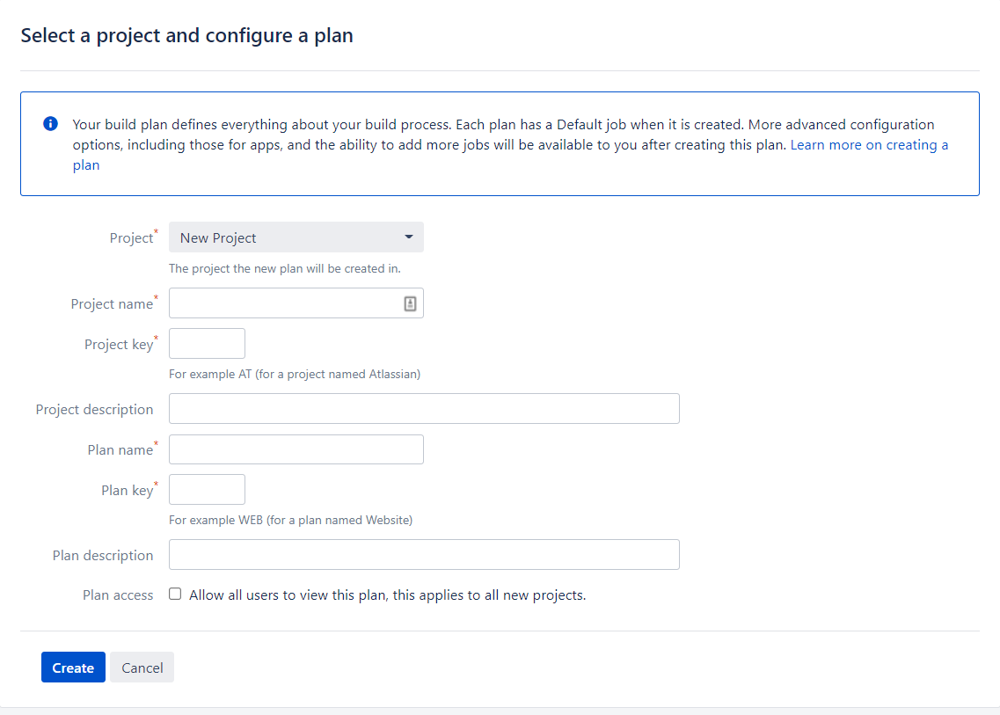

Continuous Integration (CI) servers are an important step in the CI/CD process. CI servers take a code repository, build it, and push it to a central location where a continuous delivery (CD) tool like Octopus can take over and manage deployments. 

Bamboo is a CI server developed by Atlassian that automates the building and testing of software applications. If you're beginning your CI/CD journey, it's helpful to begin with a simple use case, with a visible result. 

In this post, you build and push a software artifact where Octopus can take over and deploy it to a target environment.

This post takes you through:

- Installing Bamboo on a Windows Server
- Configuring a Bamboo project
- Configuring a Bamboo plan to build and push a Docker container to a container registry
- Running and viewing the container image

## Prerequisites

To follow this post, you need the following software and accounts:

- [Java 8 or 11](https://confluence.atlassian.com/bamboo/supported-platforms-289276764.html)
- [Docker](https://docs.docker.com/desktop/install/windows-install/)
- [Git](https://git-scm.com/book/en/v2/Getting-Started-Installing-Git) 
- A Github account
- DockerHub account

## Installing Bamboo on a Windows Server

To install Bamboo:

- Sign up for a free trial which gives you an activation key
- [Download the latest release](https://www.atlassian.com/software/bamboo/download)
- Run the install executable
- Set the install location to a directory you can access, such as C:\Users\Username\Documents. Setting it to the Default location of C:\Program Files may result in permission errors.
- Set the Bamboo home directory, make sure this is a separate directory from the install location with a folder name `Bamboo-home`.

Once the install finishes, run the Bamboo server:

- Open terminal and navigate to the Bamboo installation directory
- Run bin\start-bamboo.bat
- The server should be started at http://localhost:8085/

## Setting up users

In the start up screen, you're asked to set up an admin account. Fill out the details and store the details in a password manager. If you misplace your password, you need to run through a recovery process.

## Agents

Agents are the Workers that execute workloads in Bamboo. Because you installed the pre-requisite technology, you can use the local machine as an agent for testing purposes. To set up a local agent:

- In the Bamboo dashboard, go to the Settings icon and agents
- Go to **Add local agent** and give it a name
- Click **Add**

## Setting up the project and plan

Bamboo organizes your workflow into projects and plans. A project can contain multiple plans and each plan is a process that executes a series of tasks. To get started, set up your first project and plan:

- In the home menu, click **Create** and **Create Plan** 
- Fill out the name of your project and plan

In the next screen, check the box that says **Link new repository**.

### Connect to the Octopus underwater app repository

This post uses the [Octopus underwater app](https://github.com/OctopusSamples/octopus-underwater-app). 

To use this repository:

- Fork it into your own GitHub account 
- In the password settings of GitHub, use a [personal access token](https://docs.github.com/en/authentication/keeping-your-account-and-data-secure/creating-a-personal-access-token) to grant Bamboo access to repositories under your GitHub account
- Select the main branch
- Test the connection to make sure Bamboo connects to this repository
- Click **Save and continue**

### Configuring the job

You're now on the **Configure Job** screen. Here you configure the tasks that the plan runs to execute your job. Bamboo provides a suite of task steps that you can select from. These tasks execute a certain step in the CI pathway, such as checkout, build, pull, push. 

There's a source code checkout task pre-filled for you. This checks out the linked GitHub repository into Bamboo.

- Leave the isolated build as **Agent environment**. This uses the local agent you set up earlier.

First, add the Build Docker task:

- Click **Add Task** and search for `Docker`
- Set the command to `Build a Docker Image`
- Set the repository to be [Your DockerHub Username]/[The tag of your image]
- Check **Use an existing Dockerfile located in context path**
- Click **Save**

Now, add the Push Docker task:

- Click on **Add task** and search for `Docker`
- Set the command to `Push a Docker Image`
- Set the repository to be [Your DockerHub Username]/[The tag of your image]
- Check **Use the agent's native credentials**
- Click **Save**
- Click **Create**

The plan starts to execute by checking out the code, building the Docker image, and pushing the built image to DockerHub

After it's complete, you see a green tick box to indicate the plan completed successfully.

Navigate to your DockerHub account to confirm the image has been pushed to the repository.

## Deploy step

Now the image is on DockerHub, any CD tool can use that to deploy it to locally or to a cloud platform. We have guides explaining how to do this for: 

- [Azure](https://octopus.com/blog/deploying-java-app-docker-google-azure)
- [AWS through GithubActions](https://octopus.com/blog/multi-environment-deployments-github-actions)
- [AWS through Jenkins](https://octopus.com/blog/multi-environment-deployments-jenkins).

To view the application locally:

- docker pull [Your DockerHub Username]/[The tag of your image]
- docker run -p 8080:8080 [Your DockerHub Username]/[The tag of your image]
- Go to `http://localhost:8080/`

You see the Octopus underwater app where you can learn more about CI/CD and Octopus.

## Conclusion

CI servers are an important part of the CI/CD process, and you can use many different CI servers with Octopus Deploy to complete your deployments. Bamboo by Atlassian lets you build and push Docker images to Docker repositories. 

In this post, you learnt how to install Bamboo and set up a project and plan to build and push the Octopus underwater app. This is a simple example to get started, but there are many more ways to use Bamboo. 

If you're interested in more CI server resources, check out our [series on CI servers](https://octopus.com/blog/tag/CI%20Series) where we focussed on Jenkins, GitHub Actions, and fundamental CI concepts.

Happy deployments!