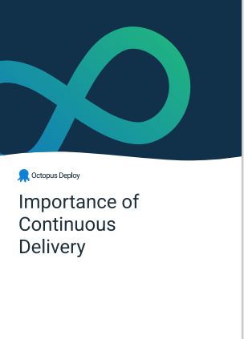
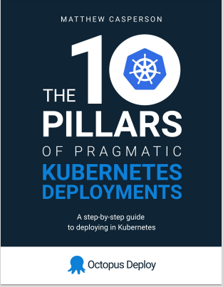

Cloud-native technologies let companies gain a competitive advantage through scalability, economies of scale, and global reach. Migrating to the cloud and modernizing systems are important issues for most IT professionals. Despite the clear need, there are challenges knowing where to start.

At Octopus, we can help by providing you with resources for getting started with cloud migration. These resources are a mix of Octopus-developed tools, white papers, guides, and external reports. This list of resources exposes you to a wide variety of sources so you have an informed opinion about the benefits of the cloud, with practical tools to get started.

## White papers

As a cloud-native dedicated continuous delivery tool, we want to help our users understand Continuous Delivery and cloud-native technologies. We wrote 4 white papers to help educate you and give you actionable steps to start your journey to the cloud.

### Modernize your apps by moving to cloud-native

*Modernize your apps by moving to cloud-native* is a white paper that provides an argument for migrating to the cloud and the first steps to take. It contains researched-backed reports and distills cloud migration into a series of phases: 

- Strategy
- Implementation
- Operation

The paper provides straightforward, actionable steps your company can take when migrating to the cloud.

[Read the white paper, *Modernize your apps by moving to cloud-native*](link to PDF here). 

### The importance of Continuous Delivery

*The Importance of Continuous Delivery* white paper is a deep-dive into the best practice principles and benefits of Continuous Delivery's technical capabilities, and how they're fundamental to successful DevOps adoption. You'll find case studies and a discussion about the challenges your company may face when implementing Continuous Delivery.

[Read about *The Importance of Continuous Delivery*](https://i.octopus.com/whitepapers/importance-of-cd.pdf[). 

### How to map your deployment pipeline

Your deployment pipeline is the key ingredient for Continuous Delivery (CD). By mapping and improving your deployment pipeline, you can increase the frequency of deployments while reducing your change-related risk. High-performing teams use Continuous Delivery to drive their software delivery and achieve higher levels of organizational performance.

In this paper, will learn how to apply Lean thinking to start from where you are, mapping and improving your deployment pipeline while planning your adoption of the core technical CD practices.

[Read the paper, *How to map your deployment pipeline*](https://i.octopus.com/whitepapers/how-to-map-your-deployment-pipleline.pdf). 

### Measuring Continuous Delivery and DevOps

You might be introducing new practices and capabilities as part of Continuous Delivery and DevOps adoption, or making changes as part of continuous improvement. In either case, you need a way to tell if changes are improving your ability to deliver software and, ideally, if they help your organization achieve its goals.

In this white paper, you find several approaches for measuring your progress. There are statement-based assessments and metric-driven measurements. You can use them at different times or combine them to create a custom view of your organization.

[Read about *Measuring Continuous Delivery and DevOps*](https://i.octopus.com/whitepapers/measuring-continuous-delivery.pdf). 

## Octopus free tools

We know customers want to set up deployment pipelines, but there are common barriers to getting started. Often, you have a repository you want to deploy. To do this, you need to perform scaffolding steps to support the deployment. These steps require knowledge of cloud platforms, containers, image repositories, infrastructure as code (IaC), and more. Not everyone has the time to learn these technologies and just want a simple deployment with a few clicks of a button. To address this, we developed free tools that remove some of the barriers to getting started with modern CI/CD pipelines.

### Octopus Workflow Builder

The [Octopus Workflow Builder](https://octopusworkflowbuilder.octopus.com/#/) was born out of a need to get customers started quickly in a cloud CI/CD workflow. The Octopus Workflow Builder populates a GitHub repository with a sample application built with GitHub Actions workflows and configures a hosted Octopus instance with sample deployment projects, demonstrating best practices such as vulnerability scanning and Infrastructure as Code (IaC).

### Kubernetes YAML generator

When working with Kubernetes, you need to supply a YAML configuration file for your deployments. The [Kubernetes YAML generator](https://k8syaml.com/) is a UI-based tool that lets you quickly generate Kubernetes-compliant YAML code. This code can be pasted directly into the Octopus UI to help you get started quickly with Kubernetes deployments.

You can read our post on [getting started and using the Kubernetes YAML generator](https://octopus.com/blog/octopus-kubernetes-yaml-generator).

## External reports

When validating your cloud-native approach, aligning with the broader cloud community is helpful. To convince senior management to migrate to the cloud, you need research-backed statistics to support your argument. External reports provide surveys of cloud usage, best practices, and use cases to back up your strategies and gain momentum for cloud migration in your company.

### State of the cloud reports

State of the cloud reports provide a snapshot of the significant trends toward cloud-native. These reports show how cloud use has increased, and that it's forecast to keep growing. Companies need to modernize their systems and workforce to maintain a competitive advantage.

- [HashiCorp 2022 State of Cloud Strategy Survey](https://www.hashicorp.com/state-of-the-cloud)
- [Flexera State of the Cloud Report 2022](https://resources.flexera.com/web/pdf/Flexera-State-of-the-Cloud-Report-2022.pdf)
- [Konveyor State of Application Modernization Report 2022](https://www.konveyor.io/modernization-report/?utm_source=thenewstack&utm_medium=website&utm_campaign=platform)
- [Foundary Cloud Computing Study 2022](https://resources.foundryco.com/download/cloud-computing-executive-summary)

### Best-practice reports

To migrate to the cloud, it's helpful to understand the best practices that major cloud providers used themselves to become cloud-native. These reports show that planning is essential, and also discuss the implementation and operational concerns companies face. When moving towards cloud-native, hybrid approaches are recommended to bridge the gap between traditional systems and complete cloud-native solutions.

- [AWS - 8 Best Practices to Make Your
Cloud Migration a Success](https://pages.awscloud.com/rs/112-TZM-766/images/AWS_Migration_8_Best_Practices_ebook_final.pdf)
- [Microsoft - How to migrate and modernize](https://azure.microsoft.com/en-au/migration/migration-journey/#how-to-migrate)
- [Migration to Google Cloud: Getting started](https://cloud.google.com/architecture/migration-to-gcp-getting-started)

## Octopus supporting resources

At Octopus, we've written posts and guides to help you with cloud migration. We focus on educating you on the best practices of cloud-native deployments and giving you practical steps to get started.

### 10 pillars of pragmatic Kubernetes deployments

Kubernetes is a popular container orchestration tool. It's open source and works on all the major cloud platforms. Despite its popularity, it can be intimidating to learn. To help you use Kubernetes, we wrote an ebook on getting started with Kubernetes, called [The 10 pillars of pragmatic Kubernetes deployments](https://github.com/OctopusDeploy/TenPillarsK8s/releases/tag/0.1.269-main). 

The 10 pillars speak to the needs of modern DevOps teams, always being asked to deliver more in less time. By understanding the value of each pillar, and learning practical implementations, DevOps teams can meet these challenges head-on.

The guide contains practical steps you can follow in an Octopus environment to set up your Kubernetes deployments. 

To support this guide, we also wrote an [ultimate guide to Kubernetes microservice deployments](https://octopus.com/blog/ultimate-guide-to-k8s-microservice-deployments).

### The Octopus DevOps Engineer's handbook

The Octopus DevOps Engineer's handbook provides you with a central place to learn about all things DevOps. We provide resources on common questions, definitions, and debates in the field of DevOps. The handbook is a great tool to get up to speed with the latest trends in the DevOps space. 

### More cloud-related blog posts

We've written many posts relevant to cloud-native technologies. Some of these posts are educational, about the benefits of the cloud, and others are instructional, walking you through how to set up a cloud-native workflow:

- [What is cloud orchestration?](https://octopus.com/blog/what-is-cloud-orchestration)
- [Microservices and frameworks](https://octopus.com/blog/microservices-and-frameworks)
- [Monolith versus microservices](https://octopus.com/blog/monoliths-vs-microservices)
- [The benefits of containerization](https://octopus.com/blog/benefits-of-containerization)
- [Containerization - what you need to get started](https://octopus.com/blog/get-started-containers)

We also have an entire [series on Continuous Integration (CI)](https://octopus.com/blog/tag/CI%20Series) which gives practical examples of CI servers working in cloud-native technologies.

## Conclusion

Research and surveys show that cloud technologies have a clear advantage over traditional systems. To help you get started with cloud migration, you can access white papers, free tools, external reports, and Octopus-published posts and guides. These resources aim to help you understand cloud technologies and provide practical tools and steps to start your migration efforts. We hope you find these resources useful on your cloud migration journey.

Happy deployments!