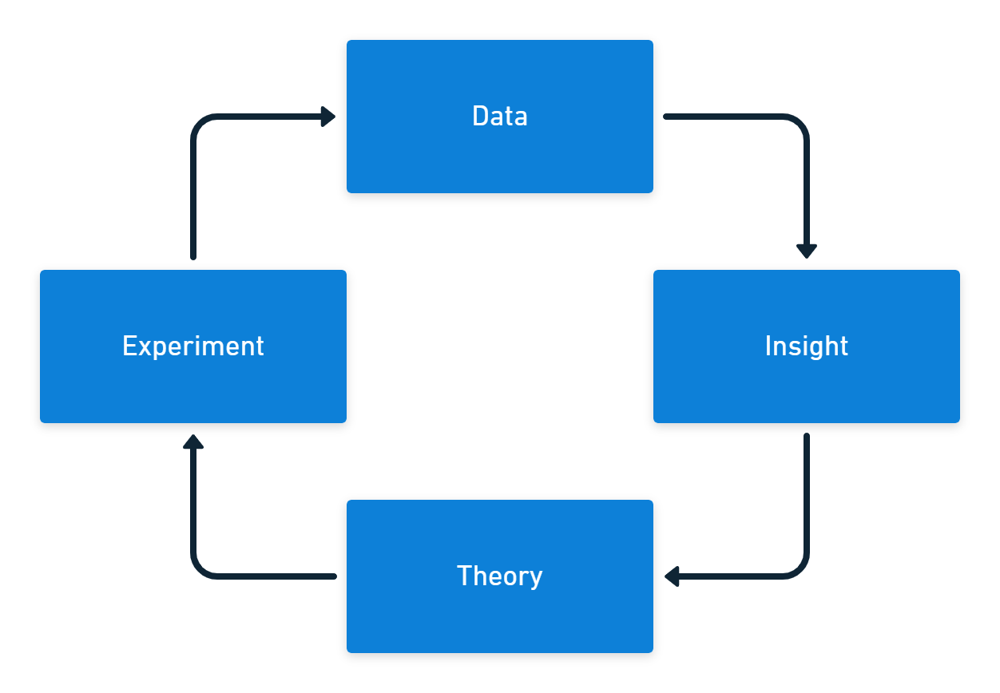

Metrics are crucial to DevOps and Continuous Delivery as part of the process of continuous improvement. However, you must balance collecting and displaying data with being flooded with information. You need to decide what data to collect and what smaller set of data you pay attention to at any time.

:::hint
You can [find out more about CI/CD](https://octopus.com/devops/continuous-delivery/) and [how to get started with Continuous Delivery](https://octopus.com/devops/continuous-delivery/get-started-with-continuous-delivery/) in our [DevOps engineer's handbook](https://octopus.com/devops/).
:::

If your car had a dashboard that displayed every metric it collects through the engine management system, there'd be no space for a windscreen.

Early cars only featured an *ammeter* on their dashboard, which measured the electric current between the battery and voltage regulator. This was important as it told you the charging system was working. There was no speedometer. Cars could only achieve a top speed of 35 miles per hour, and the suspension discouraged traveling at this speed. It wasn't necessary to measure velocity.

In a modern car, no dashboard space is given to an ammeter (though a battery light will illuminate if there's a problem). But, you will find a speedometer in almost every car. The current dashboard design reflects the development of cars and the broader system they operate in. Engines are more powerful, suspension systems are better, roads are generally smoother, and more cars are on the road. Attitudes towards safety have also changed.

Similarly, the metrics you collect and show will change over time as you respond to differences in your team and organization.

As you create and evolve your measurement system, there are some common mistakes you should avoid.

## Ignoring the data

The first problem with metrics is that you expend great effort collecting them, but they're not always used. This happens even in organizations that regularly review the numbers.

Your data needs some process that generates insights. You can turn what you discover from the information into theories you use for experiments. The experiments should then provide new data to start the cycle again.

The only good reason to collect DevOps metrics is to learn more about your work and find ways to improve it. If you collect data *just in case*, the chances are it will be misused or not used at all.

## Activity bias

There are 4 levels of measurement, with activity often being the earliest and easiest to collect. You can usually track activity in near real-time. The result of the activity is not typically available as an output or outcome-based metric until some later date.

| Measurement level    | Software example  | Heating example             |
|----------------------|-------------------|-----------------------------|
| Activity             | Lines of code     | Power consumption           |
| Outputs              | Features per week | Heating element temperature |
| System output        | Lead time         | Room temperature            |
| Outcomes             | User value        | People are comfortable      |

Activity metrics are usually built-in to your existing tools, so they're already available. The problem is not all activity represents progress. Some activities might even reduce output and result in worse outcomes.

You can use activity metrics to predict future changes to outputs and outcomes. To do this, you must continually test the relationship between your activity metrics and your related output or outcome metrics.

If you only measure activity, you get a lot of motion but no progress.

## Tracking too much at once

The number of metrics you collect and display can increase, often rapidly. Before long, you've filled your dashboard with charts, and you don't know what's important and what isn't.

You need to keep your tracked metrics lean, current, and relevant. When a chart is no longer helpful, you should remove it from your dashboard. You should also consider whether the metric still needs to be collected and retire it if you don't have a good reason to track it.

If you already have a dashboard, open it, and for each chart ask, "What would I do differently if this number went up or down?". Revisit this question frequently, deleting any chart where you don't have an answer.

Your metric set should focus on key long-term output and outcome metrics, with dashboards showing short-term metrics across all categories in your current improvement efforts.

## Jumping into tools

Data visualization tools like Microsoft Power BI, Tableau, or Google Data Studio are among the most useful software products you'll have in your organization. Many business tools have a grid or text-based interface, but data tools come stacked with colorful animated charts.

It's easy to be distracted by creating an engaging dashboard. If you don't begin with metric design, you end up with lots of pleasing dashboards that have no impact on your daily work. You need dashboards and charting tools to help you make sense of the information, but design the metrics first.

It's better to start in low-fidelity to collect meaningful metrics. It's okay to start with a simple spreadsheet or even a whiteboard. After you work out which measurements are helpful to your team and organization, start automating the collection and creating slick displays.

If you invest too much time creating a stunning dashboard, you'll find it harder to delete charts when they're no longer required.

## Standardization

Some organizations try to replicate the success of a high-performing team by making other teams follow the same process. This is rarely successful, as each team works on different problems and has different skill levels. Just as the process and practices need to be context-specific, so do the metrics.

You should address metrics as part of your continuous improvement activities. For a team with long lead times, you measure batch size, queue times, and the time work spends in each state. These metrics are unsuitable for a team whose primary problem is quality.

This requires the data, insight, theory, experiment cycle where you look at the information you have about the problem you want to solve, form a theory about what might improve the issue, then run an experiment to test your idea.

The metrics you collect also signal to the team what's important *at the current time*. You often see improvements simply because your metrics communicate that you care about some aspect of software delivery.

## Relying on eyeballs

You should create a simple dashboard to display the metrics you're tracking for experiments. This should be displayed on an information radiator so everyone on the team can see the data.

However, if you only react to data when someone looks at a dashboard, you'll crowd the dashboard with too much information and miss key events. Long-term metrics you keep to track progress over time will seem as important as the short-term metrics you use to improve your software delivery.

The key to resolving the problem of retaining long-term metrics without cluttering your dashboard is to put in place a monitoring and alerting process for the data. Automated alerts should tell you if the metrics cross a threshold, and you could use anomaly detection to tell you if something interesting happened.

With metrics tracked automatically, you can remove them from the dashboard to free up space.

## Rewarding performance

If your team is working to increase their deployment rate, it can be tempting to incentivize them with a reward if they achieve daily deployments. This approach to motivation leads to poor outcomes. A team might let other critical work slip to achieve the goal - not to cheat the system but because you made daily deployments more important than anything else.

In the landmark book [*Punished By Rewards*](https://www.alfiekohn.org/punished-rewards/), Alfie Kohn explains that attempting to manage people with incentives leads to long-term harm for your organization. Hundreds of studies have found that people do worse work when offered rewards.

Using metrics to create a competitive atmosphere, either for individual performance, comparison of different teams, or to gamify the workplace (where you introduce game elements as a form of "fun" competition), all lead to trouble.

Competition conflicts with what you really need in your organization; collaboration. If you work on the assumption that people want to do good work, you'll find you don't need to use rewards or punishments to get them to improve their performance.

## Conclusion

The 5 DORA metrics and the SPACE framework provide pre-built, balanced ways to measure software delivery performance. (There used to be 4 DORA metrics, but an additional *reliability* metric was added.)

A good set of metrics will mix leading indicators to predict performance with lagging indicators that check the accuracy of predictions. Measurements should span activity, output, system output, and outcome categories.

We cover DevOps and Continuous Delivery metrics in detail in our [white paper on measuring Continuous Delivery](https://i.octopus.com/whitepapers/measuring-continuous-delivery.pdf).

Our [DevOps Insights in Octopus](https://octopus.com/blog/octopus-release-2022-q3#devops-insights-better-visibility-and-actionable-dora-metrics-early-access-preview) give you better visibility into your company’s DevOps performance by surfacing insights based on 4 key DORA metrics. These metrics help you qualify the results of your DevOps performance, and gain insights into areas for improvement.

Whatever you measure, you need to constantly refine your metrics to ensure they remain useful to your team and organization. Ideally, the metrics you collect are relevant to a specific experiment you're running to test a theory.

If you use metrics well, you amplify performance and learning as you seek to become one of the elite performers in software delivery.

## Further reading

- [*Punished By Rewards*](https://www.alfiekohn.org/punished-rewards/) - Alfie Kohn. 1993.
- We have a white paper on [Measuring Continuous Delivery](https://i.octopus.com/whitepapers/measuring-continuous-delivery.pdf), which describes different types of metrics and frameworks for measuring DevOps and Continuous Delivery
- You can [find out more on DevOps and Continuous Delivery in our DevOps engineer's handbook](https://octopus.com/devops/)
- Learn more about Octopus Deploy's [DevOps Insights feature](https://octopus.com/docs/insights)

Happy deployments!