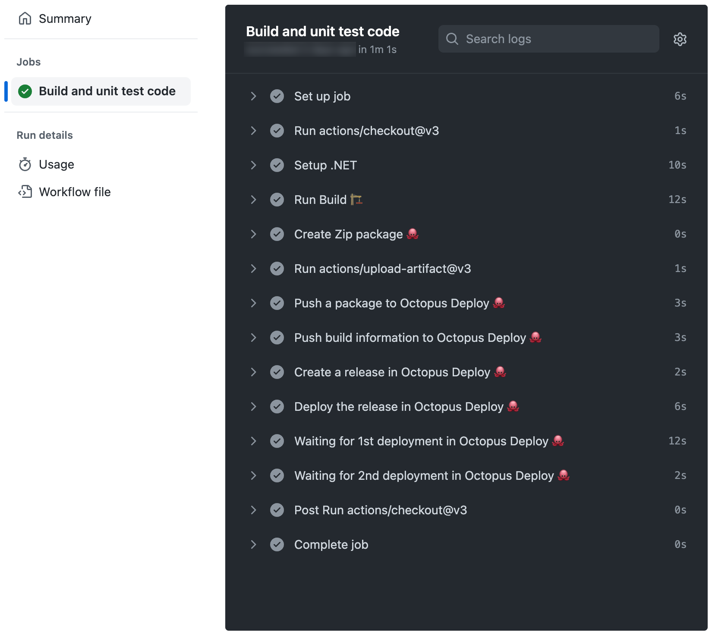

We published our first set of [GitHub Actions to the GitHub Marketplace in June 2021](https://octopus.com/blog/github-actions-for-octopus-deploy). Then in September 2022, [we updated our actions to include many new features](https://octopus.com/blog/new-in-github-actions). 

As part of our third iteration of GitHub Actions for Octopus Deploy, we made further improvements and added 5 new actions.

Highlights include:

- We eliminated the dependency on the Octopus CLI, which also means standard environment variable names have changed
- [install-octopus-cli-action](https://github.com/marketplace/actions/install-octopus-cli) now installs [our Go-based CLI (`octopus`)](https://github.com/OctopusDeploy/cli)
- There are new actions for deploying releases and executing runbooks:
   - [deploy-release-action](https://github.com/marketplace/actions/deploy-a-release-in-octopus-deploy)
   - [deploy-release-tenanted-action](https://github.com/marketplace/actions/deploy-a-tenanted-release-in-octopus-deploy)
   - [await-task-action](https://github.com/marketplace/actions/wait-watch-an-execution-task-in-octopus-deploy)
- There are new actions for creating Zip and NuGet packages:
   - [create-zip-package-action](https://github.com/marketplace/actions/create-zip-package-for-octopus-deploy) 
   - [create-nuget-package-action](https://github.com/marketplace/actions/create-nuget-package-for-octopus-deploy)
- Chaining actions is a built-in feature

In this post, I do a technical deep dive into the key changes of this iteration and show you examples using the new actions.

## Octopus CLI is no longer required

Removing the dependency on the Octopus CLI is the biggest architectural change to our GitHub Actions. 

Our actions no longer use the Octopus CLI to perform work. Instead, they interact with the Octopus API directly from TypeScript. This means your workflows start and execute far quicker than before.

:::hint
You can still use the Octopus CLI, but you're no longer required to include the **install-octopus-cli-action** in your workflow if you only need to use our other actions. 

The **install-octopus-cli-action** is still available for you to use if you have a script of your own that needs it.
:::

## Install Octopus CLI action now installs the Go-based CLI

We recently moved our CLI implementation from C# to Go (for more information on why, please see [Building Octopus CLI vNext](https://octopus.com/blog/building-octopus-cli-vnext)). The Octopus CLI (`octo`) will remain supported until mid-2023. In fact, v1 of the **install-octopus-cli-action** will continue to install the Octopus CLI (`octo`). If you have existing workflows using the C#-based CLI, you can continue to use v1 of this action.

**install-octopus-cli-action** v3 (or greater) will only install the new Go-based CLI (`octopus`). If you're writing new workflows, we strongly recommend using v3. The Go-based CLI (`octopus`) has new features and improvements missing from the C#-based CLI, however, there are some minor differences. If necessary, these CLIs can be used side-by-side.

## Environment variable names

We [advocate using environment variables](https://octopus.com/blog/new-in-github-actions#improved-usability) in the actions, rather than the CLI parameters, for the security benefits.

We still encourage you to use environment variables for setting sensitive values (i.e. API keys), but in the new version of the actions, the names have changed, because it's no longer the Octopus CLI picking them up.

| Value              | Old Variable          | New Variable      |
| :----------------- | :-------------------- | :---------------- |
| Octopus Server URL | `OCTOPUS_CLI_SERVER`  | `OCTOPUS_URL`     |
| Octopus API Key    | `OCTOPUS_CLI_API_KEY` | `OCTOPUS_API_KEY` |
| Octopus Space Name |                       | `OCTOPUS_SPACE`   |

## Deployment and runbook run actions

GitHub Actions for Octopus Deploy v3 introduces 3 new actions for deployments and runbook runs:

- [deploy-release-action](https://github.com/marketplace/actions/deploy-a-release-in-octopus-deploy)
- [deploy-release-tenanted-action](https://github.com/marketplace/actions/deploy-a-tenanted-release-in-octopus-deploy)
- [await-task-action](https://github.com/marketplace/actions/wait-watch-an-execution-task-in-octopus-deploy)

In v1 of the **create-release-action**, we supported the old `deploy-to` parameter from the Octopus CLI (`octo`). Unfortunately, this brought with it all of the other deployment-related switches that the Octopus CLI (`octo`) supports. This bloated the action parameters, making them complex and confusing. 

As an example, the `--variable` parameter often tripped people up. It only works for setting the value of a prompted variable for a deployment, but it looked like it could be used for setting a project variable value during release creation.

Based on ongoing issues with these parameters, we dropped them in GitHub Actions for Octopus Deploy v2 to remove the confusion. Our goal was what we now have in v3, separate actions for queuing deployments (and runbooks runs).

The Octopus CLI (`octo`) also bundled the concept of whether to wait for the deployment to complete into the same command. We separated this into its own action too. This might seem excessive at first, but when used in conjunction with other features of GitHub Actions, it allows greater flexibility. We talk about this in more detail in the examples below.

:::hint 
Tenanted deployments have different semantics to "standard" deployments. Primarily, they support a different multiplicity on the environments you can deploy to (standard can deploy to multiple environments, tenanted can only deploy to a single environment). To make this clear in the action contracts, **deploy-release-tenanted-action** is separate to **deploy-release-action**.
:::

:::warning 
While this is the initial version of these actions, we decided to release them as v3 to make it easier to reason about these new actions as a matching set. The versions will diverge again over time as we move forward and make patches and updates to the actions individually.
:::

## Actions for creating Zip and NuGet packages

GitHub Actions for Octopus Deploy v3 introduces 2 new actions for package creation:

- [create-zip-package-action](https://github.com/marketplace/actions/create-zip-package-for-octopus-deploy) 
- [create-nuget-package-action](https://github.com/marketplace/actions/create-nuget-package-for-octopus-deploy)

Zip and NuGet packages are archive files used to distribute and deploy software applications. 

- Zip is a widely-used archive format that can be opened by many different applications. 
- NuGet packages are specifically designed for use with the Microsoft development platform, and are used to distribute libraries and other resources that can be easily integrated into .NET applications. 

Both Zip and NuGet packages are commonly used to distribute software because they provide a convenient and efficient way to package and distribute large numbers of files. Typically, we observe customers using the Octopus CLI (`octo`) to generate packages through the `pack` command. These actions eliminate this requirement while providing an integrated experience through GitHub Actions.

## Chaining is a built-in feature

A number of the actions produce outputs, to enable chaining of the actions. The outputs are as follows:

| action                           | outputs                  | description                                                                    |
| :------------------------------- | :----------------------- | :----------------------------------------------------------------------------- |
| `create-release-action`          | `release_number`         | The release number (version) that was created                                  |
| `deploy-release-action`          | `server_tasks`           | JSON array of objects with `serverTaskId` and `environmentName`                |
| `deploy-release-tenanted-action` | `server_tasks`           | JSON array of objects with `serverTaskId` and `tenantName`                     |
| `run-runbook-action`             | `server_tasks`           | JSON array of objects with `serverTaskId`, `environmentName`, and `tenantName` |
| `await-task-action`              | `completed_successfully` | Whether the task completed successfully or not                                 |

We show you in more detail how to use the JSON arrays in the examples below.

On the output of the `await-task-action`, note that the action fails if the task doesn't complete successfully. You can then use the [step's outcome](https://docs.github.com/en/actions/learn-github-actions/contexts#steps-context) with the `completed_successfully` if you want to take different action in the workflow based on whether the deployment/run failed versus some other failure (like comms lost to the Octopus instance).

## Common workflow patterns

### All-in-one

All-in-one is the pattern we see most widely used, driven by how the CLI encourages you to do things. It's about all actions being steps in the one job:

```yaml
- name: Create Zip package 🐙
  id: package
  uses: OctopusDeploy/create-zip-package-action@v3
  with:
    package_id: DemoNetCoreWebAppGHASingleJob
    version: ${{ steps.build.outputs.version }}
    base_path: ${{ steps.build.outputs.output_folder }}
    files: "**/*"
    output_folder: packaged

- uses: actions/upload-artifact@v3
  with:
  name: ${{ steps.package.outputs.package_filename }}
  path: ${{ steps.package.outputs.package_file_path }}

- name: Push a package to Octopus Deploy 🐙
  uses: OctopusDeploy/push-package-action@v3
  with:
    packages: ${{ steps.package.outputs.package_file_path }}

- name: Push build information to Octopus Deploy 🐙
  uses: OctopusDeploy/push-build-information-action@v3
  with:
    version: ${{ steps.build.outputs.version }}
    packages: MyPackage

- name: Create a release in Octopus Deploy 🐙
  uses: OctopusDeploy/create-release-action@v3
  id: "create_release"
  with:
    project: "Pet Shop"
    package_version: ${{ steps.build.outputs.version }}

- name: Deploy the release in Octopus Deploy 🐙
  uses: OctopusDeploy/deploy-release-action@v3
  id: "queue_deployments"
  with:
    project: "Pet Shop"
    release_number: ${{ steps.create_release.outputs.release_number }}
    environments: |
      Development
      Integration

- name: Waiting for 1st deployment in Octopus Deploy 🐙
  uses: OctopusDeploy/await-task-action@v3
  with:
    server_task_id: ${{ fromJson(steps.queue_deployments.outputs.server_tasks)[0].serverTaskId }}

- name: Waiting for 2nd deployment in Octopus Deploy 🐙
  uses: OctopusDeploy/await-task-action@v3
  with:
    server_task_id: ${{ fromJson(steps.queue_deployments.outputs.server_tasks)[1].serverTaskId }}
```

The output of that workflow running in GitHub Actions would look something like this:



Using this pattern provides the following benefits:

- Steps are relatively easy to chain together in the workflow file (compared to what you see in the next example)
- Suitable for deploying to a single environment/tenant

This pattern has the following disadvantages:

- After there are multiples, you have no guarantee about the order in which they're queued
- You can't see at a glance which task is for which environment
- Steps execute serially, so the wait for the second deployment doesn't start waiting until the wait for the first is complete

### Separate the actions into multiple jobs

In this example, we illustrate a workflow that uses multiple jobs to coordinate the actions. It uses both jobs and a feature in GitHub Actions called [matrixes](https://docs.github.com/en/actions/using-jobs/using-a-matrix-for-your-jobs):

```yaml
jobs:
  build:
    name: Build and unit test code
    runs-on: ubuntu-latest

    outputs:
      version: ${{ steps.build.outputs.version }}
      artifact_name: ${{ steps.package.outputs.package_filename }}

    steps:
      - uses: actions/checkout@v3

      - name: Setup .NET
        uses: actions/setup-dotnet@v2
        with:
          dotnet-version: 6.0.x

      - name: Run Build 🏗
        id: build
        run: |
          # do whatever you do to build your package. Assume this outputs a version variable and the folder where it produced output

      - name: Create Zip package 🐙
        id: package
        uses: OctopusDeploy/create-zip-package-action@v3
        with:
          package_id: MyPackage
          version: ${{ steps.build.outputs.version }}
          base_path: ${{ steps.build.outputs.output_folder }}
          files: "**/*"
          output_folder: packaged

      - uses: actions/upload-artifact@v3
        with:
          name: ${{ steps.package.outputs.package_filename }}
          path: ${{ steps.package.outputs.package_file_path }}

  push:
    name: Push information to Octopus
    needs: build
    runs-on: ubuntu-latest

    env:
      OCTOPUS_URL: ${{ secrets.OCTOPUS_URL }}
      OCTOPUS_API_KEY: ${{ secrets.OCTOPUS_API_KEY }}
      OCTOPUS_SPACE: "Galaxy"

    steps:
      - uses: actions/download-artifact@v3
        with:
          name: MyPackage.${{ needs.build.outputs.version }}
          path: package

      - name: Push a package to Octopus Deploy 🐙
        uses: OctopusDeploy/push-package-action@v3
        with:
          packages: package/MyPackage.${{ needs.build.outputs.version }}.zip

      - name: Push build information to Octopus Deploy 🐙
        uses: OctopusDeploy/push-build-information-action@v3
        with:
          version: ${{ needs.build.outputs.version }}
          packages: MyPackage

  snapshot:
    name: Snapshot information in Octopus
    needs: [build, push]
    runs-on: ubuntu-latest

    outputs:
      release_number: ${{ steps.create_release.outputs.release_number }}

    env:
      OCTOPUS_URL: ${{ secrets.OCTOPUS_URL }}
      OCTOPUS_API_KEY: ${{ secrets.OCTOPUS_API_KEY }}
      OCTOPUS_SPACE: "Galaxy"

    steps:
      - name: Create a release in Octopus Deploy 🐙
        id: "create_release"
        uses: OctopusDeploy/create-release-action@v3
        with:
          project: "Rockets"
          package_version: ${{ needs.build.outputs.version }}

  deploy:
    name: Deploy snapshot using Octopus
    needs: [build, snapshot]
    runs-on: ubuntu-latest

    env:
      OCTOPUS_URL: ${{ secrets.OCTOPUS_URL }}
      OCTOPUS_API_KEY: ${{ secrets.OCTOPUS_API_KEY }}
      OCTOPUS_SPACE: "Galaxy"

    outputs:
      server_tasks: ${{ steps.queue_deployments.outputs.server_tasks }}

    steps:
      - name: Deploy the release in Octopus Deploy 🐙
        uses: OctopusDeploy/deploy-release-tenanted-action@v3
        id: "queue_deployments"
        with:
          project: "Rockets"
          release_number: ${{ needs.snapshot.outputs.release_number }}
          environment: Development
          tenants: Mars
          tenant_tags: |
            planets/gas giants

  wait:
    needs: deploy
    runs-on: ubuntu-latest
    name: ${{ matrix.deployment.tenantName }}

    env:
      OCTOPUS_URL: ${{ secrets.OCTOPUS_URL }}
      OCTOPUS_API_KEY: ${{ secrets.OCTOPUS_API_KEY }}
      OCTOPUS_SPACE: "Galaxy"

    strategy:
      matrix:
        deployment: ${{ fromJson(needs.deploy.outputs.server_tasks) }}

    steps:
      - name: Waiting for deployment in Octopus Deploy 🐙
        uses: OctopusDeploy/await-task-action@v3
        with:
          server_task_id: ${{ matrix.deployment.serverTaskId }}
```

The output of that workflow running in GitHub Actions would look something like this:


Using this pattern provides the following benefits:

- When there are multiple deployments, it's easy to determine which is which
- Waiting for the tasks happens in parallel (this is when the matrix feature in GitHub Actions comes into play)
- Tasks appear in the expandable section on the diagram but also as individual entries in the summary on the left (again, using matrixes)
- Individual jobs in the workflow can be rerun if they fail. For example, imagine the packages got built and pushed to Octopus but the release creation failed because of a config error in Octopus. If you corrected the config, you can then rerun the workflow from the same point without having to rebuild the packages and push them again (both of which can be potentially expensive operations)

This pattern has the following disadvantages:

- The workflow is more complex to setup - passing outputs from steps across job boundaries requires a bit more work in the YAML
- The matrix can feel excessive if there's only a single deployment

### Runbook runs

Executing runbooks is similar to deploying releases. We won't provide a full example here, but want to call out one specific aspect of the output data that action provides, and what it means for the matrix configuration.

In the previous example, this entry binds the name of the matrix job to the tenant's name from the JSON output data:

```yaml
name: ${{ matrix.deployment.tenantName }}
```

With runbook runs, the output data contains both the `tenantName` and the `environmentName`, because it allows you to request multiples of both at once and executes for any matching tenants with a connection to the given project for the given environments. This means your matrix name can do something like this, depending on which value is more important to you:

```yaml
name: ${{ matrix.deployment.tenantName }} - ${{ matrix.deployment.environmentName }}
```

or

```yaml
name: ${{ matrix.deployment.environmentName }} - ${{ matrix.deployment.tenantName }}
```

This is important because in the summary view, the GitHub Actions UI truncates long values. Having the most important information up front makes it easier to find at a glance (you can always see the full details after you drill in, it just takes extra clicking).

## Conclusion

GitHub Actions for Octopus Deploy v3 delivers significant improvements to v2, with [5 new actions](https://github.com/marketplace?query=octopus&type=actions&verification=verified_creator) added to the lineup. These new actions enhance the ability to automate deployment processes, execute tasks, and create packages. They also greatly improve the overall user experience. 

We use these actions ourselves, which is a testament to their effectiveness and reliability. We hope this latest release helps you by providing powerful, user-friendly actions for managing your GitHub deployments.

Happy deployments!
