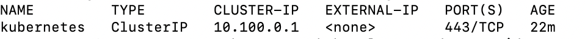
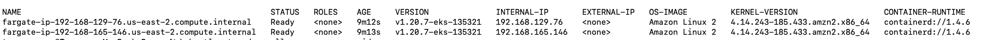
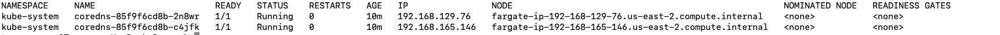

You will need:

- AWS account
- kubectl
- eksctl
- IAM Permissions


## CLI interface

**AWS Console &rarr; IAM &rarr; Users &rarr; Add Users**

**Users &rarr; Security Credentials &rarr; Create Access Key**

Command line aws login - put in access keys

**Users &rarr; [Your User] &rarr; Add Policy**

https://github.com/weaveworks/eksctl/blob/main/userdocs/src/usage/minimum-iam-policies.md

createservicelinkedrole


```
eksctl create cluster \
--name my-cluster \
--region us-west-2 \
--fargate
```

    kubectl get svc
    

    
fsdf

    kubectl get nodes -o wide
    


fsda

    kubectl get pods --all-namespaces -o wide


blah

    eksctl delete cluster --name my-cluster --region us-west-2
    
## Console interface


## Check Clusters


