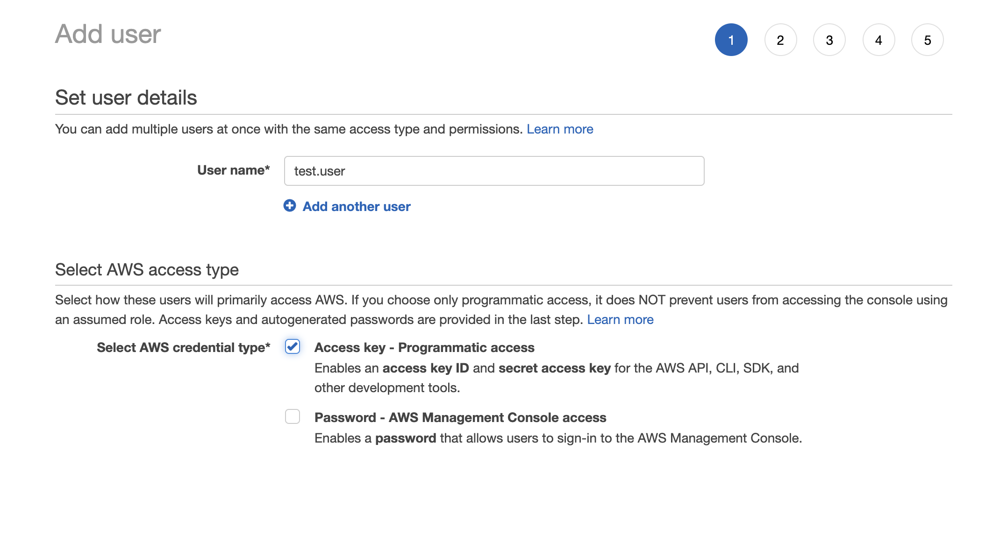
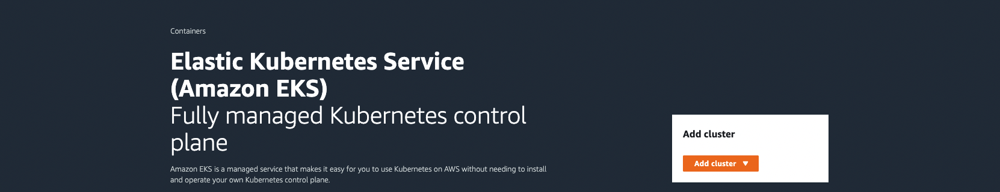
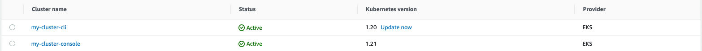
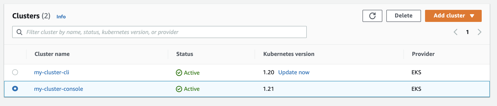

This blog will set up an Elastic Kubernetes Service (EKS) cluster in Amazon Web Services (AWS). EKS is a managed container service to run and scale Kubernetes in the cloud or on-premises. 

You will need:

- AWS account
- A terminal with [kubectl](https://docs.aws.amazon.com/eks/latest/userguide/install-kubectl.html), [eksctl](https://docs.aws.amazon.com/eks/latest/userguide/eksctl.html) and [aws-iam-authenticator](https://docs.aws.amazon.com/eks/latest/userguide/install-aws-iam-authenticator.html) installed
- IAM Permissions

There are two ways to set up a cluster in EKS, the command-line interface (CLI) or the console. Before doing these, we need to set up some access keys and user accounts.

## Preliminary setup

**AWS Console &rarr; IAM &rarr; Users &rarr; Add Users**

Give the user a name, and tick **Access Key - Programmatic access**

Click **Next**



Select **Attach existing policies directly &rarr; Create policy**

The IAM policy will allow you to create an EKS cluster from the command line. [The actions in this policy are the minimum policies required by eksctl](https://eksctl.io/usage/minimum-iam-policies/).

Click **Next** and give the policy a name. Click **Add Policy**

Amazon will then show you the **Access Key ID** and **Secret Access Key**. Download this file for reference later.

## Command-line interface

Log in to the AWS command line using `aws login`

Run `aws configure`

Enter your Access Key ID and Secret Access Key earlier. Set the zone to us-east-2 and accept the defaults.

Now we can create our cluster.

```
eksctl create cluster \
--name my-cluster \
--region us-east-2 \
--fargate
```

AWS Fargate allows you to run containers without having to manage servers or clusters of Amazon EC2 instances. The profile gives a simple way to spin up a test cluster. Test the cluster configuration:

    kubectl get svc
    
**Output**

```    
NAME         TYPE        CLUSTER-IP   EXTERNAL-IP   PORT(S)   AGE
kubernetes   ClusterIP   10.100.0.1   <none>        443/TCP   25h
```

Run the following command to view your cluster nodes:

    kubectl get nodes -o wide
    
**Output** 

```
NAME                                                    STATUS   ROLES    AGE   VERSION              INTERNAL-IP       EXTERNAL-IP   OS-IMAGE         KERNEL-VERSION                  CONTAINER-RUNTIME
fargate-ip-192-168-129-76.us-east-2.compute.internal    Ready    <none>   25h   v1.20.7-eks-135321   192.168.129.76    <none>        Amazon Linux 2   4.14.243-185.433.amzn2.x86_64   containerd://1.4.6
fargate-ip-192-168-165-146.us-east-2.compute.internal   Ready    <none>   25h   v1.20.7-eks-135321   192.168.165.146   <none>        Amazon Linux 2   4.14.243-185.433.amzn2.x86_64   containerd://1.4.6
```
View the workloads that are running on your cluster:

    kubectl get pods --all-namespaces -o wide

**Output** 
```
NAMESPACE     NAME                       READY   STATUS    RESTARTS   AGE   IP                NODE                                                    NOMINATED NODE   READINESS GATES
kube-system   coredns-85f9f6cd8b-2n8wr   1/1     Running   0          25h   192.168.129.76    fargate-ip-192-168-129-76.us-east-2.compute.internal    <none>           <none>
kube-system   coredns-85f9f6cd8b-c4jfk   1/1     Running   0          25h   192.168.165.146   fargate-ip-192-168-165-146.us-east-2.compute.internal   <none>           <none>
```


    
## Console interface

You can also create a cluster from the AWS console. Go to **EKS &rarr; Add Cluster &rarr; Create**



- **Name:** Give your cluster a name
- **Kubernetes Version:**- Select the latest Kubernetes version
- **Cluster Service Role:** Re-use the service role created from the CLI cluster

Accept all other defaults to create your cluster.

## Check Clusters

Check the state of your two clusters by going to **EKS &rarr; Clusters**



Now that your clusters are live, you can perform operations on them, such as deploying an application or configuring resources. For this blog, we will delete them.

## Deleting the clusters

You can delete a cluster using the CLI by running this command. Replace the cluster name and region with your values. 
    eksctl delete cluster --name my-cluster --region us-east-2

You can delete a cluster using the console by ticking the cluster, clicking delete, and typing the name of the cluster to delete. You can only delete a resource the same way you created it. This means clusters created through the CLI can only be deleted through the CLI. Clusters created through the console can only be deleted through the console.




In this blog, you have set up IAM permissions in AWS. You have used the CLI and console to create, inspect and delete an EKS cluster. EKS on AWS allows you to provision Kubernetes services in the cloud to deploy and scale workloads.

Happy Deployments!

