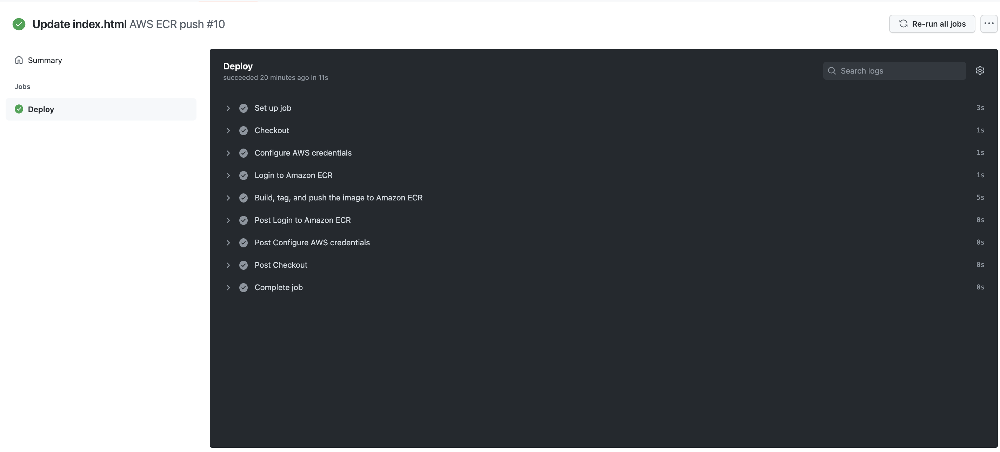
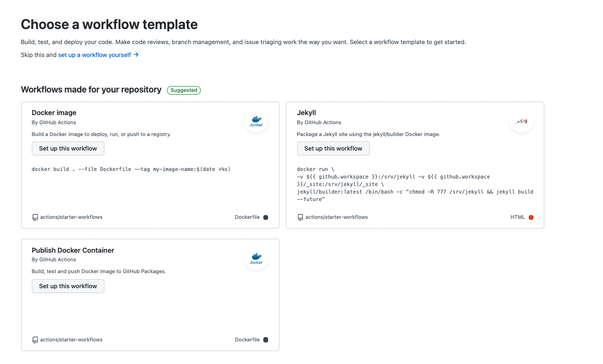
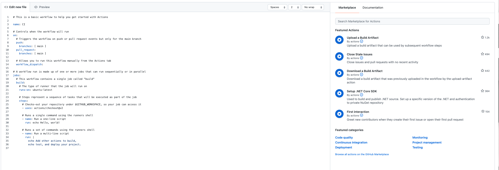

This blog will build a docker image in a GitHub Actions workflow and publish the image to Amazon Elastic Container Registry (ECR). To follow along, you will need:

- An Amazon Web Services Account (AWS)
- A GitHub account


## Amazon Web Services setup

To set up AWS for GitHub Actions, we need to create an access key and an ECR repository to store the image.

To create an access key, go to **Amazon Console &rarr; IAM &rarr; Users &rarr; [your user] &rarr; Security credentials &rarr; Create Access Key**

Your browser will download a file containing the Access Key ID and the Secret Access Key. These values will be used in Jenkins to authenticate to Amazon.

To create a repository, go to the **Amazon Console &rarr; ECR &rarr; Create Repository**

The ECR requires an image repository set up for each image you want to publish. Name the repository the name you want the image to have. 

Under **Amazon ECR &rarr; Repositories**, you will see your repository. Make a note of the zone it is in, which is in the URI field.


## GitHub setup

For this example, we will use a sample web application that displays an animated underwater Octopus named simple-octo.

Fork the repository at https://github.com/terence-octo/simple-octo

Go to **Settings &rarr; Secrets &rarr; New repository secret**

- **REPO_NAME**- the name of the AWS ECR repository you created
- **AWS_ACCESS_KEY_ID**- the Access Key ID from earlier
- **AWS_SECRET_ACCESS_KEY**- the Secret Access Key from earlier

We need to create a workflow file in the repository. A Github Actions workflow contains instructions on how to perform operations on the code repository. There are several pre-built step templates that will allow you to do many different tasks on a code repository. In this example we use a step template that will build and push the code to an AWS ECR repository.


Create a file named main.yml in the .github/workflow directory of the root folder. Paste the following code in the main.yml file:

```
on:
  push:
    branches: [ main ]
  pull_request:
    branches: [ main ]

name: AWS ECR push

jobs:
  deploy:
    name: Deploy
    runs-on: ubuntu-latest

    steps:
    - name: Checkout
      uses: actions/checkout@v2
      
    - name: Configure AWS credentials
      uses: aws-actions/configure-aws-credentials@v1
      with:
        aws-access-key-id: ${{ secrets.AWS_ACCESS_KEY_ID }}
        aws-secret-access-key: ${{ secrets.AWS_SECRET_ACCESS_KEY }}
        aws-region: us-east-2

    - name: Login to Amazon ECR
      id: login-ecr
      uses: aws-actions/amazon-ecr-login@v1

    - name: Build, tag, and push the image to Amazon ECR
      id: build-image
      env:
        ECR_REGISTRY: ${{ steps.login-ecr.outputs.registry }}
        ECR_REPOSITORY: ${{ secrets.REPO_NAME }}
        IMAGE_TAG: simple-octo
      run: |
        # Build a docker container and push it to ECR 
        docker build -t $ECR_REGISTRY/$ECR_REPOSITORY:$IMAGE_TAG .
        echo "Pushing image to ECR..."
        docker push $ECR_REGISTRY/$ECR_REPOSITORY:$IMAGE_TAG
        echo "::set-output name=image::$ECR_REGISTRY/$ECR_REPOSITORY:$IMAGE_TAG"
```

The yml file is triggered by a push or pull request on the main branch. The steps checks out the code, authenticates and logs into AWS, then builds, tags and pushes the image to Amazon ECR. A similar step template could be used to push to other cloud repositories like Google or Microsoft. 

Commit your changes and go to the **Actions** tab and click the title of your commit message. You will see the various stages of the workflow as it reaches completion.



Go to your Amazon ECR repository to confirm that the image has been pushed successfully. This image can now be deployed to a deployment target with a tool like Octopus Deploy.


## GitHub Step Templates

If you want to experiment with different workflows, GitHub Actions has a workflow builder. Go to **Actions &rarr; New Workflow** where you can use pre-built step templates. GitHub suggests templates based on your repository but you can manually select the steps that are relevant to you. 



Select **set up a workflow yourself** and you can use a template and add code snippets from the GitHub Marketplace. The marketplace contains several community built templates for different kinds of operations. Use the search box to search for the steps that you need.

Each yml file created in the workflow folder is a separate job. They will each trigger separately depending on the trigger conditions of the workflow. You could have one workflow to push to AWS and another to push to Google for example.



In this blog, you have set up a GitHub Actions workflow to build and push an image to Amazon ECR. GitHub actions has several pre-built step templates that can help you perform many types of operations on a code repository. 

Happy Deployments!
