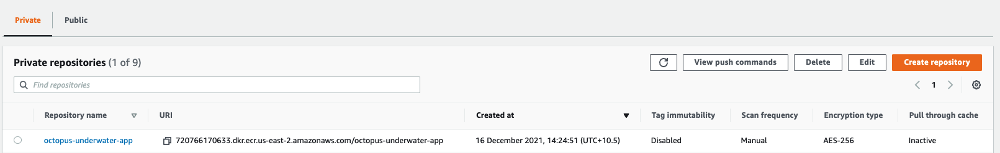

This blog will build a docker image in a GitHub Actions workflow and publish the image to Amazon Elastic Container Registry (ECR). To follow along, you will need:

- An Amazon Web Services Account (AWS)
- A GitHub account

This blog will use the [Octopus Underwater app repository](https://github.com/terence-octo/octopus-underwater-app). You can fork the repository and follow along. Alternatively, the github-deployment branch contains the template files needed to complete the steps in this blog. You will have to replace some values with your own. I have included my values as a reference.

## Amazon Web Services setup

To set up AWS for GitHub Actions, we need to create an access key and an ECR repository to store the image.

To create an access key, go to **Amazon Console &rarr; IAM &rarr; Users &rarr; [your user] &rarr; Security credentials &rarr; Create Access Key**

Your browser will download a file containing the Access Key ID and the Secret Access Key. These values will be used in Jenkins to authenticate to Amazon.

To create a repository, go to the **Amazon Console &rarr; ECR &rarr; Create Repository**

The ECR requires an image repository set up for each image you publish. Name the repository the name you want the image to have. 

You will see your repository under **Amazon ECR &rarr; Repositories**. Make a note of the zone it is in, in the URI field.



### AWS Cluster setup

[Set up the cluster in AWS using this guide](https://github.com/OctopusDeploy/blog/blob/2022-q1/blog/2022-q1/eks-cluster-aws/index.md)

## GitHub setup

We will use a sample web application that displays an animated underwater scene with helpful links for this example.

Fork the repository at https://github.com/terence-octo/octopus-underwater-app

Go to **Settings &rarr; Secrets &rarr; New repository secret**

- **REPO_NAME**- the name of the AWS ECR repository you created

- **AWS_ACCESS_KEY_ID**- the Access Key ID from earlier

- **AWS_SECRET_ACCESS_KEY**- the Secret Access Key from earlier

- **AWS_ACCOUNT_ID**- The ID of your Amazon account

First, we need to create a deployment YAML file for GitHub actions to deploy to EKS. Create a file named `git-deployment.yml` in the root level of your repository with the following code:

```


apiVersion: apps/v1
kind: Deployment
metadata:
  name: ecr-app-underwater
  labels:
    app: octopus-underwater-app
spec:
  selector:
    matchLabels:
        app: octopus-underwater-app
  replicas: 3
  strategy:
    type: RollingUpdate
  template:
    metadata:
      labels:
        app: octopus-underwater-app
    spec:
      containers:
        - name: octopus-underwater-app
          image: 720766170633.dkr.ecr.us-east-2.amazonaws.com/octopus-underwater-app:latest
          ports:
            - containerPort: 80
              protocol: TCP
          imagePullPolicy: Always

```

We need to create a workflow file in the repository. A Github Actions workflow contains instructions on performing operations on the code repository. Several pre-built step templates will allow you to do many different tasks on a code repository. In this example, we use a step template to build and push the code to an AWS ECR repository and deploy it to EKS.

Create a file named main.yml in the .github/workflow directory of the root folder. Paste the following code in the main.yml file:

```

on:
  push:
    branches: [ main ]
  pull_request:
    branches: [ main ]

name: AWS ECR push

jobs:
  deploy:
    name: Deploy
    runs-on: ubuntu-latest

    steps:
    - name: Install Octopus CLI
      uses: OctopusDeploy/install-octopus-cli-action@v1.1.1
      with:
          version: latest
    - name: Checkout
      uses: actions/checkout@v2
      
    - name: Configure AWS credentials
      uses: aws-actions/configure-aws-credentials@v1
      with:
        aws-access-key-id: ${{ secrets.AWS_ACCESS_KEY_ID }}
        aws-secret-access-key: ${{ secrets.AWS_SECRET_ACCESS_KEY }}
        aws-region: us-east-2

    - name: Login to Amazon ECR
      id: login-ecr
      uses: aws-actions/amazon-ecr-login@v1

    - name: Build, tag, and push the image to Amazon ECR
      id: build-image
      env:
        ECR_REGISTRY: ${{ steps.login-ecr.outputs.registry }}
        ECR_REPOSITORY: ${{ secrets.REPO_NAME }}
        IMAGE_TAG: "latest"
        
      run: |
        # Build a docker container and push it to ECR 
        docker build -t $ECR_REGISTRY/$ECR_REPOSITORY:$IMAGE_TAG .
        echo "Pushing image to ECR..."
        docker push $ECR_REGISTRY/$ECR_REPOSITORY:$IMAGE_TAG
        echo "::set-output name=image::$ECR_REGISTRY/$ECR_REPOSITORY:$IMAGE_TAG"
```


We will port forward locally to inspect the service. Use this command to inspect the web application:

`kubectl port-forward deployment/octopus-underwater-app-octo  28019:80`

Go to the IP address in the browser to view your web application.


## GitHub Actions as a CD tool

GitHub Actions can build, push and deploy a GitHub repository to a Kubernetes cloud platform like EKS. Integrating with cloud platforms and other tools relies on community-built step templates. In my experience with the tools, these step templates are not standardized. I tried several different templates. Some worked differently from others, depending on the variables called.

I found that using a new step template in GitHub required a layer of learning each time. A tool like Octopus also uses step templates, but they share a standard design across the Octopus Deploy application. This means the Octopus Deploy step template experience is consistent. 


