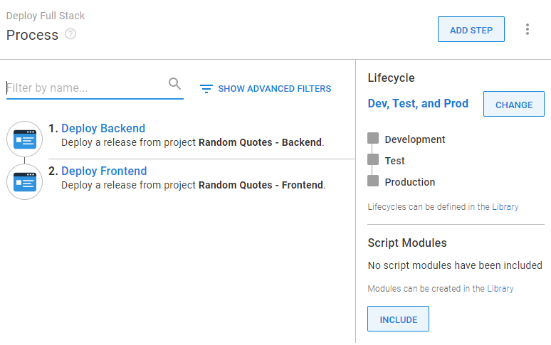

<!-- see https://github.com/OctopusDeploy/blog/blob/master/tags.txt for a comprehensive list of tags -->

We spent the last few months exploring 2 build server options in Jenkins and GitHub Actions. As we discovered, Jenkins is a traditional build server with a self-managed instance at its center, while GitHub Actions performs similar tasks but as a service in a product you may already use. Either is a worthwhile option as part of a continuous integration/continuous deployment (CI/CD) workflow, depending on your needs.

As a deployment tool that sits between packages and their destinations, however, Octopus is build server agnostic. Octopus supports all major automation services on the market, but why should you connect them to Octopus?

I mean, build servers can deploy too, right? They can, for sure, but they don’t quite solve the same problems Octopus does.

In this blog we look at how Octopus not only complements your build server of choice, but also completes your [development pipeline](https://octopus.com/devops/continuous-delivery/what-is-a-deployment-pipeline/).

## Build servers specialize in continuous integration. Octopus specializes in continuous deployment

We talk a lot about CI/CD on this blog! Though ‘CI’ and ‘CD’ combine to make a catchy acronym and share the belief that repetition gives confidence, they’re separate concepts.

CI exists mostly to serve developers and is about automating the tasks that used to slow them down, such as compiling, building, and testing code. These are the same functions build servers excel at, so it’s no accident that many in DevOps now refer to build servers as ‘CI platforms’.

CD processes, then, usually touch many teams as a release works its way through a pipeline’s environments. And where CD fundamentally differs to CI is the need for manual intervention at several stages.

Let’s look at how Octopus can help with managing those manual actions.

### Build human interactions into your deployment process

As a release moves through a typical development pipeline (consisting of at least ‘Dev’, ‘QA’ and ‘Production’ environments), you may need the following types of human checks or actions:

- Developers may want to check deployed changes in Dev before a release moves into QA.
- A QA team will usually test the product as you’d expect customers to use it. This is different to the automated code tests during builds.
- A release may need sign-off from leadership before deployment to production (and thus your customers).

In Octopus, you can build [manual intervention steps](https://octopus.com/docs/projects/built-in-step-templates/manual-intervention-and-approvals) right into your deployment processes. For example, if you need a deployment to pause and check for QA confirmation or management sign-off, that’s easy to add.

This helps keep your deployments moving along as swiftly as you can.

### Use permissions to manage workflows

Sometimes, those performing manual checks don’t need to see the full deployment picture. You can use permissions in Octopus’s to make sure teams can only access and see what they need. 

You could set Octopus access so:

- Development teams can only deploy to Dev
- QA teams can promote from Dev to QA
- Managers can only confirm consent or reject deployment to the next phase
- Project managers can only see the dashboard and reporting features
- Teams can see only the projects they’re attached to

This not only provides security around your instance, but also makes your info clearer by reducing the clutter for everyone.

## Octopus gives you confidence in releases
Octopus helps provide greater confidence in your releases before they go to production. It does this in a few ways.

### Octopus matches your environment structure

While build servers can technically deploy a package to any target, they tend to lack the concept of environments.

:::hint
An environment is a collection of deployment targets used for a specific purpose, such as regional server farms, virtual machines, and cloud services.
:::

As you most likely know, an ideal deployment should flow through at least 2 environments before it reaches users. A minimalist environment structure, for example, would look like this:

- Development - an environment used by developers to iron out mistakes
- Test - an environment for testing an app works as users would expect
- Production - the live environment where users access your application

Some pipelines may add extra environments, such as User Acceptance Testing (UAT) or Staging. Regardless, the idea is to build confidence in your release before it hits production.

That’s why with Octopus, you deploy to environments rather than each individual target.

What if you have complex projects that only need to hit certain targets in your environments? Don’t worry, we have tools to help manage that, such as [target roles](https://octopus.com/docs/security/users-and-teams/system-and-space-permissions) and [tenants](https://octopus.com/docs/tenants).

### Octopus controls deployment order with lifecycles

When setting your environments, Octopus automatically creates a ‘lifecycle’. The lifecycle controls the order a release moves through your environments whenever you deploy.
This means:

- You can never accidentally skip an environment
- Releases always promote in the correct order
- Users will only get your release when you want them to

You can have more than one lifecycle, though. For example, you might want special lifecycles for different projects, or use them to help set up a favored [deployment pattern](https://octopus.com/blog/common-deployment-patterns-and-how-to-set-them-up-in-octopus).

### Octopus uses just one deployment process across a project’s lifecycle

With Octopus, you set your deployment process just once per project. Unless you hit problems deploying to Dev, the process will stay the same throughout your entire pipeline.

By the time you’re ready to push to production, you can trust your deployment process as it’s already worked before. Repeatable deployments breed confidence!

## Octopus easily connects to both ends of your development pipeline

We’ve already explored how, thanks to plugins and connecters, your build server of choice can connect to Octopus. You can find our plugins for popular CI platforms on the following marketplaces:

- [Jenkins](https://plugins.jenkins.io/octopusdeploy/)
- [GitHub Actions](https://github.com/marketplace?type=&verification=&query=Octopus+)
- [JetBrains TeamCity](https://plugins.jetbrains.com/plugin/9038-octopus-deploy-integration)
- [Atlassian Bamboo](https://marketplace.atlassian.com/apps/1217235/octopus-deploy-bamboo-add-on?hosting=server&tab=overview)
- [Azure Pipelines](https://marketplace.visualstudio.com/items?itemName=octopusdeploy.octopus-deploy-build-release-tasks)

Not only that, Octopus connects to your deployment targets too. Whether that’s physical servers, container orchestration services, or any of the major cloud providers - Octopus can deploy there. We’ve built much of this into Octopus to make it as easy as possible. Once you’ve defined some environments, set your deployment targets with our simple setup wizards.

## Octopus offers clarity for project statuses

If a deployment by build server fails, it’s likely you’ll need to search through logs to find out what went wrong. This is probably fine for the tech-minded, but it’s not ideal for everyone involved in deployments, such as release managers, leaders, or QA teams.

Thankfully, Octopus’s dashboard makes it easy to check what releases each environment has, and across all your projects too. Even during deployments.

## Automate related administrative tasks with Runbooks

Octopus’s Runbooks feature is one of its most useful additions, allowing you to automate a range of routine or emergency operations tasks.

This could include performing:

- Incident recovery
- Backups, restores, and tests
- Spin-up and teardown of infrastructure
- The stop, start and restart of system services
- File cleanup
- The running of scripts in any language you need

We will cover Octopus Runbooks in more detail starting next month, but in the meantime, why not check out our [Runbooks documentation](https://octopus.com/docs/runbooks) for more info.

## Conclusion

Over the course of our series on continuous integration and build servers, we covered 2 great options in Jenkins and GitHub Actions. We looked at how they can help your teams and provided setup advice and free tools along the way.

We also looked at how though CI and CD are separate concepts solving different problems, they’re 2 sides of the same coin combining for something greater.

Finally, we offered insight on how Octopus can help complete your full CI/CD pipeline. But don’t just take our word for it, [sign up for a free trial](https://octopus.com/start) to see it in action for yourself!

Happy deployments!

## Related links
- links to the other posts (I don't have all the URLs, sorry)
