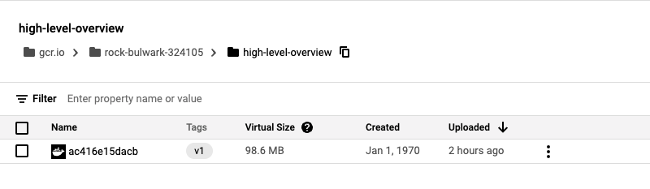
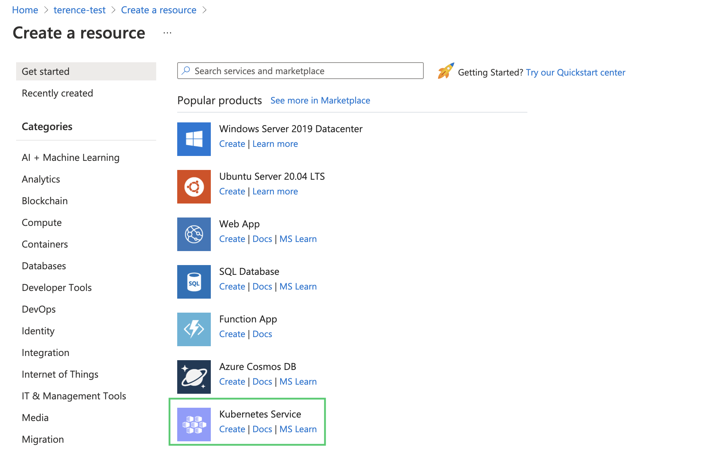
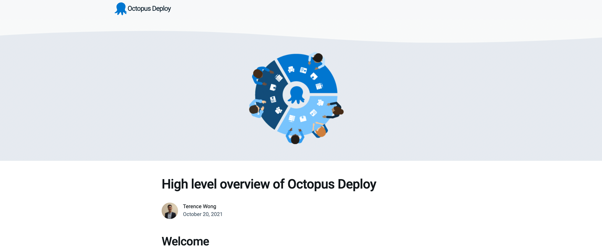

I built a Maven Java project and hosted the built image on the Google Container Registry (GCR) in this blog post. I access the GCR through Octopus Deploy and deploy the Java application to Azure Kubernetes Service (AKS). To follow along, you will need:

- A Google Cloud Platform Account
- A Microsoft Azure Account
- An Octopus Deploy instance - to link the [Azure Account to the Octopus Deploy instance](https://octopus.com/docs/infrastructure/accounts/azure#azure-service-principal).
- Access to a terminal, either locally or in the cloud, with gcloud and the azure command line interface installed

## Spring Initializr

To create the Java project, I went to [Spring Initializr](https://start.spring.io/). This tool generates a java project framework. In this project, I configured a custom Java project, displaying a deployable high-level overview of Octopus Deploy.

You can find the repository of the web application on [GitHub]().

## Building and pushing to a registry

We will use the command line to build the Java project and use gcloud to push the image to GCR.

Configure the gcloud tool to point to my current PROJECT_ID.

    gcloud config set project <PROJECT_ID>

Clone the java project repository that we will use to build and deploy to Azure.

    git clone [Java App Repo]
    cd gs-spring-boot/complete

Test the application locally by using the run command and visiting http://localhost:8080/ 

    ./mvnw -DskipTests spring-boot:run
    
Running the package step builds the target JAR deployable for the app.

    ./mvnw -DskipTests package
    
Enable the container registry to store the container image.

    gcloud services enable containerregistry.googleapis.com
    export GOOGLE_CLOUD_PROJECT=`gcloud config list --format="value(core.project)"`
    
The jib tool creates and pushes the image to the container registry.

    ./mvnw -DskipTests com.google.cloud.tools:jib-maven-plugin:build -Dimage=gcr.io/$GOOGLE_CLOUD_PROJECT/high-level-overview:v1
    
Confirm that the image is present on the GCR by going to the [registry home page](https://cloud.google.com/container-registry).



    
## Create Azure Kubernetes Cluster

Now we switch to Microsoft Azure to host our Kubernetes cluster. Octopus Deploy is cloud-agnostic. It can work with deployments that span multiple cloud providers. 

Create a new Kubernetes cluster by going to your resource group and creating a Kubernetes service. Give the cluster a name and accept all default options.




## Octopus Steps

### Add External Feeds

For Octopus to access the image stored in the GCR, enable the [google feed](https://octopus.com/docs/packaging-applications/package-repositories/guides/google-container-registry).


### Set up deployment steps

In a project, add the deploy kubernetes containers step.


### YAML file

Click the Edit YAML box and paste the following YAML file in the box. The YAML file will populate the various settings in the Octopus UI. You will have to replace the PROJECT_ID with your google PROJECT_ID. You can also use the UI to manually select the container image, using the google external feed credentials set up earlier.

```
apiVersion: apps/v1
kind: Deployment
metadata:
  name: java-web-gs-high-google
  labels:
    app: java-web-app
spec:
  selector:
    matchLabels:
      octopusexport: OctopusExport
  replicas: 1
  strategy:
    type: RollingUpdate
  template:
    metadata:
      labels:
        app: java-web-app
        octopusexport: OctopusExport
    spec:
      containers:
        - name: java-web-app
          image: gcr.io/<PROJECT_ID>/high-level-overview
          ports:
            - containerPort: 80
```

### Deploy to Azure

Click SAVE.

Click Create Release and click through the steps to deploy the application to Azure.

## Azure steps
    
The last step is to expose the app to the internet using a load balancer. Go to the Azure portal and bring up the Powershell Azure CLI.

    az aks get-credentials --resource-group myResourceGroup --name myAKSCluster

This command will point the CLI to your cluster:

    kubectl get deployments

Running this command will get the list of deployments on the cluster. You should see the deployment `java-web-gs-high-google`. Use this name to expose the Web Application:

    kubectl expose deployment java-web-gs-high-google --type=LoadBalancer --port=80 --target-port=8080 --name=my-service-gs-high-google
    
This command creates a service named 'my-service' that generates a public IP to view the Web Application:

    kubectl get services
        
Run this command, and you will see "pending" under the External-IP. Wait 1 minute, run again, and you should see a public IP in that field. Go to the IP address in the browser to view your Web Application.



In this blog post, you have used Spring Initializr to create your own Maven Java project. You have built the project and pushed the image to GCR. You used Octopus Deploy to reference this image and deploy the image to AKS.

Happy Deployments!


