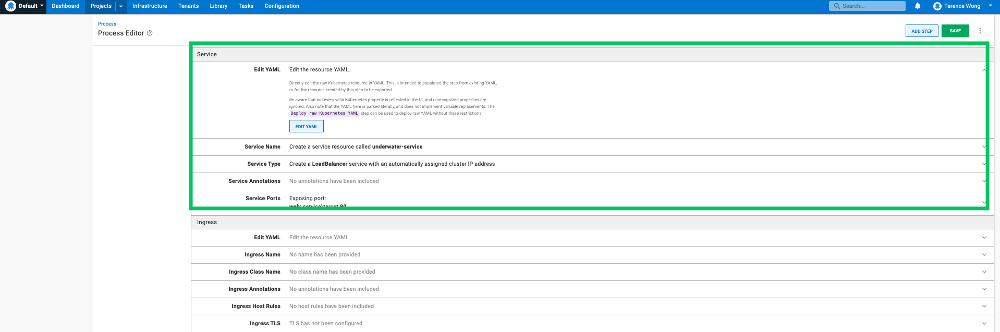
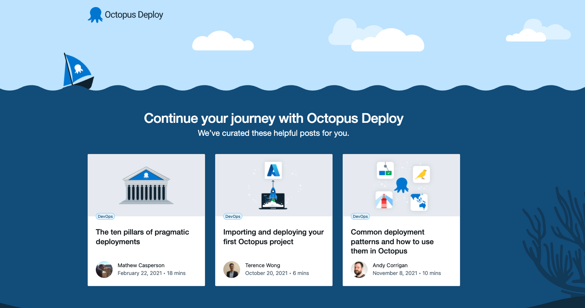

In this blog post, I built a Maven Java project and hosted the image on the Google Container Registry (GCR). I access the GCR through Octopus Deploy and deploy the Java application to Azure Kubernetes Service (AKS). To follow along, you will need:

- A Google Cloud Platform Account
- A Microsoft Azure Account
- An Octopus Deploy instance - to link the [Azure Account to the Octopus Deploy instance](https://octopus.com/docs/infrastructure/accounts/azure#azure-service-principal).
- Access to a terminal, either locally or in the cloud, with gcloud and the azure command line interface installed

## The Octopus Deploy Underwater App

The Octopus Deploy Underwater App is a landing page for users creating their first deployment. It showcases relevant articles for users as well as links to other resources.

You can find the web application repository on [GitHub](https://github.com/terence-octo/octopus-underwater-app/tree/underwater-app-java). The repository is split into separate branches for different use cases. We will be using the underwater-app-java branch.

## Building and pushing to a registry

We will use the command line to build the Java project and use gcloud to push the image to GCR.

Configure the gcloud tool to point to your PROJECT_ID.

    gcloud config set project <PROJECT_ID>

Clone the java project repository that we will use to build and deploy to Azure.

    git clone https://github.com/terence-octo/octopus-underwater-app
    cd octopus-underwater-app

Test the application locally by using the run command and visiting http://localhost:8080/ 

    ./mvnw spring-boot:run
    
Running the package step builds the target JAR deployable for the app.

    ./mvnw package
    
Enable the container registry to store the container image.

    gcloud services enable containerregistry.googleapis.com
    export GOOGLE_CLOUD_PROJECT=`gcloud config list --format="value(core.project)"`
    
Run this command to create the config.json with the correct settings

    gcloud auth configure-docker
    
The jib tool creates and pushes the image to the container registry.

    ./mvnw com.google.cloud.tools:jib-maven-plugin:build -Dimage=gcr.io/$GOOGLE_CLOUD_PROJECT/octopus-underwater-app:latest
    
Confirm that the image is present on the GCR by going to the [registry home page](https://cloud.google.com/container-registry).


## Retrieve Credentials from Azure for Octopus Deploy

We need to retrieve some credentials to pass to Octopus Deploy. Follow these steps to [add an Azure Service Principle to Octopus Deploy](https://octopus.com/docs/infrastructure/accounts/azure).


## Octopus Steps

### Add Deployment Target

Go to **Infrastructure &rarr; Deployment Targets &rarr; Add Deployment Target &rarr; Kubernetes Cluster** and fill out the fields using the Azure Service Principle set up earlier. Assign a unique role for the deployment. 

### Add External Feeds

For Octopus to access the image stored in the GCR, enable the [google feed](https://octopus.com/docs/packaging-applications/package-repositories/guides/google-container-registry).

### Set up deployment steps

In a project, add the deploy Kubernetes containers step.


### YAML file

Click the Edit YAML box and paste the following YAML file in the box. The YAML file will populate the various settings in the Octopus UI. You will have to replace the PROJECT_ID with your google PROJECT_ID. Using the google external feed credentials set up earlier, you can also use the UI to select the container image manually.

```
apiVersion: apps/v1
kind: Deployment
metadata:
  name: java-web-underwater
  labels:
    app: java-web-app
spec:
  selector:
    matchLabels:
      octopusexport: OctopusExport
  replicas: 1
  strategy:
    type: RollingUpdate
  template:
    metadata:
      labels:
        app: java-web-app
    spec:
      containers:
        - name: java-web-app
          image: gcr.io/<PROJECT_ID>/octopus-underwater-app
          ports:
            - containerPort: 80
```

### Service

Paste the following YAML into the Service section of the step. This will create an Azure Service through the Octopus client.

```

apiVersion: v1
kind: Service
metadata:
  name: underwater-service
spec:
  type: LoadBalancer
  ports:
    - name: web
      port: 80
      targetPort: 80
      protocol: TCP
  selector:
    app: java-web-app

```




### Deploy to Azure

Click SAVE.

Click Create Release and click through the steps to deploy the application to Azure.

## Azure steps
    
The last step is to expose the app to the internet using a load balancer. Go to the Azure portal and bring up the Powershell Azure CLI.

    az aks get-credentials --resource-group myResourceGroup --name myAKSCluster

This command will point the CLI to your cluster:

    kubectl get deployments

Running this command will get the list of deployments on the cluster. You should see the deployment `java-web-underwater`. Use this name to expose the Web Application:

    kubectl expose deployment java-web-underwater --type=LoadBalancer --port=80 --target-port=8080 --name=java-web-underwater
    
This command creates a service named 'my-service' that generates a public IP to view the Web Application:

    kubectl get services
        
Run this command, and you will see "pending" under the External-IP. Wait 1 minute, run again, and you should see a public IP in that field. Go to the IP address in the browser to view your Web Application.



### Runbooks as a Kubernetes monitoring tool 

You can also set up monitoring of your kubernetes resources through runbooks. Go to your project dashboard then **Runbooks &rarr; Add Runbook &rarr; Define your Runbook Process &rarr; Add Step &rarr; Kubernetes - Inspect Resource**


Assign the role you set for your deployment target and you can replicate the `kubectl get deployments` command by setting the **Resource** and **Kubectl Verb**. 

Click **Save** then **Run**

This is useful as the runbooks can be shared across teams. Monitoring can then be done at an organization level rather than individually on local machines.


In this blog post, you have built the  Octopus Deploy Underwater App and pushed the image to GCR. You used Octopus Deploy to reference this image and deploy the image to AKS.

Happy Deployments!


