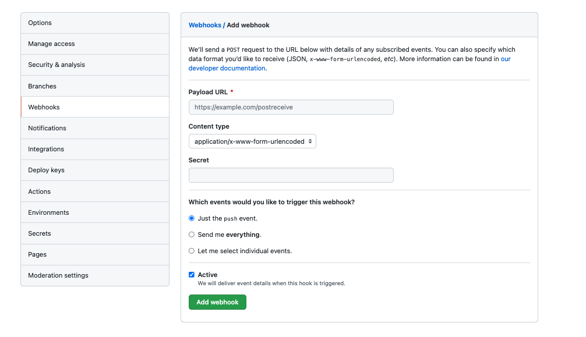
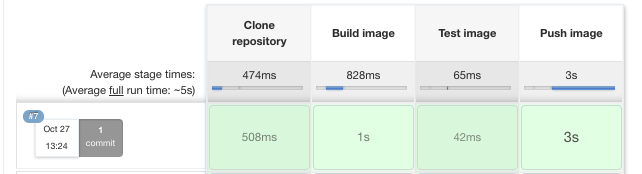

Set up Jenkins (link to previous article)

AWS IAM

Go to Amazon **IAM, Users, [your user], Security credentials, Create Access Key

Make note of the Access Key ID and the Secret Access Key

AWS Elastic Container Registry

Create repository

make note of the zone that the repository is in.


Manage Credentials


put int the Access Key ID and Secret Access Key from earlier


Set up pipeline


**GitHub hook trigger for GITScm polling** - Check the box

**Definition** - Pipeline script from SCM
- **SCM** - Git
- **Repository URL** - https://github.com/terence-octo/simple-octo
- **Credentials** - zone of the repository
- **Branch Specifier** -*/main

Click **SAVE**

Connect repository (Simple-Octo)

Jenkinsfile
```
node {
    def app

    stage('Clone repository') {

        checkout scm
    }

    stage('Build image') {
        /* Referencing the image name in AWS */

        app = docker.build("terence.wong")
    }
    
    stage('Test image') {
    /* Empty for test purposes */


    }

    stage('Push image') {
        /* Referencing the AWS registry. Tagging with the Jenkins build number and the latest tag */
        docker.withRegistry('https://720766170633.dkr.ecr.us-east-2.amazonaws.com', 'ecr:us-east-2:amazon-credentials') {
            app.push("${env.BUILD_NUMBER}")
            app.push("latest")
        }
    }
}
```

Add webhook



**Payload URL** - http://[jenkins-url]/github-webhook/

**Content Type** - application/json

Commit

Check Jenkins



Check ECR


