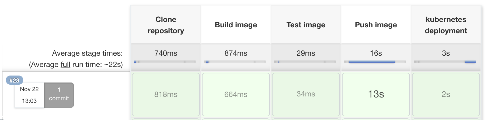

This blog will build a docker image in a Jenkinsfile workflow and publish the image to Amazon Elastic Container Registry (ECR). Jenkins will trigger a deployment to Amazon Elastic Kubernetes Service (EKS). To follow along, you will need:

- An Amazon Web Services Account (AWS)
- A GitHub account
- [A Jenkins instance set up with a pipeline](https://github.com/OctopusDeploy/blog/blob/2022-q1/blog/2022-q1/jenkins-docker-ecr/index.md). This was set up as part of a previous blog.

We will extend the repository to include a deployment YAML file for this blog. Jenkins will use this deployment file to deploy to EKS. Add this file to the root level of your repository.

This blog will use the [Octopus Underwater app repository](https://github.com/terence-octo/octopus-underwater-app). You can fork the repository and use the main branch to follow along. The jenkins-deploy branch contains the template files needed to complete the steps in this blog. You will have to replace some values with your own. I have included my values in this blog as a reference.

As we are working with Kubernetes, the agent needs to be configured with a config file. [This documentation shows you how to configure your agent](https://awscli.amazonaws.com/v2/documentation/api/latest/reference/eks/update-kubeconfig.html). AWS also requires the [aws-iam-authenticator binary](https://docs.aws.amazon.com/eks/latest/userguide/install-aws-iam-authenticator.html).

Create a file named `deployment.yml` in the root level of the repository.

```
apiVersion: apps/v1
kind: Deployment
metadata:
  name: ecr-app-underwater
  labels:
    app: octopus-underwater-app
spec:
  selector:
    matchLabels:
        app: octopus-underwater-app
  replicas: 3
  strategy:
    type: RollingUpdate
  template:
    metadata:
      labels:
        app: octopus-underwater-app
    spec:
      containers:
        - name: octopus-underwater-app
          image: 720766170633.dkr.ecr.us-east-2.amazonaws.com/underwater:latest
          ports:
            - containerPort: 80
              protocol: TCP
          imagePullPolicy: Always

```

Create a file named `Jenkinsfile` in the root level of your repository.

```


pipeline {
    agent any
    options {
        skipStagesAfterUnstable()
    }
    stages {
         stage('Clone repository') { 
            steps { 
                script{
                checkout scm
                }
            }
        }
        
        stage('Build') { 
            steps { 
                script{
                 app = docker.build("underwater")
                }
            }
        }
        stage('Test'){
            steps {
                 echo 'Empty'
            }
        }
        stage('Push') {
            steps {
                script{
                        docker.withRegistry('https://720766170633.dkr.ecr.us-east-2.amazonaws.com', 'ecr:us-east-2:aws-credentials') {
                    app.push("${env.BUILD_NUMBER}")
                    app.push("latest")
                    }
                }
            }
        }
        stage('Deploy'){
            steps {
                 sh 'kubectl apply -f deployment.yml'
                 sh 'kubectl rollout restart deployment ecr-app-underwater'
            }
        }
        
    }
}

```
Jenkins will clone, build, test, push and deploy the image to an EKS cluster. Jenkins does this through the deployment file created earlier.

## Jenkins as a CD tool

Jenkins is a continuous integration tool. Jenkins focuses on building and pushing images to a remote repository. Using it as a continuous deployment tool is possible. However, it cannot track a release through various deployment stages. A  continuous deployment tool like Octopus Deploy can help in the release management of complex deployments. Octopus Deploy enables the benefits of a dedicated continuous deployment tool. (link)



    kubectl get deployments

Running this command will get the list of deployments on the cluster. You should see the deployment `ecr-app-underwater`. The AWS Fargate Kubernetes profile does not support exposing a service via a Load Balancer. We will port forward locally to inspect the service. Use this command to expose the web application:

    kubectl port-forward deployment/octopus-underwater-app  28019:80
    
Go to the IP address in the browser to view your web application.


In this blog, you have deployed a web application to EKS with Jenkins.

Happy Deployments!
