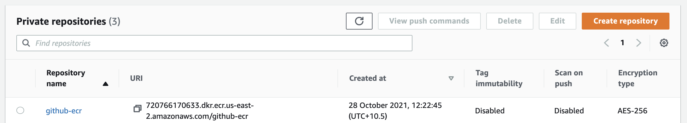
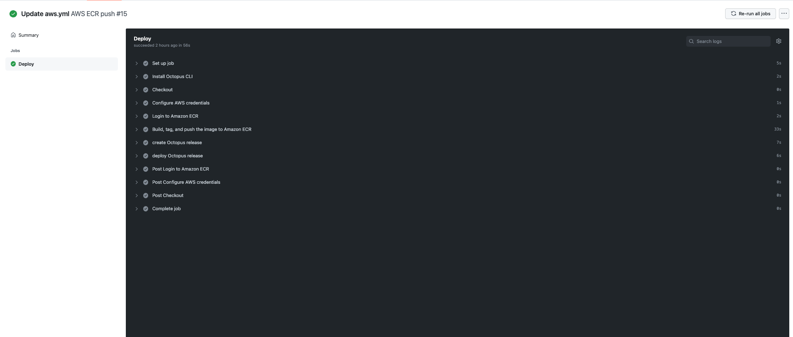
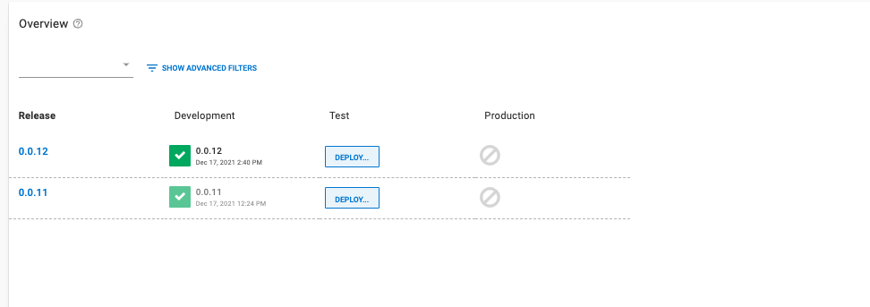

This blog will build a docker image in a GitHub Actions workflow and publish the image to Amazon Elastic Container Registry (ECR). To follow along, you will need:

- An Amazon Web Services Account (AWS)
- A GitHub account

This blog will use the [Octopus Underwater app repository](https://github.com/terence-octo/octopus-underwater-app). You can fork the repository and follow along. Alternatively, the github-octopus branch contains the files needed to complete the steps in this blog. You will have to replace some values with your own.


## Amazon Web Services setup

To set up AWS for GitHub Actions, we need to create an access key and an ECR repository to store the image.

To create an access key, go to **Amazon Console &rarr; IAM &rarr; Users &rarr; [your user] &rarr; Security credentials &rarr; Create Access Key**

Your browser will download a file containing the Access Key ID and the Secret Access Key. These values will be used in Jenkins to authenticate to Amazon.

To create a repository, go to the **Amazon Console &rarr; ECR &rarr; Create Repository**

The ECR requires an image repository set up for each image you publish. Name the repository the name you want the image to have. 

You will see your repository under **Amazon ECR &rarr; Repositories**. Make a note of the zone it is in, in the URI field.



### AWS Cluster setup

[Set up the cluster in AWS using this guide](https://github.com/OctopusDeploy/blog/blob/2022-q1/blog/2022-q1/eks-cluster-aws/index.md)

## GitHub setup

For this example, we will use a sample web application that displays an animated underwater Octopus named simple-octo.

Fork the repository at https://github.com/terence-octo/simple-octo

Go to **Settings &rarr; Secrets &rarr; New repository secret**

- **REPO_NAME**- the name of the AWS ECR repository you created
- **AWS_ACCESS_KEY_ID**- the Access Key ID from earlier
- **AWS_SECRET_ACCESS_KEY**- the Secret Access Key from earlier
- **OCTOPUS_SERVER**- The URL of your Octopus Server
- **OCTOPUS_APIKEY**- The Octopus API Key of your Octopus Instance. To create one, go to **Your User Name &rarrl Profile &rarr; My API Keys &rarr; New API key**

We need to create a workflow file in the repository. A Github Actions workflow contains instructions on performing operations on the code repository. Several pre-built step templates will allow you to do many different tasks on a code repository. In this example, we use a step template to build and push the code to an AWS ECR repository and deploy it from Octopus Deploy.


Create a file named main.yml in the .github/workflow directory of the root folder. Paste the following code in the main.yml file:

```
on:
  push:
    branches: [ main ]
  pull_request:
    branches: [ main ]

name: AWS ECR push

jobs:
  deploy:
    name: Deploy
    runs-on: ubuntu-latest

    steps:
    - name: Install Octopus CLI
      uses: OctopusDeploy/install-octopus-cli-action@v1.1.1
      with:
          version: latest
    - name: Checkout
      uses: actions/checkout@v2
      
    - name: Configure AWS credentials
      uses: aws-actions/configure-aws-credentials@v1
      with:
        aws-access-key-id: ${{ secrets.AWS_ACCESS_KEY_ID }}
        aws-secret-access-key: ${{ secrets.AWS_SECRET_ACCESS_KEY }}
        aws-region: us-east-2

    - name: Login to Amazon ECR
      id: login-ecr
      uses: aws-actions/amazon-ecr-login@v1

    - name: Build, tag, and push the image to Amazon ECR
      id: build-image
      env:
        ECR_REGISTRY: ${{ steps.login-ecr.outputs.registry }}
        ECR_REPOSITORY: ${{ secrets.REPO_NAME }}
        IMAGE_TAG: "latest"
        
      run: |
        # Build a docker container and push it to ECR 
        docker build -t $ECR_REGISTRY/$ECR_REPOSITORY:$IMAGE_TAG .
        echo "Pushing image to ECR..."
        docker push $ECR_REGISTRY/$ECR_REPOSITORY:$IMAGE_TAG
        echo "::set-output name=image::$ECR_REGISTRY/$ECR_REPOSITORY:$IMAGE_TAG"
        
    - name: create Octopus release
      run: octo create-release --project underwater-octo-github --version 0.0.i --server=${{ secrets.OCTOPUS_SERVER }} --apiKey=${{ secrets.OCTOPUS_APIKEY }}
        
    - name: deploy Octopus release
      run: octo deploy-release --project underwater-octo-github --version=latest --deployto Development --server=${{ secrets.OCTOPUS_SERVER }} --apiKey=${{ secrets.OCTOPUS_APIKEY }}    
     
      
```

GitHub Actions creates an Action on a push or pull request on the main branch. The steps check out the code, authenticate and log into AWS, then build, tag, and push the image to Amazon ECR. GitHub Actions could use a similar step template to push to other cloud repositories like Google or Microsoft. 

Commit your changes and go to the **Actions** tab and click the title of your commit message. You will see the various stages of the workflow as it reaches completion.



Go to your Amazon ECR repository to view the image.


## Set Up Octopus Deploy

In your Octopus Deploy instance, create a project called `aws` by going to **Project, Add Project** Add the `aws` title and click **Save**.

Set up a Development Environment by going to **Infrastructure, Environments, Add Environment**. Give it a name and click **Save**. Do the same for a Test and Production environment

We need to set up the Amazon account to deploy to EKS. Go to **Infrastructure, Accounts, Add Account, AWS Account**. Give it a name and fill out the **Access Key ID and Secret Access Key** from earlier.

Set up your AWS Kubernetes cluster as a deployment target in Octopus Deploy by going to **Infrastructure, Deployment Targets, Add Deployment Target, Kubernetes Cluster, Add**


## Deploy to EKS step

In your `aws` project, go to **Process, add deployment step, Kubernetes, Deploy Kubernetes Containers**

Add the following YAML into the YAML section.

```
apiVersion: apps/v1
kind: Deployment
metadata:
  name: ecr-app-underwater-github
  labels:
    app: octopus-underwater-app
spec:
  selector:
    matchLabels:
        app: octopus-underwater-app
  replicas: 3
  strategy:
    type: RollingUpdate
  template:
    metadata:
      labels:
        app: octopus-underwater-app
    spec:
      containers:
        - name: octopus-underwater-app
          image: 720766170633.dkr.ecr.us-east-2.amazonaws.com/underwater-github:latest
          ports:
            - containerPort: 80
              protocol: TCP
          imagePullPolicy: Always

```

Navigate back to the Octopus instance project overview and you will see the release deployed to the development environment.



Now we can progress the release to the Test and Production environment when we are ready. Click Deploy to progress the release.


This command will point the CLI to your cluster:

    kubectl get deployments

Running this command will get the list of deployments on the cluster. You should see the deployment `octopus-underwater-github`. The AWS Fargate Kubernetes profile does not support exposing a service via a Load Balancer. We will port forward locally to inspect the service. Use this command to expose the web application:

    kubectl port-forward deployment/octopus-underwater-app-github  28019:80
    
Go to the IP address in the browser to view your web application.


## Octopus as a CD tool

When you use Octopus Deploy as a stage in your CI/CD toolchain, you benefit from a dedicated continuous delivery tool. Octopus Deploy integrates with several cloud repositories and natively supports release management.  GitHub Actions has community-developed step templates.  The experience with these may vary from template to template. Through its UI, Octopus Deploy provides a standardized experience for step templates. Octopus Deploy also contains integration to different repositories and cloud providers.
