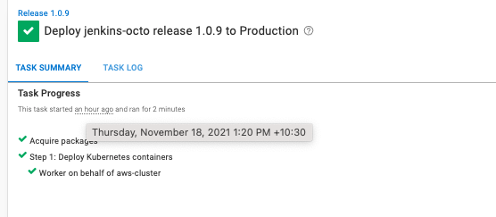

This blog will build a docker image in a Jenkinsfile workflow and publish the image to Amazon Elastic Container Registry (ECR). A deployment will be triggered in Octopus Deploy to deploy to Amazon Elastic Kubernetes Service. To follow along, you will need:

- An Amazon Web Services Account (AWS)
- A GitHub account
- [A Jenkins instance set up with a pipeline](https://github.com/OctopusDeploy/blog/blob/2022-q1/blog/2022-q1/jenkins-docker-ecr/index.md)

Extend the pipeline with Octopus Release and Deploy commands

```

node {
    def app

    stage('Clone repository') {

        checkout scm
    }

    stage('Build image') {
        /* Referencing the image name in AWS */

        app = docker.build("jenkins-ecr")
    }
    
    stage('Test image') {
    /* Empty for test purposes */

    }

    stage('Push image') {
        /* Referencing the AWS registry. Tagging with the Jenkins build number and the latest tag */
        docker.withRegistry('https://720766170633.dkr.ecr.us-east-2.amazonaws.com', 'ecr:us-east-2:aws-credentials') {
            app.push("${env.BUILD_NUMBER}")
            app.push("latest")
        }
    }
    
        stage('Create and Deploy Release') {
        octopusCreateRelease additionalArgs: '', cancelOnTimeout: false, channel: '', defaultPackageVersion: '', deployThisRelease: false, deploymentTimeout: '', environment: "Production", jenkinsUrlLinkback: false, project: "jenkins-octo", releaseNotes: false, releaseNotesFile: '', releaseVersion: "1.0.${BUILD_NUMBER}", tenant: '', tenantTag: '', toolId: 'Default', verboseLogging: false, waitForDeployment: false
        octopusDeployRelease cancelOnTimeout: false, deploymentTimeout: '', environment: "Production", project: "jenkins-octo", releaseVersion: "1.0.${BUILD_NUMBER}", tenant: '', tenantTag: '', toolId: 'Default', variables: '', verboseLogging: false, waitForDeployment: true
            
    }
}

```





## Set Up Octopus Deploy

In your Octopus Deploy instance, create a project called `jenkins-octo` by going to **Project, Add Project** Add the `jenkins-octo` title and click **Save**.

Set up a Production Environment by going to **Infrastructure, Environements, Add Environment**. Give it a name and click **Save**

We need to set up the Amazon account to deploy to EKS. Go to **Infrastructure, Accounts, Add Account, AWS Account**. Give it a name and fill out the **Access Key ID and Secret Access Key** from earlier.

Set up your AWS Kubernetes cluster as a deployment target in Octopus Deploy by going to **Infrastructure, Deployment Targets, Add Deployment Target, Kubernetes Cluster, Add**


## Deploy to EKS step

In your `jenkins-octo` project, go to **Process, add deployment step, Kubernetes, Deploy Kubernetes Containers**

Add the following YAML into the YAML section

```
apiVersion: apps/v1
kind: Deployment
metadata:
  name: octopus-underwater-app-octo
  labels:
    app: octopus-underwater-app-octo
spec:
  selector:
    matchLabels:
      app: octopus-underwater-app-octo
  replicas: 3
  strategy:
    type: RollingUpdate
  template:
    metadata:
      labels:
        app: octopus-underwater-app-octo
        octopusexport: OctopusExport
    spec:
      containers:
        - name: octopus-underwater-app
          image: underwater
          ports:
            - containerPort: 80
              protocol: TCP

```

For the container image, you will have to use the UI to point to the ECR repository.

Click **SAVE**

## Deploy in Jenkins


Make a change to the code on GitHub and the build will trigger in Jenkins and Octopus


You can navigate directly to the Octopus Deploy instance and deployment through the Octopus Icon.

This command will point the CLI to your cluster:

    kubectl get deployments

Running this command will get the list of deployments on the cluster. You should see the deployment `octopus-deployment`. Use this command to expose the web application:

    kubectl port-forward deployment/octopus-underwater-app-octo  28019:80
    
Go to the IP address in the browser to view your web application.

127.0.0.1:28019


## The benefits of a dedicated CD tool

Octopus is a dedicated continuous delivery tool. It natively supports release management. In Jenkins, environments are defined through the pipeline file. They are just dividers to the pipeline code. In Octopus, environments are dedicated, seperated spaces where deployments can be deployed to. This makes it easy to stop a deployment at a staging environment before it gets pushed to production. The following dashboard shows how this capability is visualised. Different releases are present in different environemnts, and it is easy to see the stage where releases are at.

Jenkins is a continous integration tool. It can be used to build and push an image to a central repository. Octopus Deploy can interface with several different repositories and manage the deployment process. This seperation of concerns allows both Jenkins and Octopus Deploy to focus on what they are good at, enabling happier deployments.


