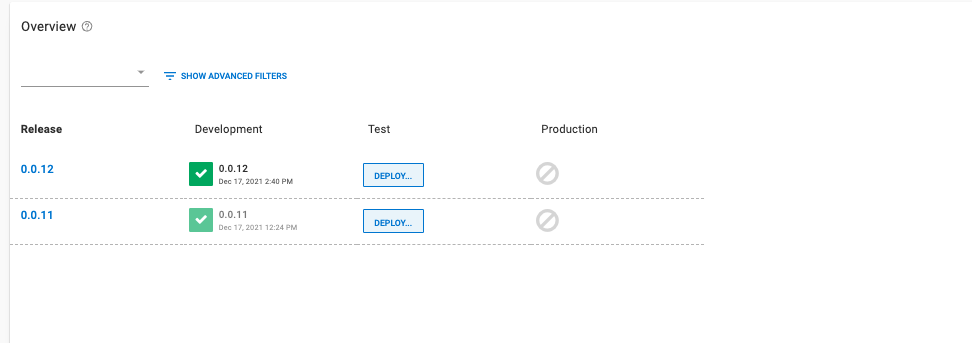

This blog will build and push the Octopus Underwater App to Amazon Elastic Container Registry (ECR). Jenkins will trigger a deployment in Octopus Deploy. Octopus Deploy will deploy the App to Amazon Elastic Kubernetes Service. To follow along, you will need:

- An Amazon Web Services Account (AWS)
- A GitHub account
- [A Jenkins instance set up with a pipeline](https://github.com/OctopusDeploy/blog/blob/2022-q1/blog/2022-q1/jenkins-docker-ecr/index.md).This was set up as part of a previous blog. If using the branch, specify the jenkins-octopus branch reference in Jenkins.

This blog will use the [Octopus Underwater app repository](https://github.com/OctopusSamples/octopus-underwater-app). You can fork the repository and use the main branch to follow along. The jenkins-octopus branch contains the template files needed to complete the steps in this blog. You will have to replace some values with your own. I have included my values in this blog as a reference.

## Amazon Web Services setup

To set up AWS for Jenkins, we need to create an access key and an ECR repository to store the image.

To create an access key, go to **Amazon Console &rarr; IAM &rarr; Users &rarr; [your user] &rarr; Security credentials &rarr; Create Access Key**

Your browser will download a file containing the Access Key ID and the Secret Access Key. These values will be used in Jenkins to authenticate to Amazon.

To create a repository, go to the **Amazon Console &rarr; ECR &rarr; Create Repository**

The ECR requires an image repository set up for each image you publish. Name the repository the name you want the image to have. 

You will see your repository under **Amazon ECR &rarr; Repositories**. Make a note of the zone it is in, in the URI field.


### AWS Cluster setup

[Set up the cluster in AWS using this guide](https://github.com/OctopusDeploy/blog/blob/2022-q1/blog/2022-q1/eks-cluster-aws/index.md)


Extend the pipeline with Octopus Release and Deploy commands. Create a Jenkinsfile and paste the following code.

```


pipeline {
    agent any
    options {
        skipStagesAfterUnstable()
    }
    stages {
         stage('Clone repository') { 
            steps { 
                script{
                checkout scm
                }
            }
        }
        
        stage('Build') { 
            steps { 
                script{
                 app = docker.build("octopus-underwater-app")
                }
            }
        }
        stage('Test'){
            steps {
                 echo 'Empty'
            }
        }
        stage('Push') {
            steps {
                script{
                        docker.withRegistry('https://720766170633.dkr.ecr.us-east-2.amazonaws.com', 'ecr:us-east-2:aws-credentials') {
                    app.push("${env.BUILD_NUMBER}")
                    app.push("latest")
                    }
                }
            }
        }
        stage('Deploy'){
            steps {
                script{
                    octopusCreateRelease additionalArgs: '', cancelOnTimeout: false, channel: '', defaultPackageVersion: '', deployThisRelease: false, deploymentTimeout: '', environment: "Development", jenkinsUrlLinkback: false, project: "underwater-octo", releaseNotes: false, releaseNotesFile: '', releaseVersion: "1.0.${BUILD_NUMBER}", tenant: '', tenantTag: '', toolId: 'Default', verboseLogging: false, waitForDeployment: false
                    octopusDeployRelease cancelOnTimeout: false, deploymentTimeout: '', environment: "Development", project: "underwater-octo", releaseVersion: "1.0.${BUILD_NUMBER}", tenant: '', tenantTag: '', toolId: 'Default', variables: '', verboseLogging: false, waitForDeployment: true
                }
            }
        }
        
    }
}

```

## Set Up Octopus Deploy

In your Octopus Deploy instance, create a project called `aws-jenkins` by going to **Project, Add Project** Add the `aws-jenkins` title and click **Save**.

Set up a Development Environment by going to **Infrastructure, Environments, Add Environment**. Give it a name and click **Save**. Do the same for a Test and Production environment.

We need to set up the Amazon account to deploy to EKS. Go to **Infrastructure, Accounts, Add Account, AWS Account**. Give it a name and fill out the **Access Key ID and Secret Access Key** from earlier.

Set up your AWS Kubernetes cluster as a deployment target in Octopus Deploy by going to **Infrastructure, Deployment Targets, Add Deployment Target, Kubernetes Cluster, Add**. [These steps indicates the fields to add to set up the deployment target.](https://octopus.com/docs/infrastructure/deployment-targets#adding-deployment-targets) In this section you will give the deployment target a target role. This will be referenced in the Octopus Deploy step later.

We need to add the Amazon feed to the Octopus Instance. Go to **Library &rarr; External Feeds &rarr; Add Feed** and select the **AWS Elastic Container Registry**. Enter your **Access Key ID, Secret Access Key and Zone** of your registry. 


## Deploy to EKS step

In your `aws-jenkins` project, go to **Process, add deployment step, Kubernetes, Deploy Kubernetes Containers**. Add the target role that you gave your deployment target earler.

Add the following YAML into the YAML section.

```

apiVersion: apps/v1
kind: Deployment
metadata:
  name: octopus-underwater-app-jenkins
  labels:
    app: octopus-underwater-app
spec:
  selector:
    matchLabels:
        app: octopus-underwater-app
  replicas: 3
  strategy:
    type: RollingUpdate
  template:
    metadata:
      labels:
        app: octopus-underwater-app
    spec:
      containers:
        - name: octopus-underwater-app
          image: 720766170633.dkr.ecr.us-east-2.amazonaws.com/octopus-underwater-app
          ports:
            - containerPort: 80
              protocol: TCP
          imagePullPolicy: Always
```

Click **SAVE**.

## Deploy in Jenkins

To connect Jenkins to Octopus you will need to install the [Octopus Plugin](https://plugins.jenkins.io/octopusdeploy/). Go to **Dashboard &rarr; Manage Plugins**. If the plug in is not already installed, search for the Octopus Plugin in the available tab and install the plugin. [Follow this guide on how to set up Jenkins and the Octopus Plugin](https://octopus.com/docs/packaging-applications/build-servers/jenkins)

Once the Octopus plugin is set up, make a change to the code on GitHub, and the build will trigger in Jenkins and Octopus.


Navigate back to the Octopus instance project overview and you will see the release deployed to the development environment.



Now we can progress the release to the Test and Production environment when we are ready. Click Deploy to progress the release.


We will port forward locally to inspect the service. Use this command to inspect the web application. The port 28015 is chosen based on the example in the Kubernetes documentation:

    kubectl port-forward deployment/octopus-underwater-app-jenkins  28015:80
    
Go to the IP address http://127.0.0.1:28021/ in the browser to view your web application.


## The benefits of a dedicated CD tool

Octopus is a dedicated continuous delivery tool. It natively supports release management. Jenkins defines environments through the pipeline file. They are dividers to the pipeline code. In Octopus, environments are dedicated spaces. Octopus Deploy makes it easy to stop a deployment at a staging environment before it gets pushed to production. The following dashboard shows the capability. Different releases are present in different environments, and it is easy to see the stage where releases are in the lifecycle.

Jenkins is a continuous integration tool. It can do some parts of CD, but not all. Jenkins is commonly used to build and push images to a central repository. Octopus Deploy can interface with several different repositories and manage the deployment process. This separation of concerns allows Jenkins and Octopus Deploy to focus on what they are good at, enabling happier deployments.


