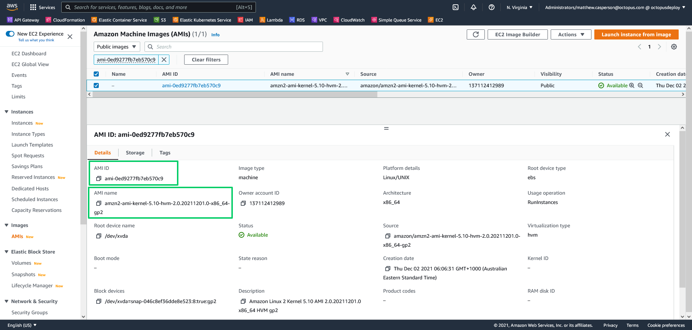

Many of the services provided by AWS are specific to individual regions, and Amazon Machine Images (AMIs) are just one example. While common AMIs are published to all regions, the AMI ID is unique per region.

This presents a challenge when writing CloudFormation scripts, as the AMI ID passed to EC2 resources is region specific, making your template region specific as well.

[Mappings](https://docs.aws.amazon.com/AWSCloudFormation/latest/UserGuide/intrinsic-function-reference-findinmap.html) can be used to write generic CloudFormation templates, allowing AMI IDs are mapped to a region and looked up when the template is deployed. Unfortunately, AMI IDs change frequently, and there are no easy mapping references to include in your templates.

In this post, you'll learn how to generate an up-to-date mapping with the latest regional AMI IDs for inclusion in your CloudFormation templates.

## Prerequisites

The script requires `jq`. The `jq` [download page](https://stedolan.github.io/jq/download/) includes instructions for installing the tool for major Linux distributions.

## The lookup script

The Bash script below builds a CloudFormation map in YAML:

```bash
#!/usr/bin/env bash
echo "Mappings:"
echo "  RegionMap:"
regions=$(aws ec2 describe-regions --output text --query 'Regions[*].RegionName')
for region in $regions; do
    (
     echo "    $region:"
     AMI=$(aws ec2 describe-images --region $region --filters Name=is-public,Values=true Name=name,Values="$1*" Name=architecture,Values=x86_64 | jq -r '.Images |= sort_by(.CreationDate) | .Images | reverse | .[0].ImageId')
     echo "      ami: $AMI"
    )
done
```

Save the script to a file like `amimap.sh`, and then mark the file as executable with the command:

```bash
chmod +x amimap.sh
```

The script is called with the AMI name (or the start of the AMI name) as the first argument:

```bash
./amimap.sh amzn2-ami-kernel-5.10
```

The output looks something like this:

```yaml
$ ./amimap.sh amzn2-ami-kernel-5.10-hvm
Mappings:
  RegionMap:
    eu-north-1:
      ami: ami-06bfd6343550d4a29
    ap-south-1:
      ami: ami-052cef05d01020f1d
    eu-west-3:
      ami: ami-0d3c032f5934e1b41
    eu-west-2:
      ami: ami-0d37e07bd4ff37148
    eu-west-1:
      ami: ami-04dd4500af104442f
    ap-northeast-3:
      ami: ami-0f1ffb565070e6947
    ap-northeast-2:
      ami: ami-0eb14fe5735c13eb5
    ap-northeast-1:
      ami: ami-0218d08a1f9dac831
    sa-east-1:
      ami: ami-0056d4296b1120bc3
    ca-central-1:
      ami: ami-0bae7412735610274
    ap-southeast-1:
      ami: ami-0dc5785603ad4ff54
    ap-southeast-2:
      ami: ami-0bd2230cfb28832f7
    eu-central-1:
      ami: ami-05d34d340fb1d89e5
    us-east-1:
      ami: ami-0ed9277fb7eb570c9
    us-east-2:
      ami: ami-002068ed284fb165b
    us-west-1:
      ami: ami-03af6a70ccd8cb578
    us-west-2:
      ami: ami-00f7e5c52c0f43726
```

## Using the mappings in CloudFormation

The following CloudFormation template demonstrates how the mappings generated by the script can be used:

```yaml
Mappings:
  RegionMap:
    eu-north-1:
      ami: ami-06bfd6343550d4a29
    ap-south-1:
      ami: ami-052cef05d01020f1d
    eu-west-3:
      ami: ami-0d3c032f5934e1b41
    eu-west-2:
      ami: ami-0d37e07bd4ff37148
    eu-west-1:
      ami: ami-04dd4500af104442f
    ap-northeast-3:
      ami: ami-0f1ffb565070e6947
    ap-northeast-2:
      ami: ami-0eb14fe5735c13eb5
    ap-northeast-1:
      ami: ami-0218d08a1f9dac831
    sa-east-1:
      ami: ami-0056d4296b1120bc3
    ca-central-1:
      ami: ami-0bae7412735610274
    ap-southeast-1:
      ami: ami-0dc5785603ad4ff54
    ap-southeast-2:
      ami: ami-0bd2230cfb28832f7
    eu-central-1:
      ami: ami-05d34d340fb1d89e5
    us-east-1:
      ami: ami-0ed9277fb7eb570c9
    us-east-2:
      ami: ami-002068ed284fb165b
    us-west-1:
      ami: ami-03af6a70ccd8cb578
    us-west-2:
      ami: ami-00f7e5c52c0f43726
Resources: 
  myEC2Instance: 
    Type: "AWS::EC2::Instance"
    Properties: 
      ImageId: !FindInMap
        - RegionMap
        - !Ref 'AWS::Region'
        - ami
      InstanceType: m1.small
```

## Finding AMI names

You'll notice from the command above that the AMI name must be passed as a parameter. However, the AWS console typically shows the AMI description, which is more user friendly. So how do you find the name from the AMI ID or description?

An easy solution is to open the **Images** link in the EC2 console. This allows public AMIs to be searched for either their ID or description, and the AMI details page then displays the AMI name:



## Using the parameter store

Another option that allows your CloudFormation templates to automatically reference the latest Amazon AMIs is to query the AWS Systems Manager Parameter Store. The blog post called [Query for the latest Amazon Linux AMI IDs using AWS Systems Manager Parameter Store](https://aws.amazon.com/blogs/compute/query-for-the-latest-amazon-linux-ami-ids-using-aws-systems-manager-parameter-store/) demonstrates how you can reference the latest Amazon Windows and Linux AMIs with templates that look like this:

```yaml
Parameters:
  LatestAmiId:
    Type: 'AWS::SSM::Parameter::Value<AWS::EC2::Image::Id>'
    Default: '/aws/service/ami-amazon-linux-latest/amzn2-ami-hvm-x86_64-gp2'

Resources:
 Instance:
    Type: 'AWS::EC2::Instance'
    Properties:
      ImageId: !Ref LatestAmiId
```

## Conclusion

Keeping your CloudFormation templates up-to-date with the latest AMI IDs is a constant challenge. It's made more complicated by the fact that every region has unique AMI IDs. 

In this post, you learned how to generate up-to-date mappings with regional AMI IDs to copy and paste into your CloudFormation templates.

Happy deployments!
