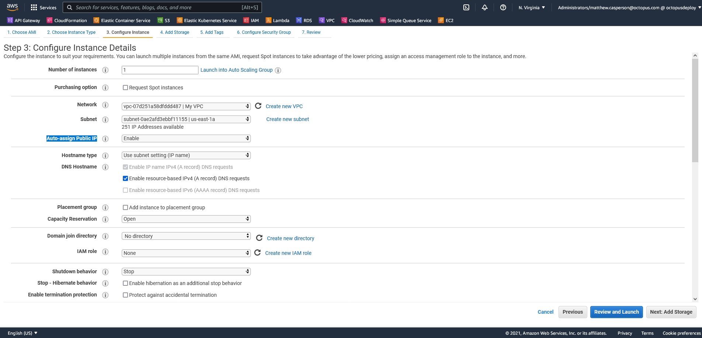
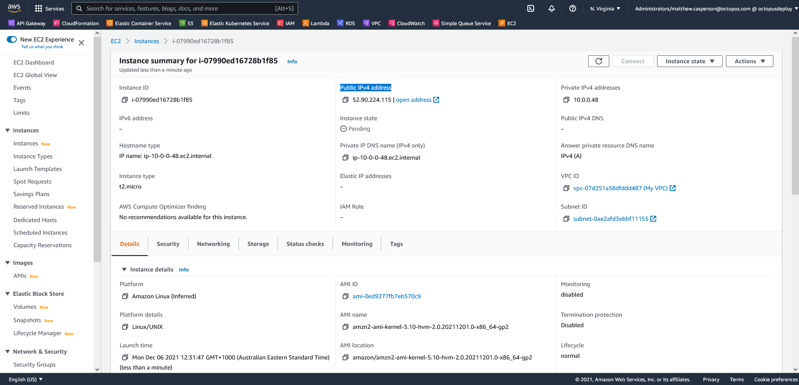

In our first post, [Create a private AWS VPC with CloudFormation](https://octopus.com/blog/aws-vpc-private), you looked at how to create a VPC with private subnets. Instances in this VPC had no internet access and could only communicate with instances in the subnets in the same VPC.

In this post, you create a VPC with public subnets, allowing instances to access, and be accessed from, the internet.

## Types of subnets

AWS has two types of subnets: public and private.

A public subnet has a connection to the internet via an [internet gateway](https://docs.aws.amazon.com/vpc/latest/userguide/VPC_Internet_Gateway.html), and can host resources with public IP addresses. An internet gateway is defined by AWS as:

> a horizontally scaled, redundant, and highly available VPC component that allows communication between your VPC and the internet. 

A private subnet does not route traffic to an internet gateway. Resources in a private subnet do not have public IP addresses, and can only communicate with resources in other subnets within the same VPC.

A VPC with public subnets allows instances to access the internet. If those instances have public IP addresses, they can also be access from the internet.

## Creating a VPC with public subnets

The following CloudFormation template creates a VPC with two public subnets:

```yaml
Parameters:
  Tag:
    Type: String
    
Resources: 
  VPC:
    Type: "AWS::EC2::VPC"
    Properties:
      CidrBlock: "10.0.0.0/16"
      InstanceTenancy: "default"
      Tags:
      - Key: "Name"
        Value: !Ref "Tag"    
        
  SubnetA:
    Type: "AWS::EC2::Subnet"
    Properties:
      AvailabilityZone: !Select 
        - 0
        - !GetAZs 
          Ref: 'AWS::Region'
      VpcId: !Ref "VPC"
      CidrBlock: "10.0.0.0/24"

  SubnetB:
    Type: "AWS::EC2::Subnet"
    Properties:
      AvailabilityZone: !Select 
        - 1
        - !GetAZs 
          Ref: 'AWS::Region'
      VpcId: !Ref "VPC"
      CidrBlock: "10.0.1.0/24"
      
  RouteTable:
    Type: "AWS::EC2::RouteTable"
    Properties:
      VpcId: !Ref "VPC"

  InternetGateway:
    Type: "AWS::EC2::InternetGateway"
    
  VPCGatewayAttachment:
    Type: "AWS::EC2::VPCGatewayAttachment"
    Properties:
      VpcId: !Ref "VPC"
      InternetGatewayId: !Ref "InternetGateway"
      
  InternetRoute:
    Type: "AWS::EC2::Route"
    Properties:
      DestinationCidrBlock: "0.0.0.0/0"
      GatewayId: !Ref InternetGateway
      RouteTableId: !Ref RouteTable
      
  SubnetARouteTableAssociation:
    Type: "AWS::EC2::SubnetRouteTableAssociation"
    Properties:
      RouteTableId: !Ref RouteTable
      SubnetId: !Ref SubnetA
      
  SubnetBRouteTableAssociation:
    Type: "AWS::EC2::SubnetRouteTableAssociation"
    Properties:
      RouteTableId: !Ref RouteTable
      SubnetId: !Ref SubnetB
      
Outputs:
  VpcId:
    Description: The VPC ID
    Value: !Ref VPC
```

The template above builds on the template presented in the previous post, [Create a private AWS VPC with CloudFormation](https://octopus.com/blog/aws-vpc-private), adding an internet gateway and the route tables required to direct traffic to the internet. Refer to the [previous post](https://octopus.com/blog/aws-vpc-private) to read the details of the VPC, Subnet, and Route Table resources.

To connect the VPC to the internet, you must attach an internet gateway, represented by the [AWS::EC2::InternetGateway](https://docs.aws.amazon.com/AWSCloudFormation/latest/UserGuide/aws-resource-ec2-internetgateway.html) resource. This resource does not support any configuration properties beyond adding custom tags:

```yaml
  InternetGateway:
    Type: "AWS::EC2::InternetGateway"
```

The internet gateway is attached to a VPC via the [AWS::EC2::VPCGatewayAttachment](https://docs.aws.amazon.com/AWSCloudFormation/latest/UserGuide/aws-resource-ec2-vpc-gateway-attachment.html) resource:

```yaml
  VPCGatewayAttachment:
    Type: "AWS::EC2::VPCGatewayAttachment"
    Properties:
      VpcId: !Ref "VPC"
      InternetGatewayId: !Ref "InternetGateway"
```

To direct external traffic through the internet gateway, you must create a route, represented by the [AWS::EC2::Route](https://docs.aws.amazon.com/AWSCloudFormation/latest/UserGuide/aws-resource-ec2-route.html) resource.

The route below defines a `DestinationCidrBlock` of `0.0.0.0/0`, which matches all traffic. This route will be applied after the default route which connects instances in subnets in the same VPC, so only traffic not destined for another instance in the VPC will be affected by this route. In practice this means any external traffic is directed through the internet gateway:

```yaml
  InternetRoute:
    Type: "AWS::EC2::Route"
    Properties:
      DestinationCidrBlock: "0.0.0.0/0"
      GatewayId: !Ref InternetGateway
      RouteTableId: !Ref RouteTable
```

The route is then associated with both subnets via the [AWS::EC2::SubnetRouteTableAssociation](https://docs.aws.amazon.com/AWSCloudFormation/latest/UserGuide/aws-resource-ec2-subnet-route-table-assoc.html) resource, which makes them public subnets:

```yaml
  SubnetARouteTableAssociation:
    Type: "AWS::EC2::SubnetRouteTableAssociation"
    Properties:
      RouteTableId: !Ref RouteTable
      SubnetId: !Ref SubnetA
      
  SubnetBRouteTableAssociation:
    Type: "AWS::EC2::SubnetRouteTableAssociation"
    Properties:
      RouteTableId: !Ref RouteTable
      SubnetId: !Ref SubnetB
```

To deploy this template, use the [Deploy an AWS CloudFormation template](https://octopus.com/docs/deployments/aws/cloudformation) step. Note how EC2 instances placed in this VPC have the option to receive public IP addresses:



The IP address assigned to the EC2 instance allows you to SSH into it from your local PC:



## Conclusion

Public subnets allow instances to access the internet, and give them the option of being assigned a public IP address. Creating a VPC with public subnets requires building an internet gateway, attaching it to the VPC, defining a route to direct public traffic through the internet gateway, and assigning the routes to the subnets.

In this post you looked at a CloudFormation template creating a VPC with two public subnets. In the [next post](https://octopus.com/blog/aws-vpc-public-private/index.md) you learn how to create a VPC with both public and private subnets, and a NAT Gateway to grant internet access to instances in the private subnet.

!include <q2-2022-newsletter-cta>

Happy deployments!