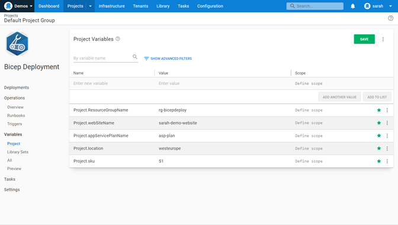
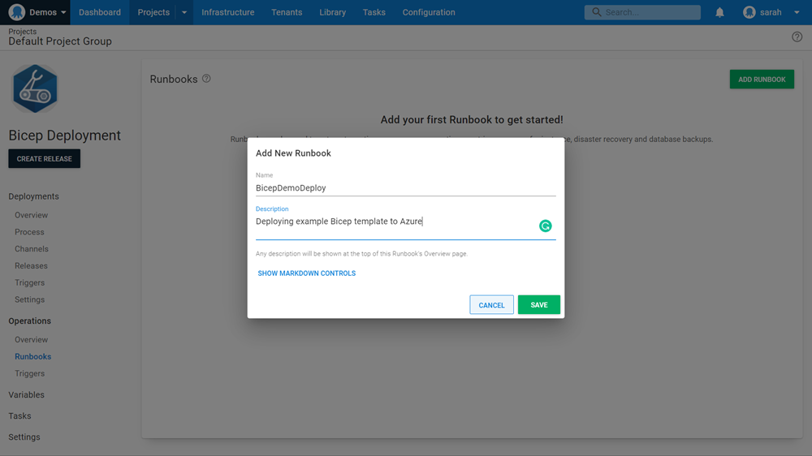
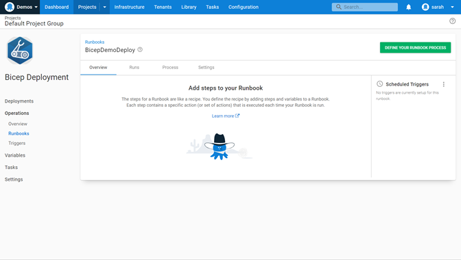
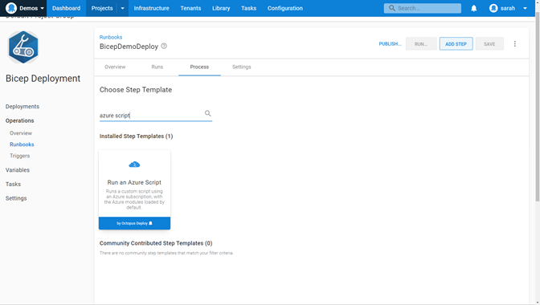
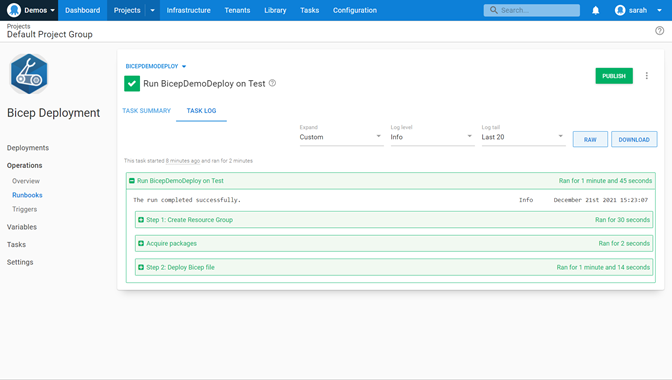

In late 2020, Microsoft announced their new project, [Bicep](https://docs.microsoft.com/azure/azure-resource-manager/bicep/overview), a Domain-Specific Language (DSL) for deploying Azure resources. Bicep aims to simplify the authoring experience, making it easy to learn. It's also modular and re-usable. 

Bicep is very popular in the IT community. You can find blog posts, tweets, conference sessions, and plenty of interaction on the official [Bicep GitHub space](https://github.com/Azure/bicep). Bicep has been supported by Microsoft Support Plans as of v.0.3, and is considered ready for production. 

In this post, I introduce Bicep templates and show you how to automate their deployment using [Octopus Runbooks](https://octopus.com/docs/runbooks).

## Getting started with Bicep and Octopus

### Prerequisites

You need the following tooling to get started with Bicep: 

- [Visual Studio Code](https://code.visualstudio.com/)
- [Bicep extension for Visual Studio Code](https://marketplace.visualstudio.com/items?itemName=ms-azuretools.vscode-bicep)
- [Azure PowerShell](https://docs.microsoft.com/powershell/azure/install-az-ps?view=azps-7.0.0)
- [Azure CLI](https://docs.microsoft.com/cli/azure/install-azure-cli)
- [Octopus CLI](https://octopus.com/docs/octopus-rest-api/octopus-cli)

### Creating your first Bicep template

Microsoft provides the [Bicep Microsoft Learning Path](https://docs.microsoft.com/en-gb/learn/paths/fundamentals-bicep/) to help you get started. 

In this post, I explain how to create a basic template. The post assumes you have experience with ARM templates or similar. I walk through the creation of an Azure App Service Plan and Azure Linux Web App. 

First in the template, you need to declare the parameters and variables you're using: 

```json
// Declare parameters
param sku string
param linuxFxVersion string = 'node|14-lts' // The runtime stack of web app
param location string
param resourceTags object = {
  Environment: 'Tutorial'
  Owner: 'Me'
} // Tags for all resources
param appServicePlanName string
param webSiteName string
```

You can declare static entries for these parameters or you can leave them blank and then input values during deployment. In this example, you're declaring some as static but leaving others blank so you can pass in the information during deployment.  

Next, you define how you want to deploy your Azure App Service Plan: 

```json
// Deploying the Azure App Service Plan
resource appServicePlan 'Microsoft.Web/serverfarms@2021-02-01' = {
  name: appServicePlanName
  location: location
  tags: resourceTags
  properties: {
    reserved: true
  }
  sku: {
    name: sku
  }
  kind: 'linux'
}
```

I'll break some of this down for you: 

- The resource identifier (resource `appServicePlan`) - tells Bicep to create a new resource named `appServicePlan`. This name identifies the resource in the Bicep template. It's not the name of the resource that you'll create in Azure. 
- `Microsoft.Web/serverfarms@2021-02-01` - defines the resource provider `Microsoft.Web`, then the resource type `serverfarms`, and lastly the API version `2021-02-01` to use.  It’s always worth checking the official Microsoft documentation to see if there's a newer API. 
- Name - this is the actual name of the Azure resource.
- Location - this is the Azure region you'll deploy in.
- Tags - tagging your resources helps you organize them logically.
- Properties - this is where you can begin to configure the App Service Plan to your needs. Here, you’re defining the SKU and the kind (Linux or Windows). 

Next you deploy the Azure Web App:

```json
// Deploying the Azure Web App
resource appService 'Microsoft.Web/sites@2021-02-01' = {
  name: webSiteName
  location: location
  tags: resourceTags
  properties: {
    serverFarmId: appServicePlan.id
    siteConfig: {
      linuxFxVersion: linuxFxVersion
    }
  }
}
```

I'll break this down for you: 

- The resource identifier (resource `appService`) - tells Bicep to create a new resource named `appService`. This name identifies the resource in the Bicep template.  It's not the name of the resource that you'll create in Azure. 
- `Microsoft.Web/sites@2021-02-01` - defines the resource provider `Microsoft.Web`, then the resource type `sites`, and lastly the API version `2021-02-01` to use.  It’s always worth checking the official Microsoft documentation to see if there's a newer API. 
- Name - this is the actual name of the Azure resource.
- Location - this is the Azure region you'll deploy in.
- Tags - tagging your resources helps organize them logically.
- Properties - this where you begin to configure the App Service. You defined which App Service Plan you're using with this web app and the Linux version you want. There are more settings you can configure but we keep it simple for this example. 

The template is now complete. You can [see the completed template on GitHub](https://gist.github.com/weeyin83/7a9a20a5fc7e10e65561b4d5e6ed4019). 

### Preparing your Bicep template for use in Octopus Deploy

To run your Bicep template file inside an Octopus Runbook, you first need to save it inside a ZIP file using the Octopus CLI. 

```bash
octo pack --id="BicepTemplate" --format="zip" --version="1.0.0.0" --basePath="c:\Bicep\" --outFolder="c:\Bicep"
```

You can upload the ZIP file to the Octopus Library through the portal or use the Octopus CLI again. 

```bash
octo push --package="c:\bicep\BicepTemplate.1.0.0.0.zip" --server="https://MyOctopusServer" --apiKey="API-MyApiKey"
```

### Running the Bicep template from an Octopus Runbook

With your Bicep ZIP file in Octopus, it’s time to automate its deployment. 

:::hint
This post assumes you have an Octopus environment set up and have connected your [Azure account](https://octopus.com/docs/infrastructure/accounts/azure). 
:::

In a new or existing project, click **Variables** in the left menu. 

You need to define the variables for deployment. Enter variables for:

- Resource Group
- Web Site Name
- App Service Plan Name
- Location 
- App Service plan SKU



After you enter the variables, navigate to **Operations** and click **Runbooks**. 

Select **Add Runbook** to create a new runbook to deploy your Bicep template. 



In this runbook, click **DEFINE YOUR RUNBOOK PROCESS**. 



The first step to add is **Run an Azure Script**. This step creates the Azure Resource Group to hold your resources.  



Give the step a name for reference. Then, enter the details of your Azure account. 

Next, enter the script that will create your Resource Group, using an Azure CLI command.

```bash
az group create -l $OctopusParameters["Project.location"] -n $OctopusParameters["Project.ResourceGroupName"]
```

You're using some of the variables you declared in an earlier step. 


Now you need to add another **Run an Azure Script** step. This deploys your Bicep template, so name it appropriately.  Then, scroll to the Azure section and again add your Azure account details.

Next, scroll to the **Script** section and enter the following script:

```powershell
# Tell the deployment to use the package we’ve associated and the file path
$filePath = $OctopusParameters["Octopus.Action.Package[BicepTemplate].ExtractedPath"]

# Change Directory to extracted package
cd $filePath

# Get current date and set the deployment name
$today=Get-Date -Format "dd-MM-yyyy"
$deploymentName="BicepDeploy"+"$today"

# Deploy Bicep template and pull in the variable information
New-AzResourceGroupDeployment -Name $deploymentName -ResourceGroupName $OctopusParameters["Project.ResourceGroupName"] -TemplateFile webapp.bicep  -sku $OctopusParameters["Project.sku"] -location $OctopusParameters["Project.location"] -appServicePlanName $OctopusParameters["Project.appServicePlanName"] -webSiteName $OctopusParameters["Project.webSiteName"]
```

:::success
If you're using your own [Workers](https://octopus.com/docs/infrastructure/workers), please check you have Azure CLI, Azure PowerShell, and Bicep installed. 
:::

The script above uses the Bicep ZIP file. Enter a deployment name so you can trace the history of the deployment. The script uses the PowerShell command to deploy the template file and pull in the variables you declared in Octopus. 

Just below the script box, navigate to the section **Referenced Package** and click **Add**.  Select the ZIP file with your Bicep file. 

You can now save this deployment process and run the deployment. 



## Conclusion

You can build on this basic Bicep deployment by creating [Bicep modules](https://docs.microsoft.com/azure/azure-resource-manager/bicep/modules) for more complex deployments. 

Reach out in the comments below or via our [Slack community](https://octopus.com/slack) if you're using Bicep to deploy resources to your environments, and let me know if have any questions.

!include <q2-2022-newsletter-cta>

Happy deployments! 
