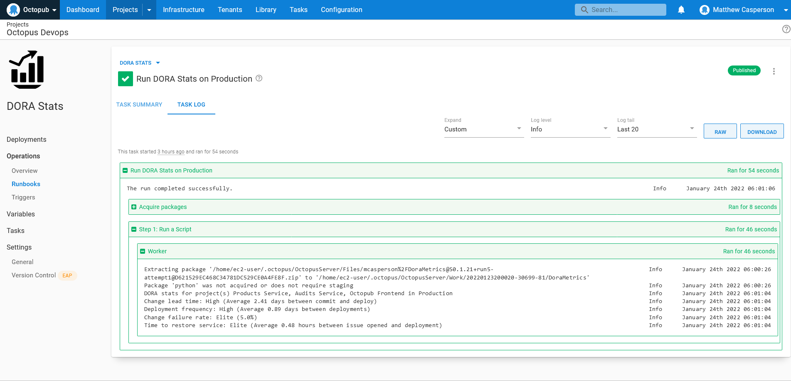

The [DevOps Research and Assessment](https://www.devops-research.com/research.html) annual report captures input from tens of thousands of professionals worldwide, and ranks the performance of software development teams using four key metrics:

* Deployment Frequency — How often an organization successfully releases to production.
* Lead Time for Changes — The amount of time it takes a commit to get into production.
* Change Failure Rate — The percentage of deployments causing a failure in production.
* Time to Restore Service — How long it takes an organization to recover from a failure in production.

A challenge for teams is then how to calculate these metrics. Fortunately, Octopus captures most of the raw information required to generate these metrics, and in this post you'll learn how to query the Octopus API to calculate scores for the DORA metics with a custom runbook.

## Prerequisites

This post uses GitHub Actions as a CI server. GitHub Actions are free for public git repositories, so you only need a GitHub account to get started.

The sample runbook script is written against Python 3, which can be downloaded from the [Python website](https://www.python.org/downloads/). The example runbook source code can be found on [GitHub](https://github.com/OctopusSamples/DoraMetrics).

## Producing build information

[Build information](https://octopus.com/docs/packaging-applications/build-servers/build-information) provides additional metadata for packages referenced in an Octopus deployment or runbook. Build information packages are separate artifacts stored on the Octopus server with the same package ID and version as the package they represent. This allows Octopus to track metadata for all kinds of packages, whether stored in the built-in feed or hosted on external repositories.

Build information captures information such as the commits that are included in the compiled artifact and lists of work items (known as issues in GitHub) that were closed.

The [xo-energy/action-octopus-build-information](https://github.com/xo-energy/action-octopus-build-information) action provides the ability to create and upload a build information package. The step below shows an example of the action:

```yaml
    - name: Generate Octopus Deploy build information
      uses: xo-energy/action-octopus-build-information@v1.1.2
      with:
        octopus_api_key: ${{ inputs.octopus_api_token }}
        octopus_project: Products Service
        octopus_server: ${{ inputs.octopus_server_url }}
        push_version: 0.1.${{ inputs.run_number }}${{ env.BRANCH_NAME != 'master' && format('-{0}', env.BRANCH_NAME) || ''  }}
        push_package_ids: com.octopus.octopub:products-service
        push_overwrite_mode: OverwriteExisting
        output_path: octopus
        octopus_space: "Octopub"
        octopus_environment: "Development"
```

Pushing the build information package is all that is needed for Octopus to link the metadata to a release. The build information is linked to the release as long as the build information package ID and version matches a package used in an Octopus step. 

With commits and work items now associated with each Octopus release, the next task is to determine how this information can be used to measure the four key metrics.

## Interpreting the DORA metrics

One thing you'll notice about the DORA metrics is that they are very high level and do not define specific rules for how they are measured. This makes sense, because every team and toolchain will have slightly different interpretations of what a deployment is, or what a production failure is.

So to calculate the metrics, you must first decide exactly how to measure them with the data you have available.

For the purpose of this post, the DORA metrics will be calculated as follows:

* Deployment Frequency - The frequency of deployments to the production environment.
* Lead Time for Changes - The time between the earliest commit associated with a release and the deployment to the production environment.
* Change Failure Rate - The percentage of deployments to the production environment that resolved an issue.
* Time to Restore Service - The time between an issue being opened and closed.

You'll note that some of these measurements have been simplified for convenience or require external sources, like GitHub issues, to accurately track outages. 

For example, the change failure rate metric technically tracks deployments that caused an issue, not deployments that resolved an issue, as we have defined it here. However, the data exposed by build information packages makes is easy to track the resolved issues in a given release, and we assume the rate at which deployments resolve issues is a good proxy for the rate at which deployments introduce issues.

Also, the time to restore service metric assumes all issues represent bugs or regressions deployed to production. In reality, issues tend to track a wide range of changes from bugs to enhancements. The solution presented here does not make this distinction though.

It is certainly possible to track which deployments resulted in production issues, so long as you create the required custom fields in your issue tracking platform and are diligent about populating them. It is also possible to distinguish between issues that document issues and those that represent enhancements. However, this level of tracking won't be discussed in this post.

## Calculating the metrics

The complete script you'll use to generate DORA metrics is shown below:

```python
import sys
from datetime import datetime
from functools import cmp_to_key
from requests.auth import HTTPBasicAuth
from requests import get
import argparse
import pytz

parser = argparse.ArgumentParser(description='Calculate the DORA metrics.')
parser.add_argument('--octopusUrl', dest='octopus_url', action='store', help='The Octopus server URL',
                    required=True)
parser.add_argument('--octopusApiKey', dest='octopus_api_key', action='store', help='The Octopus API key',
                    required=True)
parser.add_argument('--githubUser', dest='github_user', action='store', help='The GitHub username',
                    required=True)
parser.add_argument('--githubToken', dest='github_token', action='store', help='The GitHub token/password',
                    required=True)
parser.add_argument('--octopusSpace', dest='octopus_space', action='store', help='The Octopus space',
                    required=True)
parser.add_argument('--octopusProject', dest='octopus_project', action='store',
                    help='A comma separated list of Octopus projects', required=True)
parser.add_argument('--octopusEnvironment', dest='octopus_environment', action='store', help='The Octopus environment',
                    required=True)

args = parser.parse_args()

headers = {"X-Octopus-ApiKey": args.octopus_api_key}
github_auth = HTTPBasicAuth(args.github_user, args.github_token)


def parse_github_date(date_string):
    if date_string is None:
        return None
    return datetime.strptime(date_string.replace("Z", "+0000"), '%Y-%m-%dT%H:%M:%S%z')


def parse_octopus_date(date_string):
    if date_string is None:
        return None
    return datetime.strptime(date_string[:-3] + date_string[-2:], '%Y-%m-%dT%H:%M:%S.%f%z')


def compare_dates(date1, date2):
    date1_parsed = parse_octopus_date(date1["Created"])
    date2_parsed = parse_octopus_date(date2["Created"])
    if date1_parsed < date2_parsed:
        return -1
    if date1_parsed == date2_parsed:
        return 0
    return 1


def get_space_id(space_name):
    url = args.octopus_url + "/api/spaces?partialName=" + space_name.strip() + "&take=1000"
    response = get(url, headers=headers)
    spaces_json = response.json()

    filtered_items = [a for a in spaces_json["Items"] if a["Name"] == space_name.strip()]

    if len(filtered_items) == 0:
        sys.stderr.write("The space called " + space_name + " could not be found.\n")
        return None

    first_id = filtered_items[0]["Id"]
    return first_id


def get_resource_id(space_id, resource_type, resource_name):
    if space_id is None:
        return None

    url = args.octopus_url + "/api/" + space_id + "/" + resource_type + "?partialName=" \
          + resource_name.strip() + "&take=1000"
    response = get(url, headers=headers)
    json = response.json()

    filtered_items = [a for a in json["Items"] if a["Name"] == resource_name.strip()]
    if len(filtered_items) == 0:
        sys.stderr.write("The resource called " + resource_name + " could not be found in space " + space_id + ".\n")
        return None

    first_id = filtered_items[0]["Id"]
    return first_id


def get_resource(space_id, resource_type, resource_id):
    if space_id is None:
        return None

    url = args.octopus_url + "/api/" + space_id + "/" + resource_type + "/" + resource_id
    response = get(url, headers=headers)
    json = response.json()

    return json


def get_deployments(space_id, environment_id, project_id):
    if space_id is None or environment_id is None or project_id is None:
        return None

    url = args.octopus_url + "/api/" + space_id + "/deployments?environments=" + environment_id + "&take=1000"
    response = get(url, headers=headers)
    json = response.json()

    filtered_items = [a for a in json["Items"] if a["ProjectId"] == project_id]
    if len(filtered_items) == 0:
        sys.stderr.write("The project id " + project_id + " did not have a deployment in " + space_id + ".\n")
        return None

    sorted_list = sorted(filtered_items, key=cmp_to_key(compare_dates), reverse=True)

    return sorted_list


def get_change_lead_time():
    change_lead_times = []
    space_id = get_space_id(args.octopus_space)
    environment_id = get_resource_id(space_id, "environments", args.octopus_environment)
    for project in args.octopus_project.split(","):
        project_id = get_resource_id(space_id, "projects", project)
        deployments = get_deployments(space_id, environment_id, project_id)
        for deployment in deployments:
            earliest_commit = None
            release = get_resource(space_id, "releases", deployment["ReleaseId"])
            for buildInfo in release["BuildInformation"]:
                for commit in buildInfo["Commits"]:
                    api_url = commit["LinkUrl"].replace("github.com", "api.github.com/repos") \
                        .replace("commit", "commits")
                    commit_response = get(api_url, auth=github_auth)
                    date_parsed = parse_github_date(commit_response.json()["commit"]["committer"]["date"])
                    if earliest_commit is None or earliest_commit > date_parsed:
                        earliest_commit = date_parsed
            if earliest_commit is not None:
                change_lead_times.append((parse_octopus_date(deployment["Created"]) - earliest_commit).total_seconds())
    if len(change_lead_times) != 0:
        return sum(change_lead_times) / len(change_lead_times)
    return None


def get_time_to_restore_service():
    restore_service_times = []
    space_id = get_space_id(args.octopus_space)
    environment_id = get_resource_id(space_id, "environments", args.octopus_environment)
    for project in args.octopus_project.split(","):
        project_id = get_resource_id(space_id, "projects", project)
        deployments = get_deployments(space_id, environment_id, project_id)
        for deployment in deployments:
            deployment_date = parse_octopus_date(deployment["Created"])
            release = get_resource(space_id, "releases", deployment["ReleaseId"])
            for buildInfo in release["BuildInformation"]:
                for work_item in buildInfo["WorkItems"]:
                    api_url = work_item["LinkUrl"].replace("github.com", "api.github.com/repos")
                    commit_response = get(api_url, auth=github_auth)
                    created_date = parse_github_date(commit_response.json()["created_at"])
                    if created_date is not None:
                        restore_service_times.append((deployment_date - created_date).total_seconds())
    if len(restore_service_times) != 0:
        return sum(restore_service_times) / len(restore_service_times)
    return None


def get_deployment_frequency():
    deployment_count = 0
    earliest_deployment = None
    latest_deployment = None
    space_id = get_space_id(args.octopus_space)
    environment_id = get_resource_id(space_id, "environments", args.octopus_environment)
    for project in args.octopus_project.split(","):
        project_id = get_resource_id(space_id, "projects", project)
        deployments = get_deployments(space_id, environment_id, project_id)
        deployment_count = deployment_count + len(deployments)
        for deployment in deployments:
            created = parse_octopus_date(deployment["Created"])
            if earliest_deployment is None or earliest_deployment > created:
                earliest_deployment = created
            if latest_deployment is None or latest_deployment < created:
                latest_deployment = created
    if latest_deployment is not None:
        # return average seconds / deployment from the earliest deployment to now
        return (datetime.now(pytz.utc) - earliest_deployment).total_seconds() / deployment_count
        # You could also return the frequency between the first and last deployment
        # return (latest_deployment - earliest_deployment).total_seconds() / deployment_count
    return None


def get_change_failure_rate():
    releases_with_issues = 0
    deployment_count = 0
    space_id = get_space_id(args.octopus_space)
    environment_id = get_resource_id(space_id, "environments", args.octopus_environment)
    for project in args.octopus_project.split(","):
        project_id = get_resource_id(space_id, "projects", project)
        deployments = get_deployments(space_id, environment_id, project_id)
        deployment_count = deployment_count + len(deployments)
        for deployment in deployments:
            release = get_resource(space_id, "releases", deployment["ReleaseId"])
            for buildInfo in release["BuildInformation"]:
                if len(buildInfo["WorkItems"]) != 0:
                    # Note this measurement is not quite correct. Technically, the change failure rate
                    # measures deployments that result in a degraded service. We're measuring
                    # deployments that included fixes. If you made 4 deployments with issues,
                    # and fixed all 4 with a single subsequent deployment, this logic only detects one
                    # "failed" deployment instead of 4.
                    #
                    # To do a true measurement, issues must track the deployments that introduced the issue.
                    # There is no such out of the box field in GitHub actions though, so for simplicity
                    # we assume the rate at which fixes are deployed is a good proxy for measuring the
                    # rate at which bugs are introduced.
                    releases_with_issues = releases_with_issues + 1
    if releases_with_issues != 0 and deployment_count != 0:
        return releases_with_issues / deployment_count
    return None


def get_change_lead_time_summary(lead_time):
    if lead_time is None:
        print("Change lead time: N/A (no deployments or commits)")
    # One hour
    if lead_time < 60 * 60:
        print("Change lead time: Elite (Average " + str(round(lead_time / 60 / 60, 2))
                         + " hours between commit and deploy)")
    # Every week
    elif lead_time < 60 * 60 * 24 * 7:
        print("Change lead time: High (Average " + str(round(lead_time / 60 / 60 / 24, 2))
                         + " days between commit and deploy)")
    # Every six months
    elif lead_time < 60 * 60 * 24 * 31 * 6:
        print("Change lead time: Medium (Average " + str(round(lead_time / 60 / 60 / 24 / 31, 2))
                         + " months between commit and deploy)")
    # Longer than six months
    else:
        print("Change lead time: Low (Average " + str(round(lead_time / 60 / 60 / 24 / 31, 2))
                         + " months between commit and deploy)")


def get_deployment_frequency_summary(deployment_frequency):
    if deployment_frequency is None:
        print("Deployment frequency: N/A (no deployments found)")
    # Multiple times per day
    elif deployment_frequency < 60 * 60 * 12:
        print("Deployment frequency: Elite (Average " + str(round(deployment_frequency / 60 / 60, 2))
                         + " hours between deployments)")
    # Every month
    elif deployment_frequency < 60 * 60 * 24 * 31:
        print("Deployment frequency: High (Average " + str(round(deployment_frequency / 60 / 60 / 24, 2))
                         + " days between deployments)")
    # Every six months
    elif deployment_frequency < 60 * 60 * 24 * 31 * 6:
        print("Deployment frequency: Medium (Average " + str(round(deployment_frequency / 60 / 60 / 24 / 31, 2))
                         + " months bbetween deployments)")
    # Longer than six months
    else:
        print("Deployment frequency: Low (Average " + str(round(deployment_frequency / 60 / 60 / 24 / 31, 2))
                         + " months between commit and deploy)")


def get_change_failure_rate_summary(failure_percent):
    if failure_percent is None:
        print("Change failure rate: N/A (no issues or deployments found)")
    # 15% or less
    elif failure_percent <= 0.15:
        print("Change failure rate: Elite (" + str(round(failure_percent * 100, 0)) + "%)")
    # Interestingly, everything else is reported as High to Low
    else:
        print("Change failure rate: Low (" + str(round(failure_percent * 100, 0)) + "%)")


def get_time_to_restore_service_summary(restore_time):
    if restore_time is None:
        print("Time to restore service: N/A (no issues or deployments found)")
    # One hour
    elif restore_time < 60 * 60:
        print("Time to restore service: Elite (Average " + str(round(restore_time / 60 / 60, 2))
                         + " hours between issue opened and deployment)")
    # Every month
    elif restore_time < 60 * 60 * 24:
        print("Time to restore service: High (Average " + str(round(restore_time / 60 / 60, 2))
                         + " hours between issue opened and deployment)")
    # Every six months
    elif restore_time < 60 * 60 * 24 * 7:
        print("Time to restore service: Medium (Average " + str(round(restore_time / 60 / 60 / 24, 2))
                         + " hours between issue opened and deployment)")
    # Technically the report says longer than six months is low, but there is no measurement
    # between week and six months, so we'll say longer than a week is low.
    else:
        print("Deployment frequency: Low (Average " + str(round(restore_time / 60 / 60 / 24, 2))
                         + " hours between issue opened and deployment)")


print("DORA stats for project(s) " + args.octopus_project + " in " + args.octopus_environment)
get_change_lead_time_summary(get_change_lead_time())
get_deployment_frequency_summary(get_deployment_frequency())
get_change_failure_rate_summary(get_change_failure_rate())
get_time_to_restore_service_summary(get_time_to_restore_service())
```

Let's break this code down to understand what it is doing.

Your script will accept parameters from command line arguments to make it reusable across multiple Octopus instances and spaces. The arguments are parsed by the [argparse module](https://docs.python.org/3/library/argparse.html). You can find more information about using `argparse` [here](https://realpython.com/command-line-interfaces-python-argparse/):

```python
parser = argparse.ArgumentParser(description='Calculate the DORA metrics.')
parser.add_argument('--octopusUrl', dest='octopus_url', action='store', help='The Octopus server URL',
                    required=True)
parser.add_argument('--octopusApiKey', dest='octopus_api_key', action='store', help='The Octopus API key',
                    required=True)
parser.add_argument('--githubUser', dest='github_user', action='store', help='The GitHub username',
                    required=True)
parser.add_argument('--githubToken', dest='github_token', action='store', help='The GitHub token/password',
                    required=True)
parser.add_argument('--octopusSpace', dest='octopus_space', action='store', help='The Octopus space',
                    required=True)
parser.add_argument('--octopusProject', dest='octopus_project', action='store',
                    help='A comma separated list of Octopus projects', required=True)
parser.add_argument('--octopusEnvironment', dest='octopus_environment', action='store', help='The Octopus environment',
                    required=True)

args = parser.parse_args()
```

The script makes many requests to the Octopus and GitHub APIs, and all of the requests require authentication. 

The Octopus API uses the `X-Octopus-ApiKey` header to pass the API key used to authenticate requests. You can find more information on how to create an API in the [Octopus documentation](https://octopus.com/docs/octopus-rest-api/how-to-create-an-api-key).

The GitHub API uses standard HTTP basic authentication with a personal access token for the password. The [GitHub documentation](https://docs.github.com/en/authentication/keeping-your-account-and-data-secure/creating-a-personal-access-token) provides details on creating tokens.

The code below captures the objects containing the credentials passed with each API request throughout the rest of the script:

```python
headers = {"X-Octopus-ApiKey": args.octopus_api_key}
github_auth = HTTPBasicAuth(args.github_user, args.github_token)
```

The GitHub API returns dates in a specific format. The `parse_github_date` function takes these dates and converts them into Python datetime objects:

```python
def parse_github_date(date_string):
    if date_string is None:
        return None
    return datetime.strptime(date_string.replace("Z", "+0000"), '%Y-%m-%dT%H:%M:%S%z')
```

The Octopus returns dates in its own specific format. The `parse_octopus_date` function converts Octopus dates into Python datetime objects:

```python
def parse_octopus_date(date_string):
    if date_string is None:
        return None
    return datetime.strptime(date_string[:-3] + date_string[-2:], '%Y-%m-%dT%H:%M:%S.%f%z')
```

An important aspect of this script is the ability to find the latest release deployed to a given environment. This means comparing dates returned by the Octopus API.

The Octopus API returns dates in the ISO 8601 format, which looks like `2022-01-04T04:23:02.941+00:00`. Unfortunately, [Python 3.6 does not support timezone offsets that include colons](https://bugs.python.org/issue15873), forcing us to strip them out before parsing and comparing the dates. 

The `compare_dates` function takes two dates as strings, strips out the colons, parses the result, and returns a value of `1`, `0`, or `-1` indicating how `date1` compares to `date2`:

```python
def compare_dates(date1, date2):
    date1_parsed = parse_octopus_date(date1["Created"])
    date2_parsed = parse_octopus_date(date2["Created"])
    if date1_parsed < date2_parsed:
        return -1
    if date1_parsed == date2_parsed:
        return 0
    return 1
```

A common pattern used through this script (and most scripts working with the Octopus API) is to lookup the ID of a named resource. The `get_space_id` function takes the name of an Octopus space and queries the API to return the space ID:

```python
def get_space_id(space_name):
```

The `/api/spaces` endpoint returns a list of the spaces defined in the Octopus server. The `partialName` query parameter limits the result to spaces whose name includes the supplied value, while the `take` parameter is set to a large number to ensure you do not need to loop over any paged results:

```python
    url = args.octopus_url + "/api/spaces?partialName=" + space_name.strip() + "&take=1000"
```

A GET HTTP request is made against the endpoint, including the Octopus authentication headers, and the JSON result is parsed into Python nested dictionaries:

```python
    response = get(url, headers=headers)
    spaces_json = response.json()
```

The returned results could match any space whose name is, or includes, the supplied space name. This means that the spaces called `MySpace` and `MySpaceTwo` would be returned if we searched for the space called `MySpace`.

To ensure you return the ID of the space with the correct name, a [list comprehension](https://docs.python.org/3/tutorial/datastructures.html#list-comprehensions) filters the returned spaces to just those that exactly match the supplied space name:

```python
    filtered_items = [a for a in spaces_json["Items"] if a["Name"] == space_name.strip()]
```

The function will return `None` if none of the spaces match the supplied space name:

```python
    if len(filtered_items) == 0:
        sys.stderr.write("The space called " + space_name + " could not be found.\n")
        return None
```

If there is a matching space, return the ID:

```python
    first_id = filtered_items[0]["Id"]
    return first_id
```

Spaces are top level resources in Octopus, while all other resources you'll interact with in this script are children of a space. Just as you did with the `get_space_id` function, the `get_resource_id` function converts a named Octopus resource to its ID. The only difference here is the endpoint being requested includes the space ID in the path, and the resource type is supplied to build the second element in the path. Otherwise `get_resource_id` follows the same pattern described for the `get_space_id` function:

```python
def get_resource_id(space_id, resource_type, resource_name):
    if space_id is None:
        return None

    url = args.octopus_url + "/api/" + space_id + "/" + resource_type + "?partialName=" \
        + resource_name.strip() + "&take=1000"
    response = get(url, headers=headers)
    json = response.json()

    filtered_items = [a for a in json["Items"] if a["Name"] == resource_name.strip()]
    if len(filtered_items) == 0:
        sys.stderr.write("The resource called " + resource_name + " could not be found in space " + space_id + ".\n")
        return None

    first_id = filtered_items[0]["Id"]
    return first_id
```

You'll require access to the complete Octopus release in order to examine the build information metadata. The `get_resource` function uses the resource IDs returned by the functions above to return a complete resource definition from the Octopus API:

```python
def get_resource(space_id, resource_type, resource_id):
    if space_id is None:
        return None

    url = args.octopus_url + "/api/" + space_id + "/" + resource_type + "/" + resource_id
    response = get(url, headers=headers)
    json = response.json()

    return json
```

The `get_deployments` function returns the list of deployments performed to a given environment for a given project. The list of deployments is sorted to ensure the latest deployment is the first item in the list:

```python
def get_deployments(space_id, environment_id, project_id):
    if space_id is None or environment_id is None or project_id is None:
        return None

    url = args.octopus_url + "/api/" + space_id + "/deployments?environments=" + environment_id + "&take=1000"
    response = get(url, headers=headers)
    json = response.json()

    filtered_items = [a for a in json["Items"] if a["ProjectId"] == project_id]
    if len(filtered_items) == 0:
        sys.stderr.write("The project id " + project_id + " did not have a deployment in " + space_id + ".\n")
        return None

    sorted_list = sorted(filtered_items, key=cmp_to_key(compare_dates), reverse=True)

    return sorted_list
```

### Calculating lead time for changes

You now have the code in place to query the Octopus API for deployments and releases and use the information to calculate the DORA metrics.

The first metric you'll tackle is lead time for changes, which is calculated in the `get_change_lead_time` function:

```python
def get_change_lead_time():
```

You calculate the lead time for each deployment and capture the values in an array. This allows you to calculate the average lead time: 

```python
    change_lead_times = []
```

The space and environment names are converted to IDs:

```python
    space_id = get_space_id(args.octopus_space)
    environment_id = get_resource_id(space_id, "environments", args.octopus_environment)
```

The projects argument is a comma separated list of project names. So you must loop over each individual project, and convert the project name to an ID:

```python
    for project in args.octopus_project.split(","):
        project_id = get_resource_id(space_id, "projects", project)
```

You collect the list of deployments to the project for the space and environment:

```python
        deployments = get_deployments(space_id, environment_id, project_id)
```

This is where you calculate the lead time for a each deployment:

```python
        for deployment in deployments:
```

The lead time for changes metric is concerned with the time it takes for a commit to be deployed to production. So you must find the earliest commit associated with the deployment:

```python
            earliest_commit = None
```

A deployment represents the execution of a release in an environment. It is the release that contains the build information metadata, which in turn contains the details of the commits associated with any packages included in the release. So you must get the release resource from the release ID held by the deployment:

```python
            release = get_resource(space_id, "releases", deployment["ReleaseId"])
```

Releases contain an array with zero or more build information objects. You must loop over this array looking for the details of the commits:

```python
            for buildInfo in release["BuildInformation"]:
```

Each build information object contains zero or more commits. You must loop over this array looking for the earliest commit:

```python
                for commit in buildInfo["Commits"]:
```

When working with GitHub commits, the URL associated with each commit links back to a page that you can open with a web browser. These links look like [https://github.com/OctopusSamples/OctoPub/commit/dcaf638037503021de696d13b4c5c41ba6952e9f](https://github.com/OctopusSamples/OctoPub/commit/dcaf638037503021de696d13b4c5c41ba6952e9f).

GitHub maintains a parallel set of URLs that expose the API used to query GitHub resources. The URLs used by the API are usually very similar to the publicly browseable URLs. In this case the API URL looks like [https://api.github.com/repos/OctopusSamples/OctoPub/commits/dcaf638037503021de696d13b4c5c41ba6952e9f](https://github.com/OctopusSamples/OctoPub/commit/dcaf638037503021de696d13b4c5c41ba6952e9f)]. So you convert the browseable link to the API link:

```python
                    api_url = commit["LinkUrl"].replace("github.com", "api.github.com/repos") \
                        .replace("commit", "commits")
```

You then query the details of the commit

```python
                    commit_response = get(api_url, auth=github_auth)
```

You need to return the commit date as a Python datetime object:

```python
                    date_parsed = parse_github_date(commit_response.json()["commit"]["committer"]["date"])
```

The date of the earliest commit is then saved:

```python
                    if earliest_commit is None or earliest_commit > date_parsed:
                        earliest_commit = date_parsed
```

Assuming the code above found a commit date, the difference between the deployment date and the commit date is calculated:

```python
            if earliest_commit is not None:
                change_lead_times.append((parse_octopus_date(deployment["Created"]) - earliest_commit).total_seconds())
```

Assuming any commits were found in the build information metadata, the average time between the earliest commit and the deployment date is calculated and returned:

```python
    if len(change_lead_times) != 0:
        return sum(change_lead_times) / len(change_lead_times)
```

If no commits were found, or the release has no associated build information, `None` is returned:

```python        
    return None
```

### Calculating time to restore service

The next metric you'll calculate is time to restore service. 

As we noted in the introduction, this metric is assumed to be measured by the time it takes to close a GitHub issue associated with a release. The `get_time_to_restore_service` function is used to calculate this value:

```python
def get_time_to_restore_service():
```

Again, you maintain an array of values to allow you to calculate an average:

```python
    restore_service_times = []
```

The space and environment names are converted to their IDs:

```python
    space_id = get_space_id(args.octopus_space)
    environment_id = get_resource_id(space_id, "environments", args.octopus_environment)
```

Projects are supplied as a comma separated list, which you loop over:

```python
    for project in args.octopus_project.split(","):
```

The project name is converted to an ID, and the list of deployments to the project for the environment are returned:

```python
        project_id = get_resource_id(space_id, "projects", project)
        deployments = get_deployments(space_id, environment_id, project_id)
```

You return the release associated with each deployment, loop over all the build information objects, and then loop over all the work items (called issues in GitHub) associated with each package in the release:

```python
        for deployment in deployments:
            deployment_date = parse_octopus_date(deployment["Created"])
            release = get_resource(space_id, "releases", deployment["ReleaseId"])
            for buildInfo in release["BuildInformation"]:
                for work_item in buildInfo["WorkItems"]:
```

The URL to the browseable issues is converted to an API URL, the issue is queried via the API, and the creation date is returned:

```python
                    api_url = work_item["LinkUrl"].replace("github.com", "api.github.com/repos")
                    commit_response = get(api_url, auth=github_auth)
                    created_date = parse_github_date(commit_response.json()["created_at"])
```                    

The time between the creation of the issue and the deployment is calculated:

```python
                    if created_date is not None:
                        restore_service_times.append((deployment_date - created_date).total_seconds())
```

If any issues were found, the average time between the creation of the issue and the deployment is calculated:

```python
    if len(restore_service_times) != 0:
        return sum(restore_service_times) / len(restore_service_times)
```

If no issues were found, `None` is returned:

```python
    return None
```

### Calculating deployment frequency

Deployment frequency is perhaps the easiest metric to calculate as it is simply the average time between production deployments. This is calculated by the `get_deployment_frequency` function:

```python
def get_deployment_frequency():
```

Deployment frequency is calculated as the the duration over which deployments have been performed divided by the number of deployments:

```python
    deployment_count = 0
    earliest_deployment = None
    latest_deployment = None
```

The space, environment, and project names are converted to IDs:

```python
    space_id = get_space_id(args.octopus_space)
    environment_id = get_resource_id(space_id, "environments", args.octopus_environment)
    for project in args.octopus_project.split(","):
        project_id = get_resource_id(space_id, "projects", project)
```

The deployments performed to an environment are returned:

```python
        deployments = get_deployments(space_id, environment_id, project_id)
```

The number of deployments are counted:

```python
        deployment_count = deployment_count + len(deployments)
```

The earliest and latest deployments are found:

```python
        for deployment in deployments:
            created = parse_octopus_date(deployment["Created"])
            if earliest_deployment is None or earliest_deployment > created:
                earliest_deployment = created
            if latest_deployment is None or latest_deployment < created:
                latest_deployment = created
```

Assuming any deployments were found, the the duration between deployments is divided by the number of deployments.

Note you can measure this value a few different ways. The uncommented code measures the average time between deployments from the earliest deployment until the current point in time. 

An alternative is to measure the average time between the earliest and the latest deployment:

```python
    if latest_deployment is not None:
        # return average seconds / deployment from the earliest deployment to now
        return (datetime.now(pytz.utc) - earliest_deployment).total_seconds() / deployment_count
        # You could also return the frequency between the first and last deployment
        # return (latest_deployment - earliest_deployment).total_seconds() / deployment_count
    return None
```

### Calculating change failure rate

The final metric is change failure rate.

As we noted in the introduction, this code measures the number of deployments that fix issues rather than the number of deployments that introduce issues. The former measurement is trivial to calculate with the information captured by build information, while the later requires far more metadata to be exposed by issues.

Despite the technical differences, we assume measuring deployments that fix issues is a good proxy for deployments that introduce issues; reducing production issues improves both scores, and while "bad" deployments are underrepresented by this logic where a single release fixes many issues, "bad" deployments are then overrepresented where multiple deployments are required to fix this issues from a single previous deployment.

The `get_change_failure_rate` function is used to calculate the change failure rate:

```python
def get_change_failure_rate():
```

The failure rate is measured as the number of deployments with issues compared to the total number of deployments:

```python
    releases_with_issues = 0
    deployment_count = 0
```

The space, environment, and project names are converted to IDs:

```python
    space_id = get_space_id(args.octopus_space)
    environment_id = get_resource_id(space_id, "environments", args.octopus_environment)
    for project in args.octopus_project.split(","):
        project_id = get_resource_id(space_id, "projects", project)
```

The deployments performed to an environment are returned, and the total number of deployments is accumulated:

```python
        deployments = get_deployments(space_id, environment_id, project_id)
        deployment_count = deployment_count + len(deployments)
```

You then find any issues associated with deployments and increment the count of deployments with issues when an issue is linked to the release:

```python
        for deployment in deployments:
            release = get_resource(space_id, "releases", deployment["ReleaseId"])
            for buildInfo in release["BuildInformation"]:
                if len(buildInfo["WorkItems"]) != 0:
                    # Note this measurement is not quite correct. Technically, the change failure rate
                    # measures deployments that result in a degraded service. We're measuring
                    # deployments that included fixes. If you made 4 deployments with issues,
                    # and fixed all 4 with a single subsequent deployment, this logic only detects one
                    # "failed" deployment instead of 4.
                    #
                    # To do a true measurement, issues must track the deployments that introduced the issue.
                    # There is no such out of the box field in GitHub actions though, so for simplicity
                    # we assume the rate at which fixes are deployed is a good proxy for measuring the
                    # rate at which bugs are introduced.
                    releases_with_issues = releases_with_issues + 1
```

If any deployments with issues were found, the ratio of deployments with issues is returned:

```python
    if releases_with_issues != 0 and deployment_count != 0:
        return releases_with_issues / deployment_count
```

If no deployments with issues were found, `None` is returned:

```python
    return None
```

### Measuring deployment performance

The measurement of each metric can be broken down into four categories: elite, high, medium, and low. The DORA report describes how each measurement is categorized, and the `get_change_lead_time_summary`, `get_deployment_frequency_summary`, `get_change_failure_rate_summary`, and `get_time_to_restore_service_summary` functions print the results:

```python
def get_change_lead_time_summary(lead_time):
    if lead_time is None:
        print("Change lead time: N/A (no deployments or commits)")
    # One hour
    if lead_time < 60 * 60:
        print("Change lead time: Elite (Average " + str(round(lead_time / 60 / 60, 2))
                         + " hours between commit and deploy)")
    # Every week
    elif lead_time < 60 * 60 * 24 * 7:
        print("Change lead time: High (Average " + str(round(lead_time / 60 / 60 / 24, 2))
                         + " days between commit and deploy)")
    # Every six months
    elif lead_time < 60 * 60 * 24 * 31 * 6:
        print("Change lead time: Medium (Average " + str(round(lead_time / 60 / 60 / 24 / 31, 2))
                         + " months between commit and deploy)")
    # Longer than six months
    else:
        print("Change lead time: Low (Average " + str(round(lead_time / 60 / 60 / 24 / 31, 2))
                         + " months between commit and deploy)")


def get_deployment_frequency_summary(deployment_frequency):
    if deployment_frequency is None:
        print("Deployment frequency: N/A (no deployments found)")
    # Multiple times per day
    elif deployment_frequency < 60 * 60 * 12:
        print("Deployment frequency: Elite (Average " + str(round(deployment_frequency / 60 / 60, 2))
                         + " hours between deployments)")
    # Every month
    elif deployment_frequency < 60 * 60 * 24 * 31:
        print("Deployment frequency: High (Average " + str(round(deployment_frequency / 60 / 60 / 24, 2))
                         + " days between deployments)")
    # Every six months
    elif deployment_frequency < 60 * 60 * 24 * 31 * 6:
        print("Deployment frequency: Medium (Average " + str(round(deployment_frequency / 60 / 60 / 24 / 31, 2))
                         + " months bbetween deployments)")
    # Longer than six months
    else:
        print("Deployment frequency: Low (Average " + str(round(deployment_frequency / 60 / 60 / 24 / 31, 2))
                         + " months between commit and deploy)")


def get_change_failure_rate_summary(failure_percent):
    if failure_percent is None:
        print("Change failure rate: N/A (no issues or deployments found)")
    # 15% or less
    elif failure_percent <= 0.15:
        print("Change failure rate: Elite (" + str(round(failure_percent * 100, 0)) + "%)")
    # Interestingly, everything else is reported as High to Low
    else:
        print("Change failure rate: Low (" + str(round(failure_percent * 100, 0)) + "%)")


def get_time_to_restore_service_summary(restore_time):
    if restore_time is None:
        print("Time to restore service: N/A (no issues or deployments found)")
    # One hour
    elif restore_time < 60 * 60:
        print("Time to restore service: Elite (Average " + str(round(restore_time / 60 / 60, 2))
                         + " hours between issue opened and deployment)")
    # Every month
    elif restore_time < 60 * 60 * 24:
        print("Time to restore service: High (Average " + str(round(restore_time / 60 / 60, 2))
                         + " hours between issue opened and deployment)")
    # Every six months
    elif restore_time < 60 * 60 * 24 * 7:
        print("Time to restore service: Medium (Average " + str(round(restore_time / 60 / 60 / 24, 2))
                         + " hours between issue opened and deployment)")
    # Technically the report says longer than six months is low, but there is no measurement
    # between week and six months, so we'll say longer than a week is low.
    else:
        print("Deployment frequency: Low (Average " + str(round(restore_time / 60 / 60 / 24, 2))
                         + " hours between issue opened and deployment)")
```

The final step is to calculate the metrics and pass the results to the functions above:

```python
print("DORA stats for project(s) " + args.octopus_project + " in " + args.octopus_environment)
get_change_lead_time_summary(get_change_lead_time())
get_deployment_frequency_summary(get_deployment_frequency())
get_change_failure_rate_summary(get_change_failure_rate())
get_time_to_restore_service_summary(get_time_to_restore_service())
```

## Running the script in a runbook

The first step is to expose three variables that will be passed to the script:

* `GitHubToken` is a secret holding the GitHub personal access token used to authenticate GitHub API calls.
* `ReadOnlyApiKey` is an Octopus API key assigned to an account with read only access to the Octopus server (because this script only queries the API, and never modifies any resources).


The runbook is comprised of a single **Run a script** step with the following bash script:

```bash
cd DoraMetrics

echo "##octopus[stdout-verbose]"
python3 -m venv my_env
. my_env/bin/activate
pip --disable-pip-version-check install -r requirements.txt
echo "##octopus[stdout-default]"

python3 main.py \
    --octopusUrl https://tenpillars.octopus.app \
    --octopusApiKey "#{ReadOnlyApiKey}" \
    --githubUser mcasperson \
    --githubToken "#{GitHubToken}" \
    --octopusSpace "#{Octopus.Space.Name}" \
    --octopusEnvironment "#{Octopus.Environment.Name}" \
    --octopusProject "Products Service, Audits Service, Octopub Frontend"
```

There are some interesting things going on in this script, so let's break it down.

You enter the directory where Octopus extracted the package containing the Python script:

```bash
cd DependencyQuery
```

Printing the [service message](https://octopus.com/docs/deployments/custom-scripts/logging-messages-in-scripts#service-message) `##octopus[stdout-verbose]` instructs Octopus to treat all subsequent log messages as verbose:

```bash
echo "##octopus[stdout-verbose]"
```

A new [Python virtual environment](https://realpython.com/python-virtual-environments-a-primer/) called `my_env` is created and activated, and the script dependencies are installed:

```bash
python3 -m venv my_env
. my_env/bin/activate
pip --disable-pip-version-check install -r requirements.txt
```

The service message `##octopus[stdout-default]` is printed, instructing Octopus to treat subsequent log messages at the default level again:

```bash
echo "##octopus[stdout-default]"
```

You then execute the Python script. Some of the arguments, like `octopusUrl`, `githubUser`, `octopusProject` etc will need to be customized for your specific use case. Setting the `octopusSpace` and `octopusEnvironment` arguments to the space and environment in which the runbook is executed allows you to find dependencies in any environment the runbook is run in:

```bash
python3 main.py \
    --octopusUrl https://tenpillars.octopus.app \
    --octopusApiKey "#{ReadOnlyApiKey}" \
    --githubUser mcasperson \
    --githubToken "#{GitHubToken}" \
    --octopusSpace "#{Octopus.Space.Name}" \
    --octopusEnvironment "#{Octopus.Environment.Name}" \
    --octopusProject "Products Service, Audits Service, Octopub Frontend"
```

## Executing the runbook

When the runbook is executed, it proceeds to scan each project for the latest deployment to the current environment, finds the GitHub Action run link from the build information, downloads the dependencies artifact, extracts the artifact, and scans the text files for the search text. 

With a single click of the **RUN** button, you now have the ability to quickly measure the performance of your projects:



## Conclusion

The DORA metrics represent one of the few rigorously researched insights into your team's DevOps performance. Between the information captured by Octopus build information packages and issue tracking platforms like GitHub actions, it is possible to rank your performance against thousands of other software development teams across the globe.

In this post you saw a sample Python script that queried the Octopus and GutHub APIs to calculate the four DORA metrics, and then ran the script as an Octopus runbook. The sample script can be easily applied to any team using GitHub actions, or modified to query other source control and issue tracking platforms.