Runbooks automate routine, commonly performed tasks. One of those tasks is the setup and installation of Windows servers. 

In this post, I demonstrate how to set up and install developer dependencies on a Windows server using Octopus Runbooks. The runbook can be executed to set up any number of Windows machines.

## What is Chocolatey?

[Chocolatey](https://chocolatey.org/) is a package manager for Windows. It’s an open-source project that provides developers, operations, and everybody in between a way to manage, install, and upgrade software across their Windows estate. 

Chocolatey focus on making Windows software more straightforward, streamlined, and accessible to everyone using a Windows computer. To find out more about installing Chocolatey without runbooks, check out the [Chocolatey install doc](https://chocolatey.org/install).

### Using Chocolatey

You don’t need runbooks to use Chocolatey, and it’s as simple as opening an administrator Windows PowerShell window and running a script to install something like Google Chrome:

```PowerShell
choco install googlechrome -y
```

If you want to install more than a single application, you can write PowerShell scripts and execute them locally:

```PowerShell
Write-Host "Installing Chocolatey Apps"
choco install sql-server-management-studio sql-server-2019 github-desktop git firefox -y
```

You can extend this to all your required applications, and source control the script somewhere with read access so the script can be run by users or during machine provisioning. This automates most of your application installation.

### Chocolatey packages

Chocolatey is an open-source tool, and you can get lots of pre-configured packages from the site. In my experience, though, most organizations write their own packages and you can do this too. Chocolately provide information about [creating your own Chocolatey packages](https://chocolatey.org/blog/create-chocolatey-packages), if you're not familiar with the process. 

The main reasons to write your own package are:

- Your company purchased licenses that need to be contained in the package
- Custom configuration, such as a backup agent, needs to replicate to site A from site B
- A community package may not exist

If you're [creating your own package](https://chocolatey.org/docs/create-packages), consider sharing it with the Chocolatey community.

You can install Octopus from a Chocolatey package. We publish each new version as soon as it’s available. This happens automatically from our [TeamCity](https://www.jetbrains.com/teamcity/) build server after it’s available on our website. Read more about the [Octopus Deploy Chocolatey package](https://chocolatey.org/packages/OctopusDeploy).

To install Octopus Deploy as a Chocolatey package, run the following:

```PowerShell
choco install OctopusDeploy -y
```

:::hint
You still need to configure Octopus after using Chocolatey to install, but you can [automate the installation](https://octopus.com/docs/installation/automating-installation).
:::

## Why use Runbooks and Chocolatey?

[Runbooks](https://octopus.com/docs/runbooks) is my favorite Octopus feature. With my operations background, I appreciate how it automates mundane and time-consuming operations tasks.

Let’s be honest, how many times can you install [IIS](https://www.iis.net/) or [SQL](https://en.wikipedia.org/wiki/Microsoft_SQL_Server) before it becomes tedious and error-prone?

Chocolatey with Octopus Runbooks also enables self-service for applications. You can grant people access to the Octopus project and the runbook so they can run their own installation of Chocolatey packages.

You can use [runbooks](https://octopus.com/docs/runbooks) to automate the following tasks, so you can focus on more interesting problems:

- [Routine operations](https://octopus.com/docs/runbooks/runbook-examples/routine)
- [Emergency operations](https://octopus.com/docs/runbooks/runbook-examples/emergency)
- [Database operations](https://octopus.com/docs/runbooks/runbook-examples/databases)
- [AWS operations](https://octopus.com/docs/runbooks/runbook-examples/aws)
- [Azure operations](https://octopus.com/docs/runbooks/runbook-examples/azure)
- [GCP operations](https://octopus.com/docs/runbooks/runbook-examples/gcp)
- [Terraform](https://octopus.com/docs/runbooks/runbook-examples/terraform)

## Tools to install the operating system

This post doesn't cover installing the operating system on your Windows server. There are great tools that you can use to load the latest Windows desktop and server operating systems, and this post assumes you added the [Octopus Tentacle](https://octopus.com/docs/infrastructure/deployment-targets/windows-targets) as part of that process. 

Some tools I've used when prepping Windows servers include:

- [Microsoft Endpoint Configuration Manager](https://en.wikipedia.org/wiki/Microsoft_Endpoint_Configuration_Manager)
- [Windows Deployment Services](https://docs.microsoft.com/en-us/windows/deployment/windows-deployment-scenarios-and-tools)
- [Packer](https://www.packer.io/)

Generally, public cloud providers also provide Infrastructure as Code (IaC) tools, such as:

- [Azure Resource Manager templates](https://docs.microsoft.com/en-us/azure/azure-resource-manager/management/overview)
- [AWS CloudFormation](https://aws.amazon.com/cloudformation/)
- [Google Deployment Manager](https://cloud.google.com/deployment-manager/docs)
- [Terraform](https://www.terraform.io/)

### Preparation

Before you start, you need to install an [Octopus Tentacle](https://octopus.com/docs/infrastructure/deployment-targets/windows-targets) on your server.

I'm using the Octopus [samples instance](https://samples.octopus.app). 

Next, add a new space called **Target - Windows**.

As part of the new space configuration, I did the following:

- Created an Octopus [environment](https://octopus.com/docs/infrastructure/environments) named `Provisioning`:

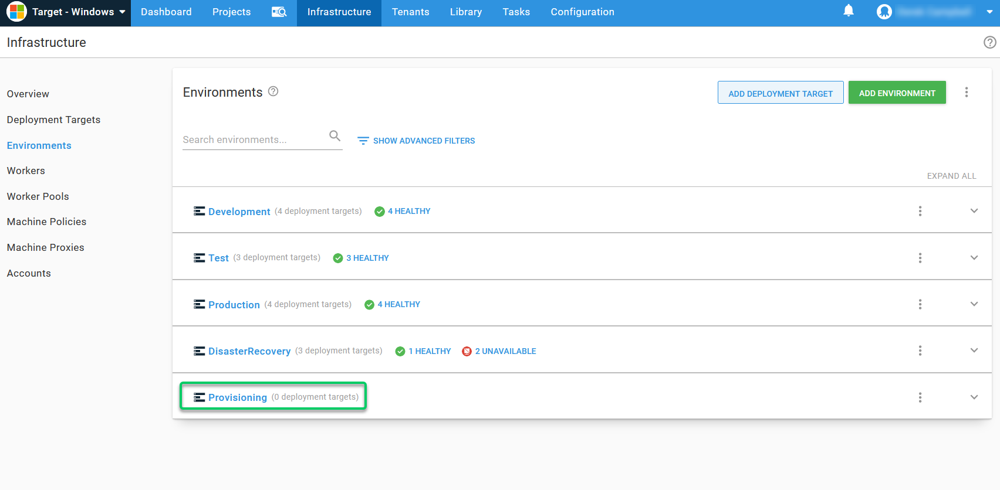

- Added a Windows server as a [deployment target](https://octopus.com/docs/infrastructure/deployment-targets) and assigned it the [target role](https://octopus.com/docs/infrastructure/deployment-targets#target-roles) **Computer**. I used a [Polling Tentacle](https://octopus.com/docs/infrastructure/deployment-targets/windows-targets/tentacle-communication#polling-tentacles):

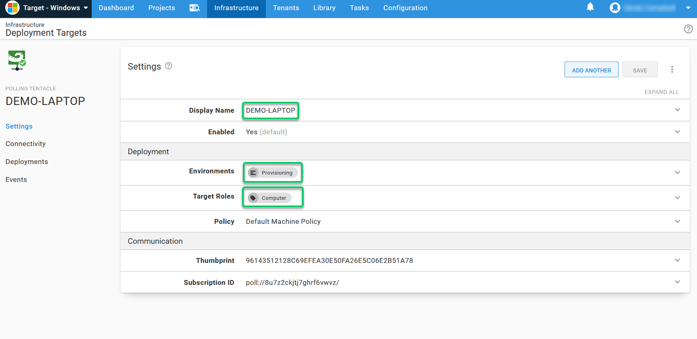

- Checked the **Infrastructure** tab showed my Windows server and that it was healthy:

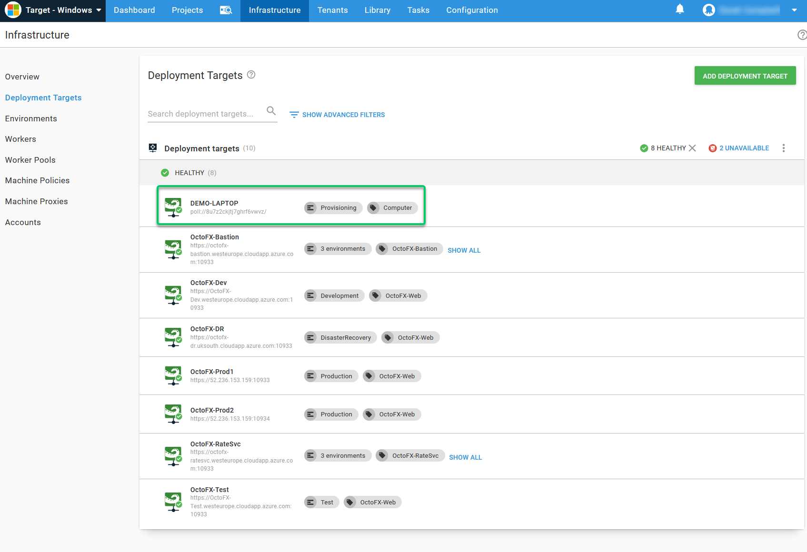

- Created a [project](https://octopus.com/docs/projects) called `Computer Provisioning`:

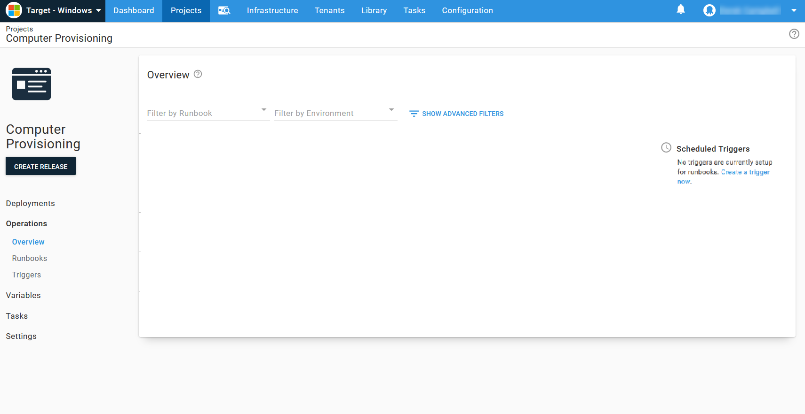

- Created a [lifecycle](https://octopus.com/docs/getting-started-guides/lifecycle) called `Computer Lifecycle` and added the **Provisioning** environment to it, and then assigned it to the project:

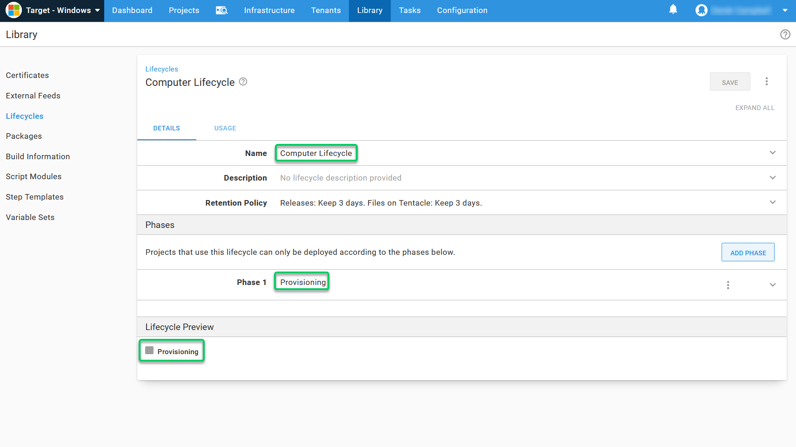

## Runbook configuration

First, you need to find the project and add the runbook:

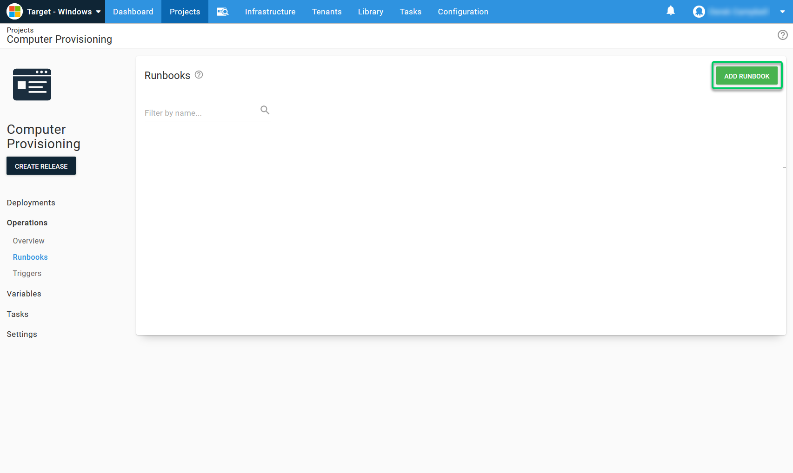

I created a runbook called `Install Developer Machine Dependencies`:

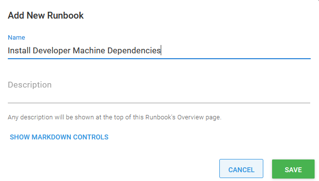

### Setting timezone, input, and region

When setting up Windows, it can be frustrating configuring your non-default regions. I use a PowerShell script to set this for all servers. You can use my example below and tweak it to your requirements:

```PowerShell
#Set home location to the United Kingdom
Set-WinHomeLocation 0xf2

#override language list with just English GB
$1 = New-WinUserLanguageList en-GB
$1[0].Handwriting = 1
Set-WinUserLanguageList $1 -force

#Set system local
Set-WinSystemLocale en-GB

#Set the timezone
Set-TimeZone "GMT Standard Time"
```

A US equivalent, on the East Coast, would look something like this:

```PowerShell
#Set home location to the United States
Set-WinHomeLocation 0xf4

#override language list with just English US
$1 = New-WinUserLanguageList en-US
$1[0].Handwriting = 1
Set-WinUserLanguageList $1 -force

#Set system local
Set-WinSystemLocale en-US

#Set the timezone
Set-TimeZone "Eastern Time Zone"
```

### Checking if Chocolatey is installed

Next, I used a community-contributed step template called [Chocolatey - Ensure Installed](https://library.octopus.com/step-templates/c364b0a5-a0b7-48f8-a1a4-35e9f54a82d3/actiontemplate-chocolatey-ensure-installed). This step checks whether Chocolatey is installed and installs it if not.

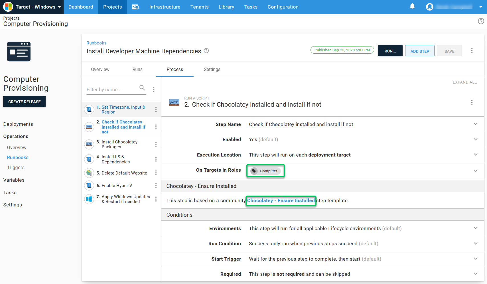

### Installing Chocolatey package step

Paul Broadwith of Chocolatey updated the [Chocolatey community step template](https://library.octopus.com/step-templates/b2385b12-e5b5-440f-bed8-6598c29b2528/actiontemplate-chocolatey-install-package) to install all of the Chocolatey packages in a single step.

The applications I need on the Windows server are:

```PowerShell
git vscode sql-server-management-studio slack github-desktop rdmfree googlechrome firefox dotnetfx dotnetcore 7zip visualstudio2019professional nordvpn lastpass-chrome lastpass docker-desktop chromium googledrive google-drive-file-stream kubernetes-helm kubernetes-cli minikube zoom notepadplusplus nugetpackageexplorer sdio virtualbox jre8 vlc python foxitreader putty.install sysinternals snagit vagrant packer terraform
```

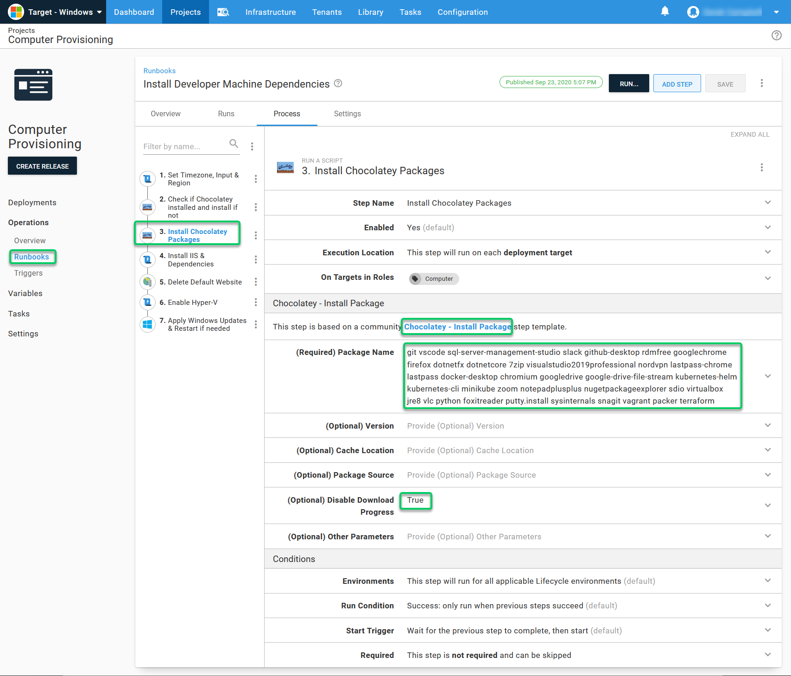

### Installing Chocolatey Package step parameters

The following parameters are available:

- **Version (optional)**: You can use this to specify the version of the software you want to install. If you’re using more than one package per step and want to set particular software versions, you need to configure that Chocolatey install and add the version in an additional step.
- **Cache location (optional)**: You can use this to specify a non-default location for a cache. This is useful when installing SQL without having the Tentacle run as an administrator. SQL can be tricky to install without running the Tentacle service as a local administrator. You can specify a folder such as `C:\Octopus\Applications` as the cache, which the Local System User has full access to.
- **Package Source (Optional)**: This is the *most crucial parameter in this step*. If you’re doing this at home, it might be acceptable to use the Chocolatey Package Repository, which is the default setting. However, if you’re doing this for a company, please consider using your own package source repositories, such as [Nexus](https://www.sonatype.com/nexus/repository-pro), [Artifactory](https://jfrog.com/artifactory/), or [MyGet](https://www.myget.org/).

The Chocolatey Package resource is built by the community for the community. If you’re using the community repository for enterprise or large scale package installation, you'll likely be [rate limited](https://chocolatey.org/docs/community-packages-disclaimer#rate-limiting). Be careful, and be kind to the community.

You can specify whether you want to disable the download progress in your logs. I usually enable this option to avoid thousands of log files. The last option allows you to specify additional parameters:

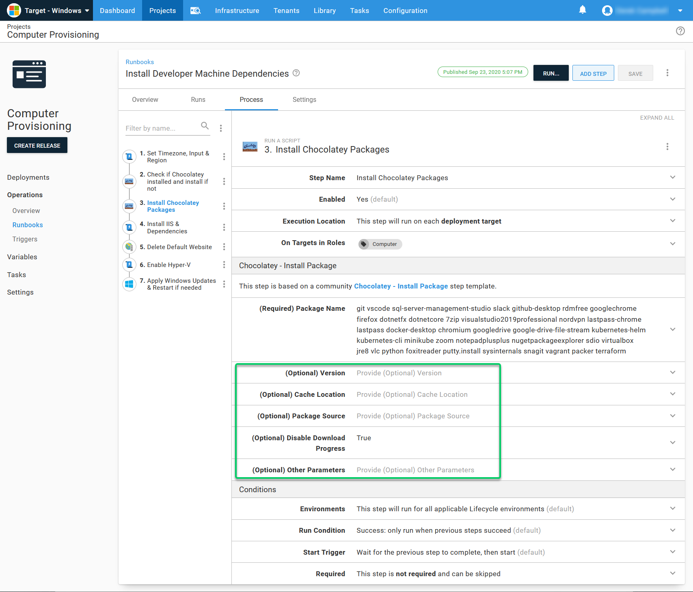

### Installing IIS & dependencies

The next step is configuring IIS and its dependencies. I used our [IIS Runbooks](https://octopus.com/docs/runbooks/runbook-examples/routine/iis-runbooks) examples and ran this install IIS, and all of its features.

### Optional steps

I prefer to avoid the default website in IIS, so I remove it by default. I use the community step template called [IIS Website - Delete](https://library.octopus.com/step-templates/a032159b-0742-4982-95f4-59877a31fba3/actiontemplate-iis-website-delete) and then specify `Default Web Site`. It removes the Default Web Site as part of this provisioning runbook in Octopus.

I use [HyperV](https://docs.microsoft.com/en-us/windows-server/virtualization/hyper-v/hyper-v-technology-overview) as hypervisor when possible, and enable it as part of the server provisioning process. I use the **Run a Script** built-in template for this task and use PowerShell to enable HyperV:

```PowerShell
Enable-WindowsOptionalFeature -Online -FeatureName Microsoft-Hyper-V -All
```

Finally, I avoid installing all of the Windows updates released if my server is prepped. I use a community step template called [Windows - Apply Windows Updates](https://library.octopus.com/step-templates/3472f207-3934-44db-a4ac-1390167cf7ed/actiontemplate-windows-apply-windows-updates), that automatically installs and reboots your machine if you set the parameter to `True`.

## Publishing the runbook

Runbooks can be in a draft or published state. You need to publish the runbook before you can execute it.

## Running the runbook

You have the space, the project, the lifecycle, the environment, the server, and the runbook in Octopus. The next step is running and testing the runbook to ensure it does what you want it to.

To run the runbook:

1. Open the runbook project
1. Select **Operations**, then **Runbooks**
1. Select the runbook you created

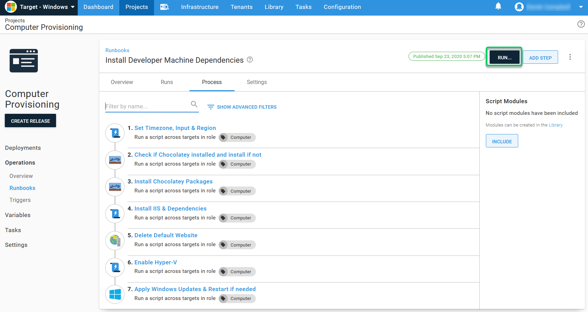

4. Select **Run**
4. Select the environment
4. Click the **Run** button

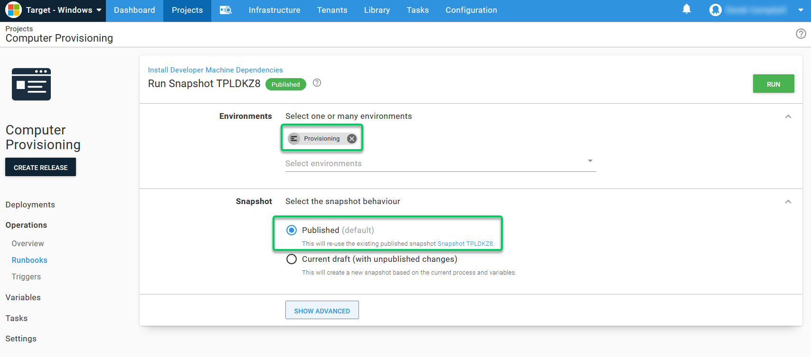

You can grab a coffee now because it takes time to install the applications and dependencies. After your coffee, the runbook should be complete. Your server will be fully configured and you can avoid the pain of next, next, finish installs, and application configuration.

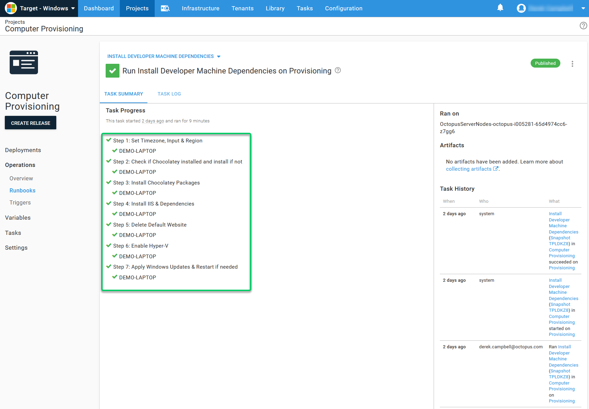

Now you see all of the new applications installed on your server.

## Using Runbooks in other scenarios

Runbooks are useful for installing applications, not just for ops, DevOps, and developers, but other job types too. You can create additional runbooks for other job types that need different applications. For example, a business analyst may want [PowerBI](https://powerbi.microsoft.com/en-us/), and a DBA might wish to install [SQL Toolbelt](https://chocolatey.org/packages/SqlToolbelt). You can even allow people access to runbooks to install and configure pre-approved software.

You can also use this approach for all of your servers, so you can install [SQL](https://chocolatey.org/packages/sql-server-2019) on a database server, or [Tomcat](https://chocolatey.org/packages/Tomcat) on a web server.

:::hint
When installing SQL, create your own Chocolatey package. SQL is trickier to install as it requires an administrator account to install quickly, and you want to configure things such as default users, groups, and locations of the database and log files.

When using Octopus to install SQL Developer Edition or SQL Express, you can do it without the Tentacle running as a local administrator. You still need to use the optional location for the files. 

Another gotcha is that if you run the install under a service account with a named service account, by default, it uses that user as the default SQL administrator. You need to connect with that account to give yourself access.
:::

## Upgrading Chocolatey packages

One of my favorite features of chocolatey is [upgrading](https://chocolatey.org/docs/commandsupgrade) software to the latest version with just one command:

```PowerShell
choco upgrade all -y
```

This command runs on the server, checks the latest version against the Chocolatey repository you configured, downloads the new package, and installs it. It's like a Windows update but for your Chocolatey package. You can set this up with runbooks, using the **Deploy a Script step**, and using the upgrade command:

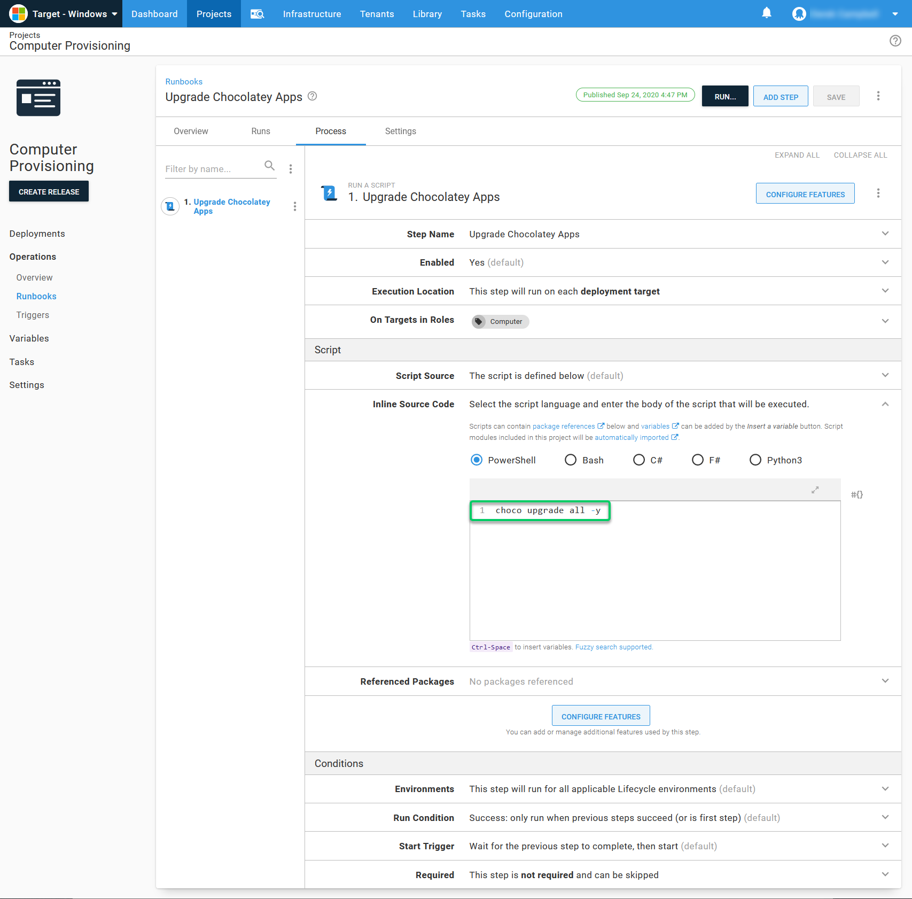

After you create the runbook, select **Run**, and it runs the Chocolatey script and upgrades all of your applications:

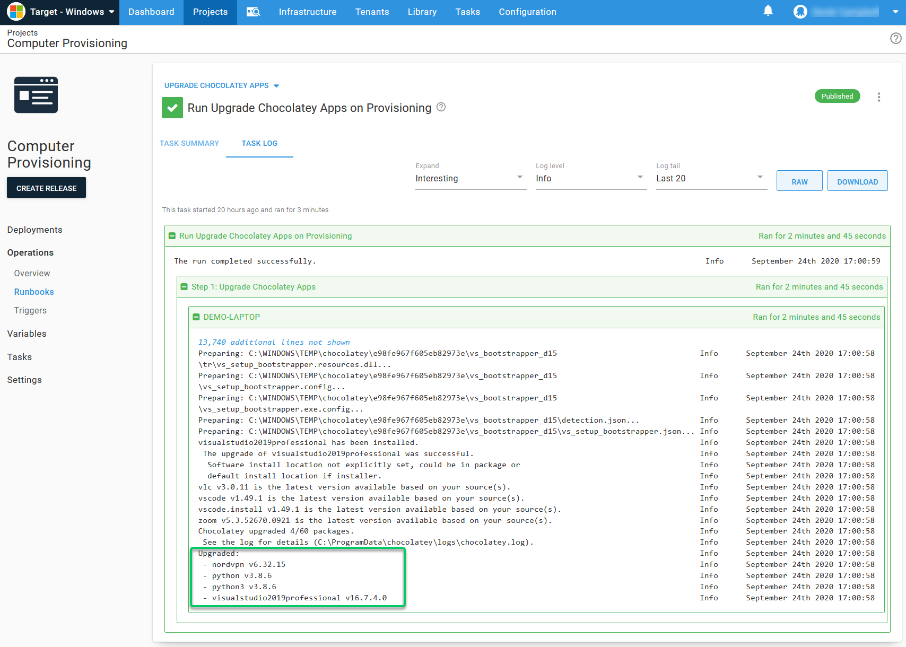

### Upgrading Chocolatey packages on a scheduled trigger

With the upgraded Chocolatey runbook working, you can publish the runbook and set a schedule to execute the script, much like a [CRON JOB](https://en.wikipedia.org/wiki/Cron) or a [Windows Task Scheduler](https://en.wikipedia.org/wiki/Windows_Task_Scheduler).

To set this up, select the triggers option under **Operations**, and select **ADD SCHEDULED TRIGGER**.

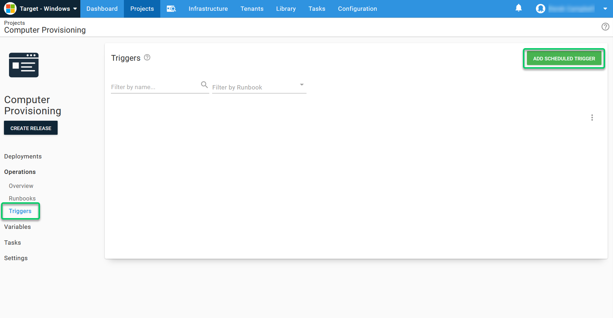

On the **New scheduled trigger** page, you need to enter:

- **Name**
- **Description**
- **Select the Runbook to run on the scheduled trigger**
- **Select the environment**
- **Select a schedule of daily or alternative schedule**
- **Select at what interval at which it should execute**
- **Select the time the schedule should execute**

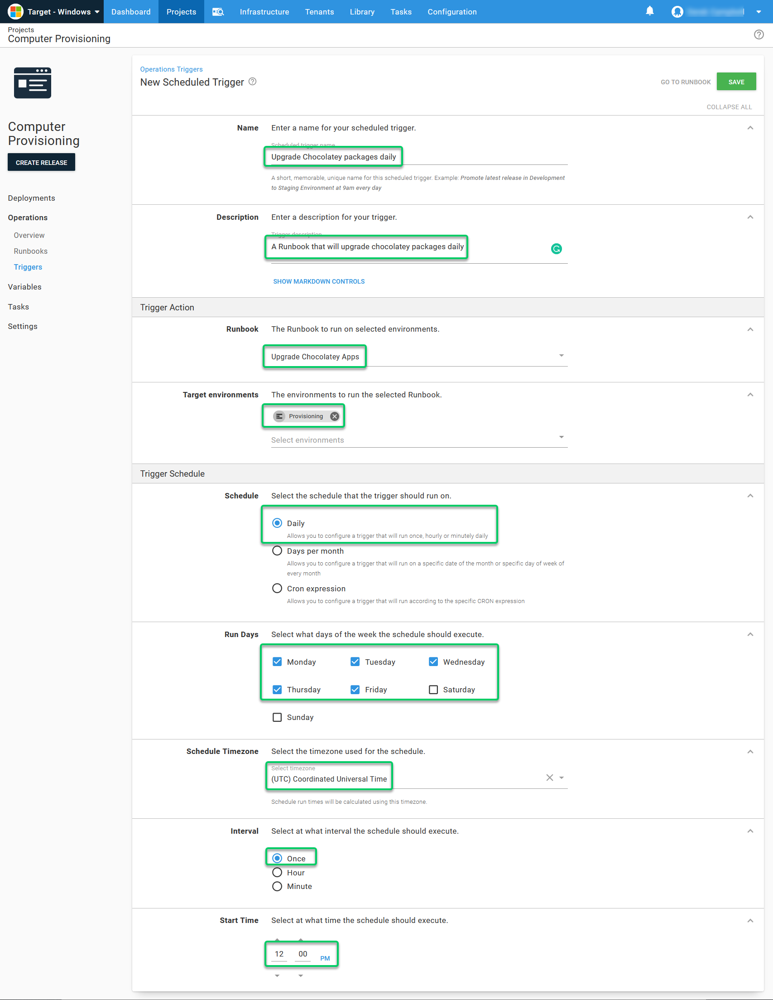

This triggers daily at the time you set. I selected 12.30 PM as that’s when many people go to lunch.

All of the configuration in this post can be found on our [samples instance](https://samples.octopus.app) by logging in as a guest and selecting the **Target - Windows** space.

## Conclusion

Octopus Runbooks and Chocolatey work well together, giving you the flexibility to automate the installation and configuration of servers both on-premises and in the cloud. They eliminate the need to install thousands of applications across your organization’s infrastructure. 

To see this in action, watch our webinar, [Automating your infrastructure & applications with Runbooks and Chocolatey](https://octopus.com/events/automating-your-infrastructure-applications-with-runbooks-and-chocolatey), with [Paul Broadwith](https://blog.pauby.com) from Chocolatey.

!include <q2-2022-newsletter-cta>

Happy deployments!
