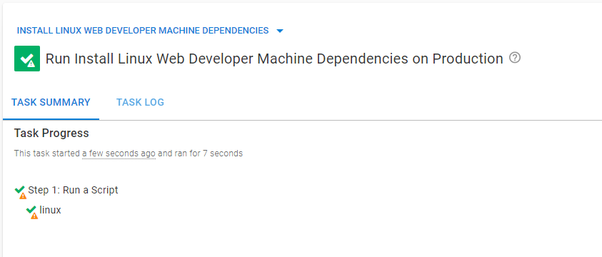
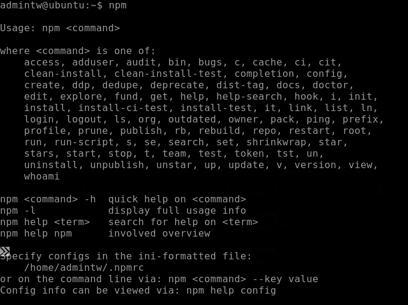
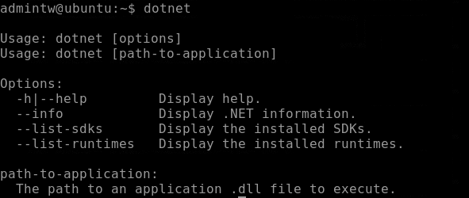

When setting up a Linux server, you need to configure the system for your needs. You can use the server for web development, system administration, data science, and more. Each use case has different configuration requirements, and manually configuring these servers can be tedious and time-consuming. 

With Octopus Runbooks you can create a repeatable, automatic process to configure your Linux servers, and it can be adapted to suit different configuration needs. 

In this post, I configure a Linux server using a runbook to specify all the dependencies required for a specific task. This runbook can be saved and exported for future servers with the same need.

## Prerequisites

To follow along, you need:

- An Azure account (if you don't already have one, [sign up for a free trial](https://portal.azure.com/))
- A Linux server (I show you how to create one in Azure)
- An Octopus instance (if you don't already have one, create a [free trial to get started](https://octopus.com/docs/octopus-cloud))

## Creating a Linux server in Azure

Microsoft Azure is a cloud computing platform for creating virtual machines, web applications, and other cloud-based resources. We'll use Azure to create a Linux server for our runbook example.

On the Azure home page, navigate to **Create a resource**, then **Ubuntu Server 20.04 LTS**, then **Create**.

Choose the linked subscription and create a new resource group. Give the server a name. Under **Administrator account** generate an SSH public key or password, which you'll use later. Select **Review + Create** to accept the default settings.

When finished, select **Go to resource**. Connect to the server by clicking **Connect, Bastion**. You need to enter either your SSH key or password from earlier. If this is your first time setting up Bastion, click **Deploy Bastion**, and wait for it to complete the set up.

## Installing an Octopus Tentacle on the Linux server

After Bastion has connected to the Linux server, you see a Bash shell. You set up an Octopus Tentacle to communicate with the Octopus instance running your runbook. 

Run the following commands to install the Tentacle:

```

sudo apt-key adv --fetch-keys https://apt.octopus.com/public.key

sudo add-apt-repository "deb https://apt.octopus.com/ stretch main"

# for Raspbian use

# sh -c "echo 'deb https://apt.octopus.com/ buster main' >> /etc/apt/sources.list"

sudo apt-get update

sudo apt-get install tentacle

```

The Tentacle needs to communicate with your Octopus instance, so you need a key to provide to the Tentacle for authentication. 

In your Octopus instance, click **Your Profile**, then **Profile**, then **My API Keys**, and **New API Key**. Give the key a name and make sure to save it, as it's only visible once.

Configure the Tentacle on the Linux server by running the following command:

```

/opt/octopus/tentacle/configure-tentacle.sh

```

The setup script will ask you a series of questions. Make sure to specify the following parameters:

1. **Name of Tentacle instance (default Tentacle):** press Enter to accept defaults
1. **What kind of Tentacle would you like to configure:** 1) Listening or 2) Polling (default 1): 2
1. **Where would you like Tentacle to store log files? (/etc/octopus):** press Enter to accept defaults
1. **Where would you like Tentacle to install applications to? (/home/Octopus/Applications):** press Enter to accept defaults
1. **Octopus Server URL (eg. https://octopus-server):** The URL of your Octopus instance
1. **Select auth method: 1) API-Key or 2) Username and Password (default 1):** 1
1. **API-Key:** Enter the API key configured earlier
1. **Select type of Tentacle do you want to setup: 1) Deployment Target or 2) Worker (default 1):** 1
1. **What Space would you like to register this Tentacle in? (Default):** press Enter to accept defaults
1. **What name would you like to register this Tentacle with?** press Enter to accept defaults
1. **Enter the environments for this Tentacle (comma seperated):** Specify the environment/s of the Octopus instance
1. **Enter the roles for this Tentacle (comma seperated):** Specify a role for the tentacle, for example, Linux (you use this later in the runbook)
1. Press Enter to continue


### Confirming the Tentacle connection

Confirm your Tentacle is connected in Octopus by navigating to **Infrastructure**, then **Deployment Targets**. Here you see your connected deployment target.


## Setting up the runbook in Octopus

After you've created the Linux server, and installed and connected the Tentacle, you can create the runbook. The runbook establishes a development environment for a web development use case. Other use cases require a different configuration setup. Operations can run the runbook when a web developer needs a server set up.

### Create the runbook

1. Create a project to host the runbook by going to **Projects**, then **Add Project**.
1. In your project, go to **Runbooks**, then **Add Runbook**, then **Process**, then **Add Step**, then **Script**, then **Run a Script**, and finally, **Add**.
1. Under `on Targets in Roles`, add the role you specified in the Tentacle setup script.
1. Specify a Bash script and add the following code:

```

apt update

apt upgrade

apt install -y build-essential

apt install -y curl

apt-get install -y git-core

apt-get install -y nodejs

apt-get install -y npm

```

5. Click **SAVE** and **Run**.

You'll get a successful result.



Go to the Linux server and run the `npm` command to confirm the installation.



## Creating a different configuration

Let's create a different kind of configuration, using a simple .NET configuration. 

Create another Linux server and follow the same steps to create another runbook with an Octopus Tentacle. 

This time, in step 4, add the following code:

```

wget https://packages.microsoft.com/config/ubuntu/21.04/packages-microsoft-prod.deb -O packages-microsoft-prod.deb

sudo dpkg -i packages-microsoft-prod.deb

rm packages-microsoft-prod.deb

sudo apt-get update; \

sudo apt-get install -y apt-transport-https && \

sudo apt-get update && \

sudo apt-get install -y dotnet-sdk-6.0

```

Run the runbook to configure the server


Go to the Linux server and run the `dotnet` command to confirm the installation.



This workflow demonstrates that runbooks can configure Linux servers. You created two runbooks, one that applied a web development configuration to the server and a second runbook that configured the server with a .NET configuration. 

You can create runbooks for as many different configurations as you need, ensuring each configuration is consistent and automatic each time it's created.

## Conclusion

Configuring servers can be a tedious, manual process. Often there are many configuration requirements for a server. To help with this, Octopus Runbooks provides a repeatable, automated way to configure servers. 

Runbooks can cater to specific configuration needs and be triggered when needed. The repeatable nature of runbooks introduces consistency in the organizational infrastructure. Runbooks reduce the workload for system administrators so they can focus on other tasks. 

If you'd like to know more about how Octopus Runbooks can help with your deployment needs, [contact us today!](mailto:customersuccess@octopus.com)

!include <q2-2022-newsletter-cta>

Happy deployments!
