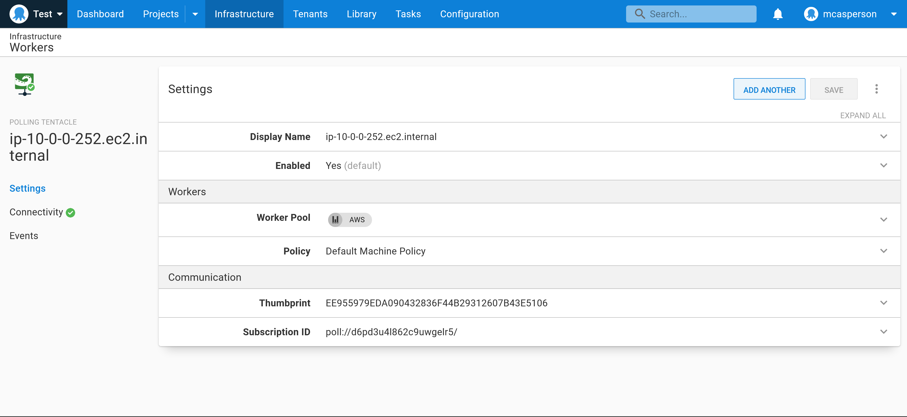

Workers let you delegate the execution of a deployment to a machine with privileged access to the resources being modified, with specialized tools installed, or just to remove the burden of executing a deployment from the Octopus Server. 

EC2 instances provide a logical solution to host Octopus Workers. 

In this post, you learn how to deploy an Octopus Worker onto a new EC2 instance with CloudFormation.

## The complete template

The CloudFormation template below deploys an EC2 instance in a public subnet in a new VPC and installs an Octopus Tentacle as a Worker as part of the VMs initialization:

```yaml
AWSTemplateFormatVersion: 2010-09-09
Parameters:
  InstanceTypeParameter:
    Type: String
    Default: t3a.medium
    AllowedValues:
    - c1.medium
    - c1.xlarge
    - c3.2xlarge
    - c3.4xlarge
    - c3.8xlarge
    - c3.large
    - c3.xlarge
    - c4.2xlarge
    - c4.4xlarge
    - c4.8xlarge
    - c4.large
    - c4.xlarge
    - c5.12xlarge
    - c5.18xlarge
    - c5.24xlarge
    - c5.2xlarge
    - c5.4xlarge
    - c5.9xlarge
    - c5.large
    - c5.metal
    - c5.xlarge
    - c5a.12xlarge
    - c5a.16xlarge
    - c5a.24xlarge
    - c5a.2xlarge
    - c5a.4xlarge
    - c5a.8xlarge
    - c5a.large
    - c5a.xlarge
    - c5d.12xlarge
    - c5d.18xlarge
    - c5d.24xlarge
    - c5d.2xlarge
    - c5d.4xlarge
    - c5d.9xlarge
    - c5d.large
    - c5d.metal
    - c5d.xlarge
    - c5n.18xlarge
    - c5n.2xlarge
    - c5n.4xlarge
    - c5n.9xlarge
    - c5n.large
    - c5n.metal
    - c5n.xlarge
    - c6g.12xlarge
    - c6g.16xlarge
    - c6g.2xlarge
    - c6g.4xlarge
    - c6g.8xlarge
    - c6g.large
    - c6g.medium
    - c6g.metal
    - c6g.xlarge
    - c6gd.12xlarge
    - c6gd.16xlarge
    - c6gd.2xlarge
    - c6gd.4xlarge
    - c6gd.8xlarge
    - c6gd.large
    - c6gd.medium
    - c6gd.metal
    - c6gd.xlarge
    - d2.2xlarge
    - d2.4xlarge
    - d2.8xlarge
    - d2.xlarge
    - g2.2xlarge
    - g2.8xlarge
    - g3.16xlarge
    - g3.4xlarge
    - g3.8xlarge
    - g4dn.12xlarge
    - g4dn.16xlarge
    - g4dn.2xlarge
    - g4dn.4xlarge
    - g4dn.8xlarge
    - g4dn.metal
    - g4dn.xlarge
    - i2.2xlarge
    - i2.4xlarge
    - i2.8xlarge
    - i2.xlarge
    - i3.16xlarge
    - i3.2xlarge
    - i3.4xlarge
    - i3.8xlarge
    - i3.large
    - i3.metal
    - i3.xlarge
    - i3en.12xlarge
    - i3en.24xlarge
    - i3en.2xlarge
    - i3en.3xlarge
    - i3en.6xlarge
    - i3en.large
    - i3en.metal
    - i3en.xlarge
    - inf1.24xlarge
    - inf1.2xlarge
    - inf1.6xlarge
    - inf1.xlarge
    - m1.large
    - m1.medium
    - m1.small
    - m1.xlarge
    - m2.2xlarge
    - m2.4xlarge
    - m2.xlarge
    - m3.2xlarge
    - m3.large
    - m3.medium
    - m3.xlarge
    - m4.10xlarge
    - m4.16xlarge
    - m4.2xlarge
    - m4.4xlarge
    - m4.large
    - m4.xlarge
    - m5.12xlarge
    - m5.16xlarge
    - m5.24xlarge
    - m5.2xlarge
    - m5.4xlarge
    - m5.8xlarge
    - m5.large
    - m5.metal
    - m5.xlarge
    - m5a.12xlarge
    - m5a.16xlarge
    - m5a.24xlarge
    - m5a.2xlarge
    - m5a.4xlarge
    - m5a.8xlarge
    - m5a.large
    - m5a.xlarge
    - m5ad.12xlarge
    - m5ad.16xlarge
    - m5ad.24xlarge
    - m5ad.2xlarge
    - m5ad.4xlarge
    - m5ad.8xlarge
    - m5ad.large
    - m5ad.xlarge
    - m5d.12xlarge
    - m5d.16xlarge
    - m5d.24xlarge
    - m5d.2xlarge
    - m5d.4xlarge
    - m5d.8xlarge
    - m5d.large
    - m5d.metal
    - m5d.xlarge
    - m5zn.12xlarge
    - m5zn.2xlarge
    - m5zn.3xlarge
    - m5zn.6xlarge
    - m5zn.large
    - m5zn.metal
    - m5zn.xlarge
    - m6g.12xlarge
    - m6g.16xlarge
    - m6g.2xlarge
    - m6g.4xlarge
    - m6g.8xlarge
    - m6g.large
    - m6g.medium
    - m6g.metal
    - m6g.xlarge
    - m6gd.12xlarge
    - m6gd.16xlarge
    - m6gd.2xlarge
    - m6gd.4xlarge
    - m6gd.8xlarge
    - m6gd.large
    - m6gd.medium
    - m6gd.metal
    - m6gd.xlarge
    - m6i.12xlarge
    - m6i.16xlarge
    - m6i.24xlarge
    - m6i.2xlarge
    - m6i.32xlarge
    - m6i.4xlarge
    - m6i.8xlarge
    - m6i.large
    - m6i.metal
    - m6i.xlarge
    - r3.2xlarge
    - r3.4xlarge
    - r3.8xlarge
    - r3.large
    - r3.xlarge
    - r4.16xlarge
    - r4.2xlarge
    - r4.4xlarge
    - r4.8xlarge
    - r4.large
    - r4.xlarge
    - r5.12xlarge
    - r5.16xlarge
    - r5.24xlarge
    - r5.2xlarge
    - r5.4xlarge
    - r5.8xlarge
    - r5.large
    - r5.metal
    - r5.xlarge
    - r5a.12xlarge
    - r5a.16xlarge
    - r5a.24xlarge
    - r5a.2xlarge
    - r5a.4xlarge
    - r5a.8xlarge
    - r5a.large
    - r5a.xlarge
    - r5ad.12xlarge
    - r5ad.16xlarge
    - r5ad.24xlarge
    - r5ad.2xlarge
    - r5ad.4xlarge
    - r5ad.8xlarge
    - r5ad.large
    - r5ad.xlarge
    - r5d.12xlarge
    - r5d.16xlarge
    - r5d.24xlarge
    - r5d.2xlarge
    - r5d.4xlarge
    - r5d.8xlarge
    - r5d.large
    - r5d.metal
    - r5d.xlarge
    - r5n.12xlarge
    - r5n.16xlarge
    - r5n.24xlarge
    - r5n.2xlarge
    - r5n.4xlarge
    - r5n.8xlarge
    - r5n.large
    - r5n.metal
    - r5n.xlarge
    - r6g.12xlarge
    - r6g.16xlarge
    - r6g.2xlarge
    - r6g.4xlarge
    - r6g.8xlarge
    - r6g.large
    - r6g.medium
    - r6g.metal
    - r6g.xlarge
    - r6gd.12xlarge
    - r6gd.16xlarge
    - r6gd.2xlarge
    - r6gd.4xlarge
    - r6gd.8xlarge
    - r6gd.large
    - r6gd.medium
    - r6gd.metal
    - r6gd.xlarge
    - t1.micro
    - t2.2xlarge
    - t2.large
    - t2.medium
    - t2.micro
    - t2.nano
    - t2.small
    - t2.xlarge
    - t3.2xlarge
    - t3.large
    - t3.medium
    - t3.micro
    - t3.nano
    - t3.small
    - t3.xlarge
    - t3a.2xlarge
    - t3a.large
    - t3a.medium
    - t3a.micro
    - t3a.nano
    - t3a.small
    - t3a.xlarge
    - t4g.2xlarge
    - t4g.large
    - t4g.medium
    - t4g.micro
    - t4g.nano
    - t4g.small
    - t4g.xlarge
    - z1d.12xlarge
    - z1d.2xlarge
    - z1d.3xlarge
    - z1d.6xlarge
    - z1d.large
    - z1d.metal
    - z1d.xlarge
  WorkstationIp:
    Type: String
    Description: The IP address of the workstation that can RDP into the instance.
  Key:
    Type: String
    Description: The key used to access the instance.
  OctopusURL:
    Type: String
    Description: The URL of the Octopus instance to connect to.
  OctopusAPI:
    Type: String
    Description: The Octopus API key.
  OctopusSpace:
    Type: String
    Description: The Octopus space.
  OctopusWorkerPool:
    Type: String
    Description: The Octopus worker pool.
Mappings:
  RegionMap:
    eu-north-1:
      ami: ami-0f541966b45340fce
    ap-south-1:
      ami: ami-00c7dbcc1310fd066
    eu-west-3:
      ami: ami-0bce8e5f8fd912af2
    eu-west-2:
      ami: ami-02a7ca2a9d03676bf
    eu-west-1:
      ami: ami-02c55114d1d2a8201
    ap-northeast-3:
      ami: ami-02d358004635cea15
    ap-northeast-2:
      ami: ami-0dcf592770858a733
    ap-northeast-1:
      ami: ami-0a428a8bcfce0f804
    sa-east-1:
      ami: ami-035b4cb75ab88f259
    ca-central-1:
      ami: ami-0583af09af7e435f3
    ap-southeast-1:
      ami: ami-09df7bed19956d10b
    ap-southeast-2:
      ami: ami-0666dd0a9eccbab7d
    eu-central-1:
      ami: ami-0e8f6957a4eb67446
    us-east-1:
      ami: ami-0ba45cd7fcf163404
    us-east-2:
      ami: ami-086e001f1a73d208c
    us-west-1:
      ami: ami-0bd3976c0dbacc605
    us-west-2:
      ami: ami-04e6179c63d17513d
Resources:
  VPC:
    Type: AWS::EC2::VPC
    Properties:
      CidrBlock: 10.0.0.0/16
      Tags:
        - Key: Name
          Value: Linux VPC
  InternetGateway:
    Type: AWS::EC2::InternetGateway
  VPCGatewayAttachment:
    Type: AWS::EC2::VPCGatewayAttachment
    Properties:
      VpcId: !Ref VPC
      InternetGatewayId: !Ref InternetGateway
  SubnetA:
    Type: AWS::EC2::Subnet
    Properties:
      AvailabilityZone: !Select 
        - 0
        - !GetAZs 
      VpcId: !Ref VPC
      CidrBlock: 10.0.0.0/24
      MapPublicIpOnLaunch: true
  RouteTable:
    Type: AWS::EC2::RouteTable
    Properties:
      VpcId: !Ref VPC
  InternetRoute:
    Type: AWS::EC2::Route
    DependsOn: InternetGateway
    Properties:
      DestinationCidrBlock: 0.0.0.0/0
      GatewayId: !Ref InternetGateway
      RouteTableId: !Ref RouteTable
  SubnetARouteTableAssociation:
    Type: AWS::EC2::SubnetRouteTableAssociation
    Properties:
      RouteTableId: !Ref RouteTable
      SubnetId: !Ref SubnetA
  InstanceSecurityGroup:
    Type: AWS::EC2::SecurityGroup
    Properties:
      GroupName: "Internet Group"
      GroupDescription: "SSH in, all traffic out."
      VpcId: !Ref VPC
      SecurityGroupIngress:
        - IpProtocol: tcp
          FromPort: '22'
          ToPort: '22'
          CidrIp:  !Sub ${WorkstationIp}/32
      SecurityGroupEgress:
        - IpProtocol: -1
          CidrIp: 0.0.0.0/0
  ElasticIP:
    Type: AWS::EC2::EIP
    Properties:
      Domain: vpc
      InstanceId: !Ref Linux
  Linux:
    Type: 'AWS::EC2::Instance'
    Properties:
      SubnetId: !Ref SubnetA
      ImageId: !FindInMap
        - RegionMap
        - !Ref 'AWS::Region'
        - ami
      InstanceType:
        Ref: InstanceTypeParameter
      KeyName: !Ref Key
      SecurityGroupIds:
        - Ref: InstanceSecurityGroup
      BlockDeviceMappings:
        - DeviceName: /dev/xvda
          Ebs:
            VolumeSize: 250
      Tags:
        - Key: Name
          Value: Linux Server

      UserData:
        Fn::Base64:
          Fn::Sub: |
            #cloud-boothook
            #!/bin/bash
            # Wait for network connectivity
            until ping -c1 www.google.com &>/dev/null; do
                echo "Waiting for network ..."
                sleep 1
            done
            # Update all packages
            sudo yum update -y
            # Install useful tools
            sudo yum install jq wget curl awscli -y
            # Install Kubernetes cli tools
            curl -o kubectl https://amazon-eks.s3.us-west-2.amazonaws.com/1.21.2/2021-07-05/bin/linux/amd64/kubectl
            chmod +x ./kubectl
            sudo mv kubectl /usr/local/bin
            curl -o aws-iam-authenticator https://amazon-eks.s3.us-west-2.amazonaws.com/1.21.2/2021-07-05/bin/linux/amd64/aws-iam-authenticator
            chmod +x ./aws-iam-authenticator
            sudo mv aws-iam-authenticator /usr/local/bin
            curl --silent --location "https://github.com/weaveworks/eksctl/releases/latest/download/eksctl_$(uname -s)_amd64.tar.gz" | tar xz -C /tmp
            sudo mv /tmp/eksctl /usr/local/bin
            # Install Linux Tentacle
            sudo wget https://rpm.octopus.com/tentacle.repo -O /etc/yum.repos.d/tentacle.repo
            sudo yum install tentacle -y
            sudo /opt/octopus/tentacle/Tentacle create-instance --instance "Tentacle" --config "/etc/octopus/Tentacle/tentacle-Tentacle.config"
            sudo /opt/octopus/tentacle/Tentacle new-certificate --instance "Tentacle" --if-blank
            sudo /opt/octopus/tentacle/Tentacle configure --instance "Tentacle" --app "/home/Octopus/Applications" --noListen "True" --reset-trust
            sudo /opt/octopus/tentacle/Tentacle register-worker --instance "Tentacle" --server "${OctopusURL}" --name "$(hostname)" --comms-style "TentacleActive" --server-comms-port "10943" --apiKey "${OctopusAPI}" --space "${OctopusSpace}" --workerpool "${OctopusWorkerPool}"
            sudo /opt/octopus/tentacle/Tentacle service --install --start --instance "Tentacle"
Outputs:
  PublicIp:
    Value:
      Fn::GetAtt:                          
        - Linux
        - PublicIp
    Description: Server's PublicIp Address
```

This template is creating a number of resources, so let's break it down.

The available instance types are defined in a parameter called `InstanceType`. While Workers don't typically need to be installed on high powered machines, the network capabilities of different EC2 instances may require selecting specific instance types:

```yaml
Parameters:
  InstanceTypeParameter:
    Type: String
    Default: t3a.medium
    AllowedValues:
    - c1.medium
    - c1.xlarge
    - c3.2xlarge
    # ...
```

For additional security, only your local workstation can SSH into the EC2 instance. You can [Google your IP address](https://www.google.com/search?q=what+is+my+ip) and define it in the `WorkstationIp` parameter:

```yaml
  WorkstationIp:
    Type: String
    Description: The IP address of the workstation that can RDP into the instance.
```

The parameter called `Key` defines the SSH key assigned to the EC2 instance. This CloudFormation template does not create a key, so an existing key must be specified:

```yaml
  Key:
    Type: String
    Description: The key used to access the instance.
```

The URL of the Octopus instance the Worker connects to is defined in the `OctopusURL` parameter. Note that this template creates a Polling Worker, which means the Octopus instance must be publicly accessible:

```yaml
  OctopusURL:
    Type: String
    Description: The URL of the Octopus instance to connect to.
```

The API key used to authenticate with the Octopus Server is defined in the `OctopusAPI` parameter:

```yaml
  OctopusAPI:
    Type: String
    Description: The Octopus API key.
```

The Octopus space in which to register the Worker is defined in the `OctopusSpace` parameter:

```yaml
  OctopusSpace:
    Type: String
    Description: The Octopus space.
```

The name of the Worker Pool to place the Worker in is defined in the `OctopusWorkerPool` parameter:

```yaml
  OctopusWorkerPool:
    Type: String
    Description: The Octopus worker pool.
```

Each availability zone in AWS has its own unique AMI IDs. The `Mappings` section maps the [Amazon ECS-optimized AMI](https://docs.aws.amazon.com/AmazonECS/latest/developerguide/ecs-optimized_AMI.html) to each region. 

You use the ECS-optimized AMI as this already has Docker installed, which is useful for running deployments in [execution containers](https://octopus.com/docs/projects/steps/execution-containers-for-workers):

```yaml
Mappings:
  RegionMap:
    eu-north-1:
      ami: ami-0f541966b45340fce
    ap-south-1:
      ami: ami-00c7dbcc1310fd066
    eu-west-3:
      ami: ami-0bce8e5f8fd912af2
    # ...
```

All EC2 instances must be placed in a Virtual Private Cloud (VPC), created with an [AWS::EC2::VPC](https://docs.aws.amazon.com/AWSCloudFormation/latest/UserGuide/aws-resource-ec2-vpc.html) resource. 

You define a Classless Inter-Domain Routing (CIDR) block of `10.0.0.0/16`, meaning all subnets assigned to the VPC must have IP addresses starting with `10.0`:

```yaml
  VPC:
    Type: AWS::EC2::VPC
    Properties:
      CidrBlock: 10.0.0.0/16
      Tags:
        - Key: Name
          Value: Linux VPC
```

An internet gateway provides a connection to and from the internet. It's represented by the [AWS::EC2::InternetGateway](https://docs.aws.amazon.com/AWSCloudFormation/latest/UserGuide/aws-resource-ec2-internetgateway.html) resource:

```yaml
  InternetGateway:
    Type: AWS::EC2::InternetGateway
```

The internet gateway is attached to the VPC using an [AWS::EC2::VPCGatewayAttachment](https://docs.aws.amazon.com/AWSCloudFormation/latest/UserGuide/aws-resource-ec2-vpc-gateway-attachment.html) resource:

```yaml
  VPCGatewayAttachment:
    Type: AWS::EC2::VPCGatewayAttachment
    Properties:
      VpcId: !Ref VPC
      InternetGatewayId: !Ref InternetGateway
```

A subnet is attached to the VPC using an [AWS::EC2::Subnet](https://docs.aws.amazon.com/AWSCloudFormation/latest/UserGuide/aws-resource-ec2-subnet.html) resource. You can avoid hard-coding an availability zone by using the `!Select` function to return the first item from the `!GetAZs` array. 

The CIDR block is set to `10.0.0.0/24`, indicating that the IP addresses for resources in this subnet all start with `10.0.0`. Setting `MapPublicIpOnLaunch` to `true` means any EC2 instances placed in this subnet receive a dynamic, public IP address, allowing you to SSH into them:

```yaml
  SubnetA:
    Type: AWS::EC2::Subnet
    Properties:
      AvailabilityZone: !Select 
        - 0
        - !GetAZs 
      VpcId: !Ref VPC
      CidrBlock: 10.0.0.0/24
      MapPublicIpOnLaunch: true
```

A route table defines the network rules for traffic associated with this VPC, and is defined by an [AWS::EC2::RouteTable](https://docs.aws.amazon.com/AWSCloudFormation/latest/UserGuide/aws-resource-ec2-subnetroutetableassociation.html) resource:

```yaml
  RouteTable:
    Type: AWS::EC2::RouteTable
    Properties:
      VpcId: !Ref VPC
```

External internet traffic is directed to the internet gateway by a route represented by an [AWS::EC2::Route](https://docs.aws.amazon.com/AWSCloudFormation/latest/UserGuide/aws-resource-ec2-route.html) resource. The CIDR block `0.0.0.0/0` matches all IPv4 addresses, which means this rule matches all traffic not configured by the default rules that handle internal traffic inside the VPC:

```yaml
  InternetRoute:
    Type: AWS::EC2::Route
    DependsOn: InternetGateway
    Properties:
      DestinationCidrBlock: 0.0.0.0/0
      GatewayId: !Ref InternetGateway
      RouteTableId: !Ref RouteTable
```

The route table is associated with the subnet using an [AWS::EC2::SubnetRouteTableAssociation](https://docs.aws.amazon.com/AWSCloudFormation/latest/UserGuide/Welcome.html) resource:

```yaml
  SubnetARouteTableAssociation:
    Type: AWS::EC2::SubnetRouteTableAssociation
    Properties:
      RouteTableId: !Ref RouteTable
      SubnetId: !Ref SubnetA
```

To allow your local workstation to SSH into the EC2 instance, a security group is configured to open port 22 to any traffic originating from your local IP address. The security group also allows traffic sent to any destination. Security groups are represented by the [AWS::EC2::SecurityGroup](https://docs.aws.amazon.com/AWSCloudFormation/latest/UserGuide/aws-properties-ec2-security-group.html) resource.

Because you configure a Polling Tentacle, which establishes an outbound connection from the Worker to the Octopus Server, there's no need to open any ports to allow traffic from Octopus to the EC2 instance. Security groups allow the Octopus Server to respond to a request made by the Worker.

If you configure a Listening Tentacle, where Octopus establishes the network connection to the Worker, you have to open port 10933 to the list of [static IPs associated with your hosted instance](https://octopus.com/docs/octopus-cloud/static-ip), or the IP address of your self hosted Octopus instance.

Polling Tentacles are easier to configure with firewalls though, and so that's the solution shown here:

```yaml
  InstanceSecurityGroup:
    Type: AWS::EC2::SecurityGroup
    Properties:
      GroupName: "Internet Group"
      GroupDescription: "SSH in, all traffic out."
      VpcId: !Ref VPC
      SecurityGroupIngress:
        - IpProtocol: tcp
          FromPort: '22'
          ToPort: '22'
          CidrIp:  !Sub ${WorkstationIp}/32
      SecurityGroupEgress:
        - IpProtocol: -1
          CidrIp: 0.0.0.0/0
```

For convenience, you can assign a static (or elastic) IP address to the EC2 instance. Without a static IP address, the EC2 instance receives a new random public IP address if it's shutdown and started again. A static address removes the need to confirm the IP address before SSHing into the EC2.

An elastic IP address is represented by the [AWS::EC2::EIP](https://docs.aws.amazon.com/AWSCloudFormation/latest/UserGuide/aws-properties-ec2-eip.html) resource:

```yaml
  ElasticIP:
    Type: AWS::EC2::EIP
    Properties:
      Domain: vpc
      InstanceId: !Ref Linux
```

All the previous resources were required to give you a location in which to place an EC2 instance and configure its networking. The final resource is then the EC2 instance itself, represented by the [AWS::EC2::Instance](https://docs.aws.amazon.com/AWSCloudFormation/latest/UserGuide/aws-properties-ec2-instance.html) resource.

This resource references the AMI IDs from the `Mappings` section, joins the subnet, links to the security group, and is configured with the SSH key. It also defines a larger hard disk than is provided by default:

```yaml
  Linux:
    Type: 'AWS::EC2::Instance'
    Properties:
      SubnetId: !Ref SubnetA
      ImageId: !FindInMap
        - RegionMap
        - !Ref 'AWS::Region'
        - ami
      InstanceType:
        Ref: InstanceTypeParameter
      KeyName: !Ref Key
      SecurityGroupIds:
        - Ref: InstanceSecurityGroup
      BlockDeviceMappings:
        - DeviceName: /dev/xvda
          Ebs:
            VolumeSize: 250
      Tags:
        - Key: Name
          Value: Linux Server
```

[User data scripts](https://docs.aws.amazon.com/AWSEC2/latest/UserGuide/user-data.html) are run after the instance is provisioned. It's here you install any specialized tools commonly required by deployments, install the Octopus Tentacle, and configure the Tentacle as a Worker.

One issue to watch out for is that the network may not be available when this script is executed. This has been [discussed on StackOverflow](https://stackoverflow.com/questions/54050975/aws-ec2-yum-update-does-not-work-in-autoscaling-launchconfig-userdata).

To ensure any subsequent commands have network access, you must enter a loop waiting for a ping to a known and reliable site like Google to succeed:

```yaml
      UserData:
        Fn::Base64:
          Fn::Sub: |
            #cloud-boothook
            #!/bin/bash
            # Wait for network connectivity
            until ping -c1 www.google.com &>/dev/null; do
                echo "Waiting for network ..."
                sleep 1
            done
```

Any operating system updates are applied, and common tools like the AWS CLI, jq, wget, and curl are installed:

```yaml
            # Update all packages
            sudo yum update -y
            # Install useful tools
            sudo yum install jq wget curl awscli -y
```

Deployments to a Kubernetes cluster require `kubectl` to be available on the `PATH`. EKS clusters require an additional binary called `aws-iam-authenticator` to perform authentication. The `eksctl` tool provides an easy way to create EKS clusters. These executables are downloaded and placed on the path so they can be used by Octopus deployments:

```yaml
            # Install Kubernetes cli tools
            curl -o kubectl https://amazon-eks.s3.us-west-2.amazonaws.com/1.21.2/2021-07-05/bin/linux/amd64/kubectl
            chmod +x ./kubectl
            sudo mv kubectl /usr/local/bin
            curl -o aws-iam-authenticator https://amazon-eks.s3.us-west-2.amazonaws.com/1.21.2/2021-07-05/bin/linux/amd64/aws-iam-authenticator
            chmod +x ./aws-iam-authenticator
            sudo mv aws-iam-authenticator /usr/local/bin
            curl --silent --location "https://github.com/weaveworks/eksctl/releases/latest/download/eksctl_$(uname -s)_amd64.tar.gz" | tar xz -C /tmp
            sudo mv /tmp/eksctl /usr/local/bin
```

You then install the Octopus Tentacle:

```yaml
            # Install Linux Tentacle
            sudo wget https://rpm.octopus.com/tentacle.repo -O /etc/yum.repos.d/tentacle.repo
            sudo yum install tentacle -y
```

A Worker is then deployed, connecting to your Octopus instance in polling mode.

The script below is shown when you manually configure a Tentacle in Linux. To recreate these commands, run through a manual Tentacle installation, and copy the script output generated against your inputs:

```yaml
            sudo /opt/octopus/tentacle/Tentacle create-instance --instance "Tentacle" --config "/etc/octopus/Tentacle/tentacle-Tentacle.config"
            sudo /opt/octopus/tentacle/Tentacle new-certificate --instance "Tentacle" --if-blank
            sudo /opt/octopus/tentacle/Tentacle configure --instance "Tentacle" --app "/home/Octopus/Applications" --noListen "True" --reset-trust
            sudo /opt/octopus/tentacle/Tentacle register-worker --instance "Tentacle" --server "${OctopusURL}" --name "$(hostname)" --comms-style "TentacleActive" --server-comms-port "10943" --apiKey "${OctopusAPI}" --space "${OctopusSpace}" --workerpool "${OctopusWorkerPool}"
            sudo /opt/octopus/tentacle/Tentacle service --install --start --instance "Tentacle"
```

The outputs capture the public, static IP address assigned to the EC2 instance:

```yaml
Outputs:
  PublicIp:
    Value:
      Fn::GetAtt:                          
        - Linux
        - PublicIp
    Description: Server's PublicIp Address
```

After this template is deployed, a new Worker appears in your Octopus instance, ready to begin processing deployments:



## Conclusion

Deploying Workers as EC2 instances allows you to offload deployment tasks to dedicated VMs, and may improve the efficiency of your deployments by executing them closer to the AWS resources being modified.

In this post, you looked at a CloudFormation template that deployed an EC2 instance in a VPC with public internet access and with initialization scripts that installed and configured an Octopus Tentacle as a Worker.

We have [other posts about CloudFormation](https://octopus.com/blog/tag/CloudFormation) you might find helpful too.

!include <q2-2022-newsletter-cta>

Happy deployments!
