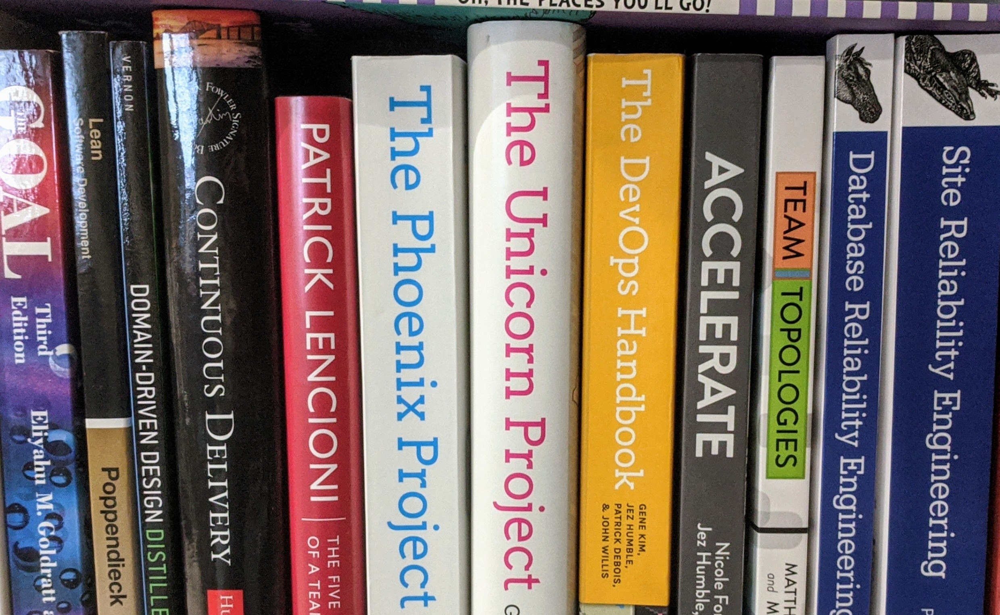
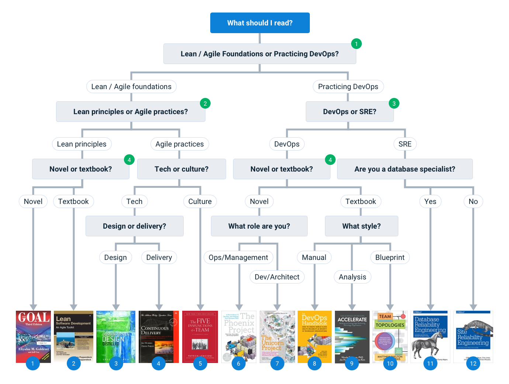

 
You like books. You want to learn more about DevOps. Either you're new to the topic, or you're looking to expand your knowledge, but you’re overwhelmed by the options. It seems like everyone has an opinion, and you don't know where to start or what to read first/next.

Or perhaps you're already an advocate of DevOps, you want to recommend a book for a friend or colleague, but you aren’t up to date on the latest releases. Which book should you put under their nose?

This post is for you.

What follows is a list of some of the most widely respected DevOps books and my personal recommendation about which one you (yes, you, specifically you) should read first. If you're pressed for time, try our [recommendation tool](https://octopus.com/devops/reading-list) inspired by this post.    

## How to read this post

This post is too long for you to read end-to-end. It’s not intended to be read that way. Instead, treat this like a “choose your own adventure” storybook, and I’ll chaperone you to the most appropriate parts you.

What follows is a simple decision tree, designed to point you directly to my personal book recommendation for you. When you get to the decision tree, I encourage you to answer the questions and see where they lead you. Hopefully, you end up with a book recommendation that piques your interest.

Some of the questions are a little loaded, so immediately below the decision tree, I’ve provided a little more information/clarification about those questions. If these clarifications help you to make your decisions, great – otherwise, you can skip them.

Next, I’ve written a brief summary of each of my recommended DevOps books. After you’ve done the decision tree exercise, I encourage you to follow the link(s) directly to my description of whichever book(s) you are most interested in reading. From there, you’ll find links to further information/reviews and purchasing options.

I’ve concluded this post with a couple of additional honorable mentions that didn’t neatly fit into the decision tree and some final thoughts.

It's my hope that by the time you finish reading, you'll feel ready to buy a copy of your preferred book, block out a few hours in your schedule, and start reading. I can say without a hint of exaggeration that when I did that, one of these books changed my professional career for the better.

To find out which book set me on my path, as well as which one I discovered while researching for this post, you have to read on.

## Choose your own adventure! A decision tree

Before you complete this exercise, an important caveat: 

**This is not perfect. It might not work.**

I cannot stress this enough. Many of the books below overlap. Some of the questions are a little contrived, often deliberately under-stating complexities or over-stating differences to create the illusion of simplicity and a quick recommendation. Please don’t take it too seriously.

Also, this is not an exhaustive list of titles. I sought as much feedback as I could while compiling this list, but ultimately there are so many great books, and I can’t include them all. Some readers will say I should include this or exclude that, but I hope the vast majority will agree that all the texts below are all widely respected.

Caveats aside, now it’s time for you to answer the questions for yourself and see where you end up.

  

    <em>(Click diagram to enlarge.)</em>
  

If you want clarification on the highlighted questions in the decision tree above, you’ll find more guidance below. If you do'nt need any clarification, skip to my summaries of [The Books](#the-books).

## Clarifications on the loaded questions

### Question 1: Lean/Agile Foundations or Practicing DevOps?

DevOps is built on the shoulders of giants. Before DevOps, there was Continuous Delivery, and Agile and Extreme Programming and TDD and Lean. In order to truly understand DevOps, it’s useful to learn about the ideas on which DevOps is built.

Ask yourself, right now, are you more interested in learning about the foundational ideas or the current state of DevOps? 

[Back to decision tree](#decision_tree)

### Question 2: Lean principles or Agile practices?

The Agile movement (which pre-dates the DevOps movement) was itself heavily influenced by the Toyota Production System (TPS) and Lean ideas. TPS and Lean are huge topics in their own right, worthy of their own reading lists. They refer to a revolution in manufacturing and supply chain management, which dates back to the 1970s and is heavily influenced by the Japanese automotive industry.

A few decades later, the Agile movement recognized that IT in the 1990s was suffering from similar issues to the pre-1970 automotive industry. Various Lean principles, designed for manufacturing, were reimagined to work in IT. These have since been codified into a set of now near-ubiquitous Agile practices.

[Back to decision tree](#decision_tree)

### Question 3: DevOps or Site Reliability Engineering (SRE)?

This is one of the hottest debates in the DevOps/SRE world, but it can be confusing because, in many ways, DevOps and SRE are pretty similar. Both DevOps and SRE promote similar ideas such as continuous delivery, observability, blameless cultures, the reduction of administrative toil, and the closer collaboration/alignment between “dev” and “ops” teams. However, there are also some important differences.

Since Google is widely credited with inventing SRE, it’s appropriate to honor Google’s definition. In [this post and short YouTube video](https://cloud.google.com/blog/products/gcp/sre-vs-devops-competing-standards-or-close-friends), they describe SRE as a class which implements DevOps. In other words, SRE is a particular working practice that implements many of the most important DevOps principles. Hence, according to Google, DevOps and SRE are not in conflict.

Some of the key components of SRE include the separation of the SRE (reimagined “Ops”) team from the product (reimagined “Dev”) teams, the use of Service Level Objectives (SLOs) to ensure that product and SRE teams share the same priorities, and the use of error budgets to encourage a healthy amount of innovation and risk taking.

However, some folks from the DevOps community are uncomfortable with this. They feel that in almost all cases, it’s much healthier for product teams, made up of a healthy mix of dev and ops folks, to run their own services. Hence, there is no need for a centralized Ops or SRE team. Some DevOps folks feel that SRE normalizes the separation of traditional dev and ops concerns. They sometimes argue that this inevitably leads to the familiar silos and functional stand-offs that DevOps attempts to avoid.

Ask yourself which feels more realistic:

- For development and operations concerns for a specific product or service to belong to separate teams (SRE)
- For a small, cross-functional team to own the entire lifecycle, end-to-end (DevOps)

[Back to decision tree](#decision_tree)

### Question 4: Novel or textbook?

This question is less about subject matter and more about learning style: What sorts of books do you enjoy reading?

Most of the books read like textbooks or manuals. They're divided into chapters about different topics, and they explain ideas the way a teacher might explain them to a student, often referencing other related materials.

However, several of the books are very different. They are written as novels. They center around specific characters who are often larger than life satires of many of the stereotypes that most IT folks are familiar with. Readers will often recognize their colleagues or themselves in these characters, provoking tears of either laughter or pain.

Most folks find the novels easier to read and more enjoyable, while others are put off by prose that are generally written by engineers, rather than arts majors. While the stories may be eerily familiar and genuinely thought provoking, don't go into these expecting the literary genius of Shakespeare, Austin, or Dickens.

Other folks find the textbooks easier to digest. They make clear and well-structured arguments but, with the best will in the world, it’s uncommon for folks to get drawn in and emotionally engaged when there are no characters and no plot. For most readers, they are less engaging.

The textbooks speak to your brain. The novels speak to your gut.

[Back to decision tree](#decision_tree)

## The Books: {#the-books}

Hopefully, by now, you’ve picked one or more books that interest you. Follow the links below to read a few of my comments about each book with links to further reviews and procurement options.

After you check out the materials for your chosen books, carry on to the [Honorable Mentions](#hon_mentions) and [Final Thoughts](#final_thoughts) sections.

### Book Index {#book-index}

1.	[The Goal](#goal)
1.	[Lean Software Development: An Agile Toolkit](#lean)
1.	[Domain-Driven Design: Distilled](#ddd)
1.	[Continuous Delivery](#cd)
1.	[The Five Dysfunctions of a Team](#dysfunc)
1.	[The Phoenix Project](#phoenix)
1.	[The Unicorn Project](#unicorn)
1.	[The DevOps Handbook](#handbook)
1.	[Accelerate](#accelerate)
1.	[Team Topologies](#tt)
1.	[Database Reliability Engineering](#dre)
1.	[Site Reliability Engineering](#sre)

### 1. The Goal (Goldratt: 1984) {#goal}

The fact that this is by far the oldest book in my selection is testament to how well its aged and how important and timeless it is.

The Goal is a novel about Alex Rogo, a senior manager at UniCo, an auto-parts manufacturing company. Business is going badly. In order to avoid a massive restructuring program and many job losses, Rogo needs to simultaneously improve performance, quality, and profitability before a seemingly impossible deadline.

His initial efforts don’t go well. He falls into various traps of old-fashioned plant management, focusing on local optimizations and cost-efficiencies. Fortunately, he bumps into Jonah, an eccentric old friend, who gives him some curious advice that seems counter to everything he believed about effective plant management.

The Goal offers a genuinely engaging, personal, accessible, and practical approach to learning about fundamental lean principles like value streams, flow, waste, global efficiencies, and the theory of constraints.

Unlike the other books in my list, The Goal makes hardly any references to software. It is, after all, a book about manufacturing, not software development. This is a good thing since it helps the reader to understand the foundational lean principles in their original context, and it means the reader requires zero prior IT experience to appreciate the concepts.

If you'd like to learn more about how these lean principles can be applied to modern software development, I encourage you to read either [The Phoenix Project](#phoenix) (a modern retelling of The Goal, based in an IT department) or [Lean Software Development: An Agile Toolkit](#lean) (a more formal textbook).

For more reviews, as well as procurement options: [Check out this book on GoodReads](https://www.goodreads.com/book/show/113934.The_Goal)

Back: [Book Index](#book-index) / Next: [Honorable Mentions](#hon_mentions)

### 2. Lean Software Development: An Agile Toolkit (Poppendieck, Poppendieck: 2003) {#lean}

A book that’s stood up to the test of time.
  
I wouldn’t like to guess how many software books have “Agile” in the title. Arguably, “Agile” was the original marketing buzzword for software. That’s probably got something to do with a drunken ski trip where a bunch of dudes created <a href="https://agilemanifesto.org/">a pithy website</a>.

However, skepticism aside, I believe these buzzwords work so well for selling software, training, and certifications because there's a fundamental truth behind them. These ideas make a lot of technical and commercial sense.

I might have mocked it above, but The Agile Manifesto had its place. For many, it was an important stepping stone toward articulating Agile. However, a better articulation for Agile is Mary and Tom Poppendieck’s “Lean Software Development: An Agile Toolkit”, which came along two years later.

The Poppendiecks take 7 of the core lean principles and talk practically about how they translate from the manufacturing domain into software development:

1.	Eliminate Waste
1.	Amplify Learning
1.	Decide as Late as Possible
1.	Deliver as Fast as Possible
1.	Empower the Team
1.	Build Integrity In
1.	See the Whole

Along the way, they cover 20 tools for applying the lean principles into practice, such as Value-Stream Mapping, working in iterations, and refactoring.

This book stands up as one of the (if not the) best articulation of what Agile actually is, how it builds on stable Lean foundations, and why specific practices result in better software delivery outcomes. As an “Agile” book, it’s not technically a “DevOps” book (it was written 6 years before Patrick DeBois accidentally gave us *that* buzzword), but this book was an important chapter in the genesis of DevOps.

For those who want to learn more about Lean principles in their original manufacturing context, check out [The Goal](#goal). For those who would like to learn how these Agile ideas have evolved with the emergence of DevOps, take a look at [The DevOps Handbook](#handbook). For those who would like to go deeper into software design/architecture, try [Domain-Driven Design: Distilled](#ddd). Finally, for those who are more interested in the human side of Agile/DevOps, you might prefer [The Five Dysfunctions of a Team](#dysfunc) (more personal) or [Team Topologies](#tt) (more strategic).

For more reviews, as well as a preview and procurement options: [Check out this book on GoodReads](https://www.goodreads.com/book/show/194338.Lean_Software_Development)

Back: [Book Index](#book-index) / Next: [Honorable Mentions](#hon_mentions)

### 3. Domain-Driven Design Distilled (Vernon: 2016)  {#ddd}

Domain-Driven Design (DDD) is an approach that enables folks to create loosely coupled architectures and avoid creating a “big ball of mud” monolithic system, which is painful to develop, deploy, or maintain. <a href="https://martinfowler.com/bliki/DomainDrivenDesign.html">Martin Fowler does a better job of describing it on his blog</a> than I can reasonably expect to achieve in a few paragraphs here.

Central to DDD is the idea of “Bounded Contexts”, which can be used to define the scope of any one part of the system. Team members acknowledge that the language used in any one context is consistent but that it might also vary between different contexts. This allows teams to focus on solving the right problems in the right places and establishing appropriate interfaces between different contexts to avoid complicated dependencies and introducing mistakes due to subtle contextual differences. [Again, Fowler does a great job of explaining Bounded Contexts in more detail here.](https://martinfowler.com/bliki/BoundedContext.html)

The great thing about writing a post like this is receiving feedback. As I was compiling my list of titles, I asked Twitter for feedback, and a few folks suggested a book about DDD. For example:

<blockquote class="twitter-tweet">
The DDD books are important to me. The stuff on Bounded Contexts and a Ubiquitous Language seems relevant in terms of how it can help break down silos and organise teams.
&mdash; Yani Lathouris (@Yarnacle) <a href="https://twitter.com/Yarnacle/status/1318511712983683072?ref_src=twsrc%5Etfw">October 20, 2020</a></blockquote> 

Honestly, this was me discovering a blind spot of my own. DDD is not a topic I’d studied before, and I had not appreciated the relationship between DDD and DevOps. I’m grateful to all the folks who encouraged me to take a look. Now I’ve got a new book on my bookshelf, and I’ve been learning too.

Most folks recommended [Eric Evans’ Domain-Driven Design](https://www.goodreads.com/book/show/179133.Domain_Driven_Design), but Matthew Skelton (author of [Team Topologies](#tt)) also recommended Vernon’s “distilled” edition to me. After a little research, I learned that the Evans book has excellent reviews and is recognized as the gold standard for DDD. However, it’s also perceived as long and complicated. (It’s 560 pages long, and it costs over $50, making it longer and more expensive than any of the other books in this post.)

Since this was to be my first book about DDD, I purchased a copy of Vernon’s “distilled” edition instead. Half the price and only 130 diagram-rich pages. Even slow readers (like myself) will probably be able to read it cover to cover in a few hours. I’ve included the Vernon book in my list because I’m uncomfortable recommending a book I haven’t read, but I recognize that many readers may prefer to go straight for the Evans book.

The Vernon book is a great primer on DDD, and it’s relatively easy to digest by anyone with a little software development experience. It’s especially relevant for anyone who is either struggling with a monolithic system at the moment or who would like to avoid their stuff gradually turning into one.

After reading Domain-Driven Design Distilled, you might like to go deeper on DDD with the Evans book mentioned above. Alternatively, you might like to read more about how loosely coupled architectures are so much easier to work with. This is covered to some extent in both [Accelerate](#accelerate) and [The DevOps Handbook](#handbook). 

You might also like to take a look at [Sam Newman’s Building Microservices](https://www.goodreads.com/book/show/22512931-building-microservices) (which narrowly missed a spot in this post), and in [Site Reliability Engineering](#sre) you learn how Google maintains a large, complicated environment with many loosely coupled services.

Finally, I encourage you to take a look at [Team Topologies](#tt). Software architecture starts with team architecture, and Team Topologies uses Conway’s Law to apply the ideas of bounded contexts and loosely coupled systems to the way we architect the teams in our IT departments. 

For more reviews, as well as a preview and procurement options: [Check out this book on GoodReads](https://www.goodreads.com/book/show/28602719-domain-driven-design-distilled)

Back: [Book Index](#book-index) / Next: [Honorable Mentions](#hon_mentions)

### 4. Continuous Delivery (Humble, Farley: 2011)  {#cd}

The first time I attended the London Continuous Delivery (CD) Meetup group, shortly after this book was published, half the attendees were holding a copy. They called it “the Bible”. While the DevOps movement had already started by 2011, I don’t think I’d heard of it yet. Our community had something very similar called CD instead.

This book formalized many of the ideas about deployment pipelines that have since become ubiquitous. It goes into some technical detail about Config as Code, build and deployment automation, and effective testing strategies.

Most folks don’t tend to read this book end to end. (It’s pretty dry and technical.) Instead, it’s best used as a reference book. If you intend to adopt new technical practices, it’s worth reading the associated chapter before you get started to help you understand how to approach it.

The book is generally pretty technical, mostly focusing on the practical implementation of deployment pipelines. However, it also discusses topics such as hand-offs, rapid iterations, experimentation, and learning. In many ways, once you start to see CD through this broader lens, it becomes difficult to differentiate between CD and DevOps.

In fact, today, there is some confusion about the scope of CD. For some, it’s simply about the practical implementation of deployment pipelines. For others, CD encompasses broader cultural and organizational issues. Some would go as far as to say that DevOps is part of CD, rather than the other way around.

For example, the two authors now seem to be on opposite sides of this debate. Jez Humble went on to co-author [Accelerate](#accelerate), which has the word “DevOps” on the front cover and describes a set of “Continuous Delivery” capabilities that are distinct from other capabilities under the headings “Architecture”, “Product and Process”, “Lean Management and Monitoring”, and “Cultural”. At the same time, Dave Farley views CD as a synonym for DevOps (and in the past, he claimed that DevOps was but a component of CD), as [he expressed on his YouTube channel](https://www.youtube.com/watch?v=MnyvgFDh-kw&list=PLwLLcwQlnXBw9jv5tFXQC_ch-VCXwPikM&index=4). 

Personally, I tire of this debate. CD and DevOps grew up alongside each other and are derived from similar Lean, XP, and Agile ideas. Through a mixture of independent thought and borrowed ideas, they came to similar conclusions. I encourage you to celebrate the way these two movements support each other rather than getting hung up on the relationship between them. (And I expect that Jez and Dave would agree.)

If you enjoyed Continuous Delivery, you might also enjoy [Site Reliability Engineering](#sre). It’s a similar technical book, designed for very large IT departments, that covers many additional topics from a more production/operations/maintenance. On the other hand, if you found CD a little dry and would like something more accessible, try [The DevOps Handbook](#handbook) or [Accelerate](#accelerate) instead.

For more reviews, as well as procurement options: [Check out this book on GoodReads](https://www.goodreads.com/book/show/8686650-continuous-delivery)

Back: [Book Index](#book-index) / Next: [Honorable Mentions](#hon_mentions)

### 5. The Five Dysfunctions of a Team (Lencioni: 2002) {#dysfunc}

Andrew Clay Shafer’s “wall of confusion” slide at Velocity in 2009 struck a chord because it was such a great articulation of the “core chronic conflict” between dev and ops. It resonated. Painfully.

Most large organizations have more complex political structures than simply “dev” and “ops”, and it’s a struggle to get all functions working in alignment – yet this is precisely what’s required in order to achieve short lead times, frequent releases, and “flow”.

Alignment is only possible with teamwork, and teamwork is not possible without well-trained team players. As Gerald Weinberg famously said, “no matter what they tell you, it’s always a people problem”.

This is why the DevOps community has always been deeply focused on people and culture. However, tech folks are generally far more comfortable talking about software or automation than they are talking about emotions, trust, or personal vulnerabilities. This leads to one of DevOps’ problems: Too often, it’s boiled down to simply automated deployments, infrastructure as code, or the latest vendor tool. These over-simplifications completely miss the point.

The Five Dysfunctions of a Team provides a logical framework for addressing “the people problem”. The first 180 pages tell a “Leadership Fable”, similar to [The Goal](#goal), [The Phoenix Project](#phoenix), or [The Unicorn Project](#unicorn). DecisionTech is a start-up with all the raw ingredients for success, but the senior leadership team is a dysfunctional mess. Kathryn Peterson, the new CEO, is tasked with uniting these individually brilliant but wily and guarded individuals to turn the company’s fortunes around.

The final 40 pages formally review the framework Kathryn uses to create an effective team. You could skip the fable and just read these 40 pages and be done in an hour, but that would be like reading sheet music in silence or learning to use some new tech by reading the documentation without ever installing it. In order to be truly appreciated, it’s valuable to read the fable and observe the framework in action.

If your biggest problems are “people problems”, this book should be one of the first that you read.

After reading “dysfunctions”, if you’d like to learn how to structure multiple teams in your organization for success, you might like to try reading [Team Topologies](#tt). If you fancy another fable, take a look at [The Phoenix Project](#phoenix), in which some of the exercises from “dysfunctions” are used to bring together warring leadership teams in the midst of a project management disaster. 

For more reviews, as well as a preview and procurement options: [Check out this book on GoodReads](https://www.goodreads.com/book/show/21343.The_Five_Dysfunctions_of_a_Team)

Back: [Book Index](#book-index) / Next: [Honorable Mentions](#hon_mentions)

### 6. The Phoenix Project (Kim, Behr, Spafford: 2013)  {#phoenix}

Earlier, I mentioned that one of these books changed the course of my career. This was it.

The Phoenix Project is a satire of every company you’ve ever worked for. It’s full of the larger than life characters that you often worked with in the past. There’s the grumpy DBA, the lone engineer who understands how all the most critical systems work, and the senior leadership characters who don’t understand tech, and many others. You read this book and recognize your colleagues. One by one, you giggle to yourself. There’s Dave. That’s Susan. Oh, wait – that’s me.

Gene Kim was so inspired when he read [The Goal](#goal) that he wanted to retell it in the context of software development. The Phoenix Project is an homage. Alex Rogo is replaced by Bill Palmer, a middle manager who’s just been _unwittingly_ promoted into a senior leadership role after his predecessor was fired. He works for Parts Unlimited, another auto-parts manufacturing company, and business is going badly. Sound familiar?

Parts Unlimited has bet the shop on The Phoenix Project, a giant new software release designed to turn the company’s fortunes around. They promised investors that it will be delivered in a few weeks, but the team is hopelessly behind schedule, and the marketing department keep adding to the workload through various unofficial back-channels. At the same time, frequent firefighting is pulling resources away from Phoenix and causing more delays. It’s a vicious cycle from which escape appears to be impossible.

If Phoenix is not delivered on time, Bill knows that he and the majority of his colleagues will lose their jobs.

The Goal’s Jonah is replaced by Eric, a quirky new investor with crazy ideas that challenge Bill’s conventional wisdom. Under Eric’s mentorship, Bill learns the flaws in his old ideas about how to manage IT projects. He embarks on a journey to understand “The Three Ways”: Flow, Feedback, and Continual Experimentation and Learning.

Along the way, each of those archetypal characters either learns to embrace a new way of working or they get their comeuppance. When I realized that things weren’t likely to end well for the character that I recognized as myself, I personally knew I had to change.

In my opinion, the most valuable thing about this book is how well it articulated the harm I was doing, when I thought I was doing my job well. The Phoenix Project helped me to understand my role and the consequences of my actions in a broader and more valuable context. If it wasn’t for this book, I probably wouldn’t be writing this post.

If you enjoyed The Phoenix Project, you’ll probably also enjoy [The Unicorn Project](#unicorn), which tells the same story from a very different perspective, and you might be interested to go back and read [The Goal](#goal). If you’d like to learn more about building great teams, check out [The Five Dysfunctions of a Team](#dysfunc). If you want a more formal overview of the topics raised in Phoenix, try [The DevOps Handbook](#handbook) or [Accelerate](#accelerate).

For more reviews, as well as a preview and procurement options: [Check out this book on GoodReads](https://www.goodreads.com/book/show/17255186-the-phoenix-project)

Back: [Book Index](#book-index) / Next: [Honorable Mentions](#hon_mentions)

### 7. The Unicorn Project (Kim: 2019)  {#unicorn}

The Unicorn Project is a retelling of [The Phoenix Project](#phoenix). It’s neither a prequel nor a sequel. It’s the same story, on the same time-line, but told from a different perspective.

The Phoenix Project is told from Bill Palmer’s perspective, as a senior manager with a background in the operations side of the business. Phoenix talks a lot about lean principles and collaboration and all that’s valuable, but Bill has been promoted far enough that he rarely plays with the code any more, and he lacks development experience. This can make The Phoenix Project an unsatisfying read for developers, sometimes giving them the impression that unless you are in senior management, you can’t do much about the underlying problems.

In contrast, The Unicorn Project tells the story of Maxine Chambers. She’s a senior developer who’s just been relegated to the phoenix project after getting the blame for a disaster that wasn’t her fault. Well respected by her team, she’s a strong leader who shuns formal management positions because she loves to code.

Alongside some of the organizational themes, such as corporate bureaucracy, blame culture, and lengthy approval processes, “Unicorn” covers more technical topics, including continuous integration (CI), data management, and functional programming. (Yeah, I admit I was a little surprised by that last one!)

The primary focus of Unicorn is “The Five Ideals”:

1.	Locality and simplicity
1.	Focus, flow, and joy
1.	Improvement of daily work
1.	Psychological safety
1.	Customer focus

While Unicorn is undoubtedly aimed at engineers over managers, and developers over operations, it’s the pairing of Phoenix and Unicorn that I find so valuable. Frankly, if you like one, you’ll probably enjoy the other, and it’s enlightening to read the same story from two different perspectives. It’s a wonderful exercise for learning to understand and empathize with how the other side sees things.

If you enjoyed the Unicorn Project, try reading [The Phoenix Project](#phoenix) next. If you’d like to learn more about building great teams, check out [The Five Dysfunctions of a Team](#dysfunc). If you’d like to learn more about designing your code for DevOps, try [Domain-Driven Design: Distilled](#ddd) or if you are a data specialist, [Database Reliability Engineering](#dre). Finally, if you’d like to learn more about continuous integration and deployment pipelines, check out either [Continuous Delivery](#cd) or [The DevOps Handbook](#handbook).

For more reviews, as well as a preview and procurement options: [Check out this book on GoodReads](https://www.goodreads.com/book/show/44333183-the-unicorn-project)

Back: [Book Index](#book-index) / Next: [Honorable Mentions](#hon_mentions)

### 8. The DevOps Handbook (Kim, Humble, Debois, Willis: 2016) {#handbook}

This book is perhaps the best articulation of what DevOps is. It’s intended as a companion to <a href="https://www.octopus.com/blog/devops-reading-list#phoenix">The Phoenix Project</a>, and it aims to codify the thoughts and patterns of Phoenix into a more formal and actionable pocket handbook. (Although you need pretty big pockets.)

It opens with an account by John Willis called “The Convergence of DevOps”. This is a short and excellent read, describing how various interrelated movements (Lean, Agile Manifesto, Agile Infrastructure, Continuous Delivery, Toyota Kata) all seemed to reach similar conclusions at roughly the same time and how they converged under the banner of DevOps.

The handbook then uses Kim’s “three ways” from the Phoenix Project as a logical structure through which it articulates many of the key ideas and practices at the heart of DevOps, including value stream mapping, deployment practices, testing, telemetry, experimentation/learning. There’s also a section dedicated to security and compliance.

It’s well written too. It’s easy to understand with many references to other great books, articles, and videos. It also includes plenty of real-world case studies to demonstrate the theories in practice.

One of the key differentiators of The DevOps Handbook relative to [Continuous Delivery](#cd) (CD) or [Site Reliability Engineering](#sre) (SRE) is its accessibility. It explains the ideas and concepts in straightforward and logical terms, and it ties them directly to business values that are relatively easy to understand even by folks who aren’t experienced engineers or business leaders. This is one reason why it’s a great read for IT managers or senior leadership who lack recent technical experience.

This accessibility may also be its downside. On the topics I was already familiar with, I wanted to go deeper, but I was left with questions. 

> “How should you handle this unusual scenario?”

> “How would that work in practice?”

If compared with CD or SRE, for example, The DevOps Handbook is less detailed but broader in scope, and it’s an easier read as a result. Unlike CD or SRE (which are pretty dense), you may find yourself reading the handbook cover to cover.

The DevOps Handbook is a fantastic read for someone new to DevOps or someone who wants to better understand how the various strands of DevOps fit together. After you finish it, you’ll hopefully be inspired to continue your DevOps education by going deeper on the topics that most interest you.

If you haven’t read [The Phoenix Project](#phoenix) yet, it’s a great companion to The DevOps Handbook as it tells the story of an IT manager who puts “the three ways” into practice. If you want to go deeper on any of the specific topics, you’ll likely find plenty of references in "Handbook" to further reading materials. In fact, most of the books in this post that pre-date the handbook are referenced at some point.

If you’re in senior management and you're interested in more reading material to help you structure your IT organization for success, I recommend you take a look at [Accelerate](#accelerate), which takes a scientific, data-driven approach to analyze the data from the State of DevOps reports to make an empirical case for why many of the practices in the handbook deliver business value. You might also enjoy [Team Topologies](#tt), which explores the various team structures that either enable or inhibit flow.

For more reviews, as well as a preview and procurement options: [Check out this book on GoodReads](https://www.goodreads.com/book/show/26083308-the-devops-handbook)

Back: [Book Index](#book-index) / Next: [Honorable Mentions](#hon_mentions)

### 9. Accelerate (Forsgren, Humble, Kim: 2018) {#accelerate}

If <a href="https://www.octopus.com/blog/devops-reading-list#handbook">The DevOps Handbook</a> explains “how” to embrace DevOps, Accelerate explains “why”. This is the slam dunk argument for anyone who is either skeptical of DevOps or interested in understanding the relationship between various DevOps practices and business success. It’s a great tool for selling DevOps to senior management.

In many ways, the book is a response to the critique that “DevOps” is a buzzword or a cult, full of warm and fluffy ideas that might sound nice and make sense for a small business or start-up, but which do not practically scale for large organizations or are not compatible with tightly regulated industries like healthcare or finance.

The authors achieve this by analyzing the data from the 2014-2017 [State of DevOps Reports](https://dora.dev/publications/). Forsgren, [a well-respected and published researcher](https://nicolefv.com/research), applies various scientific and statistical methods to the data to see what they can teach us. Her findings are striking.

Long story short: The business benefits of DevOps are real and predictable.

Despite the deeply scientific and statistics driven methods, Accelerate is a relatively short and easy to digest book, written in plain English, in a format that should make sense to either the technical or the commercial folks in any business.

The book is divided into 3 parts, each very different.

Part 1 gets straight to the point, detailing the extraordinary findings in just 130 short, diagram-rich pages. Frankly, if you are new to DevOps, these 130 pages would make an excellent DevOps primer, even if you then decide to switch to one of the other books in this list. 

Personally, I’m a fan of audiobooks, and over time I’ve gradually increased the speed at which I play them. I now listen to them at roughly double-speed, and anything slower just feels tedious. In the pre-covid era, I used to travel a lot for work. I listened to the whole of Accelerate part 1 in under 90 minutes while driving home from a “DevOps Health Check” style consulting engagement. The book was describing many of the problems that this and many of my other clients were struggling with.

I was so captivated by what I heard that as soon as I got home, I ordered myself a hard copy for next-day delivery so that I could re-read it more carefully.

Accelerate helped me to understand and appreciate many of the issues that I regularly witnessed with my customers. Previously, I would have gut instincts that certain practices were harmful, but I struggled to authoritatively articulate why. Accelerate gave me the language and evidence to explain my gut reactions to both technical and commercial stakeholders.

While I found part 1 enormously useful, I've never attempted to read part 2. I don’t think it’s designed for me. It’s an academic discussion about the scientific and statistical methods used to deliver the conclusions detailed in part 1. I’m sure that this will be valuable reading to any stats or data geeks who are interested in the methods or for any skeptics who want to find flaws in the logic. Personally, despite being a database specialist, I’m not sure I fit into either category.

I enjoy driving, and I enjoy coding, but I couldn’t design a carburetor or a CPU. Similarly, I recognize that I’m more interested in applying the lessons Accelerate teaches than understanding the scientific and statistical models used to come up with them. What matters to me is that the authors’ methods work. Given the popularity of the book and the fact that I’ve not heard any serious criticisms of the authors’ methods, my personal conclusion is that the methods were probably reliable. (And if they weren’t, it’s unlikely that I’d be the one to challenge them anyway. I recognize that Nicole Forsgren is better at research and analysis than I am.)

Despite not reading part 2, I did find part 3 useful. It’s a case study from ING Netherlands. It tells the story of a specific organization that applied the lessons from part 1. The authors give a clear warning that what matters is ING’s approach to interpreting the lessons, rather than the particular practices that they implemented. It’s a useful way to finish the book since it demonstrates how to go about putting the theory into practice.

So what are the lessons?

Accelerate places a high priority on the simultaneous and continuous improvement against four key metrics:

1.	Lead time
1.	Deployment Frequency
1.	Mean Time to Restore (MTTR)
1.	Deployment Failure Percentage

These four metrics reinforce each other, creating a virtuous cycle, and are predictive of business success as measured by profitability, market share, and productivity.

In order to achieve business success, Accelerate highlights 24 practical capabilities (such as automating deployments and supporting learning) that are demonstrated to drive improvement against the four metrics.

Accelerate provides sound evidence and reasoning, which explains why DevOps works as a method for delivering enormous business value. This makes it a great first DevOps book or a great gift for a senior leadership team who lack technical experience. For example, if you have read [The Phoenix Project](#phoenix), imagine how much grief Bill Palmer (VP of IT Operations) would have saved himself if he’d managed to persuade Steve Masters (CEO) to read Accelerate in chapter 1.

If your role is a technical one, or you are a senior manager with responsibility for technical outcomes, after reading Accelerate, you probably want to move on to one of the more practical “how to do DevOps” books, like [The DevOps Handbook](#handbook), [Continuous Delivery](#cd), [Site Reliability Engineering](#sre), [Domain-Driven Design: Distilled](#ddd) or (if you need to tackle people, team, or culture issues before addressing the technical issues) [The Five Dysfunctions of a Team](#dysfunc) or [Team Topologies](#tt). 

For more reviews, as well as a preview and procurement options: [Check out this book on GoodReads](https://www.goodreads.com/book/show/35747076-accelerate)

Back: [Book Index](#book-index) / Next: [Honorable Mentions](#hon_mentions)

### 10. Team Topologies (Skelton, Pais: 2019) {#tt}

Team Topologies uses <a href="https://en.wikipedia.org/wiki/Conway%27s_law">Conway’s Law</a> to bridge the divide between books about designing effective software architectures (e.g. <a href="https://www.octopus.com/blog/devops-reading-list#ddd">Domain-Driven Design: Distilled</a>) and books about creating effective teams (e.g. <a href="https://www.octopus.com/blog/devops-reading-list#dysfunc">The Five Dysfunctions of a Team</a>), while optimizing for the rapid “flow” of value to end users.

Matthew Skelton is deeply influenced by the Continuous Delivery movement in the UK, and this influence shines through. I know this personally because, for about a year back in 2017, I co-organized the [London Continuous Delivery Meetup Group](https://www.meetup.com/London-Continuous-Delivery/) with him. Attendees would sometimes come with their copy of [Continuous Delivery](#cd) tucked under their arm - and they called it “the Bible”. The spin-off [Pipeline Conferences](https://pipelineconf.info/), which Skelton ran, were some of the most welcoming, diverse, and intellectually stimulating tech conferences I’ve ever attended/supported.

Team Topologies is a book for the senior managers of IT departments. It takes the view that software architecture starts with team architecture, and it provides a blueprint for designing your teams, and the communication/collaboration protocols between them, in such a way that your preferred software architecture emerges organically. This radically reduces both the need for toxic bureaucracy and the risk of poor architectural choices that accrue significant [technical debt](https://en.wikipedia.org/wiki/Technical_debt).

If you enjoyed Team Topologies and would like to learn more about some of the core concepts it discusses, the three books referenced in the first two paragraphs above are a great start. You might also enjoy [Accelerate](#accelerate), which is another ideal book for senior IT leadership, which uses a scientific, data-driven approach to map various technical and cultural practices to business success. 

For more reviews, as well as procurement options: [Check out this book on GoodReads](https://www.goodreads.com/book/show/44135420-team-topologies)

Back: [Book Index](#book-index) / Next: [Honorable Mentions](#hon_mentions)

### 11. Database Reliability Engineering (Campbell, Majors : 2018) {#dre}

> "The book absolutely delivers: it’s a 250-page version of the concepts in Google’s [Site Reliability Engineering](https://octopus.com/blog/devops-reading-list#sre) book (which I love) targeted at people who might currently call themselves database administrators but want to go to work in fast-paced, high-scale companies."

Those are not my words; they were written by Brent Ozar in [his own review of “DRE”](https://www.brentozar.com/archive/2017/11/book-review-database-reliability-engineering-campbell-majors/).

As I was compiling this post, I came across Brent’s review and, frankly, I love it. He said exactly what I wanted to say, but better. He explains how the reader should approach the book, depending on whether they're a DBA, a manager, or a developer/SysAdmin.

Personally, my favorite take-aways from DRE were the focus on “resilience over robustness” and the ubiquitous use of SLOs as a method for aligning objectives and improving collaboration across the “wall of confusion” between dev and ops. I also appreciated the focus on “operational visibility” as opposed to traditional monitoring, which gets to the heart of the current #observability debate.

Brent signs off with:

> “It’s the kind of book that’s easy to read, and hard to implement. Seriously, just implementing the SLOs described in chapter 2 takes most traditional companies months to agree on and monitor.

> “Over time, the brand names and open source tools will change, but the concepts are going to be rock solid for at least a decade. This book is a great waypoint marker set about 5-10 years in the future for most of us, but it’ll be one you’ll be excited to work towards.”

[Check out Brent’s full review here](https://www.brentozar.com/archive/2017/11/book-review-database-reliability-engineering-campbell-majors/) (but please come back when you are finished).

That pretty much sums it up for “DRE”. Thanks, Brent, for saving me a little time!

If you enjoyed “DRE”, it’s likely you’ll also enjoy its big sister, [Site Reliability Engineering](#sre), which is bigger in size and broader in scope. However, if you fancy something a little lighter, you might enjoy [The Phoenix Project](#phoenix), in which an operations team learn to work more effectively with developers and the rest of the business to avoid repeated data-centric disasters. You might also like Phoenix’s sister novel, [The Unicorn Project](#unicorn), which tells the same story from the perspective of a senior developer who inherits a monolithic database and is effectively tasked with creating and maintaining a data lake.

If you're struggling to break out a monolithic database into a set of smaller, more loosely coupled databases, you may also benefit from reading [Domain-Driven Design: Distilled](#ddd). Finally, if you're an old-school DBA, and you remain skeptical about DevOps, I encourage you to take a look at [Accelerate](#accelerate).

For more reviews, as well as a preview and procurement options: [Check out this book on GoodReads](https://www.goodreads.com/book/show/36523657-database-reliability-engineering)

Back: [Book Index](#book-index) / Next: [Honorable Mentions](#hon_mentions)

### 12. Site Reliability Engineering (Beyer, Jones, Petoff, Murphy: 2016) {#sre}

You’ve arrived at the heaviest book in this list.

Site Reliability Engineering (SRE) details the way that Google approaches the continuous delivery and maintenance of its enormous portfolio. It’s been so popular and influential in the DevOps community that there is now a growing sub-community who embrace “SRE” as a distinct thing either as well as, or within, “DevOps”.

Reading this book is a reasonable time investment, so for those who are new to SRE, I recommend that before you buy it, you explore the following links:

1.	This blog post by Google: [SRE vs DevOps: Competing standards or close friends?](https://www.googblogs.com/sre-vs-devops-competing-standards-or-close-friends/)
1.	Thomas A. Limoncelli’s 2012 session at USENIX NYC: [SRE@Google: Thousands of DevOps Since 2004](https://www.youtube.com/watch?v=iIuTnhdTzK0)

That 10 minute read / 45 minute watch should give you a great primer on Google’s approach, covering important topics, including the difference between DevOps and SRE, as well as some of the core components of SRE, including SLOs, error budgets, and Customer Reliability Engineering.

Then you’ve got 560 pages covering 34 chapters, detailing some of the technical and cultural practices that Google employs to manage the reliability of its services at scale. There's so much in it that I’m not even going to attempt to go further than that about any specific techniques.

While SRE is a fascinating read, it’s worth remembering that most of us do not work for organizations anywhere near as close to “Google-scale”. With that in mind, SRE is most relevant to folks who work at very large organizations. 

One of the criticisms of SRE is the way it effectively normalizes and advocates for the existence of a separate SRE (Ops/DevOps) team. My personal view is that the majority of the DevOps community believe that in the vast majority of cases, and certainly in most small/medium-sized companies, it’s better for a team to own the end-to-end lifecycle of their product or service rather than to hand “Ops” concerns over to a separate silo.

This concern aside, many of the practices in the book are likely to be broadly applicable and relevant. It may give you ideas about how to solve some of your own challenges.

SRE is a great read for anyone who self-identifies as being toward the “Ops” end of the DevOps spectrum, and for anyone looking for ways to improve the relationships between distinct Dev and Ops teams. For folks who want to go deeper on data and databases, check out [Database Reliability Engineering](#dre) as well/instead. For folks who are more interested in Continuous Delivery challenges, rather than operability challenges, consider [Continuous Delivery](#cd). For those who would like to learn more about splitting monolithic systems into a more loosely coupled collection of services, take a look at [Domain-Driven Design: Distilled](#ddd). For those who liked SRE but don’t understand how it differs from DevOps, buy yourself a copy of [The DevOps Handbook](#handbook) for comparison (and, specifically, take a close look at chapter 7). For folks who are torn about whether to set up a distinct SRE team, you may find some guidance in [Team Topologies](#tt).

For more reviews, as well as a preview and procurement options: [Check out this book on GoodReads](https://www.goodreads.com/book/show/27968891-site-reliability-engineering)

Back: [Book Index](#book-index) / Next: [Honorable Mentions](#hon_mentions)

## Honorable mentions {#hon_mentions}

I posted my first attempt to compile this list on Twitter last month:

<blockquote class="twitter-tweet">
My next blog post in picture form:  What are my top 10 <a href="https://twitter.com/hashtag/DevOps?src=hash&amp;ref_src=twsrc%5Etfw">#DevOps</a> book recommendations?  Who should read each book?  Do you agree/disagree? Which books would you change (one out, one in)? What Qs would you ask? <a href="https://t.co/XHcmNatday">pic.twitter.com/XHcmNatday</a>
&mdash; Alex Yates (@_AlexYates_) <a href="https://twitter.com/_AlexYates_/status/1317121708336316416?ref_src=twsrc%5Etfw">October 16, 2020</a></blockquote> 

I was blessed to receive some wonderful feedback. Generally, it was pretty positive:

<blockquote class="twitter-tweet">
This is an excellent list and notice that there&#39;s not a single book about kubernetes, Jenkins or any other tool that makes you think you&#39;re &quot;doing DevOps&quot; <a href="https://t.co/oXUz0boWYq">https://t.co/oXUz0boWYq</a>
&mdash; Chris James (@quii) <a href="https://twitter.com/quii/status/1318450602599473152?ref_src=twsrc%5Etfw">October 20, 2020</a></blockquote> 

<blockquote class="twitter-tweet">
Only 4 I haven&#39;t read!! Looks like I need to look into those! You have my favourites there for sure!! Accelerate, Phoenix Project, 5 dysfunctions of a team.
&mdash; Dinah Davis (@Dinah_Davis) <a href="https://twitter.com/Dinah_Davis/status/1318555085937496070?ref_src=twsrc%5Etfw">October 20, 2020</a></blockquote> 

However, this is all very subjective. This is a big and diverse community with a lot of opinions. There were plenty of folks who suggested I add this book or remove that one. I listened to the advice, and I did make a few changes. Especially when someone with the credentials of Andrew Clay Shafer gave me direct advice. (For those who don’t know who he is, let’s just say [his Twitter handle is a little modest](https://www.youtube.com/watch?v=o7-IuYS0iSE). I felt like a total groupie when I saw his reply.)

<blockquote class="twitter-tweet">
swap ‘Lean Start Up’ for a Poppendieck book
&mdash; wear a mask 雷启理 (@littleidea) <a href="https://twitter.com/littleidea/status/1317188423543791616?ref_src=twsrc%5Etfw">October 16, 2020</a></blockquote> 

You might like to scroll around the various Twitter threads to see which books other folks liked and disliked, and I’d love for you to reply with your own comments. (Especially if this post inspired you to read something!)

There are also a few more reads that aren’t traditional books. Hence, they didn’t fit neatly into the decision tree above. Despite this, they are well worth your attention.

### The Annual State of DevOps Reports

Since 2012, a team of researchers from Puppet and DORA, with the support of various sponsors, have been polling thousands of IT professionals and analyzing the results. [Initially lead by Alanna Brown, and later by Nicole Forsgren](https://twitter.com/nicolefv/status/1328049610439360515), this research program has provided the DevOps movement with more data-driven, evidence-based foundations than would be possible by any individual author or speaker sharing their own personal experiences.

The data from the 2014-2017 reports were used by Forsgren, Humble, and Kim to produce [Accelerate](#accelerate) in 2018, which I believe remains the best evidence our industry possesses for the value of DevOps.

[You can review all the DORA State of DevOps Reports (2014-2019 at the time of writing) here](https://dora.dev/publications/).

### Beyond The Phoenix Project

Beyond the Phoenix Project is technically an audiobook, but it’s really more like a podcast series. It’s basically a recording of a 7 hour conversation between Gene Kim (Co-author of [The Phoenix Project](#phoenix), as well as other titles in this post) and John Willis (co-author of [The DevOps Handbook](#handbook)). 

Kim and Willis start by exploring the history of DevOps from its earliest origins (which Willis claims go back as far as Charles Darwin in 1859!), and they dig into the life and teachings of various impactful figures along the way, including William Deming, Taiichi Ohno, and Eliyahu Goldratt. 

They then review some of the most significant theoretical foundations of modern DevOps, including Lean Manufacturing and Safety Culture, before taking a practical look at the various DevOps ideas that played out in The Phoenix Project.

They finish with a recording from a session at a DevOps Enterprise Summit event in 2017, where they brought a bunch of experts together to explore the commonalities between Lean and Safety Culture.

It’s a fascinating listen from start to finish, and one that many people go back to and repeat over and over.

[You can purchase Beyond the Phoenix Project from Audible here.](https://www.audible.co.uk/pd/Beyond-the-Phoenix-Project-Audiobook/B07B7CH7FQ)

EDIT: Since this post was first published, I learned that [you can buy a transcript of the conversation here](https://itrevolution.com/book/beyond-phoenix-project/).

### How complex systems fail

When exploring the historical foundations of DevOps, most folks (including myself) immediately jump to Lean Manufacturing, and that’s well justified. However, many folks fail to recognize that DevOps owes much to the “Safety Culture” or “Safety 2.0” movement as well, which has a totally independent and very different history. Arguably, ideas such as agile infrastructure, chaos engineering, resilience over robustness, observability, and blame-free cultures owe more to Safety Culture than they do to Lean Manufacturing.

Safety Culture is the study of the cause of disasters in complex and often high-risk environments. In IT, we often fall into the trap of believing our regular IT failures should class our work as high risk. That’s normally a mistake, and most folks who argue that it isn’t, have clearly never worked in the military, a hospital, or the aviation industry, where individuals are often making literal life and death decisions on a daily basis. Our deployment screw ups normally matter a lot less than the screw ups of a soldier, surgeon, or pilot. It’s often worth reminding ourselves about that. (Imagine how much more difficult a blameless post-mortem would be if someone had actually died.)

However, there is a lot we can learn from folks who genuinely have to manage serious risks on a daily basis. In the 1990s, Richard Cook worked in the health care sector and researched patient safety. In 1998 he published a paper called How Complex Systems Fail. It’s a relatively short and easy read that summarizes 18 core ideas about the effective management of risk. The crazy thing is that as an IT person, if you didn’t know he was writing about safety in hospitals, you would probably have thought you were reading about IT.

By reflecting on Cook’s research and imagining the implications to one fictional IT organization that embraces DevOps and another that favors old-fashioned waterfall style project management and bureaucracy, it’s easy to understand why the waterfall organization is far more likely to suffer more frequent and severe disasters.

I won’t try to summarize the main points of Safety Culture here because it would take too long, and ultimately, I’d just be paraphrasing the same points Cook makes pretty articulately for himself. I encourage you to read the paper; it’s only a 10-minute read: [https://how.complexsystems.fail/](https://how.complexsystems.fail/)

### Other reputable DevOps reading lists

Don’t just take my word for it. I’m just one imperfect human who is fascinated by DevOps and doing my best to share some of the books that have resonated with me. If you’d like to see compilations from other reputable sources, check out the following lists. You’ll see a lot of familiar titles in those lists, as well as a few different ones.

-	[IT Revolution Press](https://itrevolution.com/learn-more-about-concepts-in-phoenix-project/)
-	[Tech Republic](https://www.techrepublic.com/article/10-books-to-add-to-your-devops-reading-list/)
-	[VMWare](https://tanzu.vmware.com/content/blog/my-devops-reading-list)

## Final thoughts {#final_thoughts}

Not every book is for everyone. For example, many people love The Phoenix Project, but some don’t like the format. And I’m aware that my decision to include a specialized book about databases reflects my personal experience. Why not a book dedicated to kanban/scrum, testing, product management, chaos engineering, or security? These are all fair questions.

It’s also true that these sorts of posts often age quickly. I’m writing this post in October 2020, and half of the titles above were published since 2016. I’m sure that over the next few years new books will be written, old books will be rediscovered, and books that are popular now will go out of fashion. The technology we use is constantly evolving, and the DevOps community has a deep passion for learning and improvement, so it would be a surprise and a shame if things don’t evolve over the coming years.

With all this in mind, dear reader, I’d like to turn the tables on you. Did you like the decision tree? Did you like or dislike the books in my list? Was your personal book recommendation a good fit? Did you read it, and was it valuable? Are there any books I overlooked which you feel should have made the cut? What would your DevOps reading list look like?

Please leave a comment. I look forward to seeing your suggestions, and I hope to add a few to my personal reading list.

But more importantly, if you like books, I encourage you to buy one and set aside some time to start reading. In this crazy time more than ever before, I’ve found it especially cathartic and valuable to block out a few hours, pop the kettle on, turn off my devices, and to sit back with a notepad, pen, and a good book about how to prosper in the face of unexpected challenges and uncertain market conditions.

Read the rest of our [Runbooks series](https://octopus.com/blog/tag/Runbooks%20Series) or explore the [DevOps engineer's handbook](https://octopus.com/devops/) to learn more about DevOps and CI/CD.

Happy deployments!

!include <related-content>
