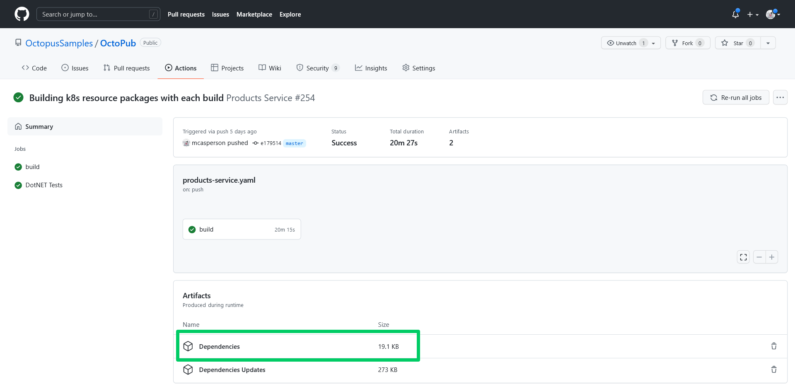
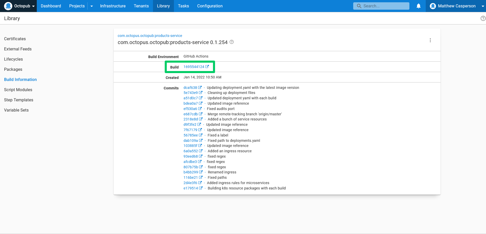
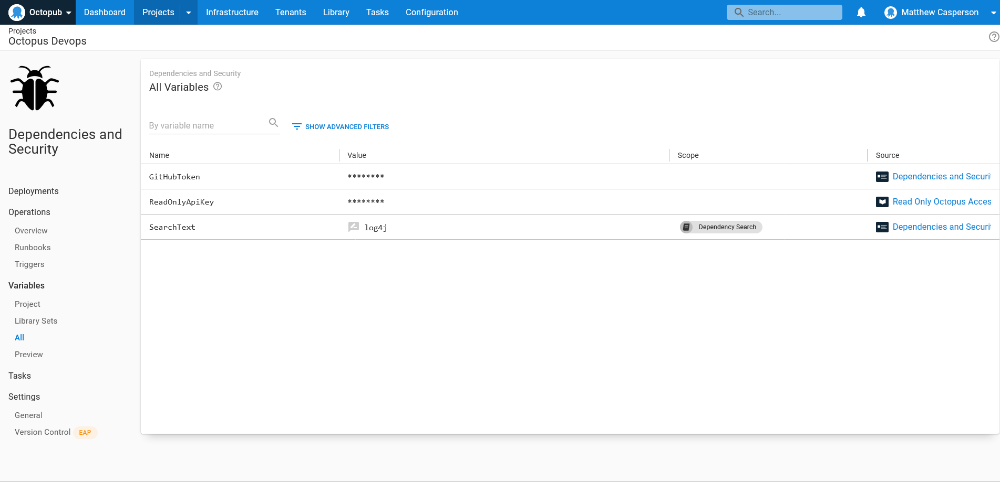
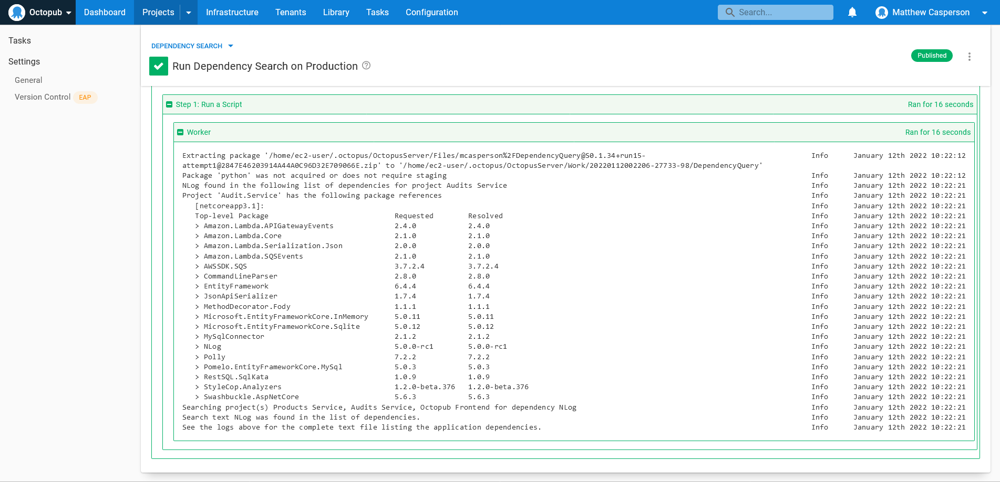

The Log4j project became the center of attention in late 2021 for a [critical vulnerability](https://cve.mitre.org/cgi-bin/cvename.cgi?name=CVE-2021-45046). It spawned a flood of ["Our response to Log4j"](https://octopus.com/blog/octopus-deploy-log4j-response) announcements from companies and framework developers around the globe, and even more requests to support desks and forums from customers looking to gauge their exposure.

Many engineering teams found themselves under pressure to identify any affected code bases, provide accurate reports describing any exposure, update any required dependencies, and deploy the new code to production as quickly as possible.

Anyone facing that challenge knows that such a response is not as easy as it sounds. Like any code dependency, knowing whether your code uses Log4j requires a deep understanding of your application's structure and currently deployed version. Typically, this requires checking your code base at the specific git commit representing the deployed version of your application and digging into your direct dependencies, along with their child dependencies, to find exactly what libraries your code uses.

Runbooks, combined with [build information](https://octopus.com/docs/packaging-applications/build-servers/build-information) and some simple changes to your CI/CD pipeline, provide a convenient method for querying the dependencies included in your deployed application. 

In this post, you learn how to modify a GitHub Actions Workflow to capture the dependencies used for a particular build and see an example runbook that can query the information on demand.

## Prerequisites

This post uses GitHub Actions as a CI server. GitHub Actions is free for public git repositories, so you only need a GitHub account to get started.

The sample runbook script is written against Python 3, which can be downloaded from the [Python website](https://www.python.org/downloads/). The example runbook source code can be found on [GitHub](https://github.com/OctopusSamples/DependencyQuery).

## Capturing dependencies during the build process

You start by capturing the dependencies consumed by the build process as part of our GitHub Actions workflow. Every major language today provides the ability to list dependencies, and the list below shows examples of these commands, capturing the output in a file called `dependencies.txt`:

- Maven - `mvn --batch-mode dependency:tree --no-transfer-progress > dependencies.txt`
- Gradle - `gradle dependencies --console=plain > dependencies.txt`
- Npm - `npm list --all > dependencies.txt`
- PHP - `composer show --all > dependencies.txt`
- Python - `pip install pipdeptree; pipdeptree > dependencies.txt`
- Go - `go list > dependencies.txt`
- Ruby - `gem dep > dependencies.txt`
- DotNET Core - `dotnet list package > dependencies.txt`

Two steps must be added to a GitHub Actions workflow to capture the dependencies as an artifact. The example below demonstrates how to capture Maven dependencies, but the `run` property of the `List Dependencies` step can be replaced with any of the commands above for your specific use case:

```yaml
    - name: List Dependencies
      run: mvn --batch-mode dependency:tree --no-transfer-progress > dependencies.txt
      shell: bash
    - name: Collect Dependencies
      uses: actions/upload-artifact@v2
      with:
        name: Dependencies
        path: dependencies.txt
```

The screenshot below shows the artifact associated with the build:



## Producing build information

[Build information](https://octopus.com/docs/packaging-applications/build-servers/build-information) provides additional metadata for packages referenced in an Octopus deployment or runbook. Build information packages are separate artifacts stored on the Octopus server with the same package ID and version as the package they represent. This allows Octopus to track metadata for all kinds of packages, whether stored in the built-in feed or hosted on external repositories.

One attribute captured by build information packages is a link back to the CI build that produced the package. The screenshot below shows the link back to the GitHub Actions run:



The [xo-energy/action-octopus-build-information](https://github.com/xo-energy/action-octopus-build-information) action provides the ability to create and upload a build information package. The step below shows an example of the action:

```yaml
    - name: Generate Octopus Deploy build information
      uses: xo-energy/action-octopus-build-information@v1.1.2
      with:
        octopus_api_key: ${{ inputs.octopus_api_token }}
        octopus_project: Products Service
        octopus_server: ${{ inputs.octopus_server_url }}
        push_version: 0.1.${{ inputs.run_number }}${{ env.BRANCH_NAME != 'master' && format('-{0}', env.BRANCH_NAME) || ''  }}
        push_package_ids: com.octopus.octopub:products-service
        push_overwrite_mode: OverwriteExisting
        output_path: octopus
        octopus_space: "Octopub"
        octopus_environment: "Development"
```

Pushing the build information package is all you need for Octopus to link the metadata to a release. The build information is linked to the release as long as the build information package ID and version matches a package used in an Octopus step. 

The next step is to write a custom script to query the Octopus API to extract the link back to the CI server for the latest release in a given environment.

## Querying the build information to download CI artifacts

You now have all the information in place to track the dependencies for any packages used in an Octopus release. It's possible to manually traverse the links exposed in the Octopus UI back to the GitHub Actions run, download the dependencies artifact, and scan the text file inside. But this manual workflow doesn't scale as the number of application increases. Instead, you want to automate the process through a runbook executing a custom Python script.

The first step is to define the dependencies for the script in the file `requirements.txt`. The script will make use of the [requests](https://pypi.org/project/requests/) package to streamline HTTP requests:

```txt
requests==2.27.1
```

You then create a file called `main.py` to hold the script. The complete code is shown below:

```python
import os
import sys
from datetime import datetime
from functools import cmp_to_key
from requests.auth import HTTPBasicAuth
import tempfile
from requests import get
import zipfile
import argparse

parser = argparse.ArgumentParser(description='Scan a deployment for a dependency.')
parser.add_argument('--octopusUrl', 
                    dest='octopus_url', 
                    action='store', 
                    help='The Octopus server URL',
                    required=True)
parser.add_argument('--octopusApiKey', 
                    dest='octopus_api_key', 
                    action='store', 
                    help='The Octopus API key',
                    required=True)
parser.add_argument('--githubUser', 
                    dest='github_user', 
                    action='store', 
                    help='The GitHub username',
                    required=True)
parser.add_argument('--githubToken', 
                    dest='github_token', 
                    action='store', 
                    help='The GitHub token/password',
                    required=True)
parser.add_argument('--octopusSpace', 
                    dest='octopus_space', 
                    action='store', 
                    help='The Octopus space',
                    required=True)
parser.add_argument('--octopusProject', 
                    dest='octopus_project', 
                    action='store',
                    help='A comma separated list of Octopus projects', 
                    required=True)
parser.add_argument('--octopusEnvironment', 
                    dest='octopus_environment', 
                    action='store', 
                    help='The Octopus environment',
                    required=True)
parser.add_argument('--searchText', 
                    dest='search_text', 
                    action='store',
                    help='The text to search for in the list of dependencies',
                    required=True)
parser.add_argument('--githubDependencyArtifactName', 
                    default="Dependencies", 
                    dest='github_dependency_artifact',
                    action='store',
                    help='The name of the GitHub Action run artifact that contains the dependencies')

args = parser.parse_args()

headers = {"X-Octopus-ApiKey": args.octopus_api_key}
github_auth = HTTPBasicAuth(args.github_user, args.github_token)


def compare_dates(date1, date2):
    # Python 3.6 doesn't handle the colon in the timezone of a string like "2022-01-04T04:23:02.941+00:00".
    # So we need to manually strip it out.
    date1_parsed = datetime.strptime(date1["Created"][:-3] + date1["Created"][-2:], '%Y-%m-%dT%H:%M:%S.%f%z')
    date2_parsed = datetime.strptime(date2["Created"][:-3] + date2["Created"][-2:], '%Y-%m-%dT%H:%M:%S.%f%z')
    if date1_parsed < date2_parsed:
        return -1
    if date1_parsed == date2_parsed:
        return 0
    return 1


def get_space_id(space_name):
    url = args.octopus_url + "/api/spaces?partialName=" + space_name.strip() + "&take=1000"
    response = get(url, headers=headers)
    spaces_json = response.json()

    filtered_items = [a for a in spaces_json["Items"] if a["Name"] == space_name.strip()]

    if len(filtered_items) == 0:
        sys.stderr.write("The space called " + space_name + " could not be found.\n")
        return None

    first_id = filtered_items[0]["Id"]
    return first_id


def get_resource_id(space_id, resource_type, resource_name):
    if space_id is None:
        return None

    url = args.octopus_url + "/api/" + space_id + "/" + resource_type + "?partialName=" \
        + resource_name.strip() + "&take=1000"
    response = get(url, headers=headers)
    json = response.json()

    filtered_items = [a for a in json["Items"] if a["Name"] == resource_name.strip()]
    if len(filtered_items) == 0:
        sys.stderr.write("The resource called " + resource_name + " could not be found in space " + space_id + ".\n")
        return None

    first_id = filtered_items[0]["Id"]
    return first_id


def get_release_id(space_id, environment_id, project_id):
    if space_id is None or environment_id is None or project_id is None:
        return None

    url = args.octopus_url + "/api/" + space_id + "/deployments?environments=" + environment_id + "&take=1000"
    response = get(url, headers=headers)
    json = response.json()

    filtered_items = [a for a in json["Items"] if a["ProjectId"] == project_id]
    if len(filtered_items) == 0:
        sys.stderr.write("The project id " + project_id + " did not have a deployment in " + space_id + ".\n")
        return None

    sorted_list = sorted(filtered_items, key=cmp_to_key(compare_dates), reverse=True)
    release_id = sorted_list[0]["ReleaseId"]

    return release_id


def get_build_urls(space_id, release_id, project):
    if space_id is None or release_id is None:
        return None

    url = args.octopus_url + "/api/" + space_id + "/releases/" + release_id
    response = get(url, headers=headers)
    json = response.json()

    build_information_with_urls = [a for a in json["BuildInformation"] if "github.com" in a["BuildUrl"]]
    build_urls = list(map(lambda b: b["BuildUrl"], build_information_with_urls))

    if len(build_urls) == 0:
        sys.stderr.write("No build information results contained build URLs to GitHub for project "
                         + project.strip() + ".\n")
        sys.stderr.write("This script assumes GitHub Actions were used to build the packages deployed by Octopus.\n")

    return build_urls


def download_file(url):
    with tempfile.NamedTemporaryFile(delete=False, suffix=".zip") as tmp_file:
        # get request
        response = get(url, auth=github_auth)
        # write to file
        tmp_file.write(response.content)
        return tmp_file.name


def get_artifacts(build_urls, dependency_artifact_name):
    if build_urls is None:
        return None

    files = []

    for url in build_urls:
        # turn https://github.com/OctopusSamples/OctoPub/actions/runs/1660462851 into
        # https://api.github.com/repos/OctopusSamples/OctoPub/actions/runs/1660462851/artifacts
        artifacts_api_url = url.replace("github.com", "api.github.com/repos") + "/artifacts"
        response = get(artifacts_api_url, auth=github_auth)
        artifact_json = response.json()

        filtered_items = [a for a in artifact_json["artifacts"] if a["name"] == dependency_artifact_name]

        if len(filtered_items) == 0:
            print("No artifacts were found in the GitHub Action run called " + dependency_artifact_name)

        for artifact in filtered_items:
            artifact_url = artifact["archive_download_url"]
            files.append(download_file(artifact_url))

    return files


def unzip_files(zip_files):
    if zip_files is None:
        return None

    text_files = []
    for file in zip_files:
        with zipfile.ZipFile(file, 'r') as zip_ref:
            with tempfile.TemporaryDirectory() as tmp_dir:
                zip_ref.extractall(tmp_dir)
                for extracted_file in os.listdir(tmp_dir):
                    filename = os.fsdecode(extracted_file)
                    if filename.endswith(".txt"):
                        with open(os.path.join(tmp_dir, extracted_file)) as f:
                            content = f.read()
                            text_files.append(content)
    return text_files


def search_files(text_files, text, project):
    found = False
    for file in text_files:
        if text in file:
            found = True
            print(text + " found in the following list of dependencies for project " + project.strip())
            print(file)

    return found


def scan_dependencies():
    space_id = get_space_id(args.octopus_space)
    environment_id = get_resource_id(space_id, "environments", args.octopus_environment)
    found = False
    for project in args.octopus_project.split(","):
        project_id = get_resource_id(space_id, "projects", project)
        release_id = get_release_id(space_id, environment_id, project_id)
        urls = get_build_urls(space_id, release_id, project)
        files = get_artifacts(urls, args.github_dependency_artifact)
        text_files = unzip_files(files)
        if search_files(text_files, args.search_text, project):
            found = True

    print("Searching project(s) " + args.octopus_project + " for dependency " + args.search_text)
    if found:
        print("\n\nSearch text " + args.search_text + " was found in the list of dependencies.")
        print("See the logs above for the complete text file listing the application dependencies.")
    else:
        print("\n\nSearch text " + args.search_text + " was not found in any dependencies.")


scan_dependencies()
```

Let's break this code down to understand what it's doing.

Your script will accept parameters from command-line arguments to make it reusable across multiple Octopus instances and spaces. The arguments are parsed by the [argparse module](https://docs.python.org/3/library/argparse.html). Learn more about using `argparse`in Real Python's post, [How to Build Command Line Interfaces in Python With argparse](https://realpython.com/command-line-interfaces-python-argparse/):

```python
parser = argparse.ArgumentParser(description='Scan a deployment for a dependency.')
parser.add_argument('--octopusUrl', 
                    dest='octopus_url', 
                    action='store', 
                    help='The Octopus server URL',
                    required=True)
parser.add_argument('--octopusApiKey', 
                    dest='octopus_api_key', 
                    action='store', 
                    help='The Octopus API key',
                    required=True)
parser.add_argument('--githubUser', 
                    dest='github_user', 
                    action='store', 
                    help='The GitHub username',
                    required=True)
parser.add_argument('--githubToken', 
                    dest='github_token', 
                    action='store', 
                    help='The GitHub token/password',
                    required=True)
parser.add_argument('--octopusSpace', 
                    dest='octopus_space', 
                    action='store', 
                    help='The Octopus space',
                    required=True)
parser.add_argument('--octopusProject', 
                    dest='octopus_project', 
                    action='store',
                    help='A comma separated list of Octopus projects', 
                    required=True)
parser.add_argument('--octopusEnvironment', 
                    dest='octopus_environment', 
                    action='store', 
                    help='The Octopus environment',
                    required=True)
parser.add_argument('--searchText', 
                    dest='search_text', 
                    action='store',
                    help='The text to search for in the list of dependencies',
                    required=True)
parser.add_argument('--githubDependencyArtifactName', 
                    default="Dependencies", 
                    dest='github_dependency_artifact',
                    action='store',
                    help='The name of the GitHub Action run artifact that contains the dependencies')

args = parser.parse_args()
```

The script makes many requests to the Octopus and GitHub APIs, and all of the requests require authentication. 

The Octopus API uses the `X-Octopus-ApiKey` header to pass the API key used to authenticate requests. You can find more information on how to create an API in the [Octopus documentation](https://octopus.com/docs/octopus-rest-api/how-to-create-an-api-key).

The GitHub API uses standard HTTP basic authentication with a personal access token for the password. The [GitHub documentation](https://docs.github.com/en/authentication/keeping-your-account-and-data-secure/creating-a-personal-access-token) provides details on creating tokens.

The code below captures the objects containing the credentials passed with each API request throughout the rest of the script:

```python
headers = {"X-Octopus-ApiKey": args.octopus_api_key}
github_auth = HTTPBasicAuth(args.github_user, args.github_token)
```

An important aspect of this script is the ability to find the latest release deployed to a given environment. This means comparing dates returned by the Octopus API.

The Octopus API returns dates in the ISO 8601 format, which looks like `2022-01-04T04:23:02.941+00:00`. Unfortunately, [Python 3.6 does not support timezone offsets that include colons](https://bugs.python.org/issue15873), forcing us to strip them out before parsing and comparing the dates. 

The `compare_dates` function takes two dates as strings, strips out the colons, parses the result, and returns a value of `1`, `0`, or `-1` indicating how `date1` compares to `date2`:

```python
def compare_dates(date1, date2):
    # Python 3.6 doesn't handle the colon in the timezone of a string like "2022-01-04T04:23:02.941+00:00".
    # So we need to manually strip it out.
    date1_parsed = datetime.strptime(date1["Created"][:-3] + date1["Created"][-2:], '%Y-%m-%dT%H:%M:%S.%f%z')
    date2_parsed = datetime.strptime(date2["Created"][:-3] + date2["Created"][-2:], '%Y-%m-%dT%H:%M:%S.%f%z')
    if date1_parsed < date2_parsed:
        return -1
    if date1_parsed == date2_parsed:
        return 0
    return 1
```

A common pattern in this script (and most scripts working with the Octopus API) is to lookup the ID of a named resource. The `get_space_id` function takes the name of an Octopus space and queries the API to return the space ID:

```python
def get_space_id(space_name):
```

The `/api/spaces` endpoint returns a list of the spaces defined in the Octopus server. The `partialName` query parameter limits the result to spaces whose name includes the supplied value, while the `take` parameter is set to a large number to ensure you don't need to loop over any paged results:

```python
    url = args.octopus_url + "/api/spaces?partialName=" + space_name.strip() + "&take=1000"
```

A GET HTTP request is made against the endpoint, including the Octopus authentication headers, and the JSON result is parsed into Python nested dictionaries:

```python
    response = get(url, headers=headers)
    spaces_json = response.json()
```

The returned results could match any space whose name is, or includes, the supplied space name. This means that the spaces called `MySpace` and `MySpaceTwo` would be returned if we searched for the space called `MySpace`.

To ensure you return the ID of the space with the correct name, a [list comprehension](https://docs.python.org/3/tutorial/datastructures.html#list-comprehensions) filters the returned spaces to just those that exactly match the supplied space name:

```python
    filtered_items = [a for a in spaces_json["Items"] if a["Name"] == space_name.strip()]
```

The function will return `None` if none of the spaces match the supplied space name:

```python
    if len(filtered_items) == 0:
        sys.stderr.write("The space called " + space_name + " could not be found.\n")
        return None
```

If there is a matching space, return the ID:

```python
    first_id = filtered_items[0]["Id"]
    return first_id
```

Spaces are top level resources in Octopus, while all other resources you interact with in this script are children of a space. Just as you did with the `get_space_id` function, the `get_resource_id` function converts a named Octopus resource to its ID. The only difference here is the endpoint being requested includes the space ID in the path, and the resource type is supplied to build the second element in the path. Otherwise `get_resource_id` follows the same pattern described for the `get_space_id` function:

```python
def get_resource_id(space_id, resource_type, resource_name):
    if space_id is None:
        return None

    url = args.octopus_url + "/api/" + space_id + "/" + resource_type + "?partialName=" \
        + resource_name.strip() + "&take=1000"
    response = get(url, headers=headers)
    json = response.json()

    filtered_items = [a for a in json["Items"] if a["Name"] == resource_name.strip()]
    if len(filtered_items) == 0:
        sys.stderr.write("The resource called " + resource_name + " could not be found in space " + space_id + ".\n")
        return None

    first_id = filtered_items[0]["Id"]
    return first_id
```

You now need to provide a way to determine the release that was last deployed to the selected environment for the selected project.

A release is a snapshot of the deployment process, package versions, and variables. This is the resource that is created when you click the **CREATE RELEASE** button in the Octopus UI.

A deployment is then the execution of a release to an environment.

So, in order to find which package versions are deployed to the specified environment (and we're usually talking about the production environment when dealing with vulnerabilities), you must list the deployments to an environment, filter them down to the deployments for the specified project, sort the deployments to ensure you find the latest one, and return the ID of the release that the deployment executed.

The `get_release_id` function implements this query:

```python
def get_release_id(space_id, environment_id, project_id):
    if space_id is None or environment_id is None or project_id is None:
        return None
```

You query the `/deployments` endpoint to return the list of deployments, and pass the `environments` query param to limit the result to just those deployments for the specified environment:

```python
    url = args.octopus_url + "/api/" + space_id + "/deployments?environments=" + environment_id + "&take=1000"
    response = get(url, headers=headers)
    json = response.json()
```

The resulting list is filtered to just those items relating to the specified project:

```python
    filtered_items = [a for a in json["Items"] if a["ProjectId"] == project_id]
    if len(filtered_items) == 0:
        sys.stderr.write("The project id " + project_id + " did not have a deployment in " + space_id + ".\n")
        return None
```

The filtered list is sorted to ensure the latest deployment is the first item:

```python
    sorted_list = sorted(filtered_items, key=cmp_to_key(compare_dates), reverse=True)
```

The release ID of the latest deployment is then returned:

```python
    release_id = sorted_list[0]["ReleaseId"]

    return release_id
```

As you saw earlier, when build information is available for a package referenced in a release, details like the link back to the CI build that created the package are made available. This link is exposed in the release resource returned by the Octopus API, and is extracted by the `get_build_urls` function:

```python
def get_build_urls(space_id, release_id, project):
    if space_id is None or release_id is None:
        return None
```

You query the Octopus API to return the complete release resource from the specified release ID:

```python
    url = args.octopus_url + "/api/" + space_id + "/releases/" + release_id
    response = get(url, headers=headers)
    json = response.json()
```

Each release can have multiple associated build information resources, and each of those is filtered to find any whose build URL includes `github.com`, indicating the package was built using GitHub Actions:

```python
    build_information_with_urls = [a for a in json["BuildInformation"] if "github.com" in a["BuildUrl"]]
```    

The dictionary containing all the build information is flattened to an array of links:

```python
    build_urls = list(map(lambda b: b["BuildUrl"], build_information_with_urls))
```

If no links back to GitHub are found, a warning message is presented:

```python
    if len(build_urls) == 0:
        sys.stderr.write("No build information results contained build URLs to GitHub for project "
                         + project.strip() + ".\n")
        sys.stderr.write("This script assumes GitHub Actions were used to build the packages deployed by Octopus.\n")
```

The list of URLs is then returned:

```python
    return build_urls
```

GitHub Action artifacts are simply zip files that are downloaded like a regular file from any other webserver. The `download_file` function creates a temporary file and writes the contents of the supplied URL into it, returning the file name:

```python
def download_file(url):
    with tempfile.NamedTemporaryFile(delete=False, suffix=".zip") as tmp_file:
        # get request
        response = get(url, auth=github_auth)
        # write to file
        tmp_file.write(response.content)
        return tmp_file.name
```

The `get_artifacts` function queries the GitHub API for links to artifacts associated with a run:

```python
def get_artifacts(build_urls, dependency_artifact_name):
    if build_urls is None:
        return None

    files = []
```

The GitHub link captured by the build information is to the public, browsable web page displaying the results of the GitHub Action run. In order to interact with the details of the run programmatically though, you'll need to interact with the GitHub API.

GitHub has two related URL structures. URLs that start with `https://github.com/` expose HTML pages for web browsers, while URLs that start with `https://api.github.com/repos/` expose the GitHub API. Other than the prefix, the two URL structures are mostly the same.

What this means is that we must convert a URL like `https://github.com/OctopusSamples/OctoPub/actions/runs/1660462851` into `https://api.github.com/repos/OctopusSamples/OctoPub/actions/runs/1660462851` in order to access the GitHub API:

```python
    for url in build_urls:
        # turn https://github.com/OctopusSamples/OctoPub/actions/runs/1660462851 into
        # https://api.github.com/repos/OctopusSamples/OctoPub/actions/runs/1660462851/artifacts
        artifacts_api_url = url.replace("github.com", "api.github.com/repos") + "/artifacts"
        response = get(artifacts_api_url, auth=github_auth)
        artifact_json = response.json()
```

The list of artifacts is filtered to return the one that matches the expected artifact name:

```python
        filtered_items = [a for a in artifact_json["artifacts"] if a["name"] == dependency_artifact_name]
```        

If there are no matching artifacts, an error is displayed:

```python
        if len(filtered_items) == 0:
            print("No artifacts were found in the GitHub Action run called " + dependency_artifact_name)
```

For each matching artifact, the download URL is extracted, and the list of URLs is returned:

```python
        for artifact in filtered_items:
            artifact_url = artifact["archive_download_url"]
            files.append(download_file(artifact_url))

    return files
```

GitHub artifacts are expected to be zip files containing text files. The `unzip_files` function extracts the supplied files, scans the resulting files for text files, reads the text files, and returns the text:

```python
def unzip_files(zip_files):
    if zip_files is None:
        return None

    text_files = []
    for file in zip_files:
        with zipfile.ZipFile(file, 'r') as zip_ref:
            with tempfile.TemporaryDirectory() as tmp_dir:
                zip_ref.extractall(tmp_dir)
                for extracted_file in os.listdir(tmp_dir):
                    filename = os.fsdecode(extracted_file)
                    if filename.endswith(".txt"):
                        with open(os.path.join(tmp_dir, extracted_file)) as f:
                            content = f.read()
                            text_files.append(content)
    return 
```

The `search_files` function prints any dependency list that contains the specified search string from the contents of the extracted text files:

```python
def search_files(text_files, text, project):
    found = False
    for file in text_files:
        if text in file:
            found = True
            print(text + " found in the following list of dependencies for project " + project.strip())
            print(file)

    return found
```

The `scan_dependencies` function is where all the code above is pulled together to scan the list of dependencies for the supplied text:

```python
def scan_dependencies():
```

The space name is turned into an ID:

```python
    space_id = get_space_id(args.octopus_space)
```    

The environment name is turned into an ID:

```
    environment_id = get_resource_id(space_id, "environments", args.octopus_environment)
```

The projects can be supplied as a comma separated list, which you loop over:

```python
    found = False
    for project in args.octopus_project.split(","):
```    

The project name is turned into an ID:

```python
        project_id = get_resource_id(space_id, "projects", project)
```

The release associated with the latest deployment for the project to the environment is found:

```python
        release_id = get_release_id(space_id, environment_id, project_id)
```

The artifact download URLs are found:

```python
        urls = get_build_urls(space_id, release_id, project)
```

Each URL is then downloaded:

```python
        files = get_artifacts(urls, args.github_dependency_artifact)
```

The zip files are extracted, and any text files contained in them are read:

```python
        text_files = unzip_files(files)
```    

The contents of these text files are scanned for the search string:

```python
        if search_files(text_files, args.search_text, project):
            found = True
```            

Summary information is then printed:

```python
    print("Searching project(s) " + args.octopus_project + " for dependency " + args.search_text)
    if found:
        print("\n\nSearch text " + args.search_text + " was found in the list of dependencies.")
        print("See the logs above for the complete text file listing the application dependencies.")
    else:
        print("\n\nSearch text " + args.search_text + " was not found in any dependencies.")
```

The last step is to call the `scan_dependencies` function, which initiates the script:

```python
scan_dependencies()
```

With the script written, it's time to execute it in a runbook.

## Running the script in a runbook

The first step is to expose 3 variables that will be passed to the script:

- `GitHubToken` is a secret holding the GitHub personal access token used to authenticate GitHub API calls.
- `ReadOnlyApiKey` is an Octopus API key assigned to an account with read only access to the Octopus server (because this script only queries the API, and never modifies any resources).
- `SearchText` is a prompted variable that defines the text to search for in the dependency text files.



The runbook is comprised of a single **Run a script** step with the following Bash script:

```bash
cd DependencyQuery

echo "##octopus[stdout-verbose]"
python3 -m venv my_env
. my_env/bin/activate
pip --disable-pip-version-check install -r requirements.txt
echo "##octopus[stdout-default]"

python3 main.py \
    --octopusUrl https://tenpillars.octopus.app \
    --octopusApiKey "#{ReadOnlyApiKey}" \
    --githubUser mcasperson \
    --githubToken "#{GitHubToken}" \
    --octopusSpace "#{Octopus.Space.Name}" \
    --octopusEnvironment "#{Octopus.Environment.Name}" \
    --octopusProject "Products Service, Audits Service, Octopub Frontend" \
    --searchText "#{SearchText}"
```

There are some interesting things going on in this script, so let's break it down.

You enter the directory where Octopus extracted the package containing the Python script:

```bash
cd DependencyQuery
```

Printing the [service message](https://octopus.com/docs/deployments/custom-scripts/logging-messages-in-scripts#service-message) `##octopus[stdout-verbose]` instructs Octopus to treat all subsequent log messages as verbose:

```bash
echo "##octopus[stdout-verbose]"
```

A new [Python virtual environment](https://realpython.com/python-virtual-environments-a-primer/) called `my_env` is created and activated, and the script dependencies are installed:

```bash
python3 -m venv my_env
. my_env/bin/activate
pip --disable-pip-version-check install -r requirements.txt
```

The service message `##octopus[stdout-default]` is printed, instructing Octopus to treat subsequent log messages at the default level again:

```bash
echo "##octopus[stdout-default]"
```

You then execute the Python script. Some of the arguments, like `octopusUrl`, `githubUser`, `octopusProject`, need to be customized for your specific use case. Setting the `octopusSpace` and `octopusEnvironment` arguments to the space and environment in which the runbook is executed allows you to find dependencies in any environment the runbook is run in:

```bash
python3 main.py \
    --octopusUrl https://tenpillars.octopus.app \
    --octopusApiKey "#{ReadOnlyApiKey}" \
    --githubUser mcasperson \
    --githubToken "#{GitHubToken}" \
    --octopusSpace "#{Octopus.Space.Name}" \
    --octopusEnvironment "#{Octopus.Environment.Name}" \
    --octopusProject "Products Service, Audits Service, Octopub Frontend" \
    --searchText "#{SearchText}"
```

## Executing the runbook

When the runbook is executed, it scans each project for the latest deployment to the current environment, finds the GitHub Action run link from the build information, downloads the dependencies artifact, extracts the artifact, and scans the text files for the search text. 

With a single click of the **RUN** button, you have the ability to quickly search any project deployed by Octopus that has associated build information and the required build artifacts:



## Conclusion

Log4j exposed many engineering teams to the reality that dependency vulnerabilities are a fact of life, and that timely responses are crucial not only to limit your exposure to exploits, but to reduce pressure on support teams fielding questions from customers. It's also clear that Log4j won't be the last widespread vulnerability, and it's just a matter of time before your code base is impacted by a disclosure.

In this post, you learned how to save the list of dependencies consumed by a build of your application as an artifact in GitHub Actions, how to link runs to the packages they produce using build information, and then perform simple text matching on the dependencies included in packages deployed to an environment with a runbook executing a custom Python script. The end result is the ability to know in minutes whether your applications are exposed to a vulnerability reported in a dependency, and begin responding almost immediately. 

!include <q2-2022-newsletter-cta>

Happy deployments!